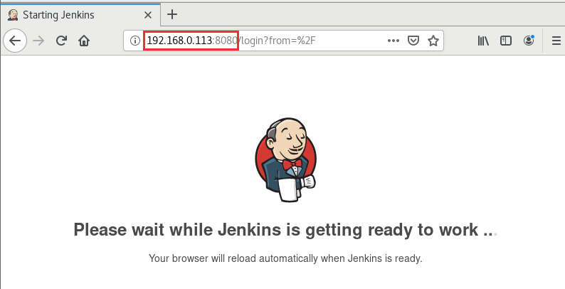
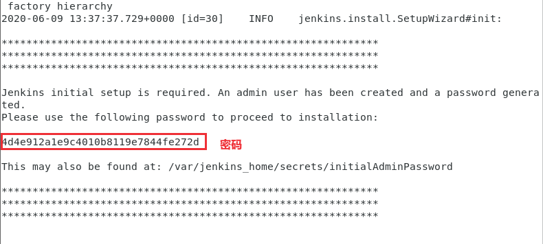
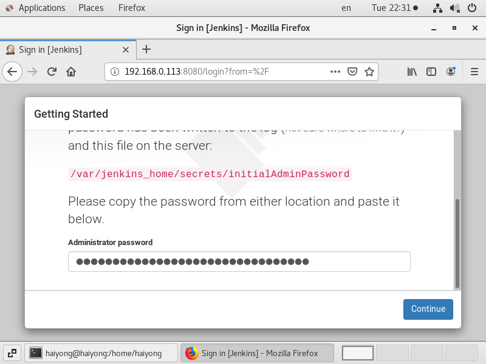
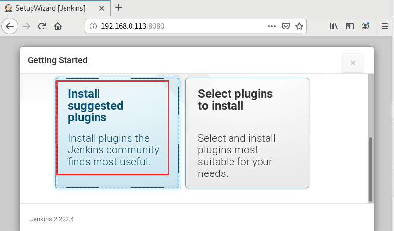
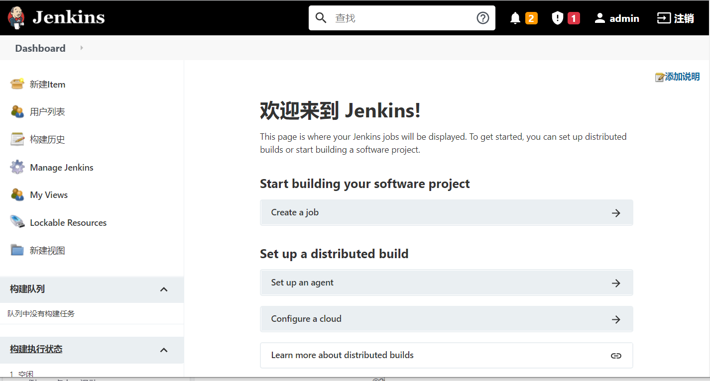
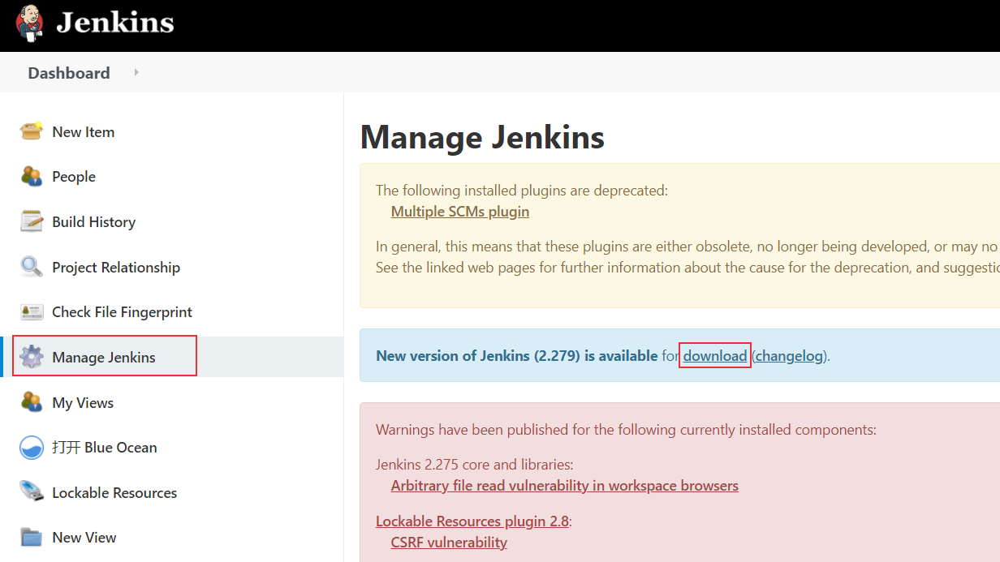
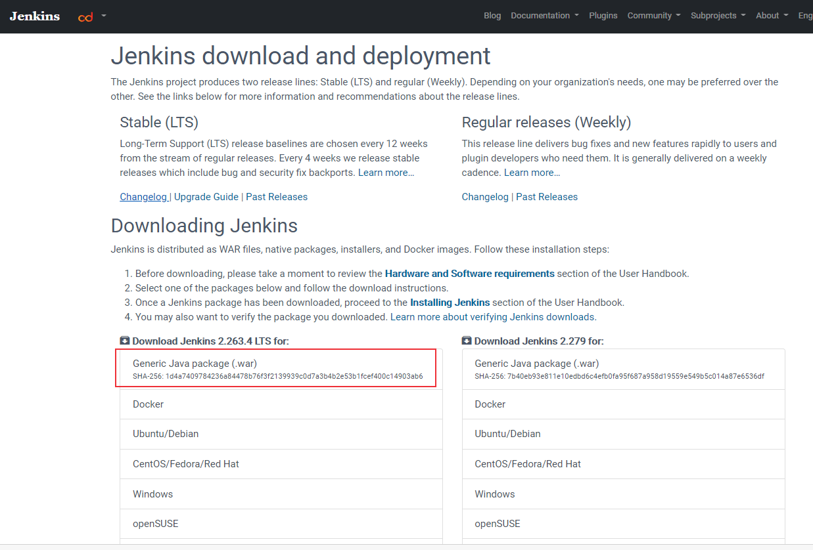

# Docker搭建持续集成平台Jenkins
本文介绍使用docker来安装Jenkins服务的步骤。

<!--more-->
## Docker搭建Jenkins
### 1. 安装
Jenkins docker hub地址: [https://hub.docker.com/r/jenkins/jenkins](https://hub.docker.com/r/jenkins/jenkins)
```docker
docker pull jenkins/jenkins
```
```sh
[root@server /]# docker pull jenkins/jenkins
Using default tag: latest
latest: Pulling from jenkins/jenkins
3192219afd04: Already exists 
17c160265e75: Already exists 
cc4fe40d0e61: Already exists 
9d647f502a07: Already exists 
d108b8c498aa: Already exists 
1bfe918b8aa5: Already exists 
dafa1a7c0751: Already exists 
c69d355c63ac: Pull complete 
b15898bb1800: Pull complete 
a51ccfc981f7: Pull complete 
49f46bd4bf74: Pull complete 
efa670fd97de: Pull complete 
1565294bcba3: Pull complete 
4c51bcfbed1e: Pull complete 
49f4fafbfbf2: Pull complete 
28a75541fa5f: Pull complete 
c3c03c2d5564: Pull complete 
ace64d1af7cf: Pull complete 
f1960af3b8ab: Pull complete 
6fd1a5a6d017: Pull complete 
Digest: sha256:e4630b9084110ad05b4b51f5131d62161881216d60433d1f2074d522c3dcd6dc
Status: Downloaded newer image for jenkins/jenkins:latest
docker.io/jenkins/jenkins:latest
```

### 2. 创建docker的文件影射卷
创建docker的文件影射卷，用于存储数据
```docker
[root@server tmp]# docker volume create jenkins_test
[root@server tmp]# docker volume inspect jenkins_test
[
    {
        "CreatedAt": "2020-07-18T10:49:17+08:00",
        "Driver": "local",
        "Labels": {},
        "Mountpoint": "/var/lib/docker/volumes/jenkins_test/_data",
        "Name": "jenkins_test",
        "Options": {},
        "Scope": "local"
    }
]
[root@server tmp]# 
```

### 3. 运行: 创建实例
创建一个挂载目录jenkins，添加可执行权限：`chmod 777 jenkins`

```docker
docker run --name=jenkins -d -p 8080:8080 -p 50000:50000 -v jenkins_test:/var/jenkins_home jenkins/jenkins
```

运行：
```sh
[root@server /]# docker run --name=jenkins -d -p 8080:8080 -p 50000:50000 -v jenkins_test:/var/jenkins_home jenkins/jenkins
c7fb87aec99402febd95edddda5cf1dc7ad15437f674bf71a09692d93369ccb9
[root@server /]# 
[root@server /]# docker ps
CONTAINER ID   IMAGE             COMMAND                  CREATED         STATUS         PORTS                                              NAMES
c7fb87aec994   jenkins/jenkins   "/sbin/tini -- /usr/…"   9 minutes ago   Up 9 minutes   0.0.0.0:8080->8080/tcp, 0.0.0.0:50000->50000/tcp   jenkins
```
浏览器输入电脑IP地址+端口号：http://192.168.0.103:8080/



`docker logs -f jenkins`  查看输出日志


注意：jenkins默认启动后的时区为美国，通过以下命令启动中国时区：
```sh
# 先删除已经构建的jenkins实例
docker rm -f jenkins
# 重新创建实例并设置时区
docker run --name=jenkins -d -p 8080:8080 -p 50000:50000 -v jenkins_test:/var/jenkins_home -e JAVA_OPTS=-Duser.timezone=Asia/Shanghai jenkins/jenkins
```
### 4. 查看默认密码

```docker
docker exec jenkins cat /var/jenkins_home/secrets/initialAdminPassword
```


### 5. 输入密码
等待初始化完成后，输入密码


### 6. 安装推荐的插件


### 7. 设置用户名密码


### 8. Jenkins URL配置


配置成功后，进入欢迎界面


## Jenkins更新
进入Manage Jenkins，提示新版本，点击下载 jenkins.war 包。


或者进入官网[https://www.jenkins.io/download/](https://www.jenkins.io/download/)下载指定版本的war 包。

### 1. jenkins.war 位置查看
**方法1：Manage Jenkins中查看**
点击进入Manage Jenkins，找到Status Information，点击System Information，可以查看war包位置


**方法2：find命令查找**
使用root账号进入容器中后使用find命令查找

```sh
[root@server ~]# docker exec -it -u root jenkins bash
root@ed883da9faab:/# find / -name jenkins.war
find: ‘/proc/1/map_files’: Operation not permitted
find: ‘/proc/7/map_files’: Operation not permitted
find: ‘/proc/138/map_files’: Operation not permitted
find: ‘/proc/155/map_files’: Operation not permitted
/usr/share/jenkins/jenkins.war
root@ed883da9faab:/# 
```
### 2. 更新容器中的war包
使用root账号进入容器中，备份原来的war包
```sh
[root@server ~]# docker exec -it -u root jenkins bash
root@ed883da9faab:/# cd /usr/share/jenkins
root@ed883da9faab:/usr/share/jenkins# mv jenkins.war jenkins.war.bak
```
将下载的war包复制到容器目录 /usr/share/jenkins 下（注意是在宿主机上操作）
```sh
[root@server ~]# docker cp jenkins.war jenkins:/usr/share/jenkins/
[root@server ~]# docker exec -it -u root jenkins bash
root@ed883da9faab:/usr/share/jenkins# ls
jenkins.war  jenkins.war.bak  ref
```
### 3. 重启Jenkins
```sh
$ docker restart jenkins
```
刷新页面，登陆，进入Manage Jenkins，可以看到版本更新成功，可以降回原来的版本。


注意：可能会启动不成功，报如下错误：

```bash
$  docker logs --tail="10" jenkins
.......
Error: Unable to access jarfile /usr/share/jenkins/jenkins.war
```

可能原因是jenkins.war只有只读权限，需要给它添加权限。而此时jenkins容器没有启动成功，我们是无法使用命令 `docker exec -it -u root jenkins bash` 进入容器内进行操作的。

docker容器其实是由容器镜像组成的（参考[容器技术介绍之docker核心技术概述](https://blog.csdn.net/u010698107/article/details/122641323)）我们可以直接在`/var/lib/docker/overlay2/` 目录下找到对应镜像层下的jenkins.war文件。

直接使用 `find` 命令查找：

```bash
$ find / -name jenkins.war
/var/lib/docker/overlay2/b82c33119417876cd306731155202416c5930b096ddae74c240bbdbe0a3a6d22/diff/usr/share/jenkins/jenkins.war
/var/lib/docker/overlay2/fd53382dc318381b812fc76d22635f0e8244f1ff586c31681acd88bf81a2c40b/diff/usr/share/jenkins/jenkins.war
```

有两个镜像层都有jenkins.war文件，可以都进去看一下。

进入对应镜像层目录下：

```bash
$ cd /var/lib/docker/overlay2/fd53382dc318381b812fc76d22635f0e8244f1ff586c31681acd88bf81a2c40b/diff/usr/share/jenkins/
$ ll
-rw-r--r-- 1 root root 72122649 8月  31 23:05 jenkins-228.war
-rw-r--r-- 1 root root 72247484 1月   6 10:38 jenkins-319.war
-rw-r--r-- 1 root root 73712089 2月   9 08:45 jenkins-326.war
-rw-r--r-- 1 root root 73713768 1月   6 09:21 jenkins-327.war
-r-------- 1 root root 72248203 2月   9 08:42 jenkins.war
```

发现jenkins.war文件只有只读权限，添加权限：

```bash
$ chmod 777 jenkins.war 
```

权限设置完成后就可以启动成功了。

## Windows安装Jenkins

war文件启动方法

下载地址：[https://www.jenkins.io/download/](https://www.jenkins.io/download/)


进入war包所在路径执行命令：
```sh
java -jar jenkins.war --httpPort=8081
```

可以直接下载jenkins.msi文件安装


配置方法和Linux类似


