# 持续集成：Jenkins API使用方法详细介绍
在[持续集成：Jenkins API简单使用](https://blog.csdn.net/u010698107/article/details/115102811)中介绍了使用Python requests 和 jenkinsapi 库来请求Jenkins API。本文将更全面的介绍Jenkins API以及使用方法。

<!--more-->


## Jenkins API简介

我们可以使用jenkins API来获取jenkins平台相关信息、触发构建、创建/删除job等，这些API使得jenkins具备了很强的扩展性，比如集成其它平台。

Jenkins API采用的是REST架构设计风格，支持以下3种方式：

- XML API：`.../api/xml`
- JSON API：`.../api/json`
- Python API：比如有 [JenkinsAPI](https://pypi.python.org/pypi/jenkinsapi), [Python-Jenkins](https://pypi.python.org/pypi/python-jenkins/), [api4jenkins](https://pypi.org/project/api4jenkins/), [aiojenkins](https://pypi.org/project/aiojenkins/) Python库。

Jenkins的很多页面都提供了远程访问API，你可以在当前页面URL后添加 `/api` 查看当前接口说明。

除了在服务器上手动重启jenkins外，还可以通过API进行重启（POST请求）：

- 重启： `<Jenkins-Url>/restart`，立即重启
- 安全重启： `<Jenkins-Url>/safeRestart`，Jenkins会在所有正在运行的job完成后再重新启动。

## 获取信息

以下面这个页面为例：

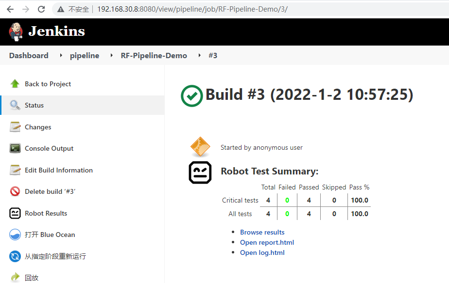

在URL后面添加 `api` 返回如下页面：


### XML API

在URL后添加`/api/xml`，效果如下：

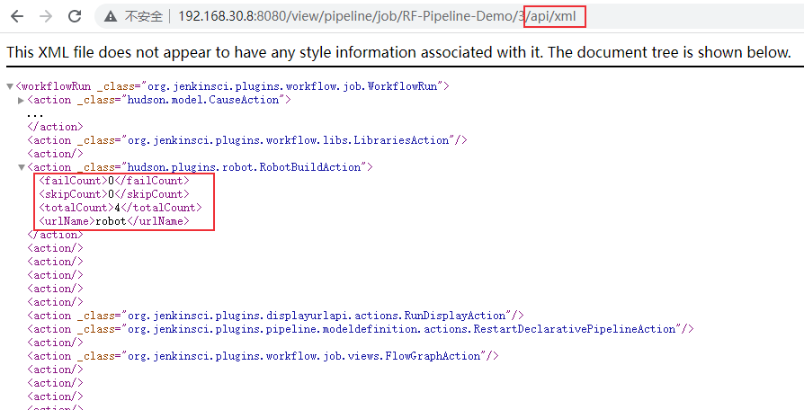

下面介绍过滤xml信息的方法。

**1、使用xpath语法**

读取测试结果：`.../api/xml?xpath=/*/*[4]` 或者 `/api/xml?xpath=/*/action[4]`

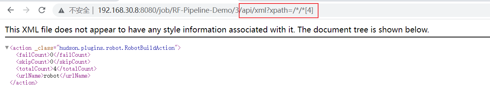

读取用例总数totalCount：`/api/xml?xpath=/*/action/totalCount` 或者 `/api/xml?xpath=//totalCount`

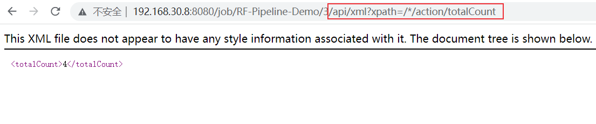

还有更多的xpath语法可以使用，比如：

- contains方法：`xpath=//urlName[contains(text(),'robot')]`
- 后面的邻居节点following-sibling：`xpath=//failCount/following-sibling::*`

更详细的xpath语法介绍可参考 [Web自动化测试：xpath & CSS Selector定位](https://blog.csdn.net/u010698107/article/details/111415888)。

**2、exclude语法排除节点**

排除action节点：`/api/xml?exclude=/*/action`


**3、depth指定深度**

指定深度为1：`/api/xml?depth=1`

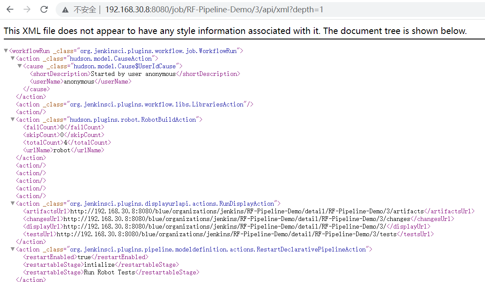

**4、tree参数**

可以使用tree参数来提取以及组合指定字段：`/api/xml?pretty=true&tree=building,displayName,id,url,previousBuild[url]`

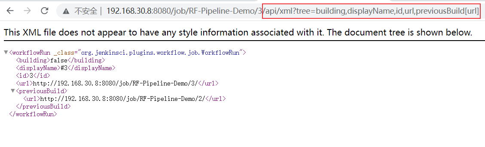

如果返回多组结果，可以指定范围（索引从0开始）：

- **{M,N}**: 从第M个元素到第N个元素
- **{M,}**: 从第M个元素到最后一个元素
- **{,N}**: 从第1个元素到第N个元素，等价于 `{0,N}`
- **{N}**: 第N个元素，等价于 `{N,N+1}`

比如下面的页面：


获取第1个到第2个元素：`.../api/xml?tree=jobs[name]{1,3}`

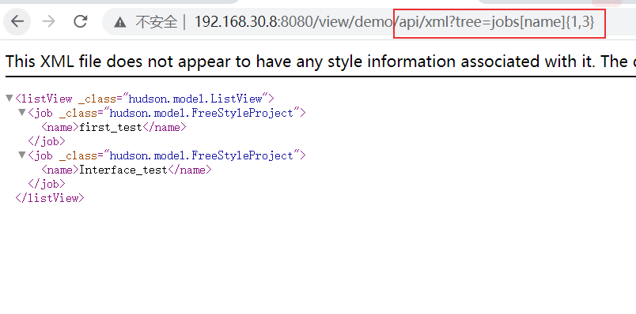

**5、组合**

可以使用 `&` 来组合多个表达式，比如：`/api/xml?exclude=/*/action&xpath=//fullDisplayName`

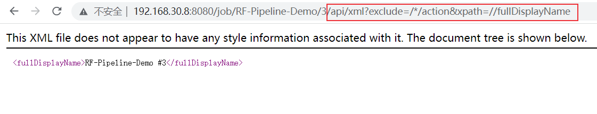

**6、wrapper方法整合多个结果**

过滤后可能有多个结果，需要使用wrapper方法来组合，例如：`/api/xml?depth=2&xpath=//fullDisplayName&wrapper=jobname`

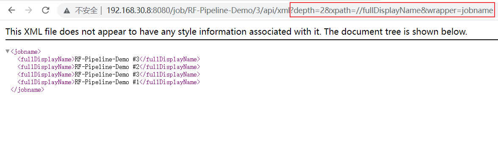


### JSON API

JSON API返回json样式的数据，在URL后添加`/api/json`。它也支持depth参数，默认为最小深度。

来看一下效果：`...3/api/json?pretty=true`

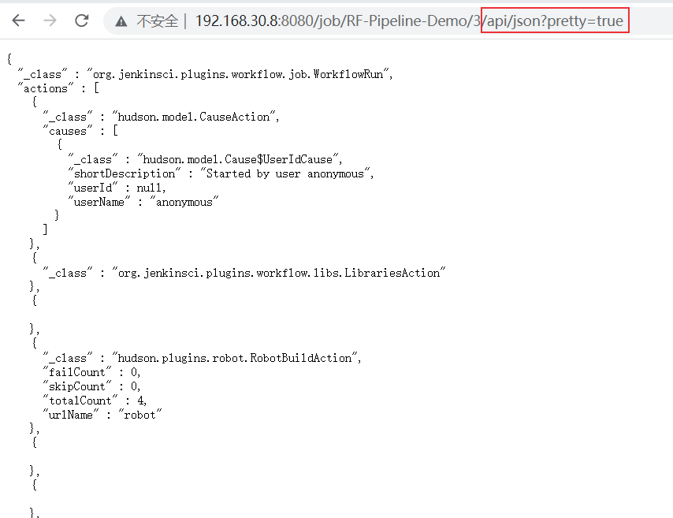

JSON API也可以使用tree参数来过滤：`/api/json?pretty=true&tree=building,displayName,id,url,previousBuild[url]`

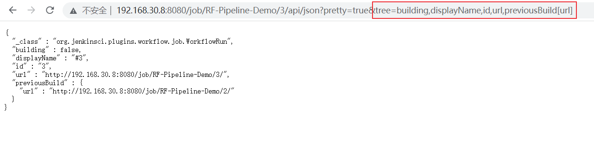

### 请求信息

由于jenkins API采用的是REST架构风格，所以支持REST API的请求方法，比如常用的POST、GET、DELETE等方法。

获取job的构建Number的API：

- 获取最近的job buildNumber： `<Jenkins-Url>/job/<Job-Name>/lastBuild/buildNumber`
- 最近完成构建job的buildNumber： `<Jenkins-Url>/job/<Job-Name>/lastCompletedBuild/buildNumber`
- 最近失败job的 buildNumber：`<Jenkins-Url>/job/<Job-Name>/lastFailedBuild/buildNumber`
- 最近稳定job的buildNumber：`<Jenkins-Url>/job/<Job-Name>/lastStableBuild/buildNumber`
- 最近成功job的buildNumber：`<Jenkins-Url>/job/<Job-Name>/lastSuccessfulBuild/buildNumber`
- 最近不成功（除成功以外的状态）job的buildNumber：`<Jenkins-Url>/job/<Job-Name>/lastUnsuccessfulBuild/buildNumber`

介绍两种方式请求api，第一种方法是curl工具，第二种是Python的requests库。

#### curl请求

使用如下curl命令发送GET请求：

```bash
$ curl -k --silent -L --user 用户名:API Token JENKINS_URL/job/JOB_NAME
```

API Token可以在用户配置中生成。

还是以下面这个页面为例：


**1、解析xml结果**

使用xpath过滤robot测试结果：`/api/xml?xpath=//action[@_class='hudson.plugins.robot.RobotBuildAction']`


shell脚本中，可以对返回的信息进行进一步处理，比如，读取totalCount：

```bash
$ curl -k --silent -L --user admin:11f8790b23a9983c0a218ba125aa855f61 http://192.168.30.8:8080/view/demo/job/RF-Pipeline-Demo/3/api/xml?xpath=//action[@_class=\'hudson.plugins.robot.RobotBuildAction\'] | tr '<' '\n' | egrep '^totalCount>' | sed 's/.*>//g'
4
$ 
```

读取 failCount 和 totalCount：

```bash
$ curl -k --silent -L --user admin:11f8790b23a9983c0a218ba125aa855f61 http://192.168.30.8:8080/view/demo/job/RF-Pipeline-Demo/3/api/xml?xpath=//action[@_class=\'hudson.plugins.robot.RobotBuildAction\'] | tr '<' '\n' | egrep '^totalCount>|^failCount>' | sed 's/>/:/g'  | sed -e '1s/$/,/g' | tr -d '\n'
failCount:0,totalCount:4
```

在需要读取多个值的时候，可以一个一个的请求，我的习惯是只请求一次，然后进行二次处理，比如在groovy脚本中：

```groovy
// curl读取测试结果
def WORKFLOW_XML = sh ( script: "API_XML=\$(curl -k --silent -L --user admin:11f8790b23a9983c0a218ba125aa855f61 http://192.168.30.8:8080/view/demo/job/RF-Pipeline-Demo/3/api/xml?xpath=//action[@_class=\'hudson.plugins.robot.RobotBuildAction\'] | tr '<' '\n' | egrep '^totalCount>|^failCount>' | sed 's/>/:/g'  | sed -e '1s/\$/,/g' | tr -d '\n'); echo \${API_XML}", returnStdout: true ).trim();

rf_results = WORKFLOW_XML.split(",");
if (rf_results[0]) {
    for ( res in rf_results ) {
        if (res.contains("failCount")) {
            failCount = res.split("failCount:")[1];
        }
        if (res.contains("totalCount")) {
            totalCount = res.split("totalCount:")[1];
        }
    }
    passCount = totalCount.toInteger() - failCount.toInteger();
    passPercentage = passCount/totalCount.toInteger() * 100;
    passPercentage = Math.round(passPercentage * 100) / 100; // 保留2位小数
    passRatio = passCount + " / " + totalCount;

} else {
    passPercentage = 'null'; 
    passRatio = 'null'; 
}
```

**2、解析json结果**

获取json格式数据和xml类似，json数据的进一步提取可以结合jq命令来使用。这里介绍一个在groovy中处理json数据的方法。

groovy脚本中可以使用readJSON 方法将json字符串反序列化为json对象，然后提取对应的值。

注意：在jenkins pipeline中使用readJSON 方法需要安装插件 [Pipeline Utility Steps Plugin](https://plugins.jenkins.io/pipeline-utility-steps/) 。

代码如下：

```groovy
def WORKFLOW_JSON = sh ( script: "API_JSON=\$(curl -k --silent -L --user admin:11f8790b23a9983c0a218ba125aa855f61 http://192.168.30.8:8080/view/demo/job/RF-Pipeline-Demo/3/api/json); echo \${API_JSON}", returnStdout: true ).trim()
def jsonObj = readJSON text: WORKFLOW_JSON;   
def failCount = (jsonObj.actions.failCount - null)[0]; // 去掉list中的null
def totalCount = (jsonObj.actions.totalCount - null)[0]; 
```

#### Python requests

介绍第二种请求REST API的工具Python requests库，举几个例子：

获取build number：

```python
import requests

url = "http://192.168.30.8:8080/job/RF-Pipeline-Demo/lastBuild/buildNumber"
ret = requests.get(url)
print(ret.text)
```

读取failCount：

```python
import json
import requests

url = "http://192.168.30.8:8080/view/demo/job/RF-Pipeline-Demo/3/api/json"
ret = requests.get(url)
res = ret.json()
print(res["actions"][3]["failCount"])
print(json.dumps(ret.json(),indent=2))
```

查看当前job是否正在构建：

```python
def checkBuilding(self,jobname):
    # 查看当前job是否正在构建
    url = "http://192.168.30.8:8080/job/{jobname}/api/json?tree=lastCompletedBuild[number],lastBuild[number]"
    res = requests.get(url)
    res = res.json()
    if res["lastBuild"]["number"] == res["lastCompletedBuild"]["number"]:
        return False
    else:
        print(f"{jobname}正在构建中...")
        return True
```


## 触发构建

通常使用POST请求在触发构建Job，请求地址为：`<jenkins url>/job/<job name>/build`

### 无参数构建

**1、curl命令**

```bash
$ curl -k --silent -L -X POST --USER admin:11f8790b23a9983c0a218ba125aa855f61 http://192.168.30.8:8080/job/RF-Pipeline-Demo/build
```

**2、Python requests库**

```python
import requests
url = "http://192.168.30.8:8080/job/RF-Pipeline-Demo/build"
username = "admin"
api_token = "11f8790b23a9983c0a218ba125aa855f61"
res = requests.post(url, auth=(username, api_token), verify=False)
```

### 参数化构建

对RF-Pipeline-Demo进行参数化构建配置，添加两个字符串参数param1和param2。

注意：参数化构建功能需要安装插件 [Parameterized Trigger](https://plugins.jenkins.io/parameterized-trigger/)。

**1、curl命令**

```bash
# 字符参数
$ curl -k --silent -L -X POST --data param1=1 --data param2=2 --user admin:11f8790b23a9983c0a218ba125aa855f61 http://192.168.30.8:8080/job/RF-Pipeline-Demo/buildWithParameters
$ 
```

**2、Python requests库**

```python
import requests
jenkins_params = {'param1': 'value11',
                  'param2': 'value22'}
url = "http://192.168.30.8:8080/job/RF-Pipeline-Demo/buildWithParameters"
username = "admin"
api_token = "11f8790b23a9983c0a218ba125aa855f61"
res = requests.post(url, auth=(username, api_token), params=jenkins_params, verify=False)
```

## 删除操作

删除操作使用POST请求：

- 删除Job某次构建：`<Jenkins-Url>/job/<Job-Name>/<buildNumber>/doDelete`，
- 删除Job：`<Jenkins-Url>/job/<Job-Name>/doDelete`，POST请求

禁用和启用Job：
- 禁用指定job： `<Jenkins-Url>/job/<Job-Name>/disable`
- 启用指定job： `<Jenkins-Url>/job/<Job-Name>/enable`

前面已经介绍了常见的Jenkins API以及使用方法，Python、Ruby和Java都对jenkins API 进行了封装，使我们使用起来更加方便。下面简单介绍Python JenkinsAPI库的使用方法。

## Python API

可以在URL后添加 `/api/python` 获取json格式数据：`/api/python?pretty=true&tree=building,displayName,id,url,previousBuild[url]`

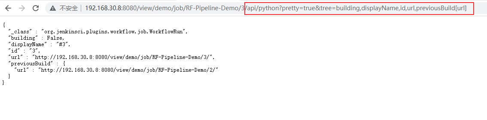

[JenkinsAPI](https://pypi.python.org/pypi/jenkinsapi), [Python-Jenkins](https://pypi.python.org/pypi/python-jenkins/), [api4jenkins](https://pypi.org/project/api4jenkins/), [aiojenkins](https://pypi.org/project/aiojenkins/)等Python库封装了许多jenkins REST API，下面以JenkinsAPI库为例。

直接来看代码：

```python
import datetime
from jenkinsapi.jenkins import Jenkins

class JenkinsApiDemo:
    def __init__(self, job_name, chose='jenkins'):
        self.jenkins_host = '192.168.30.8'
        self.jenkins_port = '8080'
        self.username = 'admin'
        self.pwd = 'admin'
        self.jenkins_url = f"http://{self.jenkins_host}:{self.jenkins_port}"
        self.job_name = job_name
        self.jenkins_server = Jenkins(self.jenkins_url, username=self.username, password=self.pwd, useCrumb=True)

    def GetJenkinsVersion(self):
        print(self.jenkins_server.version)
        return self.jenkins_server.version

    def jobBuild(self):
        if self.jenkins_server.has_job(self.job_name):
            myjob = self.jenkins_server.get_job(self.job_name)
            if not myjob.is_queued_or_running():
                self.jenkins_server.build_job(self.job_name)
    def disableJob(self):
        """Disable a Jenkins job"""
        if self.jenkins_server.has_job(self.job_name):
            job_instance = self.jenkins_server.get_job(self.job_name)
            job_instance.disable()
            print('Job %s Is Enabled ?:%s' % (self.job_name, job_instance.is_enabled()))

    def enableJob(self):
        """Disable a Jenkins job"""
        if self.jenkins_server.has_job(self.job_name):
            job_instance = self.jenkins_server.get_job(self.job_name)
            job_instance.enable()
            print('Job %s Is Enabled ?:%s' % (self.job_name, job_instance.is_enabled()))
            
    def getJobInfo(self):
        if self.jenkins_server.has_job(self.job_name):
            myjob = self.jenkins_server.get_job(self.job_name)
            if not myjob.is_queued_or_running():
                last_buildnumber = myjob.get_last_buildnumber()
                print("last_buildnumber: ", last_buildnumber)

                last_build = myjob.get_build(last_buildnumber)
                # 获取开始时间
                start_time = last_build.get_timestamp() + datetime.timedelta(hours=8)
                print("start_time: ", start_time)
                print("status: ", last_build.get_status())
                print("build_url: ", last_build.get_build_url())
                print("duration: ", last_build.get_duration())
                print("causes: ", last_build.get_causes()[0]["shortDescription"])
                print("change: ", last_build.get_changeset_items())
                print("console_log: ", last_build.get_console())
            else:
                print(self.job_name + " is running")
        else:
            print("没有 " + self.job_name + " 这个job")

if __name__ == '__main__':
    jobname = "RF-Pipeline-Demo"
    jk = JenkinsApiDemo(jobname)
    jk.GetJenkinsVersion()
    # jk.jobBuild()
    jk.disableJob()
    jk.enableJob()
    jk.getJobInfo()
```

执行结果：

```python
2.326
last_buildnumber:  20
start_time:  2022-01-20 18:22:12+00:00
status:  SUCCESS
build_url:  http://192.168.30.8:8080/job/RF-Pipeline-Demo/20/
duration:  0:00:02.620000
causes:  Started by user admin
change:  []
console_log:  Started by user admin
[Pipeline] Start of Pipeline
[Pipeline] node
.............
```

上述代码仅展示了部分方法，还可以创建、删除、复制job，创建、删除节点，重启等。

```python
jenkins_server.create_job(jobname, xml)
jenkins_server.copy_job(jobname, newjobname)
jenkins_server.create_node(name)
jenkins_server.delete_job(jobname)
jenkins_server.delete_node(nodename)
jenkins_server.safe_restart()
jenkins_server.shutdown()
```

更多方法可以查看库的相关函数。


参考资料：

1. [How to get the BUILD_USER in Jenkins when job triggered by timer? - Stack Overflow](https://stackoverflow.com/questions/36194316/how-to-get-the-build-user-in-jenkins-when-job-triggered-by-timer)
2. [Authenticating scripted clients (jenkins.io)](https://www.jenkins.io/doc/book/system-administration/authenticating-scripted-clients/)
2. https://www.jenkins.io/doc/book/using/remote-access-api/
2. https://jenkinsapi.readthedocs.io/en/latest/api.html
3. https://medium.com/@rathourarvi/remote-access-to-your-jenkins-using-rest-api-3d0c0bdb48a
3. groovy保留两位小数：https://stackoverflow.com/questions/4560546/how-do-i-round-a-number-in-groovy/18354167


