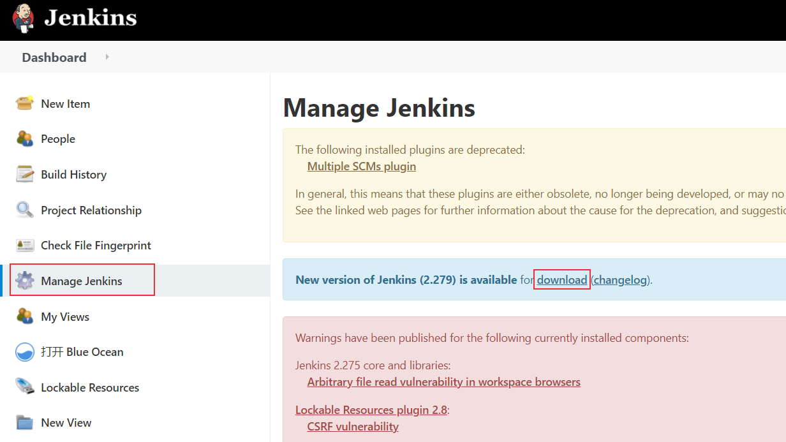
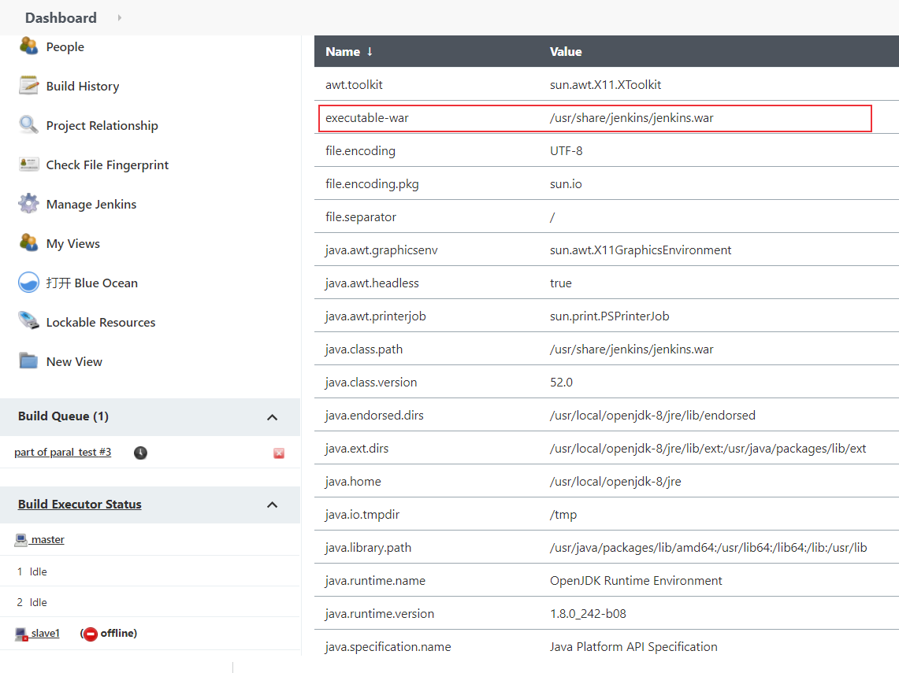
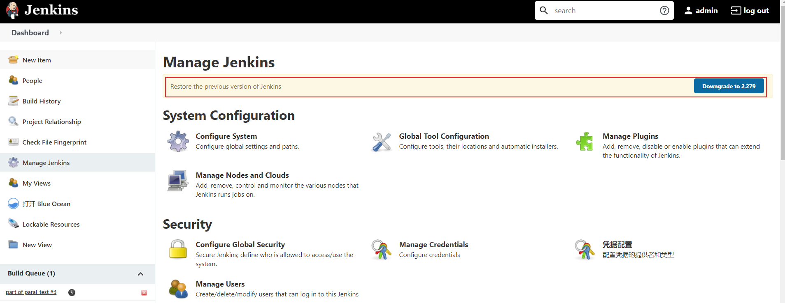
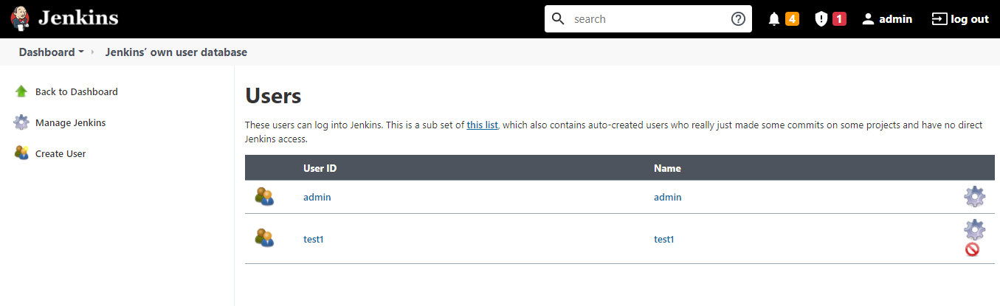

# 持续集成平台Jenkins介绍
持续集成（Continuous integration，CI）是软件开发和发布流程中最重要的组成部分，有利于加快开发进度。Jenkins是常用的持续集成管理工具，本文将简要介绍Jenkins持续集成工具。

<!--more-->

## 持续集成简介
持续集成（Continuous integration，CI）概念由Martin Fowler 于2006年提出：[https://martinfowler.com/](https://martinfowler.com/)， 频繁地（一天多次）将代码集成到主干。


> Continuous Integration doesn't get rid of bugs, but it does make them dramatically easier to find and remove.
**Martin Fowler, Chief Scientist, ThoughtWorks**

持续集成好处：
* 快速发现错误：持续自动化测试，可以快速发现和定位错误，节约时间。
* 易于定位项目进度，使项目更加透明。
* 导致更快的发布

## Jenkins介绍
Jenkins官网：[https://www.jenkins.io/](https://www.jenkins.io/)
Jenkins官网文档：[https://www.jenkins.io/doc/](https://www.jenkins.io/doc/)

Jenkins是免费开源的持续集成管理工具，基于Java开发，可以跨平台运行，提供持续集成和持续交付服务 ( continuous integration or continuous delivery，CI/CD)，自动化软件开发流程中的构建、测试和部署工作。Jenkins插件丰富，有超过1000个插件来支持构建、部署自动化，满足任何项目的需要。

持续集成工具比较：[https://en.wikipedia.org/wiki/Comparison_of_continuous_integration_software](https://en.wikipedia.org/wiki/Comparison_of_continuous_integration_software)


Docker Jenkins安装和启动方法参考：[Docker搭建持续集成平台Jenkins](https://blog.csdn.net/u010698107/article/details/113819992)

## Jenkins更新
进入Manage Jenkins，提示新版本，点击下载 jenkins.war 包。


### 1. jenkins.war 位置查看
**方法1：Manage Jenkins中查看**
点击进入Manage Jenkins，找到Status Information，点击System Information，可以查看war包位置

** 方法2：find命令查找 **
使用root账号进入容器中后使用find命令查找
```sh
[root@server ~]# docker exec -it -u root jenkins bash
root@ed883da9faab:/# find / -name jenkins.war
find: ‘/proc/1/map_files’: Operation not permitted
find: ‘/proc/7/map_files’: Operation not permitted
find: ‘/proc/138/map_files’: Operation not permitted
find: ‘/proc/155/map_files’: Operation not permitted
/usr/share/jenkins/jenkins.war
root@ed883da9faab:/# 
```
### 2. 更新容器中的war包
使用root账号进入容器中，备份原来的war包
```sh
[root@server ~]# docker exec -it -u root jenkins bash
root@ed883da9faab:/# cd /usr/share/jenkins
root@ed883da9faab:/usr/share/jenkins# mv jenkins.war jenkins.war.bak
```
将下载的war包复制到容器目录 /usr/share/jenkins 下（注意是在宿主机上操作）
```sh
[root@server ~]# docker cp jenkins.war jenkins:/usr/share/jenkins/
[root@server ~]# docker exec -it -u root jenkins bash
root@ed883da9faab:/usr/share/jenkins# ls
jenkins.war  jenkins.war.bak  ref
```
### 3. 重启Jenkins
```sh
$ docker restart jenkins
```
刷新页面，登陆，进入Manage Jenkins，可以看到版本更新成功，可以降回原来的版本。


## Jenkins配置
### 系统配置
进入Manage Jenkins -> System Configuration -> Configure System进行系统配置，有很多配置参数可以配置，比如：
- Jenkins URL：服务器域名
- 管理员邮箱
- Github配置
- 默认 Shell：bash
- 等

#### 配置 Shell
比如在windows代理节点中，默认命令行使用cmd，如果你想使用Git Bash，可以在系统配置中进行配置。进入Manage Jenkins -> System Configuration -> Configure System，下拉到shell，配置Shell executable为你的命令行文件路径，比如我的git bash路径为：`D:/tools/Git/bin/sh.exe`


### 插件管理
Jenkins插件众多，扩展了很多功能。进入Manage Jenkins -> System Configuration -> Manage Plugins进行插件的管理。

可以先点击Advanced 设置更新网址URL：https://mirrors.tuna.tsinghua.edu.cn/jenkins/updates/update-center.json


然后进行插件的安装更新操作， 插件的安装方法，在Available中的输入框输入要安装的插件名称关键字进行搜索，选择要安装的插件，点击“Download now and install after  restart”进行下载安装。

Jenkins推荐插件：
* Multiple SCMs plugin
* Rebuilder
* Safe Restart Plugin
* Pipeline
* Text Finder
* Blue Ocean
* Allure

### 用户权限控制
在Jenkins的初始化安装过程中会先注册一个管理员用户，管理员用户可以创建一般用户，管理员用户具有最高权限。

进入Manage Jenkins -> Security -> Configure Global Security进行安全配置
可以勾选允许用户注册，团队人数较少时，一般建议不勾选，由管理员创建


进入Manage Jenkins -> Security -> Manage Users进行用户管理，可以进行用户删除、修改和添加操作


权限控制在Manage Jenkins -> Security -> Configure Global Security -> Authorization下
可以选择【安全矩阵】（个人权限）或者【项目矩阵】（项目权限）进行权限管理


### 关闭跨站请求伪造保护（CSRF）

Jenkins高版本不能再web页面关闭CSRF。

一种方法是在Jenkins启动时加入取消保护的参数：

```bash
-Dhudson.security.csrf.GlobalCrumbIssuerConfiguration.DISABLE_CSRF_PROTECTION=true
# 或者
-Dhudson.security.csrf.GlobalCrumbIssuerConfiguration=false
```

第二种方法是修改Jenkins容器中的/usr/local/bin/jenkins.sh文件：

将`Dhudson.security.csrf.GlobalCrumbIssuerConfiguration.DISABLE_CSRF_PROTECTION=true` 添加到`exec java` 开头的那行命令中：

```bash
exec java -Duser.home="$JENKINS_HOME" -Dhudson.security.csrf.GlobalCrumbIssuerConfiguration.DISABLE_CSRF_PROTECTION=true "${java_opts_array[@]}" -jar ${JENKINS_WAR} "${jenkins_opts_array[@]}" "$@"
```

如果Jenkins容器没有vi或者vim命令，可以将文件复制出来修改后，再复制回去：

```bash
$ docker cp db10006f12ad:/usr/local/bin/jenkins.sh .   #复制到当前目录
$ vi jenkins.sh # 修改jenkins.sh文件
$ docker cp jenkins.sh db10006f12ad:/usr/local/bin/jenkins.sh # 复制到容器中

```

修改完成后重启jenkins容器

```bash
docker restart jenkins 
```

然后在【全局安全配置】中可以看到 跨站请求伪造保护 已经关闭


##  slave节点管理
在实际工作中，考虑到宿主机资源限制，可以采用多节点的方式，将任务分配到其他节点执行。通过添加多个Jenkins slave节点来执行Jenkins任务， Jenkins运行的主机称为 master节点：
* 节点上需要配置Java运行环境, Java_Version>1.5
* 节点支持Windows, Linux，Mac系统

### 节点添加方式
先查看是否配置了Java运行环境：
```sh
[root@server /]# java -version
openjdk version "1.8.0_252"
OpenJDK Runtime Environment (build 1.8.0_252-b09)
OpenJDK 64-Bit Server VM (build 25.252-b09, mixed mode)
[root@server /]# 
```

进入Manage Jenkins -> System Configuration -> Manage Nodes and Clouds

**1、添加Linux节点**
配置节点（注意我配置的slave节点为宿主机）：

发现节点连接不成功


查看日志，发现没有known_hosts
```sh
/var/jenkins_home/.ssh/known_hosts [SSH] No Known Hosts file was found at /var/jenkins_home/.ssh/known_hosts. Please ensure one is created at this path and that Jenkins can read it.
```
一种解决方法是，设置认证策略为手动信任


上线成功


**2、添加Windows节点**
windows节点配置


节点连接方式

第一种方式：点击Launch图标下载，双击运行下载的文件jenkins-agent.jnlp

刷新，上线成功


第二种方式：
```sh
java -jar agent.jar -jnlpUrl http://192.168.30.8:8080/computer/slave2/jenkins-agent.jnlp -secret 626402e3eee37788fa41ffa7353a2cc14f269028672a0af206b0f92e6578f364 -workDir "D:\ProgramWorkspace\TestingDemo\jenkins"
# Run from agent command line, with the secret stored in a file:
echo 626402e3eee37788fa41ffa7353a2cc14f269028672a0af206b0f92e6578f364 > secret-file
java -jar agent.jar -jnlpUrl http://192.168.30.8:8080/computer/slave2/jenkins-agent.jnlp -secret @secret-file -workDir "D:\ProgramWorkspace\TestingDemo\jenkins"
```

启动jenkins时，开启了8080和50000端口（[Docker搭建持续集成平台Jenkins](https://blog.csdn.net/u010698107/article/details/113819992)），8080端口是jenkins服务器对外URL地址，50000端口为slave节点与jenkins的通讯端口，在默认情况下，基于JNLP的Jenkins代理通过TCP端口50000与Jenkins主站进行通信。

Windows查看50000端口占用：
```sh
C:\Users\10287>netstat -aon | findstr "50000"
  TCP    127.0.0.1:50000        0.0.0.0:0              LISTENING       8644
  TCP    192.168.30.100:52297   192.168.30.8:50000     ESTABLISHED     10028

```
Linux查看端口占用情况：
```sh
[root@server /]# lsof -i:8080
COMMAND    PID USER   FD   TYPE DEVICE SIZE/OFF NODE NAME
docker-pr 2787 root    4u  IPv4  51423      0t0  TCP *:webcache (LISTEN)
[root@server /]# lsof -i:50000
COMMAND    PID USER   FD   TYPE DEVICE SIZE/OFF NODE NAME
docker-pr 2775 root    4u  IPv4  50675      0t0  TCP *:50000 (LISTEN)
[root@server /]# netstat -aptn | grep 50000
tcp        0      0 0.0.0.0:50000           0.0.0.0:*               LISTEN      2775/docker-proxy   
[root@haiyong jenkins_home]# 
```

## Jenkins创建项目
### 创建项目


### 选择Freestyle project


### 项目配置

可以发现一个job的组成部分包括：
* General：项目通用配置
* Source Code Management：源代码控制，比如Git配置
* Build Triggers：触发，构建时间配置（定期构建，代码变更构建）
* Build Environment
* Build：执行命令，比如执行shell
* Post-build Actions：执行完成后进行分析，生成报告，发送邮件等

### 构建完成


### 查看控制台输出

## Jenkins父子多任务运行
任务启动的触发条件：其他任务的运行结果
* 前驱任务成功的条件下被触发
* 前驱任务失败的条件下被触发
* 前驱任务不稳定的条件下被触发

适用于有先后次序关系的任务，比如 部署环境任务，验收测试任务
### Jenkins配置成功任务关联
**1、新建第一个任务first_test**


**2、构建**


**3、新建第二个任务second_test**


**4、构建，设置触发方式**
设置为前驱任务稳定成功的条件下被触发


**5、启动第一个任务first_test**


控制台输出


可以看到second_test也成功了


前驱任务不稳定的条件下也被触发，可以使用Text Finder插件来构建不稳定条件
### Jenkins配置失败任务关联
前驱任务稳定成功的条件下被触发


## Jenkins邮件报警
Jenkins可以配置邮件通知，比如在Jenkins构建任务之后发送邮件通知，错误报警等

安装插件：Email Extension和Email Extension Template


### Jenkins配置 Email
进入Manage Jenkins -> System Configuration -> Configure System 配置系统管理员e-mail地址


配置Extended E-mail Notification，注意SMTP Password不是邮箱密码，为你的邮箱授权码

拉到最下面，配置邮件通知，配置完成后，可以发一个测试邮件，查看是否配置成功


### Jenkins邮件模板配置
Jenkins可以根据你配置的邮件模板格式来发送结果邮件，通过Jenkins的参数定制自己的Email模板，常用的参数key值如下:
* $BUILD_STATUS ：构建结果
* $PROJECT_NAME ：构建脚本名称
* $BUILD_NUMBER ：构建脚本编号
* $JOB_DESCRIPTION ：构建项目描述
* $CAUSE ：脚本启动原因
* $BUILD_URL ：脚本构建详情URL地址

Default Subject
```txt
Jenkins构建提醒：$PROJECT_NAME - Build # $BUILD_NUMBER - $BUILD_STATUS!
```

Default Content
```html
<hr/>(自动化构建邮件，无需回复！)<br/><hr/>

项目名称：$PROJECT_NAME<br/><br/>

项目描述：$JOB_DESCRIPTION<br/><br/>

运行编号：$BUILD_NUMBER<br/><br/>

运行结果：$BUILD_STATUS<br/><br/>

触发原因：${CAUSE}<br/><br/>

构建日志地址：<a href="${BUILD_URL}console">${BUILD_URL}console</a><br/><br/>

构建地址：<a href="$BUILD_URL">$BUILD_URL</a><br/><br/>

详情：${JELLY_SCRIPT,template="html"}<br/>

<hr/>
```


### Jenkins报警规则
在模板设置的下方有个 Default Triggers 按钮，点击后，设定报警规则


在job的**构建后操作**步骤选择" Editable Email Notification "


配置完成后，构建项目，查看控制台输出


查看邮箱，发送成功！


