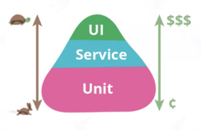

# 接口测试简介及 Web 服务架构
**API (Application Programming Interface，应用程序接口)**是支持两个相互独立的软件系统之间进行通信和数据交换的计算机接口，它定义了两个软件系统之间可以发出什么请求、如何发出请求、可用的数据格式等。
<!--more-->

## 接口测试
### 什么是接口测试？
接口测试是一种验证应用程序接口(API)的软件测试类型，目的是检查系统组件间接口的功能、可靠性、性能和安全性。在 API 测试中，不使用标准的用户输入(键盘)和输出，而是使用软件向 API 发送调用，获取输出，并记录系统的响应。API 测试与 GUI 测试不同，不关注应用程序的外观和使用体验，专注于软件架构的业务逻辑层。

### 接口测试必要性
使用接口测试可以更早的发现问题，让Bug提前暴露出来，提高测试效率，实现更快的质量反馈

接口测试保证的是后端工程师的产出质量，不能解决移动端的质量，所以接口测试不能取代UI测试。大前端工程师的产出质量只能通过UI测试保证。

## Web API

API架构有REST，XML-RPC, SOAP ，JSON-RPC等，REST和RPC是常用的两种方式，XML-RPC 和 SOAP使用xml存储数据，进行数据传输，REST基于JSON作为传输格式，使用起来比较简单，学习成本低。下面简要介绍REST和RPC这两种架构。

### RPC

RPC(Remote Procedure Call, 远程过程调用 ) 由Bruce Jay Nelson 在 1984 年提出，在客户端通过参数传递的方式调用远程服务器，以本地代码调用的方式实现远程执行，采用C/S模式。由阿里开发的基于java的Apache Dubbo就是采用的RPC框架，通讯协议是RPC协议。底层应用层协议支持 tcp http, hessian, thrift, grpc等。

### REST

REST(representational state transfer，表现层状态转移)由[Roy Thomas Fielding](https://en.wikipedia.org/wiki/Roy_Fielding)在他的[博士论文](https://www.ics.uci.edu/~fielding/pubs/dissertation/top.htm)中提出，REST 是一种架构设计风格，不是架构，也不是协议。主要特征：
- 每一个URL代表一种资源
- 客户端和服务器之间，传递这种资源的某种表现层
- 客户端通过四个HTTP动词，对服务器端资源进行操作，实现表现层状态转化

借助于http协议的基本请求方法代表资源的状态切换，将所有 Web 服务抽象为资源：
- post：新增或者更新资源
- get：获取资源
- put：更新资源
- delete：删除资源

REST API文档：[https://developer.github.com/v3/](https://developer.github.com/v3/)

### HTTP协议
#### HTTP 请求方法

| **请求方法** |                    **描述**                    |
| :----------: | :--------------------------------------------: |
|     HEAD     |             获取服务器的响应头信息             |
|     GET      |                 请求指定的资源                 |
|     POST     |     向指定资源提交数据，请求服务器进行处理     |
|    PATCH     |    与`PUT`请求类似，一般用于资源的部分更新     |
|     PUT      | 将指定资源的最新数据传送给服务器取代指定的资源 |
|    DELETE    |        用于删除所请求`URI`所标识的资源         |

#### 请求/响应模型
**HTTP请求报文Request**
客户端向服务器发送一个HTTP请求报文，请求报文包含请求的方法、URL、协议版本、请求头部和请求数据。
* **HTTP1.0**定义了三种请求方法：GET, POST 和 HEAD方法。
* **HTTP1.1**新增了五种请求方法：OPTIONS, PUT, DELETE, TRACE 和 CONNECT 方法。

**HTTP响应报文Response**
服务器接收并处理客户端发过来的请求后会返回一个HTTP响应消息。

服务器以一个状态行作为响应，响应的内容包括协议的版本、成功或者错误代码、服务器信息、响应头部和响应数据。

#### 工作原理
1. 客户与服务器建立连接；**建立连接-TCP三次握手**
2. 客户向服务器提出请求；**发送请求信息**
3. 服务器接受请求，并根据请求返回相应的文件作为应答；**发送响应信息**
4. 客户与服务器关闭连接。**关闭连接**
5. 客户端浏览器解析HTML内容

#### URL：统一资源定位符
URL是互联网上用来标识某一处资源的地址，一个完整的URL包括以下几部分：
* https://www.google.com/search?q=request&source=lnms#imgrc=Lz-GAoSvIgYOlM
    * 协议：https
    * 域名：www.google.com
    * 端口：位于域名后面，冒号连接
    * 虚拟目录：从域名后的第一个“/”开始到最后一个“/”为止
    * 文件名：从域名后的最后一个“/”开始到“？”为止；若没有“?”,则是到“#”为止；若没有“？”和“#”，则是到结束
    * 锚：从“#”开始到最后
    * 参数：从“？”开始到“#”为止之间的部分为参数部分，参数与参数之间用“&”作为分隔符

### REST API测试

REST API测试用于测试 web 应用程序的 RESTful API，目的是通过发送各种 HTTP/S 请求来记录 REST API的响应，以检查 rest api 是否工作正常。主要包括 GET、 POST、 PUT 和 DELETE 方法。

## 协议分析工具
抓包解包分析推荐使用tcpdump+ WireShark，参考 [使用tshark命令解析tcpdump抓取的数据包](https://hiyong.gitee.io/posts/network-tcpdump-and-wireshark/)

代理工具推荐：

- 手工测试 charles、安全测试 burpsuite

- 自动化测试：mitmproxy

- 其他代理：fiddler[仅windows]、 Any Proxy[全平台]

客户端模拟请求工具：

- curl：最常使用的http请求工具

- postman：http协议测试工具

- nc工具：tcp/udp协议发送，全名netcat，被誉为网络安全界的‘瑞士军刀’

  

