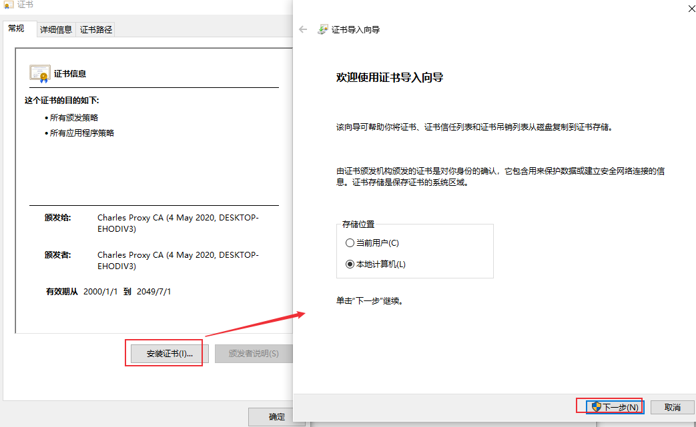

# charles SSL证书安装
charles抓取https协议报文需要配置SSL通用证书，否则会导致乱码，本文介绍Charles 的 CA 证书安装方法。

<!--more-->

## 1. 电脑安装SSL证书
选择 “Help” -> “SSL Proxying” -> “Install Charles Root Certificate”

## 2. 浏览器安装SwitchyOmega插件
插件下载地址：https://github.com/FelisCatus/SwitchyOmega/releases

设置代理：
charles默认代理端口为8888

设置完成后，浏览器开启charles代理。

## 3. 配置SSL的抓取域名
选择 “Proxy” -> “SSL Proxying Settings” 

启用SSL代理，配置location

## 4. 浏览器安装SSL证书
选择 “Help” -> “SSL Proxying” -> “Install Charles Root Certificate on a Mobile Device or Remote Browser”

弹出如下提示框

浏览器地址栏输入“chls.pro/ssl” 下载证书

chrome浏览器安装：

## 5. 手机安装SSL证书
设置手机代理

手机浏览器输入“chls.pro/ssl” 下载证书

点击下载的证书文件进行安装

设置PIN码后安装成功

手机浏览器访问baidu，charles查看https报文：
证书安装成功

