# 接口测试代理工具charles mock测试
charles代理工具支持分析http/https协议，其中https包需要安装SSL证书。charles可用于mock测试，拦截请求与响应，支持对请求和响应进行动态修改，还可用于模拟慢速网络。本文介绍charles 的mock测试方法。

<!--more-->


## 环境准备
1. 首先需要安装Charles 的 CA 证书，安装方法参考[charles SSL证书安装](https://blog.csdn.net/u010698107/article/details/112728397)。
2. 手机（或者模拟器）配置charles代理
3. 手机安装雪球APP
4. 确认charles可以抓取雪球APPhttps报文

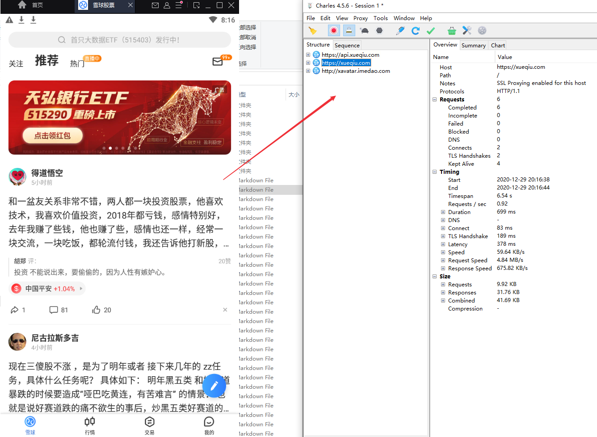

## Rewrite
要求：修改招商银行名称及股票价格
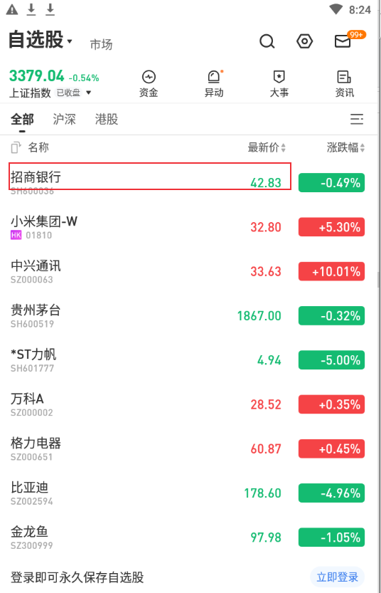

2. 1. 选择【Tools】> 【Rewrite】
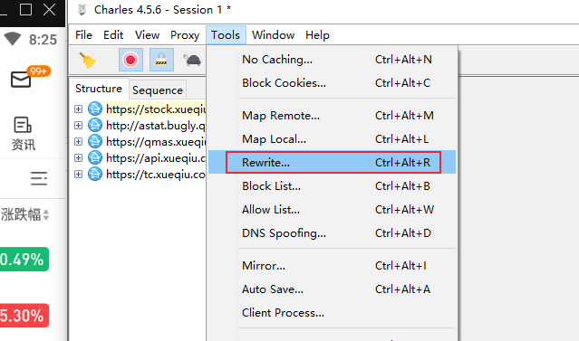

3. 2. 勾选【Enable Rewrite】，添加一条规则雪球xueqiu，Location配置为所有报文
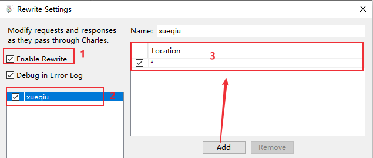

4. 3. 添加重写规则：“招商银行”改为“招商银行test"，股票价格改为”50“，添加完成后点击确认
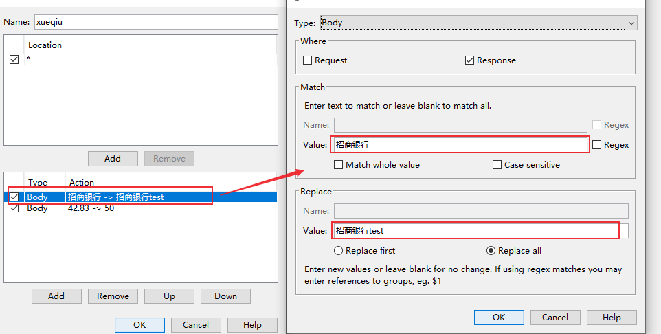

5. 4. 刷新雪球APP行情页面，发现重写成功
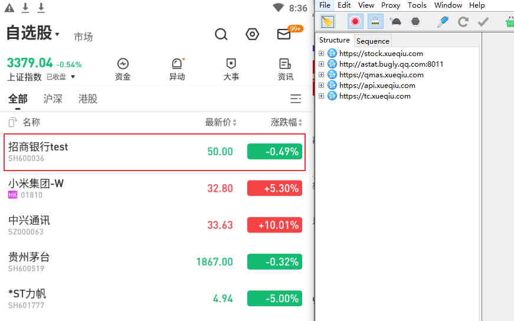

## Map Local
要求：
* 修改股票名 “招商银行” 为 “招商银行test"
* 数据倍增


1. 选择【Tools】> 【Mirror】保存数据

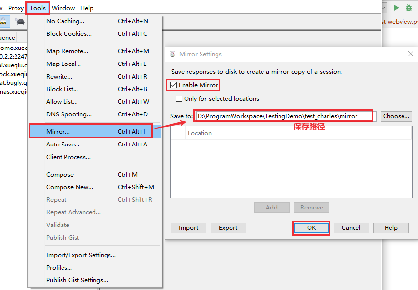
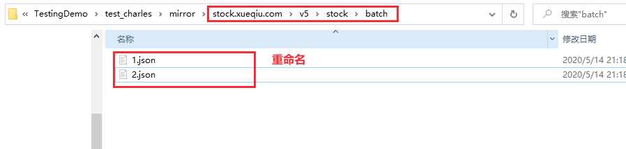

或者直接保存响应数据
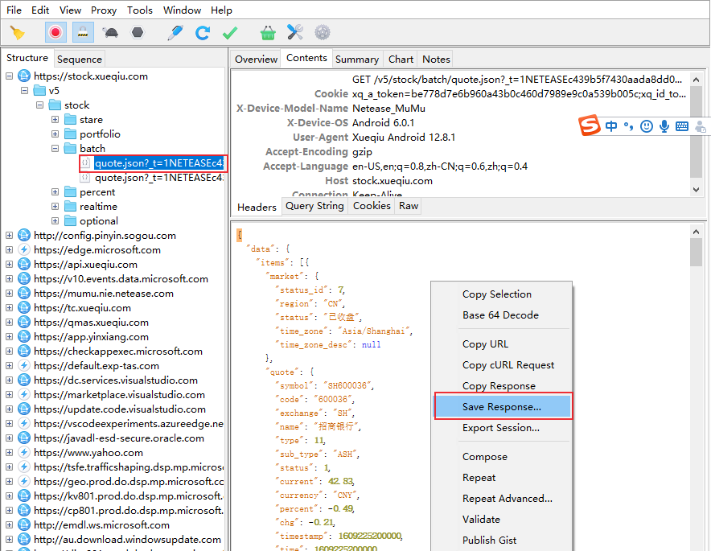

2. 修改文件股票名 “招商银行” 为 “招商银行test"
3. jq命令数据倍增
```bash
stockdata=$(cat stock.json)
stockdata=$(echo $stockdata | jq '.data.items+=.data.items' | jq '.data.items_size+=.data.items_size')
echo $stockdata > stock2.json
```
4. 设置maplocal
选择刷新股票信息的报文，右键 > 选择Map Local
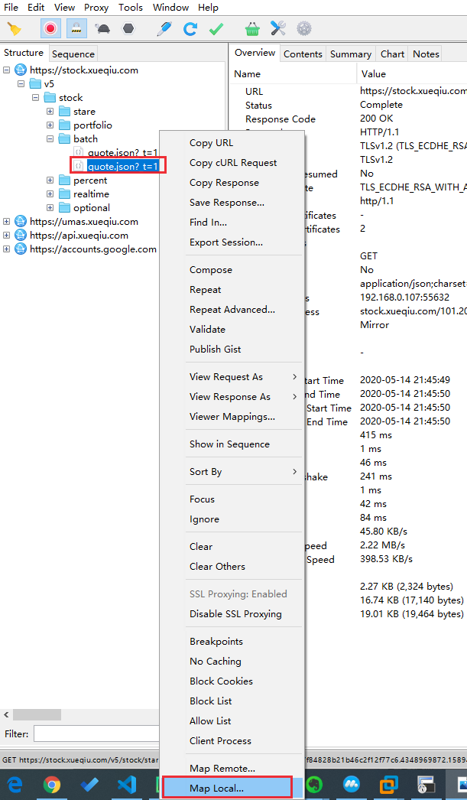

配置参数，导入生成的文件stock2.json
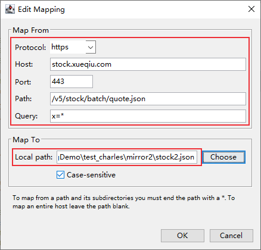

5. 刷新雪球APP行情页面
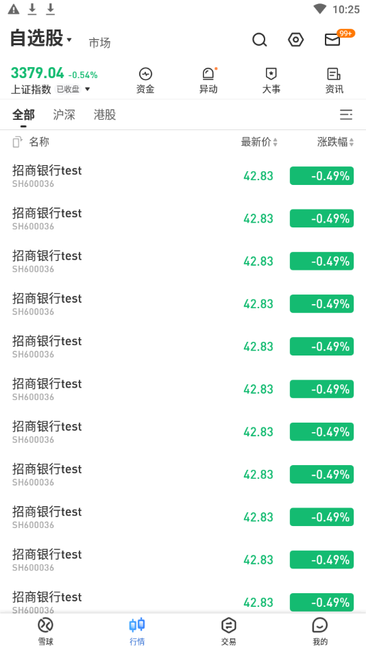


