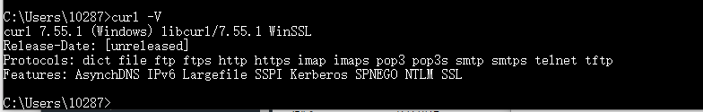
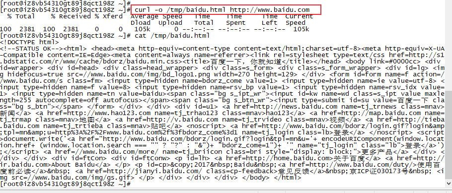
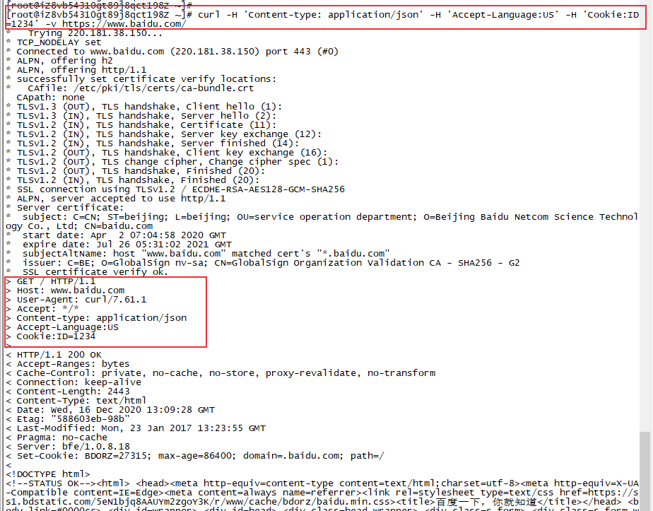
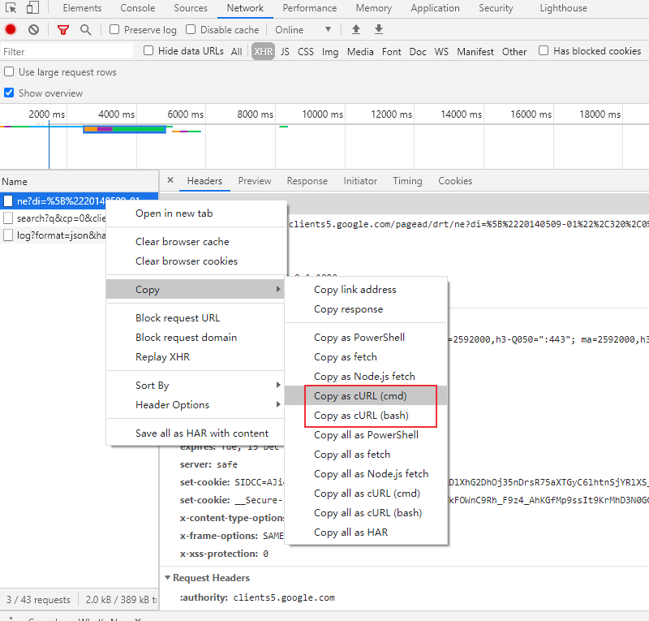

# cURL工具介绍及简单使用
curl命令是个功能强大的网络工具，可用来请求 Web 服务器，支持通过FTP、FTPS、HTTP、HTTPS、SMTP、Telnet、TFTP等协议，底层使用的是 libcurl 库。可用于文件上传、下载，还可以用来模拟客户端请求，抓取网页、网络监控等。本文介绍使用curl来发送请求。
<!--more-->

## curl安装
Windows:
1. 下载解压：[https://curl.haxx.se/download.html](https://curl.haxx.se/download.html)
2. 加入环境变量

`curl -V` 查看版本信息：

Linux:
```bash
yum install curl # CentOS 
apt-get install curl # Ubuntu
```
## curl常见用法
- get请求：curl url
- post请求：curl -d 'xxx'  -X POST $url
- proxy使用：curl -x 'http://127.0.0.1:8080' $url ：指定 HTTP 请求通过http://127.0.0.1:8080 代理发出。

其他参数用法：
- -H： "Content-type: application/json"  添加 HTTP 请求头 `curl -H 'Content-type: application/json' $url`
- -G： 把data数据当成get请求的参数发送，用来构造 URL 的查询字符串，与--data-urlencode结合使用
- -X：指定 HTTP 请求的方法 `curl -X POST $url`
- -d： 发送post请求数据，@file表示来自于文件
- --data-urlencode：发送post请求数据，会对内容进行url编码
- -u： username:password用户认证
- -o： 写文件，将服务器的响应保存成文件
- -v： verbose，打印更详细日志 
- -s： 关闭一些提示输出，不输出错误和进度信息。
- -S：只输出错误信息


## curl实例
1. 请求 http://www.baidu.com， 将服务器的响应保存为html文件。
```bash
curl -o /tmp/baidu.html http://www.baidu.com
```


2. curl设置自定义 header 信息
```bash
curl -H 'Content-type: application/json' -H 'Accept-Language:US' -H 'Cookie:ID=1234' -v https://www.baidu.com/
```


## copy as curl

打开chrome浏览器的开发者工具：


```python
curl "https://clients5.google.com/pagead/drt/ne?di=^%^5B^%^2220140509-01^%^22^%^2C320^%^2C0^%^2C550^%^5D" ^
  -H "authority: clients5.google.com" ^
  -H "user-agent: Mozilla/5.0 (Windows NT 10.0; Win64; x64) AppleWebKit/537.36 (KHTML, like Gecko) Chrome/87.0.4280.88 Safari/537.36" ^
  -H "x-requested-with: XMLHttpRequest" ^
  -H "accept: */*" ^
  -H "x-client-data: CK21yQEIjrbJAQijtskBCMS2yQEIqZ3KAQiWrMoBCJfCygEIrsLKAQisx8oBCPbHygEI98fKAQi0y8oBCKTNygEIos/KAQjc1coBCMKcywEIxZzLAQjVnMsBGOy4ygE=" ^
  -H "sec-fetch-site: same-origin" ^
  -H "sec-fetch-mode: cors" ^
  -H "sec-fetch-dest: empty" ^
  -H "referer: https://clients5.google.com/pagead/drt/dn/" ^
  -H "accept-language: zh-CN,zh;q=0.9" ^
  -H "cookie: CONSENT=YES+GB.zh-CN+V14+BX; HSID=ApIaHMWrytTvjqMEY; SSID=AygJZayBnP28BxFf8; APISID=UmyTkS9N9ChWmnBG/AiX66wI9xuFNodxDq; SAPISID=2RDZPon8mmYFUeFe/AH2H3UhsBS56EVzlz; __Secure-3PAPISID=2RDZPon8mmYFUeFe/AH2H3UhsBS56EVzlz; SID=3wecPbBT_8ICWEMZ5LIHO8U6mUJK2S89ijFYUnIkyW21xGDb-NBvF2GLkodON3gjyG3pTA.; __Secure-3PSID=3wecPbBT_8ICWEMZ5LIHO8U6mUJK2S89ijFYUnIkyW21xGDbqY5AvmtkqB83SkM4W5Afuw.; NID=204=FqAz385UbUYitAfQlLxpoWdqs1wFoatEH6GwJPuJ4Am0zybAYk_jUN1hCp7sSUxQ9g2XpEJ6pXByvz4z9p9V4dYnFhsSJ48mVJite-Zz1-vhgXewIS3NeK8_rnW6BT0X6dxcKDd5GiG6A3EdN7YuWZXCWVOi_QmARqfLrqzROWzk0u54chsvJOc0MQjKQX3eQUgNM9ATMFDgayrkUu95mRETP5XiqGkL--jPKV49482QfQFjL-oomZ7yzJpzax3h62uOkqP3m0k; 1P_JAR=2020-12-15-13; SIDCC=AJi4QfGElscF8CoJohJbugG-XFh1nPnYTmwvm-mnyMsiq0BVDeYqfb-JgqXBhoGNBTTjYv3hUw; __Secure-3PSIDCC=AJi4QfF2K4Rz5-Sl_Q6p9GM8H-h_4Q43LiFHs9mLuqsP1lYjpNoH7KTpTJDgAIApoafgbq8ZNtc" ^
  --compressed
```


