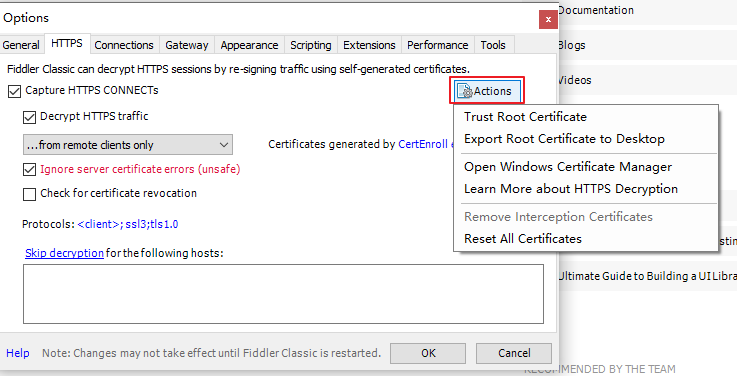

# 使用Fiddler抓取手机APP报文
Http协议代理工具有很多，比如Burp Suite、Charles、Jmeter、Fiddler等，它们都可以用来抓取APP报文，其中charles和Burp Suite是收费的，Jmeter主要用来做接口测试，而Fiddler提供了免费版，本文记录一下在Windows系统中如何用Fiddler代理工具抓取手机APP报文。

## 安装fiddler

先安装fiddler，下载地址为：[Fiddler | Web Debugging Proxy and Troubleshooting Solutions (telerik.com)](https://www.telerik.com/fiddler)

下载成功后，双击FiddlerSetup.exe文件安装。

为了能够解码https报文，点击“Tools->Options…”菜单。勾选“Decrypt HTTPS traffic”，选择信任Fiddler根证书，添加证书

选择 `…from remote clients only` 就会只抓取远程客户端的报文。

然后点击“Actions”按钮，可看到“Trust Root Certificate”可以点击，已经做了上一步信任证书的操作，这里就不需要点击了。

点击“Export Root Certificate to Desktop”导出证书。打开浏览器的管理证书页面，比如Google浏览器：[chrome://settings/security](chrome://settings/security)，导入前面导出的Fiddler证书。

## 设置Fiddler代理

点击Tools -> Options… -> Connections，设置一个端口，勾选“Allow remote computers to connect”，然后重启Fiddler。

重启后浏览器访问http://192.168.0.104:8899/，其中192.168.0.104是我电脑的IP地址，8899是设置的Fiddler端口。

## 手机安装证书

手机要和PC处于同一局域网下，可以将它们连接到同一个WiFi。

然后手机浏览器访问地址http://192.168.0.104:8899/，点击 [FiddlerRoot certificate](http://192.168.5.51:8899/FiddlerRoot.cer)下载证书，下载完成然后安装。

## 设置手机代理

手机进入连接的WiFi设置页面，配置代理：

配置完成后，Fiddler就可以抓取手机上的报文了。

## 抓取APP报文

比如手机访问百度，可在Fiddler上抓取到百度的HTTPS报文：

抓取到手机APP报文后就可以使用接口测试工具比如Jmeter进行APP接口测试了。

