# 使用Jmeter抓取手机APP报文并进行APP接口测试
Jmeter是一个比较常用的接口测试工具，尤其是接口性能测试。当然它也可以用来测试手机APP的HTTP接口，我在[Fiddler抓取手机APP报文](https://blog.csdn.net/u010698107/article/details/128524164) 和 [接口测试代理工具charles mock测试](https://blog.csdn.net/u010698107/article/details/112728913) 分别介绍了Fiddler和charles 如何抓取APP报文，本文介绍使用Jmeter来抓取APP报文以及进行手机APP接口测试。

## 安装Jmeter

使用Apache JMeter进行接口测试需要先配置Java环境，JDK下载地址：[https://www.oracle.com/java/technologies/downloads/#java11](https://www.oracle.com/java/technologies/downloads/#java11)

Jmeter下载地址：https://jmeter.apache.org/download_jmeter.cgi

安装完成后打开jmeter，页面如下：

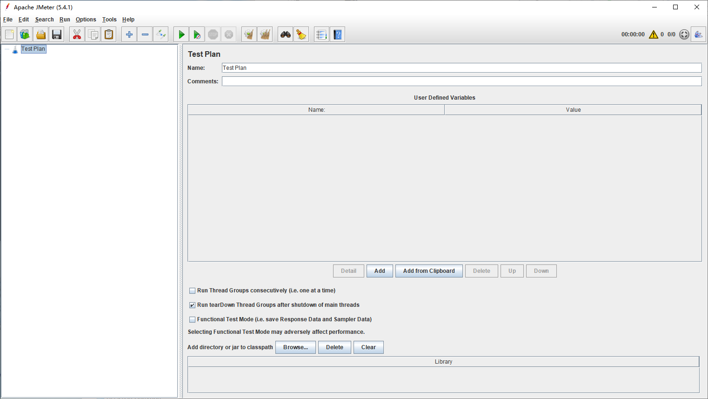

将手机和PC连接到同一局域网下，可以连接同一个WiFi。我的PC获取到的IP地址为192.168.0.167。

## Jmeter配置代理

添加HTTp(s) Test Script Recorder （代理服务）：Test Plan -> Add -> Non-Test Elements -> HTTp(s) Test Script Recorder

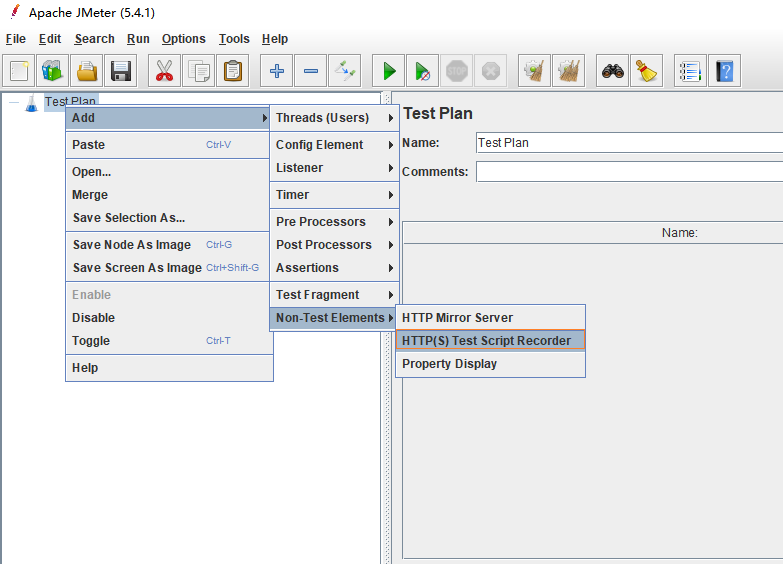

接下来配置端口（8898）和IP地址（192.168.0.167）：

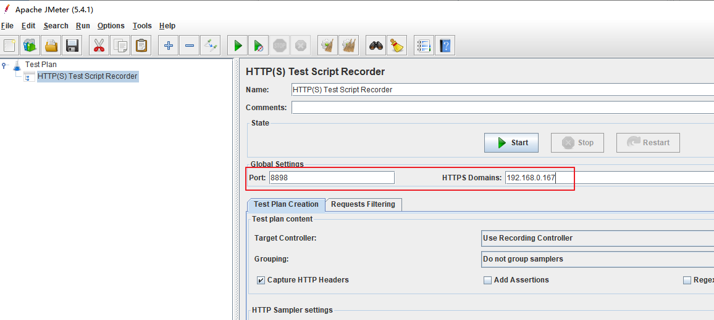

添加线程组：Test Plan -> Add ->Threads(Users) -> Thread Group

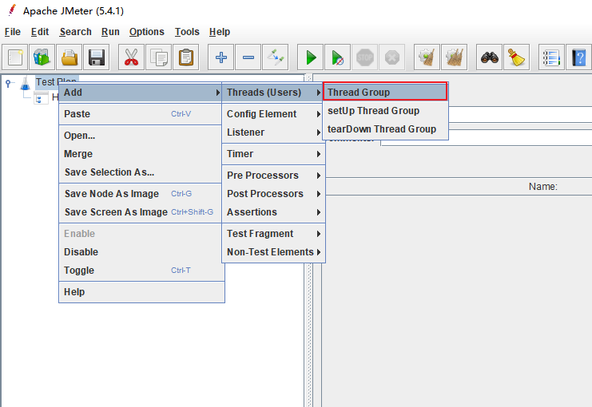

在线程组下添加Recording Controller：Thread Group -> Add -> Logic Controller -> Recording Controller

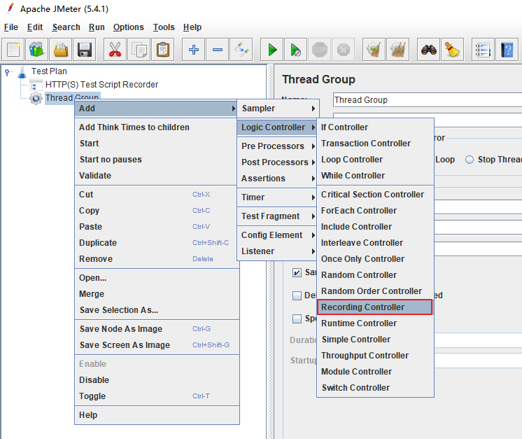

新增View Results Tree，用来监听测试结果：Thread Group -> Add -> Listenter -> View Results Tree

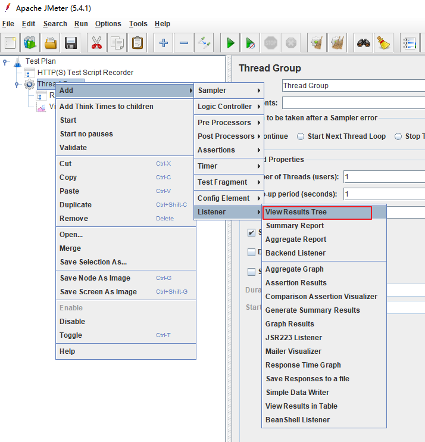

配置代理服务报文存放位置，设置为：Test Plan > Thread Group >  Recording Controller，这样抓取到的APP报文将会存放在Recording Controller下。

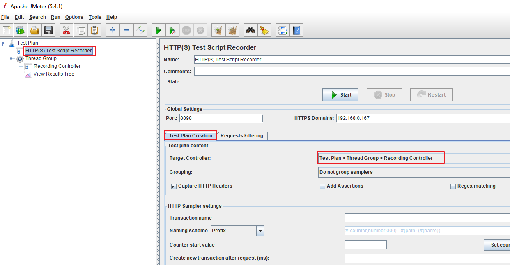

##  手机安装证书

先点击HTTP(S) Test Script Recorder的“Start”按钮，在JMeter安装目录的“bin”文件夹中会自动生成名称为ApacheJMeterTemporaryRootCA.crt的文件。

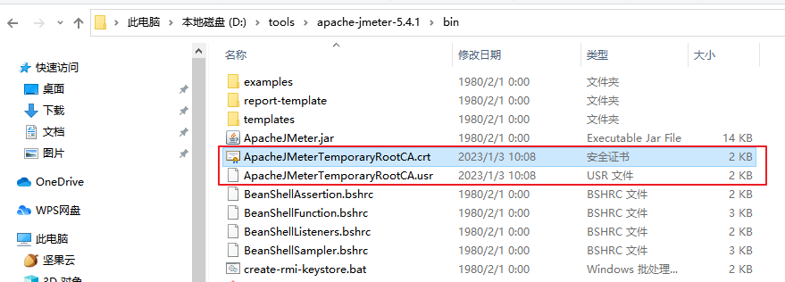

将crt证书文件发送到手机进行安装，安装完成后就可以抓取HTTPS报文了。

## 手机设置代理

配置之前一定要保证手机和PC处于同一个局域网下。

手机进入连接的WiFi设置页面，配置代理，主机IP地址为PC的IP地址192.168.0.167，端口号是jmeter设置的端口号8898。

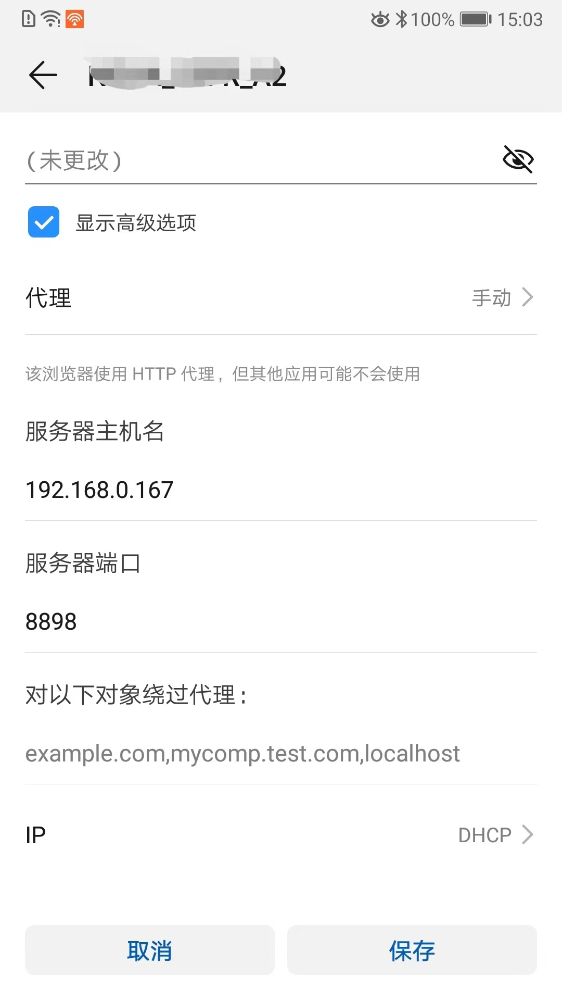

## 抓取APP报文

点击HTTP(S) Test Script Recorder中的“Start”按钮，然后手机操作APP

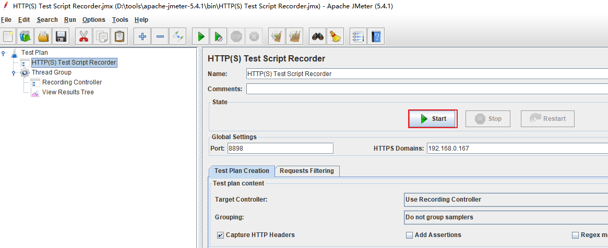

在 Recording Controller 中可以看到APP发出的请求。

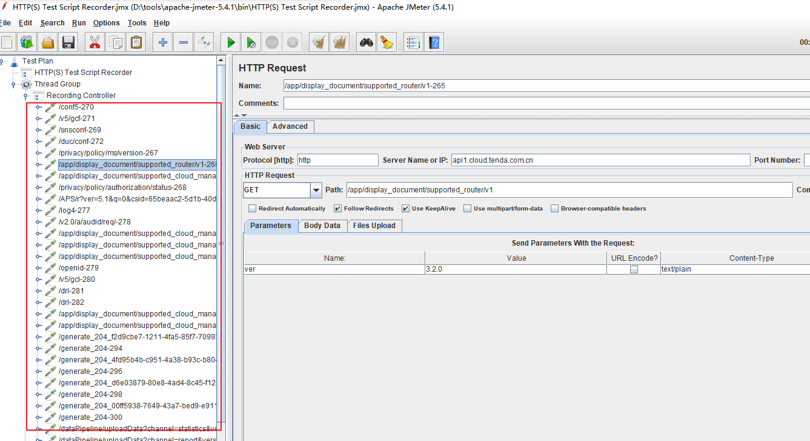

APP操作完成后，停止抓包。

## 录制回放

对录制的请求进行回放，选中Recording Controller，点击上方绿色启动按钮。

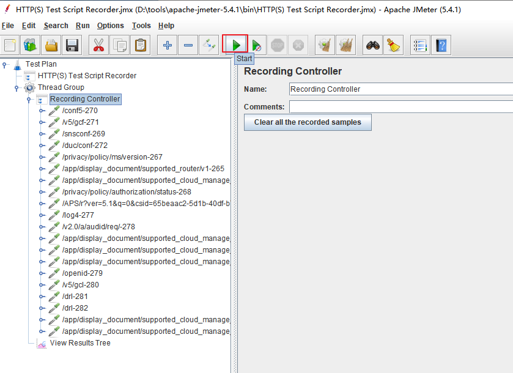

View Results Tree中显示了回放过程，可查看每一次的请求响应数据。

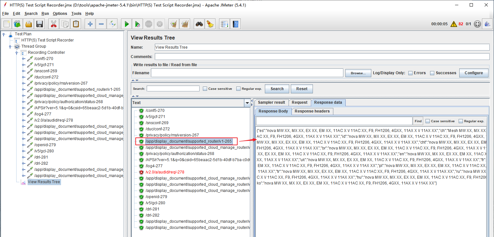

