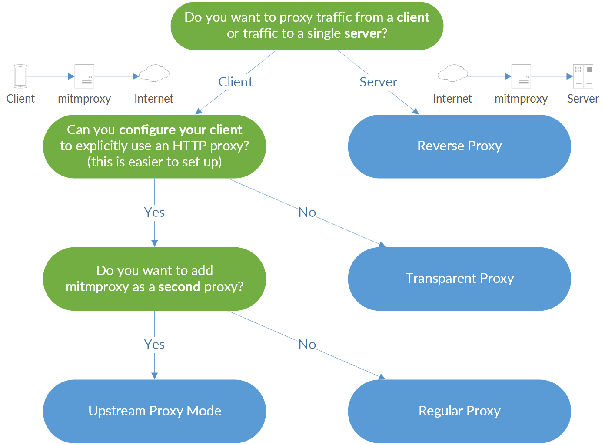

# mitmproxy 代理工具介绍：rewrite和map local实现
在接口测试中，会用到抓包工具或者代理工具，常用代理工具包括charles、 burpsuite、 fiddler、mitmproxy等，`ssh -D参数` 可实现socks5代理。网络嗅探工具可以使用tcpdump 和 wireshark。Charles工具可以实现mock测试（参考[接口测试代理工具charles mock测试](https://blog.csdn.net/u010698107/article/details/112728913)），如果要自动化实现这些功能，mitmproxy工具是个不错的选择，本文主要内容包括简要介绍mitmproxy代理工具、mitmproxy安装、SSL 证书安装以及实现和charles一样的功能：rewrite和map local。

<!--more-->


## mitmproxy简介
mitm(man-in-the-middle) 即中间人攻击，mitmproxy是主要基于Python平台开发的代理工具，功能强大，可满足高度定制化需求。它是一个用于跟踪流量的中间代理工具，具有截获、篡改、重放等功能。

插件是mitmproxy非常强大的一部分，提供了一系列API，mitmproxy扩展：[https://docs.mitmproxy.org/stable/addons-overview/](https://docs.mitmproxy.org/stable/addons-overview/)
插件例子：[https://docs.mitmproxy.org/stable/addons-examples/](https://docs.mitmproxy.org/stable/addons-examples/)


mitmproxy支持5种代理模式：
1. 正向代理（regular proxy）
2. 反向代理（reverse proxy）
3. 上行代理（upstream proxy）
4. 透明代理（transparent proxy）
5. socks5代理（socks Proxy）



本文主要介绍mitmproxy的正向代理使用过程
mitmproxy套装包括3个工具：

* mitmproxy：命令行交互工具
* mitmdump：命令行非交互工具，提供类似 tcpdump的功能
* mitmweb：基于Web的用户界面

mitmproxy的代理流程：

<center><font size="2">图片来源：https://docs.mitmproxy.org/stable/concepts-howmitmproxyworks/</font></center>

## mitmproxy安装

mitmproxy官网：[https://mitmproxy.org/](https://mitmproxy.org/)
mitmproxy安装方法参考：[https://docs.mitmproxy.org/stable/overview-installation/](https://docs.mitmproxy.org/stable/overview-installation/)

macOS：
```bash
brew install mitmproxy
```
Linux和Windows：在官网[mitmproxy.org](https://mitmproxy.org/)下载安装


检查是否安装成功
`mitmdump --version`
```bssh
C:\Users\10287>mitmdump --version
Mitmproxy: 5.1.1 binary
Python:    3.7.6
OpenSSL:   OpenSSL 1.1.1f  31 Mar 2020
Platform:  Windows-10-10.0.18362-SP0
C:\Users\10287>
```
python包安装：
注意python版本 >= 3.6
```bash
python3 -m pip install --user pipx
python3 -m pipx ensurepath
pipx install mitmproxy
```
docker 安装方法：
[https://hub.docker.com/r/mitmproxy/mitmproxy/](https://hub.docker.com/r/mitmproxy/mitmproxy/)
```bash
docker pull mitmproxy/mitmproxy
```


## SSL 证书安装
和charles代理工具一样，如果要抓取HTTPs报文，客户端（APP 或浏览器）需要安装SSL证书。
1. 启动服务
```bash
C:\Users\10287>mitmdump -p 8999
Proxy server listening at http://*:8999
```

2. 浏览器设置代理
使用SwitchyOmega插件添加mitmproxy代理，代理服务器地址设置为主机IP地址，代理端口8999
SwitchyOmega插件下载地址：[https://github.com/FelisCatus/SwitchyOmega/releases](https://github.com/FelisCatus/SwitchyOmega/releases)


3. 浏览器输入 mitm.it
选择对应系统的证书安装

4. 手机证书安装方法同charles（地址为mitm.it）
参考  [charles SSL证书安装](https://blog.csdn.net/u010698107/article/details/112728397)


手机浏览器访问百度，命令行窗口显示https报文解析成功


## mitmproxy录制回放
录制回放参考：[https://docs.mitmproxy.org/stable/tute-clientreplay/](https://docs.mitmproxy.org/stable/tute-clientreplay/)

1. 开始录制，保存到文件baidusearch中
```bash
D:\ProgramWorkspace\TestingDemo\test_mitmproxy>mitmdump -p 8999 -w baidusearch
```
2. 手机浏览baidu，进行百度搜索
3. 停止录制：`Ctrl+c` 停止
4. 回放
cmd命令行输入如下命令：
```bash
mitmweb -p 8999
```
打开生成的baidusearch文档，可以查看报文交互过程


## Rewrite
要求：和charles一样，修改招商银行名称及股票价格。见[接口测试代理工具charles mock测试](https://blog.csdn.net/u010698107/article/details/112728913)


1. 启动 mitmproxy 服务
```bash
C:\Users\10287>mitmdump -p 8999 
Proxy server listening at http://*:8999 
```

2. 手机（或者模拟器）安装ssl证书，设置代理
见 [charles SSL证书安装](https://blog.csdn.net/u010698107/article/details/112728397)

3. 抓取雪球APP行情页面数据包
```bash
C:\Users\10287>mitmweb -p 8999
Web server listening at http://127.0.0.1:8081/
Proxy server listening at http://*:8999
```
开启抓包后，刷新雪球APP行情页面，找到行情页面报文，查看URL特征，用于下一步写脚本来找到它。


4. 写一个脚本处理响应数据：


test_mitmproxy_response.py
```python
#!/usr/bin/python3
#-*-coding:utf-8-*-
import json

def response(flow):
	"""
	1. 找到行情页面相关URL
	2. 修改第一条记录（招商银行）的名称和股票价格
	3. 将数据写入响应数据中
	"""
    if "quote.json" in flow.request.pretty_url and "x=" in flow.request.pretty_url:
        data = json.loads(flow.response.content)
        data['data']['items'][0]['quote']['name'] = data['data']['items'][0]['quote']['name'] + "test"
        data['data']['items'][0]['quote']['current'] = '50'
        flow.response.text = json.dumps(data)
```
5. 运行脚本
```bash
D:\ProgramWorkspace\TestingDemo\test_mitmproxy>mitmdump -p 8999 -s test_mitmproxy_response.py
```


6. 刷新雪球APP行情页面

修改成功

## Map Local
要求和[接口测试代理工具charles mock测试](https://blog.csdn.net/u010698107/article/details/112728913)一样，我们直接使用数据倍增后的数据stock2.json，如果要实现自动化，可以使用python脚本对响应数据进行处理。

股票数据可以在上一节Rewrite 第3步中直接保存，或者通过charles获取数据。

参考官方文档提供的mitmproxy插件http-reply-from-proxy.py：[https://docs.mitmproxy.org/stable/addons-examples/#http-reply-from-proxy](https://docs.mitmproxy.org/stable/addons-examples/#http-reply-from-proxy) ，

1. 编写响应数据处理脚本test_request.py
```python
#!/usr/bin/python3
#-*-coding:utf-8-*-

"""Send a reply from the proxy without sending any data to the remote server."""
from mitmproxy import http


def request(flow: http.HTTPFlow) -> None: 
    if "quote.json" in flow.request.pretty_url and "x=" in flow.request.pretty_url:
        with open("D:/ProgramWorkspace/TestingDemo/test_mitmproxy/stock2.json",encoding="utf-8") as f:
            flow.response = http.HTTPResponse.make(
                200,  # (optional) status code
                f.read(),  # (optional) content
                {"Content-Type": "application/json"}  # (optional) headers
            )

```

2. 开启服务，运行脚本
```bash
D:\ProgramWorkspace\TestingDemo\test_mitmproxy>mitmdump -p 8999 -s test_request.py
Loading script test_request.py
Proxy server listening at http://*:8999
```
3. 刷新雪球APP行情页面


修改成功

开启服务后，可以直接修改stock2.json内容，不需要重新拉起


