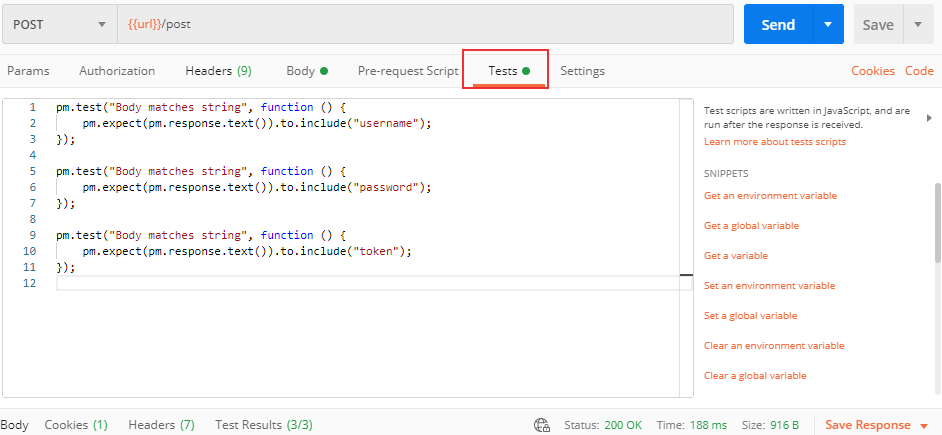

# Postman安装与使用
Postman是可以用于API调试的工具，支持各种请求类型： get、post、put、patch、delete 等，可以用来模拟HTTP请求，测试API接口功能。
<!--more-->

## 安装
官网地址：[https://www.postman.com/](https://www.postman.com/)

http请求响应测试接口：[https://httpbin.testing-studio.com/](https://httpbin.testing-studio.com/)
也可以自己本地搭建，GitHub地址：[https://github.com/postmanlabs/httpbin](https://github.com/postmanlabs/httpbin)

## 发送请求

### 发送Get请求
* 填写请求方式: Get
* 填写请求urL：https://httpbin.testing-studio.com/get
* 填写请求参数


### 发送Post请求
Post请求可以发送key -value-,json,file等格式的数据
案例:
* 请求 URL: https://httpbin.testing-studio.com/post
* 请求方式: Post


URL可以通过设置环境变量来调用：


## 断言
Tests主要用来做断言，可以测试返回结果是否含有某一字符串。
```json
pm.test("Status code is 200", function () {
    pm.response.to.have.status(200);
});

pm.test("Body matches string", function () {
    pm.expect(pm.response.text()).to.include("json");
});

pm.test("url success", function () {
    var jsonData = pm.response.json();
    pm.expect(jsonData.url).to.eql("http://httpbin.testing-studio.com/post");
});
```

测试结果：


## 变量
* 环境变量与全局变量
* 变量引用方法:{{variableName}}


### 添加 Cookie
* Cookie可以用来鉴权
* Postman可以自动保存 Cookie信息
URL：https://httpbin.testing-studio.com/cookies/set


### 参数传递
获取需要的值， 将获取到的值设置为环境变量，可以 在需要验证的接口中引用环境变量中保存的值


## 用例集
* 选择环境变量
* 选择执行次数
* 选择延迟时间
* 选择测试数据
* 点击Run按钮即可开始执行


## 代码导出
* 在接口页面点击code按钮进入code页面
* 选择需要导出的脚本


## 数据驱动
json和 CSV格式数据文件：
data.json
```json
[
    {
        "username":"test1",
        "password":"123",
        "token":"token1"
    },
    {
        "username":"test2",
        "password":"123",
        "token":"token2"
    },
    {
        "username":"test3",
        "password":"123",
        "token":"token3"
    }
]
```
data.csv
```csv
username,password,token
test1,123,token1
test2,123,token2
test3,123,token3
```
接口配置：



导入数据：


运行：


