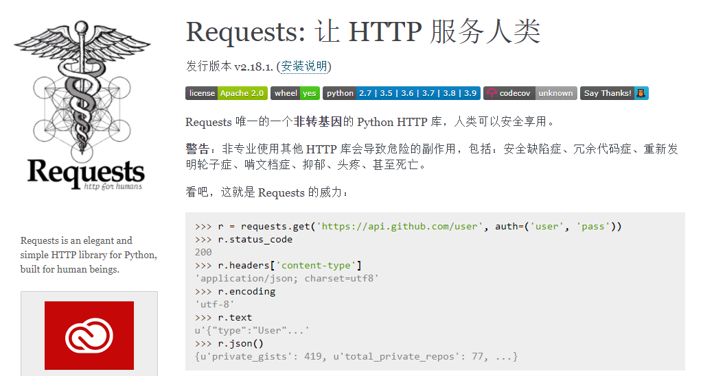

# 接口测试框架Requests
python内置了HTTP库 urllib，可以用于发送http请求。基于Python的第三方库Requests是对urllib的再次封装，相比urllib更加简洁易用。Requests库不仅用于接口测试，还用在Python爬虫、量化交易等。本文介绍Requests库的使用方法。
<!--more-->

## Requests
HTTP接口测试涉及到以下几个方面：
* 构造请求方法：get、post、put、 delete、head ......
* 构造请求体：form、json、xml、 binary
* 分析响应结果：status code、 response body、 json path、 xpath

下面介绍使用Requests怎么实现这些步骤。
### Requests安装
Github地址：[Python HTTP Requests for Humans](https://github.com/psf/requests)
requests官方文档: [https://requests.readthedocs.io/zh_CN/latest/index.html](https://requests.readthedocs.io/zh_CN/latest/index.html)


安装：
```bash
pip install requests
```

http请求响应测试接口：[https://httpbin.testing-studio.com/](https://httpbin.testing-studio.com/)
也可以自己本地搭建，GitHub地址：[https://github.com/postmanlabs/httpbin](https://github.com/postmanlabs/httpbin)

## Requests常见接口请求方法构造
常见接口请求方法：
```python
r = requests.get('https://api.github.com/events') #get请求
r = requests.post('http://httpbin.org/post', data = {'key':'value'}) #post请求
r = requests.put('http://httpbin.org/put', data = {'key':'value'})
r = requests.delete('http://httpbin.org/delete')
r = requests.head('http://httpbin.org/get')
r = requests.options('http://httpbin.org/get')
```

### 请求目标构造
请求URL
```python
import requests
r = requests.get('https://api.github.com/events') #get请求
print(r.status_code)
```
输出：
```sh
200
```
### header构造
普通的 header
```python
url = 'https://api.github.com/some/endpoint'
headers ={user-agent': 'my-app/0.0.1'}
r= requests.get(url, headers=headers)
```

### cookie
```python
url = 'http://httpbin.org/cookies'
cookies = dict(cookies_are='working')
r = requests.get(url, cookies=cookies)
```

## 构造请求体
请求体通过键值对的形式编码，有多种形式的请求体，比如query参数、form请求、binary请求（上传文件）以及结构化请求：json、xml、 json rpc等。

### Get Query请求
```python
payload= {'key':'valuel','key2':'value2'}
r = requests.get('https://httpbin.org/get', params=payload)
```
### Form请求参数
```python
payload = {'key':'valuel','key2':'value2'}
r = requests.post("https://httpbin.org/post", data=payload)
```

### JSON请求体构造
```python
url = 'https://api.github.com/some/endpoint'
payload = {'some': 'data'}
r = requests.post(url, json=payload)
```
### xml请求
```python
import requests 
xml ="""<?xml version='1.0' encoding='utf-8'?><a>6</a>""" 
headers={'Content-type':'application/xml'} 
r = requests.post('http://httpbin.org/post', data=xml, headers=headers).text
```

### binary请求
上传文件
```python
url = 'http://httpbin.org/post'
files = {'file': open('report.xls', 'rb')}
r = requests.post(url, files=files)
```

## 接口测试断言
接口测试中需要通过检查响应是否符合预期来测试接口有效性，也就是对接口响应进行断言。
### 响应
- r.url：
- r.status_code
- r.headers
- r.cookies
- r.encoding
- r.content
- r.text
- r.json()

```python
import requests

class TestRequest():
    def test_get(self):
        r = requests.get('https://api.github.com/events') #get请求
        assert r.status_code == 200        
```

### 结构化响应断言
下面是请求Github项目仓库API，GitHub API可参考：[https://docs.github.com/cn/rest/overview](https://docs.github.com/cn/rest/overview)。

```python
import requests
import json

r = requests.get('https://api.github.com/repos/hiyongz/DjangoDemo')
json_data = r.json()
print(json.dumps(json_data, indent=4))
```
响应的部分json数据如下：
```json
{
    "id": 272401302,
    "node_id": "MDEwOlJlcG9zaXRvcnkyNzI0MDEzMDI=",
    "name": "DjangoDemo",
    "full_name": "hiyongz/DjangoDemo",
    "private": false,
    "owner": {
        "login": "hiyongz",
        "id": 20513021,
        "node_id": "MDQ6VXNlcjIwNTEzMDIx",
        "avatar_url": "https://avatars0.githubusercontent.com/u/20513021?v=4",
        "gravatar_id": "",
        ...................
}
```
接下来介绍不同方法对这个json响应进行断言。

#### json断言
json断言
```python
import requests

def test_json(self):
    r = requests.get('https://api.github.com/repos/hiyongz/DjangoDemo')
    assert r.json()['owner']['login'] == "hiyongz"
```

#### JSONPath断言
JSONPath文档：[https://goessner.net/articles/JsonPath/](https://goessner.net/articles/JsonPath/)
JSONPath表达式与XPath类似，是XPath在json中的应用，全称XPath for JSON，用于从JSON文档中提取数据。

JSONPath表达式和XPath语法对比如下：

| **XPath** | **JSONPath**         | **Description** |
| --------- | -------------------- | --------------- |
| /         | $                    | 跟节点          |
| .         | @                    | 当前节点        |
| /         | . or []              | 儿子节点        |
| ..        | N/A                  | 父节点          |
| //        | ..                   | 子孙节点        |
| *         | *                    | 匹配所有节点    |
| @         | N/A                  | 属性            |
| []        | []                   | 下标操作符      |
| \|        | [,]                  | 多选            |
| N/A       | [start​ : end : ​step] | 切片            |
| []        | ?()                  | 过滤表达式      |
| N/A       | ()                   | script 表达式   |
| ()        | N/A                  | 分组            |

Python中有个jsonpath库可用于处理json数据：[https://pypi.org/project/jsonpath/](https://pypi.org/project/jsonpath/)
安装：
`pip install jsonpath`

和前面一样，断言登录名：
```python
import requests
from jsonpath import jsonpath

def test_json(self):
    r = requests.get('https://api.github.com/repos/hiyongz/DjangoDemo')
    assert jsonpath(r.json(), '$..login')[0] == "hiyongz"
```

### schema断言
JSON Schema可以用来注释和验证 JSON 文档，官网：[http://json-schema.org/](http://json-schema.org/)。

JSON Schema可用来添加自定义规则，可以自定义数据类型：
```json
schema = {
    "type" : "object",
    "properties" : {
        "price" : {"type" : "number"},
        "name" : {"type" : "string"},
    },
}
```
可以看到，除了字段值断言外，可以使用JSON Schema来断言接口返回值的类型。

把json格式转成schema，在线生成schema网址：[https://jsonschema.net/](https://jsonschema.net/)

jsonschema是使用JSON Schema的Python库，通过 `pip install jsonschema` 命令安装。
```python
import requests
from jsonschema import validate

def test_get_login_jsonschema(self):
    url = "https://api.github.com/repos/hiyongz/DjangoDemo"
    r = requests.get(url)
    data = r.json()
    schema = {
        "name" : "DjangoDemo",
        "owner" : {
        	"login" : "hiyongz",
        },
    }
    validate(data, schema=schema)
```

JSON Schema可以用来进行自动校验：在接口测试中，每次运行的时候自动保存当前的 schema，下次运行对比上次的 schema，如果发现变更就报错


### xml解析断言
xml文件解析可以使用requests_xml，参考：[https://github.com/erinxocon/requests-xml](https://github.com/erinxocon/requests-xml)

也可以使用Python xml.etree.ElementTree模块解析xml数据，可以使用Xpath定位，使用方法参考：[Web自动化测试：xpath & CSS Selector定位](https://blog.csdn.net/u010698107/article/details/111415888)

xml.etree.ElementTree模块xml解析举例：
```python
import xml.etree.ElementTree as ET
root = ET.fromstring(countrydata)
root.findall(".")
root.findall("./country/neighbor")
root.findall(".//year/..[@name='Singapore']")
root.findall(".//*[@name='Singapore']/year")
root.findall(".//neighbor[2]")
```

和JSON Schema一样，也有一个XML Schema，用于解析xml文档，文档参考：[https://www.w3.org/2001/XMLSchema](https://www.w3.org/2001/XMLSchema)

Python库安装： `pip install xmlschema`

### hamcrest断言
除了常用的Assert断言以外，有一个功能更加强大的断言方法叫Hamcrest 断言，具有丰富的断言匹配器，支持多种语言，官网地址：[http://hamcrest.org/](http://hamcrest.org/)

下面简单介绍一下Python中的hamcrest断言使用方法

PyHamcrest GitHub仓库地址：[https://github.com/hamcrest/PyHamcrest](https://github.com/hamcrest/PyHamcrest)
文档：[https://pyhamcrest.readthedocs.io/en/v2.0.2/tutorial/](https://pyhamcrest.readthedocs.io/en/v2.0.2/tutorial/)

安装PyHamcrest：
```python
pip install PyHamcrest
```
断言登录名：
```python
import requests
from hamcrest import *

def test_hamcrest(self):
    r = requests.get('https://api.github.com/repos/hiyongz/DjangoDemo')
    data = r.json()
    assert_that(data['owner']['login'], equal_to("hiyongz"))
```


