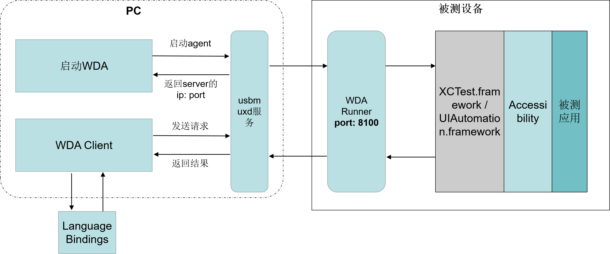
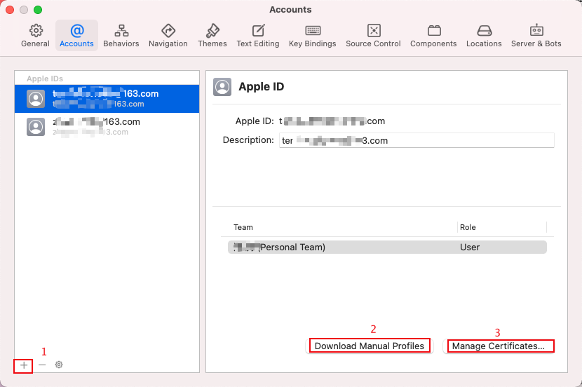
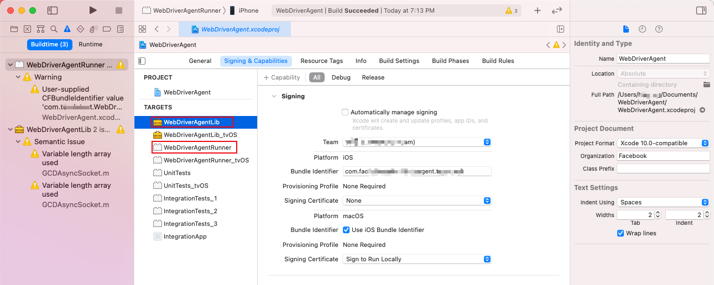
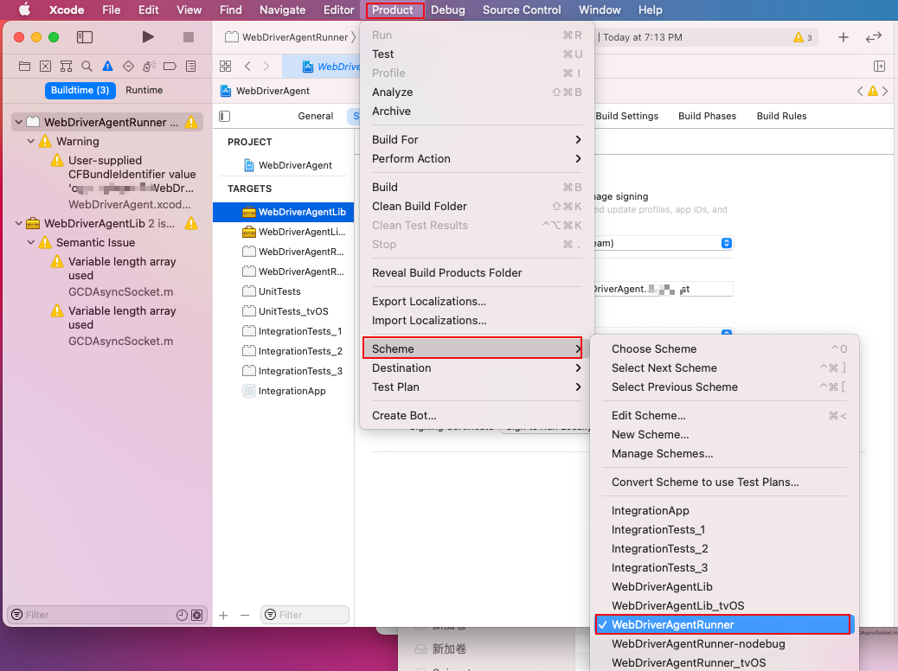
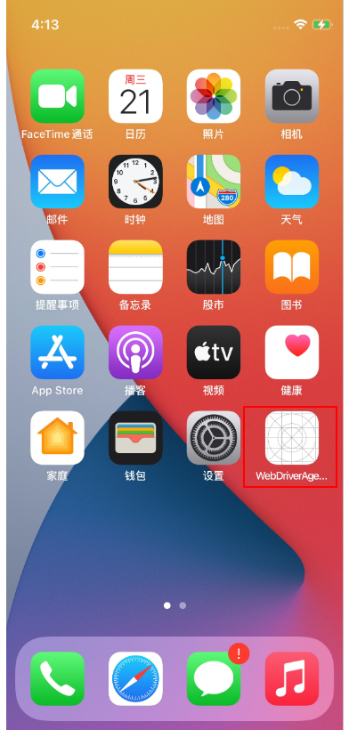
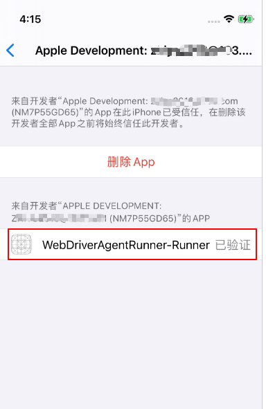
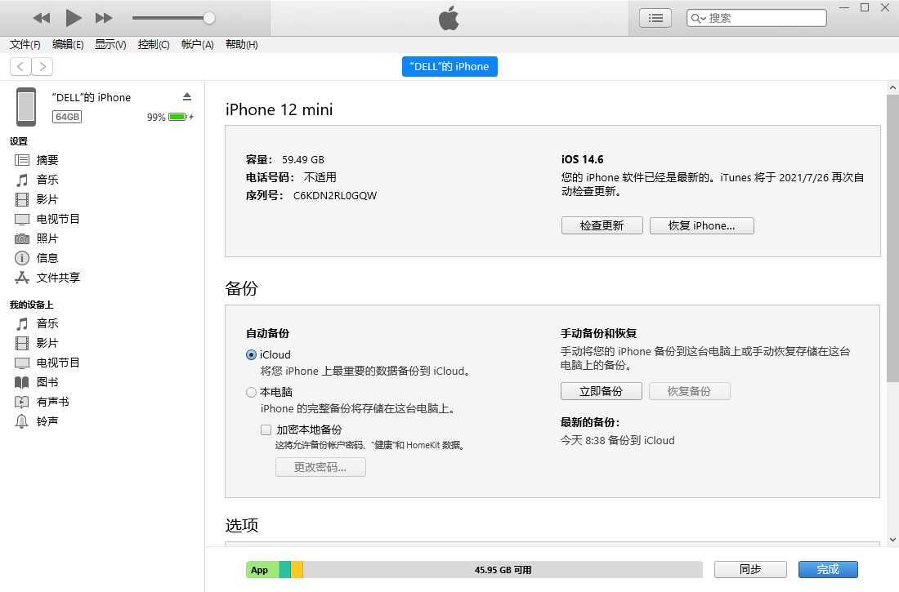
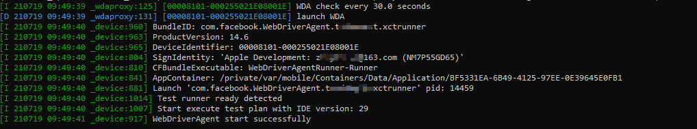
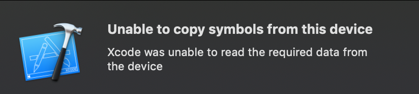

# Windows上实现iOS APP自动化测试：tidevice + WDA +  facebook-wda / appium
本文介绍如何在Windows下构建iOS APP自动化测试环境，采用的主要工具为tidevice，WebDriverAgent，facebook-wda或者appium。

<!--more-->

## 测试架构介绍

下面是本文搭建的iOS自动化测试架构原理图：


1. 手机端的WDA Runner（WebDriverAgent）类似于appium测试框架中的 UIAutomator Server，将从客户端接收到的控制命令转换为XCUITest 相关API操作，实现对应用界面的控制。WebDriverAgent应用需要通过xcode编译安装。
2. usbmuxd是苹果提供的一个服务，用于USB和TCP协议之间的转换，实现在没有网络的情况下也可以连接设备，iTunes和Xcode就使用到了这个服务，所以在环境安装中需要在windows上安装一个iTunes。
3. WDA的启动使用阿里开源的tidevice工具。
4. Language Bindings为不同语言的测试脚本，比如基于python语言的facebook-wda，基于go语言的gwda等。

### WebDriverAgent原理分析
WebDriverAgent是Facebook 在2015年的 SeleniumConf 大会上推出了一款iOS移动测试框架。它在 iOS 端实现了一个 WebDriver server ，通过这个 server 来实现远程控制 iOS 设备。它主要通过连接XCTest.framework来调用Apple的API实现对设备的操作。

WebDriverAgent采用C/S架构，集成appium使用的WebDriver协议规范，通信协议使用Mobile JSON Wire Protocol。

1. WDAClient：WDA的客户端，测试库facebook-wda 就是 WDA 的 Python 客户端库，通过HTTP协议（Mobile JSON Wire Protocol）与WebDriverAgent进行通信。
2. WebDriverAgentRunner：运行在手机上的WDA server，默认监听端口为8100，主要功能包括①接收WDAClient的请求并将操作命令发送给XCTest.framework。②将响应发送给WDA Client

### tidevice原理分析
前面介绍了iOS的自动化需要通过WebDriverAgent来实现，一种常见的解决方案是使用xcodebuild来启动WebDriverAgent，而xcode需要Mac系统，也就是必须在MAC上进行iOS自动化测试。

tidevice 是阿里开源的一个基于Python的iOS自动化工具，通过逆向iOS通信协议，模拟xcodebuild与手机进行通信，向手机发送特定的指令，来启动WDA，从而可以脱离Mac电脑，能够在Linux、Windows上运行iOS自动化。tidevice基于python实现了libimobiledevice中的功能。

tidevice通过usbmuxd与手机通信来启动WDA，通过建立一个TCP连接到usbmuxd的/var/run/usbmuxd TCP端口，然后usbmuxd将请求发送到USB连接的iPhone上。上面提到的libimobiledevice就是一个跨平台的用于与iOS设备进行通信的库。


## iOS 设备安装 wda

本文所用的环境：

- macOS版本：macOS Big Sur 11.4

- Xcode版本：Version 12.5.1 (12E507)

- iOS 设备： iPhone12 mini（14.6）

- Windows系统版本：Windows 10 家庭中文版


### 1、安装Xcode

app store 下载安装iOS开发环境Xcode。

### 2、下载WebDriverAgent

使用appium维护的WebDriverAgent，项目地址：https://github.com/appium/WebDriverAgent。
```sh
$ git clone https://github.com/appium/WebDriverAgent.git
```
现在不需要执行下面的脚本了，作者已经删除：
```sh
$ ./Scripts/bootstrap.sh
```

### 3、Xcode打开WebDriverAgent

双击WebDriverAgent中的WebDriverAgent.xcodeproj文件，这是一个xcode项目文件。

### 4、Xcode添加开发者帐户
Xcode -> Preference




### 5、项目配置

设置Team为你添加的帐户，修改Bundle Identifier为唯一名称


设置完成后，选择Scheme为WebDriverAgentRunner



选择Destination为你连接的iPhone。

### 6、项目构建及测试

然后点击左上角的三角符号进行build，或者点击Product -> Build；

Build成功之后，点击Product -> Test；

可以看到WebDriverAgent安装到了你的iPhone上


点击iPhone上的设置-> 通用 -> 设备管理 信任开发者APP



以上是我的WDA安装配置过程，如果有问题可以参考文档：[https://github.com/appium/appium-xcuitest-driver/blob/master/docs/real-device-config.md](https://github.com/appium/appium-xcuitest-driver/blob/master/docs/real-device-config.md)

## 安装iTunes

因为iTunes里面有usbmux驱动，需要安装一下它。

下载安装Windows 版 iTunes方法：[https://support.apple.com/zh-cn/HT210384](https://support.apple.com/zh-cn/HT210384)

iTunes安装成功后，连接上你的iPhone：


## 安装tidevice
tidevice用于启动WDA，它可以运行在Windows上，也支持Mac和Linux。项目地址：[https://github.com/alibaba/taobao-iphone-device](https://github.com/alibaba/taobao-iphone-device)。 要求Python版本3.6+。

pip安装tidevice：

```sh
$ pip3 install -U "tidevice[openssl]"
```

查看是否安装成功：

```sh
$ tidevice version
tidevice version 0.4.14
```


列出连接设备
```sh
$ tidevice list
List of apple devices attached
00008101-000255021E08001E iPhone11
$ tidevice list --json
[
    {
        "udid": "00008101-000255021E08001E",
        "name": "iPhone11"
    }
]
```

查看设备信息

```sh
$ tidevice info
```

tidevice的更多使用方法可参考[https://github.com/alibaba/taobao-iphone-device#readme](https://github.com/alibaba/taobao-iphone-device#readme) 。


## 启动WDA

查看安装的WDA应用：

```sh
$ tidevice applist
com.apple.store.Jolly Apple Store 509000
com.apple.Keynote Keynote 讲演 10.1
com.facebook.WebDriverAgent.XXXXXtest.xctrunner WebDriverAgentRunner-Runner 1.0
com.apple.Numbers Numbers 表格 10.1
com.apple.iMovie iMovie 剪辑 229
com.apple.mobilegarageband 库乐队 2.3.8
com.apple.clips 可立拍 2.1.1
com.apple.Pages Pages 文稿 10.1
```

使用tidevice启动WDA

```sh
$ tidevice -u [设备 udid] wdaproxy -B [wda 的 bundle Id] --port 8100 # 运行 XCTest 并在PC上监听8100端口
```
- UDID（ Unique Device Identifier）是iOS设备的唯一识别码，可以通过xcode中查看，也可以使用上面介绍的`tidevice list`命令。
- Bundle ID（Bundle identifier）为应用 ID，是iOS应用的唯一标识。是你编译WDA应用设置的名称，可通过`tidevice applist`命令查看。
- 手机设备中 wda 的默认监听端口为8100，此命令将手机的8100端口映射到了PC上的8100端口。
- `tidevice xctest --debug`：可用于查看详细日志


浏览器访问[http://127.0.0.1:8100/status](http://127.0.0.1:8100/status) 可以看到手机的状态信息。

```json
{
  "value" : {
    "message" : "WebDriverAgent is ready to accept commands",
    "state" : "success",
    "os" : {
      "testmanagerdVersion" : 28,
      "name" : "iOS",
      "sdkVersion" : "14.5",
      "version" : "14.6"
    },
    "ios" : {
      "ip" : "192.168.102.47"
    },
    "ready" : true,
    "build" : {
      "time" : "Jul 17 2021 18:57:32",
      "productBundleIdentifier" : "com.facebook.WebDriverAgentRunner"
    }
  },
  "sessionId" : "EAB73269-5D5B-45EB-913B-2BAA21FE2830"
}
```

测试一下用tidevice打开iPhone的【设置】：
```sh
$ tidevice launch com.apple.Preferences
```
其中【设置】的Bundle ID可通过如下命令查看：
```sh
$ tidevice ps
$ tidevice ps --json
```

## appium自动化（未成功）
参考：[https://testerhome.com/topics/29230](https://testerhome.com/topics/29230)

安装appium：[https://github.com/appium/appium-desktop/releases](https://github.com/appium/appium-desktop/releases)。 我安装的版本是1.21.0

安装完成后启动Appium

配置信息：
```sh
{
  "platformName": "ios",
  "platformVersion": "14.6",
  "deviceName": "iPhone11",
  "udid": "00008101-000255021E08001E",
  "bundleId": "com.facebook.WebDriverAgent.XXXXXtest.xctrunner",
  "webDriverAgentUrl": "http://127.0.0.1:8100",
  "noReset": true,
  "usePrebuiltWDA": false,
  "useXctestrunFile": false,
  "skipLogCapture": true,
  "automationName": "XCUITest"
}
```

配置完成后点击【Start Session】，发现连不上，查看日志报如下错误信息：
```sh
WDA is not response in 30 second, check again after 1s
```
在issue里面也有人遇到这个报错，他们是概率性的，我失败的概率是100%，完全连不上，折腾一会，还是没解决，果断放弃（后面解决了再更新上来），怀疑是我的WDA安装有问题，但尝试使用[facebook-wda](https://github.com/openatx/facebook-wda)进行自动化测试，发现是OK的，遂再次放弃appium。

## facebook-wda自动化

facebook-wda基于python语言，没有像appium那样启动一个中间服务appium server，这也是appium支持多语言的原因。facebook-wda相比appium更加简洁，功能也比较多，appium有的功能基本都提供了。

facebook-wda项目地址：[https://github.com/openatx/facebook-wda](https://github.com/openatx/facebook-wda)

安装：
```sh
pip3 install -U facebook-wda
```

测试：
```python
import wda

c = wda.Client('http://localhost:8100') # 8100为启动WDA设置的端口号
# c.app_current() # 显示当前应用信息，主要用于获取bundleId，也可以使用tidevice ps 命令
c.session().app_activate("com.apple.Preferences")  # 打开设置
# c.session().app_terminate("com.apple.Preferences") # 退出设置
c(name="搜索").set_text("NFC")  # 搜索 NFC
c(name="NFC").click() # 点击NFC
c(xpath='//Switch').exists # 判断NFC开关是否存在
c(xpath='//Switch').get().value # 获取NFC开关状态
```


## 常见问题

1、解决iPhone连上MAC之后会不断重连的问题：
杀掉usbd：

```sh
$ sudo killall -STOP -c usbd
```

2、xcode编译WDA时可能遇到没有指定iOS版本文件，可以尝试下载对应版本的支持文件。（我使用的Xcode 12.5.1 有iOS 14.6）

相应iOS版本支持文件项目地址：[https://github.com/iGhibli/iOS-DeviceSupport/tree/master/DeviceSupport](https://github.com/iGhibli/iOS-DeviceSupport/tree/master/DeviceSupport)

将下载的文件放到下面的目录中：Applications/Xcode.app/Contents/Developer/Platforms/iPhoneOS.platform/DeviceSupport

3、wda Build成功，出现Unable to copy symbols from this device错误


大概率是xcode版本低了，需要升级一下code。


