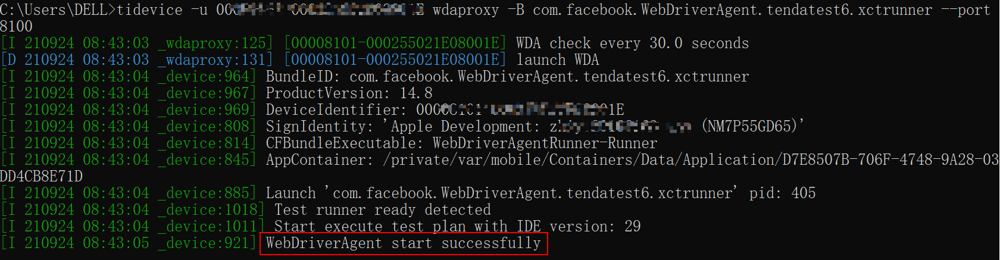
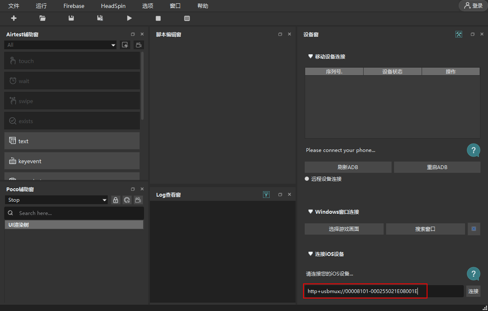
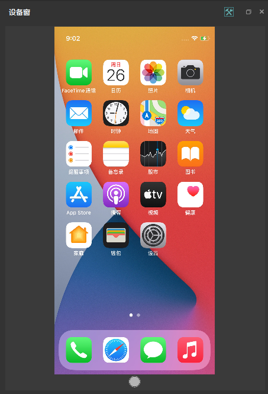
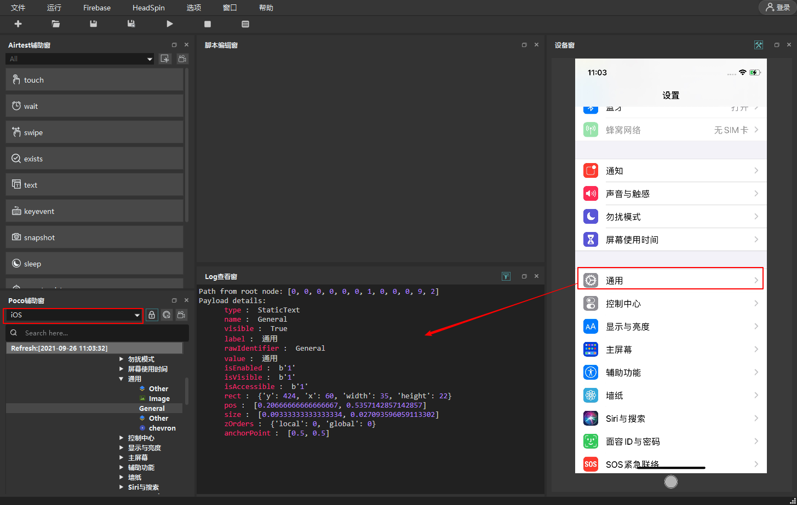
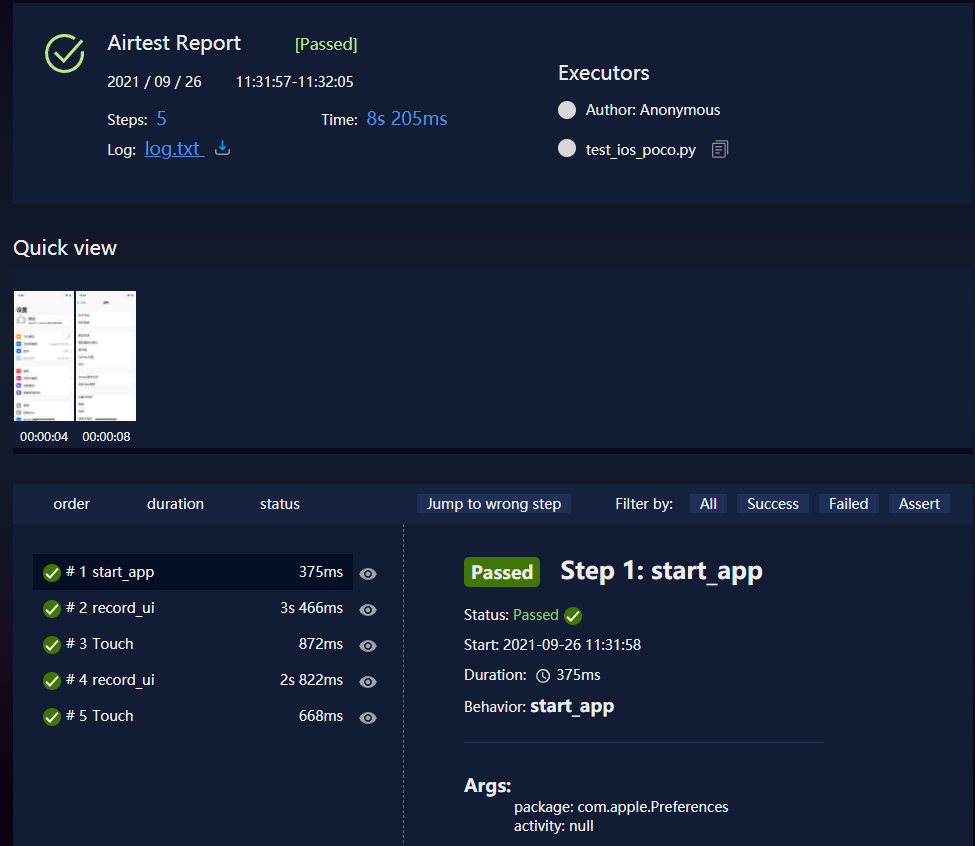

# Windows上实现iOS APP自动化测试：tidevice + WDA +  airtest

在[Windows上实现iOS APP自动化测试：tidevice + WDA + facebook-wda / appium](https://blog.csdn.net/u010698107/article/details/119492403)中介绍了使用阿里开源的tidevice 和 facebook-wda实现在Windows上进行iOS APP自动化测试。本文介绍如何使用tidevice + WDA +  airtest进行iOS APP自动化测试。


## 环境准备
本文使用的环境如下：
1. Python 3.7.6，Python版本需要3.6+
2. tidevice==0.4.14
3. WebDriverAgent，下载最新版本进行编译安装：[https://github.com/appium/WebDriverAgent](https://github.com/appium/WebDriverAgent)
4. airtest==1.2.2
5. iOS 设备： iPhone12 mini（14.6）
6. Windows系统版本：Windows 10 家庭中文版

tidevice和WebDriverAgent介绍及安装可参考[Windows上实现iOS APP自动化测试：tidevice + WDA + facebook-wda / appium](https://blog.csdn.net/u010698107/article/details/119492403)。

使用USB连接设备，检测tidevice是否安装成功：
```bash
$ tidevice list
```

airtest安装可参考：[App自动化测试工具Airtest](https://blog.csdn.net/u010698107/article/details/118468631)


## airtest iOS 自动化

### 1. 启动WDA
获取设备的udid：
```bash
$ tidevice list
```

查看wda的bundle id：
```bash
$ tidevice applist
```

使用tidevice启动iOS设备上的WDA应用
```sh
$ tidevice -u [设备 udid] wdaproxy -B [wda 的 bundle Id] --port 8100
```



如果你觉得每次进行自动化测试之前都要手动启动WDA比较麻烦，可以考虑使用vbs+bat的方式后台启动WDA。


### 2. airtest 连接设备
如果要使用airtest IDE来编写自动化测试脚本，先连接 iOS 设备。

打开Airtest IDE，在右下角【连接iOS设备】中输入地址：

```bash
http+usbmux://00008101-000255021E08001E
# 或者
http://localhost:8100/
```

`00008101-000255021E08001E` 是手机的udid，8100是使用tidevice启动WDA时设置的端口号。






可以使用init_device()或者connect_device()方法连接iOS设备：

```python
# 方法1
init_device(platform="IOS",uuid="http://localhost:8100/")
# 方法2
connect_device("ios:///http://127.0.0.1:8100")
# 方法3
init_device(platform="IOS",uuid="http+usbmux://00008101-000255021E08001E")
```

### 3. airtest 自动化

连接上iOS设备后就可以编写测试用例了， airtest使用的是图像识别的方法进行元素操作，元素操作方法可参考文章 [App自动化测试工具Airtest](https://blog.csdn.net/u010698107/article/details/118468631) 。

下面是一个示例脚本：打开【设置】

```python
#!/usr/bin/python3
# @Time:    2021/9/26 13:55
# @File:    test_ios_airtest.py

from airtest.core.api import *
from airtest.report.report import simple_report

# auto_setup(__file__, logdir=True, devices=["ios:///http://127.0.0.1:8100",])
auto_setup(__file__, logdir=True)
init_device(platform="IOS",uuid="http://localhost:8100/")

start_app("com.apple.Preferences") # 打开【设置】
touch(Template(r"tpl1632398524727.png", record_pos=(-0.34, 0.236), resolution=(1125, 2436))) # 点击

# generate html report
simple_report(__file__)

```

## poco iOS自动化

也可以使用poco进行UI元素操作，WDA启动和连接设备和前面介绍的【airtest iOS 自动化】一样。连接设备使用airtest提供的方法。

UI 元素可通过在AirtestIDE的Poco 辅助窗查看，注意要选择iOS。



poco元素操作方法可参考文章 [App自动化测试工具Airtest](https://blog.csdn.net/u010698107/article/details/118468631) 。

使用AirtestProject进行APP自动化测试时，通常将airtest和poco结合起来使用，下面是一个示例脚本：打开【设置】，检查软件版本为14.8

```python
#!/usr/bin/python3
# @Time:    2021/9/26 13:56
# @File:    test_ios_poco.py

from airtest.core.api import *
from airtest.report.report import simple_report
from poco.drivers.ios import iosPoco

# 连接设备、初始化日志路径
auto_setup(__file__, logdir=True)
init_device(platform="IOS",uuid="http://localhost:8100/")

# 打开【设置】
start_app("com.apple.Preferences")

# 初始化ios poco
poco = iosPoco()

# 点击
poco("通用").click()
poco("关于本机").click()
# 断言
assert poco('软件版本').attr('value') == "14.8"

# generate html report
simple_report(__file__)
```

查看生成的报告：



另外说明一下，facebook-wda、airtest和poco这3个测试库可以混合使用。


