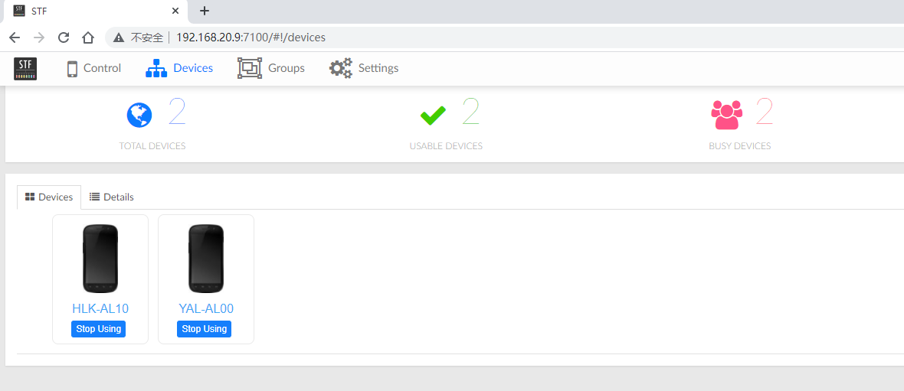
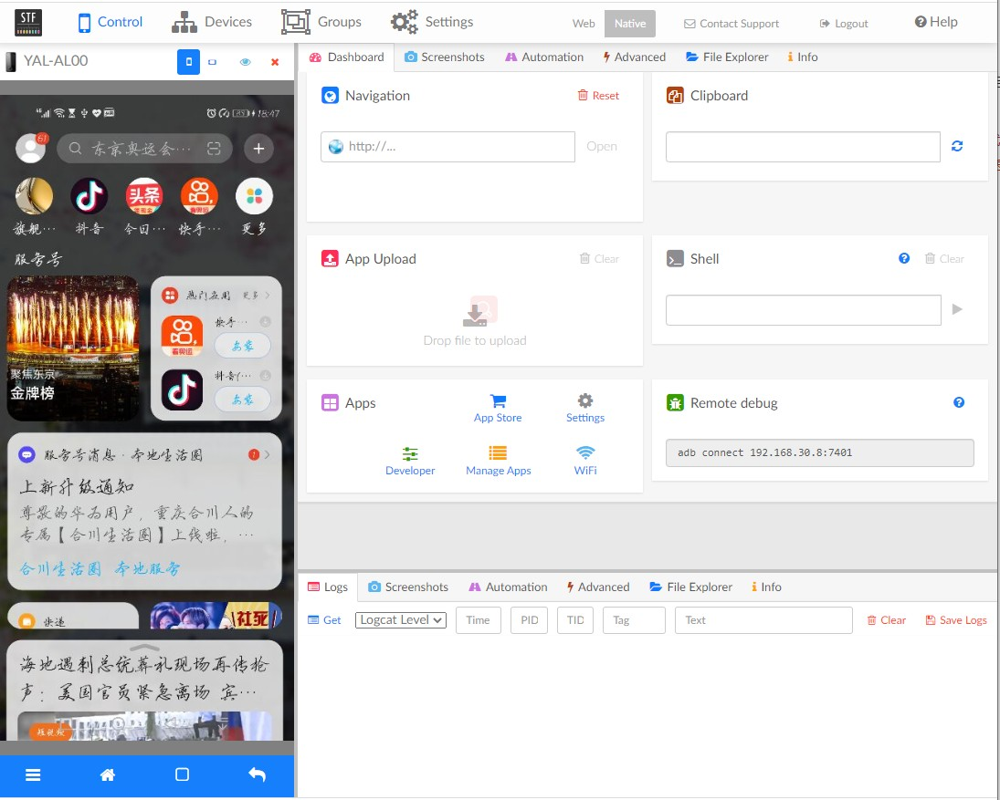
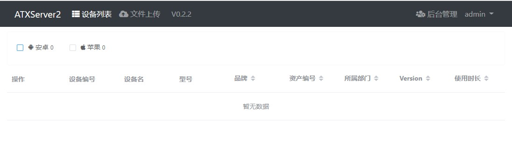
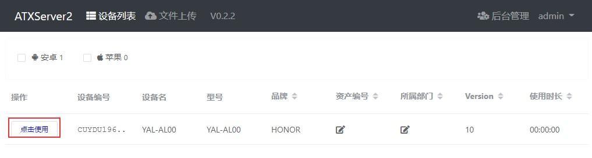
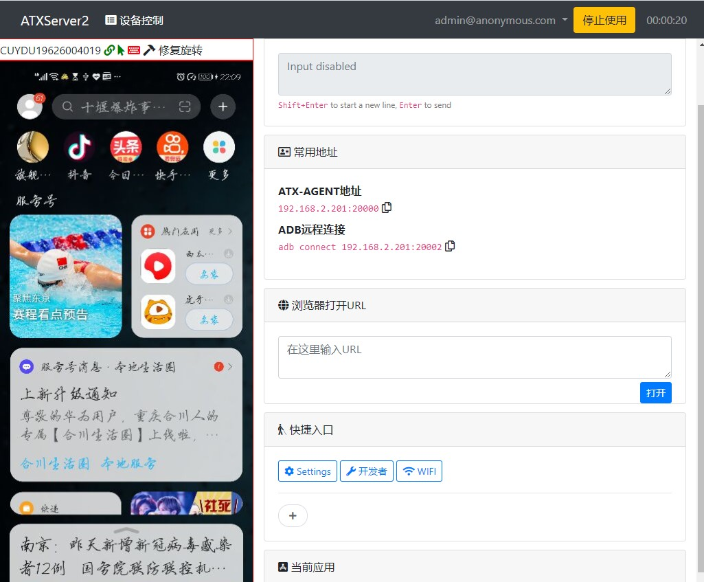

# Android手机管理平台搭建：STF和atxserver2
STF（Smartphone Test Farm）是一个Android手机设备管理平台，通过在浏览器上远程调试智能手机、手表和其它设备，一般用于远程管理、调试、监控多个设备。atxserver2移动设备管理平台支持支持Android和iOS，它也使用到了STF。本文介绍如何使用两个工具来搭建Android手机管理平台。

<!--more-->

很多APP测试项目的实时屏幕投屏都使用到了stf项目，比如[airtest](https://github.com/AirtestProject/Airtest)，[uiautomator2](https://github.com/openatx/uiautomator2)等。STF使用[openstf/minicap](https://github.com/openstf/minicap)来捕获屏幕实现实时投屏，至于对设备的各种操作使用[openstf/minitouch](https://github.com/openstf/minitouch)来实现。

## STF安装配置流程

STF官网地址：[https://openstf.io/](https://openstf.io/)

STF github项目地址：[https://github.com/openstf/stf](https://github.com/openstf/stf)

下面介绍使用docker搭建STF手机管理平台方法。

本文搭建环境：

1、Win10+虚拟机Centos7.8

- windows环境安装Android sdk
- 虚拟机IP地址：192.168.30.8；windows IP：192.168.30.100
- Centos关闭防火墙，命令：`systemctl stop firewalld`
- 虚拟机安装docker
- 虚拟机和物理机可以相互ping通

2、手机设备：真机（Android 10）2台


### 1. 拉取镜像
如果没有安装docker，CentOS下的docker安装方法可参考：[容器技术介绍：Docker简介及安装](https://blog.csdn.net/u010698107/article/details/113820115)。

docker安装完成后，拉取stf相关docker镜像：
```dockerfile
docker pull openstf/stf:latest
docker pull sorccu/adb:latest
docker pull rethinkdb:latest
docker pull openstf/ambassador:latest
docker pull nginx:latest
```
查看镜像：
```sh
[root@server ~]# docker images | grep -E "stf|adb|rethinkdb"
rethinkdb            latest    3f37e5daf5bd   2 months ago    131MB
openstf/ambassador   latest    938a816f078a   11 months ago   8.63MB
openstf/stf          latest    91d0ab894aff   11 months ago   958MB
sorccu/adb           latest    7123ee61b746   3 years ago     30.5MB
```

### 2. 连接设备
PC使用USB方式连接真机：
```sh
$ adb devices
List of devices attached
CUYDU19626004019        device
SNHVB20C18002195        device
```
开启adb远程端口：
```sh
$ adb nodaemon server -a -P 5037
```


### 3. 启动stf相关容器服务
启动rethinkdb数据库，主要用于存储连接设备信息
```sh
$ docker run --restart=always -d --name rethinkdb --net host -v /srv/rethinkdb:/data rethinkdb rethinkdb --bind all --cache-size 8192 --http-port 8090
```
- `--net`：网络模式选择主机模式
- `-v`：把容器中的目录挂载到宿主机的目录上

启动adb service
```sh
$ docker run --restart=always -d --name=adbd --privileged --net=host -v /dev/bus/usb:/dev/bus/usb sorccu/adb:latest
```
- `--privileged`：使容器获取宿主机的root权限

启动stf 
```sh
docker run --privileged -d --name=stf --net=host openstf/stf:latest stf local --public-ip 192.168.30.8 --adb-host 192.168.30.100 --adb-port 5037 --allow-remote
```

- `--allow-remote`：允许远程调试
- `--public-ip`：搭建STF服务的主机IP，用于远程访问，如果是本地访问可以不加。
- `--adb-host`：windows的IP地址
- `--adb-port`：adb暴露的端口号

查看三个镜像启动情况：

```sh
[root@server ~]# docker ps
CONTAINER ID   IMAGE                COMMAND                  CREATED         STATUS         PORTS      NAMES
96cece4b9772   openstf/stf:latest   "stf local --public-…"   6 minutes ago   Up 6 minutes              stf
b8121a631095   sorccu/adb:latest    "/sbin/tini -- adb -…"   7 hours ago     Up 7 hours                adbd
48f6b9d15282   rethinkdb            "rethinkdb --bind al…"   7 hours ago     Up 7 hours                rethinkdb
```

### 4. STF手机管理

浏览器访问：[http://192.168.20.9:7100/auth/mock/](http://192.168.190.128:7100/auth/mock/)

填写账号和邮箱，可以填写任意用户名和邮箱，登录后就可以看到设备了，可以对设备进行各种操作。



## 其它说明

本文的搭建环境为物理机+虚拟机，STF一般用于管理多台设备，这种情况下需要使用master+slave模式，将多个slave的设备连接到master上，只需要在master安装STF环境，slave连接手机就可以了。

## STF常见问题

### 1. 连接网易mumu模拟器

网易mumu模拟器可能连接不成功，安装一下STFService.apk，然后开启模拟器STFService的activity，并启动服务。

STF连接时会在android设备上自动安装STFService.apk，如果没有，可以手动安装。STFService.apk项目地址：[https://github.com/openstf/STFService.apk](https://github.com/openstf/STFService.apk)

apk下载：[https://github.com/openstf/STFService.apk/releases/tag/v2.4.3](https://github.com/openstf/STFService.apk/releases/tag/v2.4.3)

```sh
adb -s 127.0.0.1:7555 uninstall jp.co.cyberagent.stf 
adb -s 127.0.0.1:7555 install STFService.apk
adb -s 127.0.0.1:7555 shell am start -n jp.co.cyberagent.stf/.IdentityActivity
adb -s 127.0.0.1:7555 shell am startservice -n jp.co.cyberagent.stf/.Service
```


### 2. 开启adb远程端口失败

开启adb远程端口时出现如下报错：


```sh
$ adb nodaemon server -a -P 5037
error: could not install *smartsocket* listener: cannot bind to 0.0.0.0:5037: 通常每个套接字地址(协议/网络地址/端口)只允许使用一次。 (10048)
```
解决方法：杀掉占用端口的进程后重新开启

一般是adb进程占用，可先把adb杀掉，开启adb远程端口后重新开启adb。

查询5037端口占用：

```sh
$ netstat -ano | findstr 5037 
TCP    0.0.0.0:5037           0.0.0.0:0              LISTENING       34212
```
找到对应进程（也可以在任务管理器中查看）：
```sh
$ tasklist | findstr 34212
adb.exe                      34212 Console                    1     10,692 K
```
通过PID或者进程名杀死进程：
```sh
$ taskkill -pid 34212 -f -t # taskkill /pid 34212 /f /t
$ taskkill -f -im adb.exe # taskkill /f /im adb.exe
```

## atxserver2配置

atxserver2移动设备管理平台支持Android和iOS

- 项目地址：[https://github.com/openatx/atxserver2](https://github.com/openatx/atxserver2)

下面介绍Android设备上线方法。

### 1. docker部署

Clone代码到本地（虚拟机上）：

```sh
$ git clone https://github.com/openatx/atxserver2.git
```

docker-compose部署：
```sh
$ cd atxserver2
$ docker-compose up
```
如果报如下错误：
```sh
[root@server atxserver2]# docker-compose up
Creating network "atxserver2_default" with the default driver
ERROR: Failed to Setup IP tables: Unable to enable SKIP DNAT rule:  (iptables failed: iptables --wait -t nat -I DOCKER -i br-9e93ad4ad714 -j RETURN: iptables: No chain/target/match by that name.
 (exit status 1))
```
跟关闭防火墙有关，重启docker即可：
```sh
$ service docker restart
```

执行`docker-compose up`命令后会下载需要的镜像并启动服务
```sh
Creating atxserver2_rethinkdb_1 ... done
Creating atxserver2_web_1       ... done
Attaching to atxserver2_rethinkdb_1, atxserver2_web_1
rethinkdb_1  | Recursively removing directory /data/rethinkdb_data/tmp
rethinkdb_1  | Initializing directory /data/rethinkdb_data
rethinkdb_1  | Running rethinkdb 2.3.6~0jessie (GCC 4.9.2)...
rethinkdb_1  | Running on Linux 3.10.0-1062.el7.x86_64 x86_64
rethinkdb_1  | Loading data from directory /data/rethinkdb_data
rethinkdb_1  | warn: Cache size does not leave much memory for server and query overhead (available memory: 846 MB).
rethinkdb_1  | warn: Cache size is very low and may impact performance.
rethinkdb_1  | Listening for intracluster connections on port 29015
rethinkdb_1  | Listening for client driver connections on port 28015
rethinkdb_1  | Listening for administrative HTTP connections on port 8080
rethinkdb_1  | Listening on cluster addresses: 127.0.0.1, 172.20.0.2
rethinkdb_1  | Listening on driver addresses: 127.0.0.1, 172.20.0.2
rethinkdb_1  | Listening on http addresses: 127.0.0.1, 172.20.0.2
rethinkdb_1  | Server ready, "8969b4cc0c37_cpy" 2994c73a-01ff-41fb-bba2-6211e3915c04
web_1        | RethinkDB is running
rethinkdb_1  | A newer version of the RethinkDB server is available: 2.4.0. You can read the changelog at <https://github.com/rethinkdb/rethinkdb/releases>.
web_1        | Namespace(auth='simple', auth_conf_file=None, debug=False, no_xheaders=False, port=4000)
web_1        | [I 210724 11:45:58 main:70] listen on port http://172.20.0.3:4000
```

也可以后台启动atxserver2：
```sh
docker-compose up -d
```

浏览器访问：[http://192.168.30.8:4000/](http://192.168.30.8:4000/) , 随便输入一个用户名，点击【Sign in】




### 2. 安装atxserver2-android-provider

需要使用到项目 [atxserver2-android-provider](https://github.com/openatx/atxserver2-android-provider)

在windows上安装：

安装NodeJS 8，Python3.6+

将代码clone到本地：

```sh
$ git clone https://github.com/openatx/atxserver2-android-provider
```

安装依赖：

```sh
$ cd atxserver2-android-provider
$ npm install
```
创建一个Python虚拟环境
```
$ python3 -m venv venv
$ cd ./venv/Scripts/
$ activate
```
回到atxserver2-android-provider目录下，安装相关Python库：
```sh
$ pip install -r requirements.txt
```

### 3. 启动atxserver2-android-provider
指定atxserver2的地址为 http://192.168.30.8:4000
```sh
$ python3 main.py --server http://192.168.30.8:4000 --allow-remote
[I 210724 21:52:18 main:299] Owner: None
[I 210724 21:52:18 main:315] ProviderURL: http://192.168.30.100:3500
>>> app-uiautomator.apk verison: 2.3.3
>>> app-uiautomator-test.apk verison: 2.3.3
[D 210724 21:52:20 fetching:121] download from mirror error, use origin source
Downloading stf-binaries-0.3.0.zip 5070820 / -1 [Done]
[I 210724 21:52:27 heartbeat:139] WS receive: {"success": true, "id": "6194480c-ec86-11eb-ba84-0242ac140003"}
[I 210724 21:52:29 asyncadb:121] adb connection is down, retry after 1.0s
* daemon not running; starting now at tcp:5037
* daemon started successfully
[I 210724 21:52:35 asyncadb:125] adb-server started, version: 40
[D 210724 21:52:35 main:234] DeviceEvent(present=True, serial='CUYDU19626004019', status='device')
[I 210724 21:52:35 device:57] Init device: CUYDU19626004019
[D 210724 21:52:35 device:85] [CUYDU19626004019] sdk: 29, abi: arm64-v8a, abis: ['arm64-v8a', 'armeabi-v7a', 'armeabi']
[D 210724 21:52:35 device:132] [CUYDU19626004019] already pushed stf-binaries-0.3.0/node_modules/@devicefarmer/minicap-prebuilt/prebuilt/arm64-v8a/lib/android-29/minicap.so
[D 210724 21:52:35 device:132] [CUYDU19626004019] already pushed stf-binaries-0.3.0/node_modules/@devicefarmer/minicap-prebuilt/prebuilt/arm64-v8a/bin/minicap
[D 210724 21:52:35 device:113] [CUYDU19626004019] use atx-agent: atx-agent-armv7
[D 210724 21:52:35 device:132] [CUYDU19626004019] already pushed atx-agent-armv7
None : 4 1.0
[D 210724 21:52:35 device:154] [CUYDU19626004019] install vendor/WhatsInput-1.0.apk
```

启动时会自动给手机安装`minicap`, `minitouch`, `atx-agent`, `app-uiautomator-test.apk`, `whatsinput-apk`





