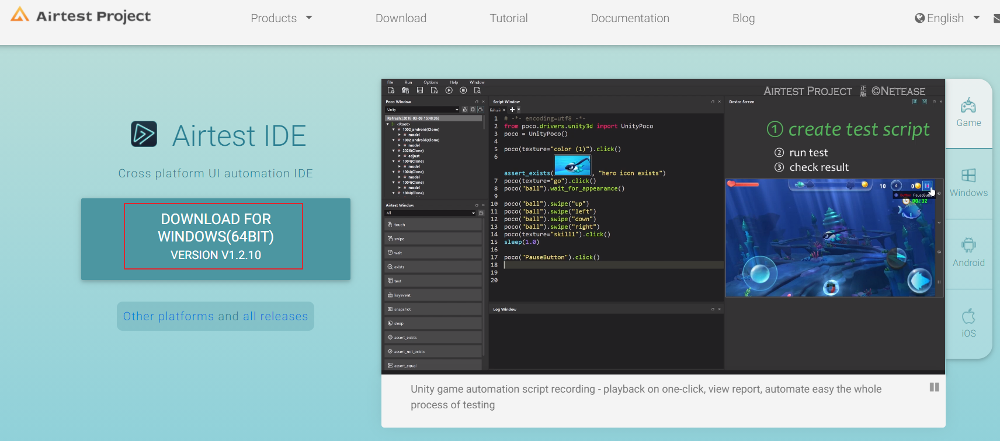
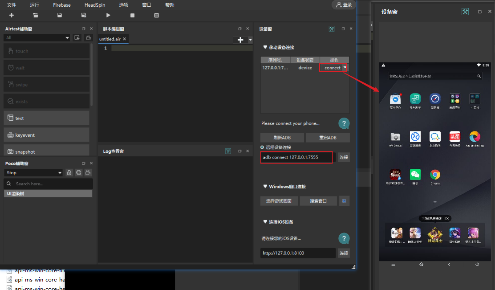
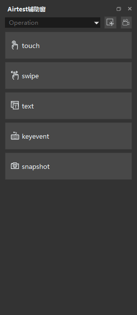
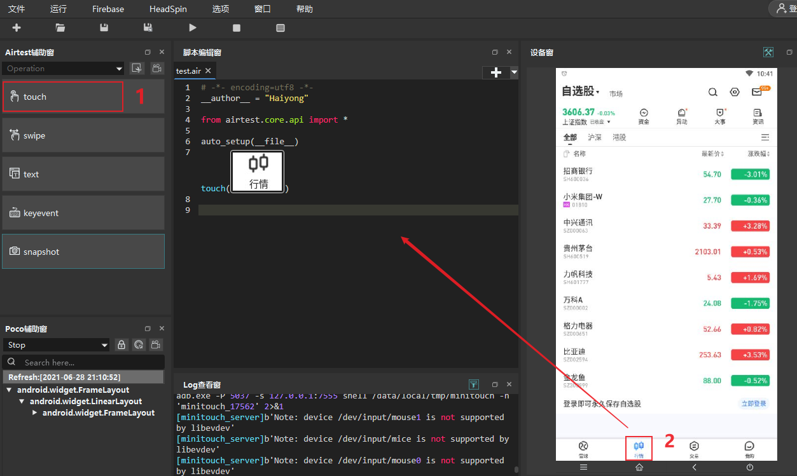
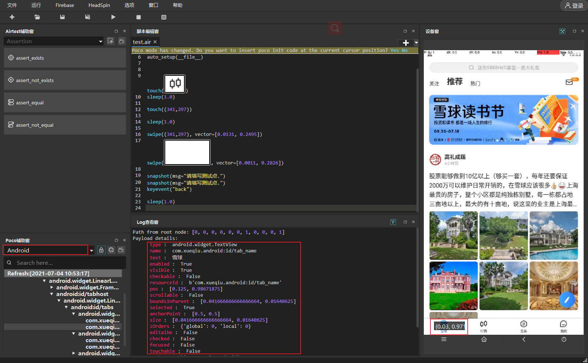
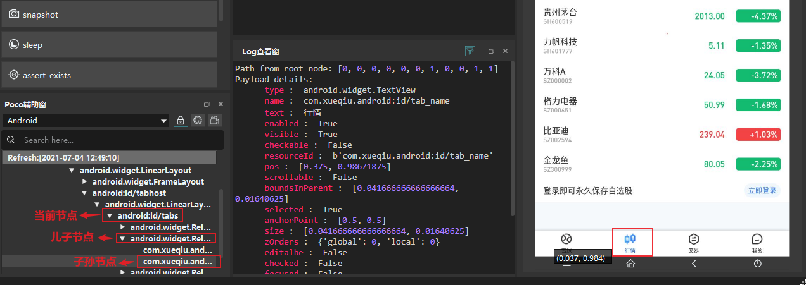

# App自动化测试工具Airtest
AirtestProject是由网易游戏推出的一款跨平台的UI自动化测试框架，主要是面向游戏的UI自动化测试，比如Unity3D、cocos2dx-\*游戏框架，也支持Android原生app、iOS app、微信小程序的UI测试。本文主要介绍如何使用AirtestProject进行Android APP自动化测试。

<!--more-->

## AirtestProject组件
AirtestProject包括一下组件：
- Airtest：基于图像识别的自动化测试框架，适用于游戏和App，图像识别主要使用opencv库。项目地址：[https://github.com/AirtestProject/Airtest](https://github.com/AirtestProject/Airtest)
- Poco：基于UI元素识别的测试框架，支持Unity3D/cocos2dx-\*/Android原生app/iOS原生app/微信小程序。项目github地址：[https://github.com/AirtestProject/Poco](https://github.com/AirtestProject/Poco)
- AirtestIDE：图形界面，内置了Airtest和Poco的相关插件。官网地址：[http://airtest.netease.com/](http://airtest.netease.com/)
- AirLab：真机自动化云测试平台。

下面介绍如何使用Airtest和Poco进行自动化测试。

## 下载安装

先安装一下AirtestIDE，主要用于截图、UI 元素查看以及脚本调试，下载地址：[http://airtest.netease.com/](http://airtest.netease.com/)


下载完成后解压，打开AirtestIDE.exe文件，连接一个模拟器，模拟器页面会实时显示在右边：



Python安装：

```sh
pip install -U airtest # airtest测试框架
pip install pocoui # poco测试框架
```

## Airtest使用
### 安装卸载apk

```python
install("path/to/your/apk") # 安装APK
uninstall("package_name_of_your_apk") # 卸载APK
```

### 连接设备

```python
init_device(platform="Android",uuid="SNHVB20C18002195") # 连接android设备SNHVB20C18002195
init_device(platform="Windows",uuid="29563034")  # uuid表示Android设备的序列号，Windows的句柄，iOS的uuid
connect_device('Android:///') # 本地android设备
connect_device('Android:///SNHVB20C18002195') # SNHVB20C18002195为手机序列号，可通过adb devices命令查看
connect_device("Android://127.0.0.1:7555")
connect_device("Windows:///")  # 连接到windows桌面
connect_device("Windows:///29563034")  # 连接到句柄29563034的windows应用
connect_device("iOS:///127.0.0.1:8100")  # 连接iOS 设备
```

### 打开、停止APP

打开APP

```python
start_app(package, activity=None)
```

停止APP：

```python
stop_app(package)
```

### 元素操作方法

常用的元素操作方法主要包括下面5种：


#### touch点击操作

```python
touch((100, 100), times=1) # 点击绝对坐标，times为点击次数，默认为1次
touch((100, 100), duration=2) # Android 和 Windows 平台应用可设置点击时间duration
touch((100, 100), right_click=True) # Windows右键点击
touch(Template(r"tpl1624889731448.png", record_pos=(-0.129, 0.832), resolution=(720, 1280))) # 点击图片中心，Template类包括了图片位置，手机分辨率，图片保存位置属性以及模板匹配，查找图片在手机的位置等方法
```

图片可以通过AirtestIDE来获取，点击Airtest辅助窗的touch方法，然后在设备窗中选择要操作的位置区域：


#### swipe滑动操作

```python
swipe(v1, v2, vector=None) # 从v1滑动到v2，v1为起点，可以是Template类或者像素坐标
swipe((341,297), vector=[0.0131, 0.2495])
swipe(Template(r"tpl1624977188003.png", record_pos=(-0.015, -0.204), resolution=(720, 1280)), vector=[0.0011, 0.2826])
```

#### text文本输入

使用此方法时要确保输入框为活动状态，可以先点击一下输入框，然后再输入

```python
text("test", enter=True) # 输入完成后，输入Enter键
```

#### keyevent键盘输入

```python
keyevent(keyname) # 在Android中类似于执行 adb shell input keyevent KEYNAME
keyevent("HOME") # 或者 keyevent("3") HOME键

```

Android的按键可参考：[https://developer.android.com/reference/android/view/KeyEvent](https://developer.android.com/reference/android/view/KeyEvent)


#### snapshot截图

```python
snapshot(filename=None, msg="", quality=None, max_size=None) # 保存屏幕截图，filename：图像名，quality：图像质量（1-99），max_size：大小
```


#### wait等待出现

等待目标图片出现

```python
wait(Template(r"tpl1624977188003.png"), timeout=None, interval=0.5, intervalfunc=None) # timeout：最大等待时间，interval：检查间隔时间
```

#### exists检查目标是否出现
检查当前界面是否出现指定目标

```python
pos = exists(Template(r"tpl1624977188003.png")) # 如果找到目标，可以返回目标位置坐标
if pos:
	touch(pos)
```

### 断言

#### 断言目标是否存在

断言目标存在：assert_exists

```python
assert_exists(Template(r"tpl1624977188003.png"))
```

断言目标不存在：assert_not_exists
```python
assert_not_exists(Template(r"tpl1624977188003.png"))
```

#### 值是否相等

```python
assert_equal(first, second) # 断言两个值相等
assert_not_equal(first, second) # 断言两个值不相等 
```

## Poco使用

UI 元素可通过在AirtestIDE的Poco 辅助窗查看：


### poco初始化

Android手机开启开发者模式，连接电脑，通过`adb devices`查看手机是否连接成功。

初始化：

```python
from poco.drivers.android.uiautomation import AndroidUiautomationPoco

poco = AndroidUiautomationPoco(force_restart=False,use_airtest_input=True, screenshot_each_action=False)
poco.device.wake() # 执行唤醒：进入主页，启动Yosemite
```

### UI元素定位

#### 基本选择器

```python
poco('node_name') # 默认第一个参数为节点名

# 也可以通过name 或者其它属性定位
poco(text='行情', type='android.widget.TextView')
```

#### 相对选择器

和XPath的相对定位一样，poco可以根据父子关系、兄弟关系、祖孙关系来定位。


子节点和子孙节点定位：

```python
# select by direct child/offspring
poco("android:id/tabs").child("android.widget.RelativeLayout")[1].offspring(text="行情").click() # 具有多个元素的情况下，可以使用索引，索引从0开始。
```

兄弟节点定位：

```python
poco("name").sibling("sibling_name")
```

父节点：

```python
poco("name").parent("parent_name")
```

#### 属性获取

获取UI对象属性

```python
ele = poco(text='行情')
print(ele.attr('type'))  # 属性
print(ele.attr('text')) # text属性
print(ele.get_bounds())  # 边界框
print(ele.get_position()) # 坐标
print(ele.get_size()) # UI 元素大小
print(ele.get_name())  # 元素名称
print(ele.get_text())  # 元素文本值，和ele.attr('text')一样
print(ele.exists())  # 元素是否存在
```

执行结果：

```python
android.widget.TextView
行情
[0.978515625, 0.39583333333333337, 0.994921875, 0.3541666666666667]
[0.375, 0.98671875]
[0.041666666666666664, 0.01640625]
com.xueqiu.android:id/tab_name
行情
True
```

poco中的坐标采用百分比坐标，将x和y方向都缩放为0-1。

### UI 元素操作

下面介绍几种常见poco元素操作方法

#### click点击

点击UI元素

```python
poco('name').click() # 默认点击UI元素锚点（左上角）
poco('name').click('center') # 点击中心点
poco('name').click([0.5, 0.5])    # 点击中心点
poco('name').focus([0.5, 0.5]).click()  # 点击中心点
```

点击坐标

```python
poco.click([0.5, 0.5])  # 点击屏幕中心点
poco.long_click([0.5, 0.5], duration=3) # 长按
```

#### set_text文本输入

```python
text = 'test'
poco('name').set_text(text) # 相文本框name输入文本
```

#### swipe滑动

```python
swipe(direction, focus=None, duration=0.5)
```

- direction ： 滑动方向，可选up，down，left，right，也可传入向量坐标。

- duration：滑动持续时间，时间越短，滑动速度就越快，滑动的距离就越长

```python
ele = poco('name')
ele.swipe('up') # 向上滑动
ele.swipe([0,-0.1]) # 向上滑动
ele.swipe('down') # [0,0.1] 下滑
ele.swipe('left') # [-0.1,0] 左滑
ele.swipe('right')# [0.1,0] 右滑
ele.swipe([0.2, -0.2])  # 右上45度角滑动swipe sqrt(0.08) 单元距离
ele.swipe([0.2, -0.2], duration=0.5)
```

根据坐标滑动

```python
poco.swipe(p1, p2=None, direction=None, duration=2.0)
```

从坐标 (100, 100) 滑动到 (100, 200) ，手机屏幕分辨率为1920×1080
```python
poco.swipe([100/1920, 100/1080], [100/1920, 200/1080], duration=0.5)
# 或者
poco.swipe([100/1920, 100/1080], direction=[0, 100/1080], duration=0.5)
```

#### drag_to拖到

从一个UI元素拖到另一个UI元素

```python
ele1 = poco('name1').focus([0.5,0.5])
ele2 = poco('name2').focus([0.5,0.5])
ele.drag_to(ele2)

```

#### wait等待

等待目标对象出现，返回目标对象

```python
poco('name').wait(5).click()  # 最多等待5秒，元素出现后点击
poco('name').wait(5).exists()  # 最多等待5秒，返回元素是否出现

poco('name').wait_for_appearance(timeout=10) # 等待元素出现
poco("name").wait_for_disappearance(timeout=10) # 等待元素消失

ele1 = poco('name1')
ele2 = poco('name2')
poco.wait_for_all([ele1,ele2], timeout=10) # 等待2个UI元素标签全部出现
poco.wait_for_any([ele1,ele2], timeout=10) # 等待任意一个UI元素出现

```

#### 截图

```python
from base64 import b64decode

b64img, fmt = poco.snapshot(width=720)
open('screen.{}'.format(fmt), 'wb').write(b64decode(b64img))
```

## 小结

本文主要介绍了Airtest和poco的使用方法，Airtest的图片识别功能很好用，poco用于UI元素操作。可以将这它们结合起来使用，特别是在游戏的测试中，需要通过图标来定位。Airtest+poco还有一个优点就是app初始化启动速度要快于appium。


