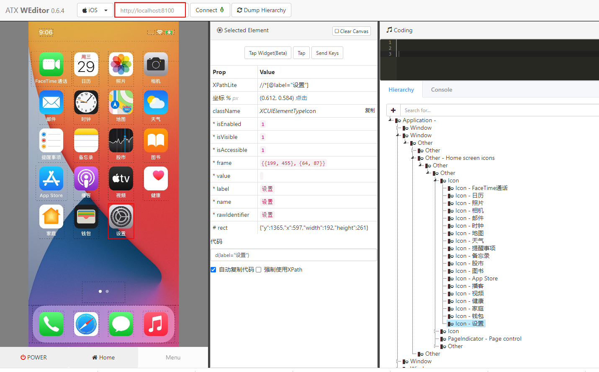

# 使用facebook-wda进行iOS APP自动化测试

facebook-wda 是一个基于Python的测试库，通过HTTP协议与WebDriverAgent通信，本文介绍如何使用 facebook-wda 进行iOS APP自动化测试。

<!--more-->

## 环境准备
使用 facebook-wda 之前需要满足如下条件：
1. 手机安装 WebDriverAgent应用

   - 可以使用xcodebuild启动WDA（需要MAC电脑）
   - 也可以使用[tidevice](https://github.com/alibaba/tidevice)启动，它可以在Linux 、Windows和MAC上使用

2. 电脑安装facebook-wda：

```sh
pip3 install -U facebook-wda
```

在windows上搭建iOS自动化测试环境可参考：[https://devtest-notes.readthedocs.io/zh/latest/app/app-testing-for-ios-app-on-windows.html)

本文使用tidevice启动WDA：

```sh
$ tidevice list
List of apple devices attached
00008101-000255021E08001E iPhone12
$ 
$ tidevice -u [设备 udid] wdaproxy -B [wda 的 bundle Id] --port 8100
```

可以使用weditor查看UI元素，注意使用它之前要启动WDA。

```bash
pip3 install -U weditor # 安装
```

命令窗口输入weditor，会自动打开一个浏览器，选择iOS。




环境准备好后就可以使用[facebook-wda](https://github.com/openatx/facebook-wda)进行iOS APP自动化测试了。

## 初始化

全局配置

```python
import wda

wda.DEBUG = False # default False
wda.HTTP_TIMEOUT = 180.0 # default 180 seconds
wda.DEVICE_WAIT_TIMEOUT = 180.0
```

DEBUG设置为 `True` 时会显示HTTP请求和响应信息
```sh
>>> import wda
>>> wda.DEBUG = True
>>> wda.HTTP_TIMEOUT = 180.0
>>> wda.DEVICE_WAIT_TIMEOUT = 180.0
>>> c = wda.Client('http://localhost:8100')
>>> c.app_current()
Shell$ curl -X GET -d '' 'http://localhost:8100/wda/activeAppInfo'
Return (206ms): {
  "value" : {
    "processArguments" : {
      "env" : {

      },
      "args" : [

      ]
    },
    "name" : "",
    "pid" : 228,
    "bundleId" : "com.apple.Preferences"
  },
  "sessionId" : null
}
{'processArguments': {'env': {}, 'args': []}, 'name': '', 'pid': 228, 'bundleId': 'com.apple.Preferences'}
>>>
>>> wda.DEBUG = False
>>> c.app_current()
{'processArguments': {'env': {}, 'args': []}, 'name': '', 'pid': 228, 'bundleId': 'com.apple.Preferences'}
>>>
```

### 创建一个客户端

```python
import wda
c = wda.Client('http://localhost:8100')
c = wda.Client() # 读取环境变量DEVICE_URL，如果没有使用默认地址：http://localhost:8100
```

也可以使用USBClient连接设备：

```python
c = wda.USBClient() # 仅连接一个设备可以不传参数
c = wda.USBClient("00008101-000255021E08001E", port=8100) # 指定设备 udid 和WDA 端口号
c = wda.Client("http+usbmux://{udid}:8100".format(udid="00008101-000255021E08001E")) # 通过DEVICE_URL访问
c = wda.USBClient("00008101-000255021E08001E", port=8100, wda_bundle_id="com.facebook.WebDriverAgent.test2.xctrunner") # 1.2.0 引入 wda_bundle_id 参数
```

注：初始化连接设备时不需要事先使用tidevice命令启动WDA，wda.Client()会自动启动WDA应用。

### 设备操作

等待WDA服务正常

```python
c.wait_ready(timeout=120, noprint=True) # 默认120s，安静的等待，无进度输出
```

锁屏

```sh
>>> c.locked()
False
>>> c.lock()
{'value': None, 'sessionId': '4D60BDFB-5D18-4EFB-8C40-97E4826B9AAB', 'status': 0}
>>> c.unlock()
{'value': None, 'sessionId': '4D60BDFB-5D18-4EFB-8C40-97E4826B9AAB', 'status': 0}
```

回到手机主页面

```python
c.home()
c.press("home")
```

增大降低音量

```python
c.press("volumeUp")
c.press_duration("volumeUp", 1) # 长按1s
c.press("volumeDown")
c.press_duration("volumeDown", 1) 
```

### 打开、停止App

打开APP
```python 
s = c.session('com.apple.Health') # 打开app
s = c.session('com.apple.Health', alert_action="accept") 
s.close() # 关闭

c.session().app_activate("com.apple.Health") # 打开app
```

停止APP：

```python
c.session().app_terminate("com.apple.Health") # 关闭app
```

获取app状态：

```python
>>> c.session().app_state("com.apple.Health") # 返回app状态
{'value': 1, 'sessionId': 'BEB6A59E-254A-428A-AB53-F52A957ABE1F', 'status': 0}

```

- `1`：表示已关闭
- `2`：表示后台运行
- `4`：表示正在运行


## 获取设备应用信息

### 查看设备状态信息

```sh
>>> c.status()
{'message': 'WebDriverAgent is ready to accept commands', 'state': 'success', 'os': {'testmanagerdVersion': 28, 'name': 'iOS', 'sdkVersion': '14.5', 'version': '14.6'}, 'ios': {'ip': '192.168.5.159'}, 'ready': True, 'build': {'time': 'Jul 27 2021 20:50:24', 'productBundleIdentifier': 'com.facebook.WebDriverAgentRunner'}, 'sessionId': '4D60BDFB-5D18-4EFB-8C40-97E4826B9AAB'}
```

### 获取应用信息
当前应用信息
```sh
>>> c.app_current()
{'processArguments': {'env': {}, 'args': []}, 'name': '', 'pid': 228, 'bundleId': 'com.apple.Preferences'}
```

### 获取设备信息

设备信息

```python
>>> c.device_info()
{'timeZone': 'GMT+0800', 'currentLocale': 'zh_CN', 'model': 'iPhone', 'uuid': '1DF5DFF9-93B2-4B87-8249-DB33ADB6A330', 'userInterfaceIdiom': 0, 'userInterfaceStyle': 'light', 'name': 'iPhone12', 'isSimulator': False}
>>>
```

电量信息

```python
>>> c.battery_info()
{'level': 0.9800000190734863, 'state': 2}
```

分辨率：

```python
>>> c.window_size()
Size(width=375, height=812)
```

## UI元素定位

### 基本选择器
通过属性值定位：
id
```python
s(id='URL')
```
className
```python
s(className="XCUIElementTypeCell")
```
name
```python
s(name='屏幕使用时间')
s(nameContains='屏幕')
s(nameMatches="屏幕.*")
```
value
```python
s(value="屏幕使用时间")
```
label
```python
s(label="屏幕使用时间")
s(labelContains="屏幕")
```
也可以组合多个属性，可以组合的属性包括：className、name、label、visible、enabled。
```python
s(className="XCUIElementTypeCell",name="屏幕使用时间").click()
```

### 子元素

```python
# 子元素定位
s(className='XCUIElementTypeTable').child(name='通知').exists
```

### 多个实例

返回所有匹配到的元素

```bash
$ s(nameContains='模式').find_elements()
[<wda.Element(id="15000000-0000-0000-0901-000000000000")>, <wda.Element(id="1B000000-0000-0000-0901-000000000000")>, <wda.Element(id="5E000000-0000-0000-0901-000000000000")>]
```

使用index来选择匹配到的多个元素
```python
s(nameContains='模式', index=2).click() # 点击匹配到的第3个元素
# 或者
s(nameContains='模式')[2].click()
```


### XPath定位

```python
s(xpath='//*[@name="屏幕使用时间"]')
# 或者
s.xpath('//*[@name="屏幕使用时间"]')

```

更多xpath语法可参考[xpath & CSS Selector定位](https://devtest-notes.readthedocs.io/zh/latest/web/selenium-xpath-and-CSS-Selector-locator.html)

### Predicate定位

Predicate定位是iOS原生支持的定位方式，定位速度比较快，它可以通过使用多个匹配条件来准确定位某一个或某一组元素。

```python
s(predicate='name BEGINSWITH "屏幕"').click() # 点击屏幕使用时间
```

更详细的Predicate语法及定位示例可参考：[iOS APP自动化：predicate定位方法介绍](https://devtest-notes.readthedocs.io/zh/latest/app/app-testing-for-ios-location-with-predicate-locator.html)

### classChain定位

classChain是Predicate和Xpath定位的结合，搜索效率比XPath更高。

```python
s(classChain='**/XCUIElementTypeTable/*[`name == "通知"`]').click() # 点击【通知】
```

更详细的使用方法参考：[iOS APP自动化：class chain定位方法介绍](https://devtest-notes.readthedocs.io/zh/latest/app/app-testing-for-ios-location-with-classChain.html)

## 获取元素信息

检查元素是否存在

```python
s(name="屏幕使用时间").exists # Return True or False
```


读取UI元素的属性信息

```python
ele = s(name="屏幕使用时间").get(timeout=3.0) # 如果10s内没有找到，会抛出WDAElementNotFoundError错误
ele = s(name="屏幕使用时间").wait(timeout=3.0)

# 获取元素属性
ele.className # XCUIElementTypeCell
ele.name # XCUIElementTypeCell
ele.visible # True 
ele.value 
ele.label # 屏幕使用时间
ele.text # 屏幕使用时间
ele.enabled # True 
ele.displayed # True 
ele.accessible

x, y, w, h = ele.bounds # Rect(x=0, y=744, width=375, height=46)
```

## 元素操作方法

### 点击
点击UI元素
```python
s(name="屏幕使用时间").get(timeout=3.0).tap()
s(name="屏幕使用时间").tap()
s(name="设置").tap_hold(2.0) # 长按

s(name="屏幕使用时间").click()

s(text='屏幕使用时间').click_exists() # return True or False
s(text='屏幕使用时间').click_exists(timeout=5.0)
```

点击像素坐标
```python
s = c.session('com.apple.Preferences')
s.tap(490, 1885) # 通过像素坐标点击

s.click(490, 1885) 
s.click(0.426, 0.716)

s.double_tap(490, 1885)  # 双击

```

### 文本输入

文本值输入与清除

```python
ele = s(text='搜索').get()

ele.set_text("NFC") # 输入文本
ele.clear_text() # 清除文本
ele.set_text("\b\b\b\n") # 删除3个字符
ele.set_text("NFC\n") # 输入文本并确认

```

### 等待wait

设置隐式等待：

```python
s.implicitly_wait(5) # 5s
```
设置超时时间

```python
s.set_timeout(10.0)
```

等待元素
```python
s(name="屏幕使用时间").wait(timeout=3.0) # 等待元素出现
s(name="屏幕使用时间").wait_gone(timeout=3.0) # 等待元素消失
```

### Alert操作

对Alert弹框进行处理

```bash
>>> print(s.alert.exists)
True
>>> print(s.alert.text)
移除“设置”？
“从主屏幕移除”会将App保留在App资源库中。

```

```python
s.alert.accept() # 确认
s.alert.dismiss() # 取消
s.alert.wait(5) # 等待出现

s.alert.buttons() # 返回选项，例如：['取消', '从主屏幕移除']

s.alert.click("取消") # 点击取消
s.alert.click(["取消", "cancel"]) # 点击出现的列表中的某个选项
```
也可以监控到Alert出现后进行操作：
```python
with c.alert.watch_and_click(['好', '确定']):
	s(label="Settings").click() # 
```

### 滑动swipe

根据像素坐标滑动
```python
c.swipe(fx, fy, tx, ty, duration=0.5) # 从(fx, fy)滑到(tx, ty)，坐标值可以是迅速值或者百分比，duration单位秒
c.swipe_left() # 向左滑动
c.swipe_right()
c.swipe_up()
c.swipe_down()
```

### 截图

```python
s.screenshot().save("test.png")
from PIL import Image
s.screenshot().transpose(Image.ROTATE_90).save("correct.png") # 横屏截图
```

设备截屏
```sh
c.screenshot().save("screen.png")
c.press_duration("snapshot", 0.1) 
```

## pytest + facebook-wda实例

测试步骤：

1. 打开【设置】
3. 点击搜索
4. 输入“NFC”
5. 关闭NFC
6. 断言NFC是否关闭

Python代码：

```python
#!/usr/bin/python3
# -*-coding:utf-8-*-

import wda
import time
wda.DEBUG = False # default False
wda.HTTP_TIMEOUT = 180.0 # default 180 seconds
wda.DEVICE_WAIT_TIMEOUT = 180.0

class TestDemo():
    def setup(self):
        self.c = wda.USBClient("00008101-000255021E08001E", port=8100)
        self.c.wait_ready(timeout=300)
        self.c.implicitly_wait(30.0)

    def teardown(self):
        self.c.session().app_terminate("com.apple.Preferences")

    def test_NFC(self):
        self.c.session('com.apple.Preferences')
        self.c.swipe_down()

        self.c(name="搜索").set_text("NFC")  # 搜索 NFC
        self.c(name="NFC").click()  # 点击NFC
        time.sleep(1)

        ele = self.c(xpath='//Switch').wait(timeout=3.0)
        sw = ele.value
        if sw == '1':
            ele.click()
            self.c.alert.wait(3)
            self.c.alert.click("关闭")
            time.sleep(1)
            sw = ele.value

        assert sw == '0'
```


