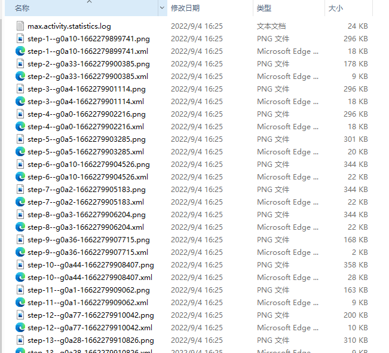

# Android APP稳定性测试工具Fastbot
我在 [自动遍历测试之Monkey工具](https://blog.csdn.net/u010698107/article/details/111437735) 和 [AppCrawler自动遍历测试](https://blog.csdn.net/u010698107/article/details/111438820) 分别介绍了APP稳定性测试工具monkey和AppCrawler，它们各有优缺点，本文介绍另一款也比较好用的稳定性测试工具Fastbot。

<!--more-->

## 简介

Fastbot是由字节跳动 Quality Lab开源的一款基于model-based testing 结合机器学习、强化学习的APP 稳定性测试工具，提供了Android和iOS版本。具体原理介绍可参考这篇文章：[https://mp.weixin.qq.com/s/QhzqBFZygkIS6C69__smyQ](https://mp.weixin.qq.com/s/QhzqBFZygkIS6C69__smyQ)。

本文记录一下Fastbot的使用方法。

## 前期准备

### 环境

本文使用环境：

- Windows10
-  Android 10真机
- adb 1.0.40

adb安装可参考[Android ADB原理及常用命令](https://blog.csdn.net/u010698107/article/details/111416228)。

使用数据线将手机连接到电脑，到手机设置中的开发人员选择中开启USB调试，电脑命令行输入`adb devices` 查看手机是否连接成功：

```bash
$ adb devices
List of devices attached
CUYDU19626004019        device
```

克隆[Fastbot_Android](https://github.com/bytedance/Fastbot_Android)项目到本地：

```bash
git clone https://github.com/bytedance/Fastbot_Android.git
```

然后进入项目目录，将 `framework.jar fastbot-thirdpart.jar monkeyq.jar` push 到手机`/sdcard`目录，push `libs/* ` 到 `/data/local/tmp/`目录:

```bash
$ adb push fastbot-thirdpart.jar /sdcard
fastbot-thirdpart.jar: 1 file pushed. 4.1 MB/s (85664 bytes in 0.020s)

$ adb push framework.jar /sdcard
framework.jar: 1 file pushed. 32.3 MB/s (1149240 bytes in 0.034s)

$ adb push monkeyq.jar /sdcard
monkeyq.jar: 1 file pushed. 12.3 MB/s (77375 bytes in 0.006s)

$ adb push libs/. /data/local/tmp/
libs/.\: 4 files pushed. 24.9 MB/s (7740944 bytes in 0.296s)
```

## Fastbot遍历测试示例

下面介绍如何使用Fastbot进行简单的遍历测试。

### 添加限定词

添加限定词，可提升模型， 使用[AAPT2](https://developer.android.google.cn/studio/command-line/aapt2)（Android 资源打包工具）解析apk中的索引字符串资源，aapt2是Google Android开发工具包Android SDK中提供的工具，所以要先安装一下Android SDK，下载地址为：[http://tools.android-studio.org/index.php/sdk](http://tools.android-studio.org/index.php/sdk)。

安装完成后将aapt2添加到 `PATH` 环境变量中，我的电脑路径为 `D:\android-sdk-windows\build-tools\29.0.3\` 。

下面提取要测试APP的apk文件中字符串，以东方财富APP为例，字符提取命令如下：

```bash
aapt2 dump strings dfcf_0005564.apk > max.valid.strings
```
将`max.valid.strings`push到手机sdcard目录下：
```bash
adb push max.valid.strings /sdcard 
```

### 获取包名

接下来读取要测试的APP包名，可以使用aapt2工具：

```bash
$ aapt2 dump badging dfcf_0005564.apk
package: name='com.eastmoney.android.berlin' versionCode='10003000' versionName='10.3' platformBuildVersionName='' platformBuildVersionCode='' compileSdkVersion='29' compileSdkVersionCodename='10'
sdkVersion:'16'
targetSdkVersion:'28'
.................
```

或者手机打开东方财富，然后执行如下命令：

```bash
$ adb shell dumpsys activity activities | findstr mResumedActivity
mResumedActivity: ActivityRecord{a9dd009 u0 com.eastmoney.android.berlin/com.eastmoney.android.module.launcher.internal.search.NewSearchActivity t64017}
```

 可获取到包名为`com.eastmoney.android.berlin` 。

### 开启遍历测试

Fastbot遍历测试命令如下：

```bash
adb -s 设备号 shell CLASSPATH=/sdcard/monkeyq.jar:/sdcard/framework.jar:/sdcard/fastbot-thirdpart.jar exec app_process /system/bin com.android.commands.monkey.Monkey -p 包名 --agent reuseq --running-minutes 遍历时长 --throttle 事件频率 -v -v
```

1. `-s 设备号 `：多个设备需要指定设备号，单独设备无需此-s参数
2. `-p 包名 `：遍历app的包名，-p+包名
3. `--agent reuseq `：遍历模式，无需更改
4. `--running-minutes 遍历时长(分钟)` ：# 遍历时间：--running-minutes 时间
5. `--throttle 事件频率` ：遍历事件频率，建议为500-800
6. 可选参数
   - `--bugreport `：崩溃时保存bug report log
   - `--output-directory /sdcard/xxx` ：log/crash 另存目录

示例：

  ```bash
  $ adb -s CUYDU19626004019 shell CLASSPATH=/sdcard/monkeyq.jar:/sdcard/framework.jar:/sdcard/fastbot-thirdpart.jar exec app_process /system/bin com.android.commands.monkey.Monkey -p com.eastmoney.android.berlin --agent reuseq --running-minutes 1 --throttle 500 -v -v --output-directory /sdcard/fastbot_results&adb pull /sdcard/fastbot_results D:\ProgramWorkspace\DevTest-Notes\APP\Android\Fastbot_Android\results
  
  ................
  [Fastbot][2022-09-01 22:18:48.386] :Sending Touch (ACTION_DOWN): 0:(592.0,412.0)
  [Fastbot][2022-09-01 22:18:48.391] Wait Event for 633 milliseconds
  [Fastbot][2022-09-01 22:18:49.025] Events injected: 815
  [Fastbot][2022-09-01 22:18:49.027] // Monkey is over!
  [Fastbot][2022-09-01 22:18:49.028] :Sending rotation degree=0, persist=false
  [Fastbot][2022-09-01 22:18:49.128] Total app activities:
  [Fastbot][2022-09-01 22:18:49.129]    1 com.eastmoney.android.ad.fund.test.FundAdTestMainActivity
  [Fastbot][2022-09-01 22:18:49.130]    2 com.eastmoney.android.cfh.activity.ColumnActivity
  [Fastbot][2022-09-01 22:18:49.130]    3 com.tencent.connect.common.AssistActivity
  ................
  [Fastbot][2022-09-01 22:18:49.248] Explored app activities:
  [Fastbot][2022-09-01 22:18:49.248]    1 com.eastmoney.android.account.activity.CMAssistanceActivity
  [Fastbot][2022-09-01 22:18:49.249]    2 com.eastmoney.android.account.activity.PassportLoginActivity
  .................
  [Fastbot][2022-09-01 22:18:49.253] Activity of Coverage: 3.3240995%
  :Dropped: keys=0 pointers=11 trackballs=0 flips=0 rotations=0
  ```

打印日志会记录每次操作细节，totalActivity（APP所有activity），ExploredActivity（遍历到的activity列表）以及本次遍历的总覆盖率。

其中Java Crash、ANR、Nativie Crash会以追加方式写入到`/sdcard/crash-dump.log`文件中，捕获的Anr 同时也会写入 `/sdcard/oom-traces.log` 文件。

## 专家系统

不同业务线支持不同的个性化需求，业务深度定制化

### 自定义输入法

ADBKeyBoard在输入栏自动输入内容，屏蔽UI输入法

**适用需求：** 遇到搜索栏乱输入，想要输入指定字符

#### 1. 下载安装ADBKeyBoard

下载[ADBKeyBoard.apk](https://github.com/senzhk/ADBKeyBoard)，adb安装：

```bash
$ adb install ADBKeyBoard.apk
Success
```

安装完成后设置ADBKeyBoard为默认输入法，设置生效后，点击输入栏时ADBKeyBoard不会弹起ui输入栏。

#### 2. 配置随机输入字符串

配置输入框可输入的字符串，遍历测试时会随机选择字符输入。

设置配置文件max.config：

```text
max.randomPickFromStringList = false # 关闭随机输入字符串
max.randomPickFromStringList = true # 从文件中随机读取字符串
```

如果设置 `max.randomPickFromStringList = true` ,需要编辑 `max.strings` 文件，输入想要输入的字符串：

```text
1   搜索
2   打开
3   检查
```

将文件`max.config` push到手机：

```python
adb push max.strings /sdcard
```

#### 3. 配置fuzzing输入

编辑项目中 test 目录下的 `max.fuzzing.strings`文件，输入想要输入的字符串

将文件push到手机:

```bash
adb push test/max.fuzzing.strings /sdcard
```

fuzz概率如下：

```
1. 50% 概率输入fuzzing.strings中某个string
2. 35% 概率输入被测试 App 历史页面中text/desc文本内容（不存在max.fuzzing.strings文件时概率提高到85%）
3. 15% 概率不输入
```


### 自定义事件序列

可以人工配置操作路径，用来覆盖 Fastbot 自动遍历不到的场景。也可以自定义操作序列，设置操作的先后顺序。

1、新建 `max.xpath.actions` 文件（文件名称不可更改）

2、编写事件序列配置（case）：

- `prob`：发生概率，"prob"：1,代表发生概率为100%
- `activity`：所属场景，详见：三.获取当前页面所属的Activity
- `times`：重复次数，默认为1即可
- `actions`：具体步骤的执行类型
- `throttle`：action间隔事件（ms）

action 支持以下类型：必须大写
- `CLICK`：点击，想要输入内容在action下补充text，如果有text 则执行文本输入
- `LONG_CLICK`：长按
- `BACK`：返回
- `SCROLL_TOP_DOWN`：从上向下滚动
- `SCROLL_BOTTOM_UP`：从下向上滑动
- `SCROLL_LEFT_RIGHT`：从左向右滑动
- `SCROLL_RIGHT_LEFT`：从右向左滑动

下面以东方财富为例：

```json
[
{
    "prob": 1,
    "activity":"com.eastmoney.android.module.launcher.internal.home.HomeActivity",
    "times": 1,
    "actions": [
        {
            "xpath":"//*[@resource-id="com.eastmoney.android.berlin:id/et_search"]",
            "action": "CLICK",
            "text": "600519",
            "throttle": 2000
        }
    ]
},
{
    "prob": 1,
    "activity":"com.eastmoney.android.module.launcher.internal.search.NewSearchActivity",
    "times": 1,
    "actions": [
        {
            "xpath":"//*[@resource-id="com.eastmoney.android.berlin:id/rv_search_stock_list"]//*[@text="600519"]",
            "action": "CLICK",
            "throttle": 2000
        }
    ]
}
]

```

编写好文件后，push到手机:

```bash
$ adb push max.xpath.actions /sdcard   
```

### Activity屏蔽

手动配置黑、白名单配置，可用来单独覆盖几个场景或屏蔽一些不必要场景。

#### 1、Activity白名单配置

只覆盖白名单内的activity

1、在PC端新建 `awl.strings`文件，写入Activity的名称，例如

```bash
com.eastmoney.android.module.launcher.internal.home.HomeActivity
```

2、将 `awl.strings` 文件push到手机端的sdcard目录下, 目录必须为sdcard

```
adb push awl.strings  /sdcard 
```

3、运行命令时添加以下参数：`--act-whitelist-file /sdcard/awl.strings`

```bash
adb -s CUYDU19626004019 shell CLASSPATH=/sdcard/monkeyq.jar:/sdcard/framework.jar:/sdcard/fastbot-thirdpart.jar exec app_process /system/bin com.android.commands.monkey.Monkey -p com.eastmoney.android.berlin --agent reuseq --act-whitelist-file /sdcard/awl.strings --running-minutes 1 --throttle 500 -v -v
```

只会遍历白名单内的设置的activity。

#### 2、Activity黑名单配置

黑名单内的activity不覆盖

1、新建 `abl.strings` 文件，在文件中输入Activity的名称，同白名单方法一致

```bash
com.eastmoney.android.module.launcher.internal.home.HomeActivity
com.eastmoney.android.msg.center.MsgCenterActivity
com.eastmoney.android.module.launcher.internal.search.NewSearchActivity
com.eastmoney.android.activity.StockActivity
```

由于白名单和黑名单不能同时设置，设置了白名单则白名单外的都为黑名单。先把白名单`awl.strings`文件删掉。

2、然后将`abl.strings`文件push到手机端的sdcard目录下：

```bash
adb push abl.strings  /sdcard 
```

3、运行命令时添加以下参数：

```
--act-blacklist-file /sdcard/abl.strings
```

```
adb -s CUYDU19626004019 shell CLASSPATH=/sdcard/monkeyq.jar:/sdcard/framework.jar:/sdcard/fastbot-thirdpart.jar exec app_process /system/bin com.android.commands.monkey.Monkey -p com.eastmoney.android.berlin --agent reuseq --act-blacklist-file /sdcard/abl.strings --running-minutes 1 --throttle 500 -v -v
```


### 屏蔽控件或区域

配置需要屏蔽的控件或区域，比如屏蔽退出登录按钮。

1、新建 `max.widget.black` 文件，可配置activity、xpath和bounds，比如：

```json
[
	{
		"activity":"com.eastmoney.android.module.launcher.internal.home.HomeActivity",
		"xpath": "//*[@resource-id='com.eastmoney.android.berlin:id/et_search']"
	},
	{
		"activity":"com.eastmoney.android.module.launcher.internal.home.HomeActivity",
		"bounds":"0,0.87,1,0.95"
	}
]
```

屏蔽控件或区域共有三种方式：
  - `bounds`：屏蔽某个区域，在该区域内的控件或坐标不会被点击，bounds 为 0.0～1.0 之间的一个百分比值。
  - `xpath`：查找匹配的控件，屏蔽点击该控件。
  - xpath+bounds：查找匹配的控件，当控件存在时屏蔽指定的区域。

2、将`max.widget.black`文件push到手机sdcard目录下

```
adb push max.widget.black /sdcard 
```

执行：

```bash
adb -s CUYDU19626004019 shell CLASSPATH=/sdcard/monkeyq.jar:/sdcard/framework.jar:/sdcard/fastbot-thirdpart.jar exec app_process /system/bin com.android.commands.monkey.Monkey -p com.eastmoney.android.berlin --agent reuseq --running-minutes 1 --throttle 500 -v -v
```


### 高速截图

保存测试过程中的截图。

1、新建 `max.config`文件，增加以下属性

- `max.takeScreenshot = true`

- `max.takeScreenshotForEveryStep = true`

- `max.saveGUITreeToXmlEveryStep =true`

2、将`max.config` 文件push到手机sdcard目录中:

```
adb push max.config /sdcard 
```

添加`--output-directory`参数指定输出路径， `--throttle` 参数要 >200 才会截图：

```
adb -s 设备号 shell CLASSPATH=/sdcard/monkeyq.jar:/sdcard/framework.jar:/sdcard/fastbot-thirdpart.jar exec app_process /system/bin com.android.commands.monkey.Monkey -p 包名 --agent reuseq --running-minutes 遍历时长 --throttle 事件频率 -v -v --output-directory 指定路径
```
示例代码：
```bash
adb -s CUYDU19626004019 shell CLASSPATH=/sdcard/monkeyq.jar:/sdcard/framework.jar:/sdcard/fastbot-thirdpart.jar exec app_process /system/bin com.android.commands.monkey.Monkey -p com.eastmoney.android.berlin --agent reuseq --running-minutes 1 --throttle 500 -v -v --output-directory /sdcard/fastbot_results&adb pull /sdcard/fastbot_results D:\ProgramWorkspace\DevTest-Notes\APP\Android\Fastbot_Android\results
```



### 权限自动授予

app 的权限弹窗处理， 默认启动app前会自动授予app所需的所有权限，但如果想测试app运行过程中的动态权限弹窗 在 `max.config` 配置

- `max.grantAllPermission = true` Fastbot启动后会自动授予各种权限；

- shell中增加

  ```
   -p com.android.packageinstaller 
   -p com.android.permissioncontroller
   -p com.lbe.security.miui  # for (miui android 10)
   -p com.samsung.android.permissioncontroller #  for (samsung android 10)
  ```

增加弹窗相关package，可在权限弹窗时关闭弹窗。

Fastbot android APP自动遍历测试就介绍到这里，更多功能可参考官方文档：[https://github.com/bytedance/Fastbot_Android/blob/main/handbook-cn.md](https://github.com/bytedance/Fastbot_Android/blob/main/handbook-cn.md)。


参考资料：

1. https://mp.weixin.qq.com/s/3t4H2bfDjei4vXkj_Cz2pg

2. https://mp.weixin.qq.com/s/Oove-BR-5ciJz35S-7tiNw

3. Fastbot icse 2020 paper
   https://2020.icse-conferences.org/details/ast-2020-papers/25/Fastbot-A-Multi-Agent-Model-Based-Test-Generation-System

4. Fastbot mtsc2020 ppt 
   https://pan.baidu.com/s/1flUHAEQKSFZvJDWIWyChJA 
5. Fastbot github
   https://github.com/bytedance/Fastbot_Android
   https://github.com/bytedance/Fastbot_iOS

6. https://github.com/bytedance/Fastbot_Android/blob/main/handbook-cn.md

7. https://github.com/bytedance/Fastbot_iOS/blob/main/Doc/handbook-cn.md

8. https://github.com/bytedance/Fastbot_iOS/issues/1

9. MTSC2021深圳站《字节跳动客户端稳定性测试——Fastbot跨平台实践》
	- https://www.bilibili.com/video/BV1jq4y1q7BX?spm_id_from=333.337.search-card.all.click&vd_source=319619ca8aecf6054720a6cf3960f824


