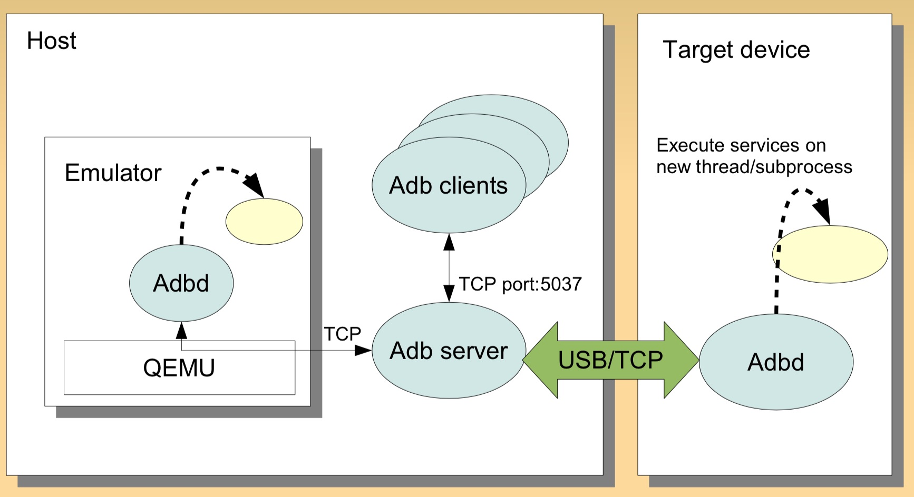
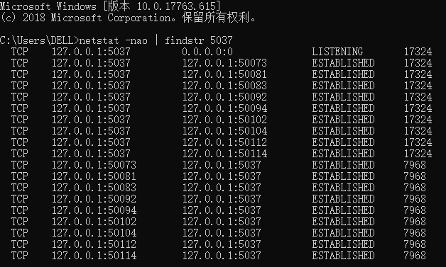
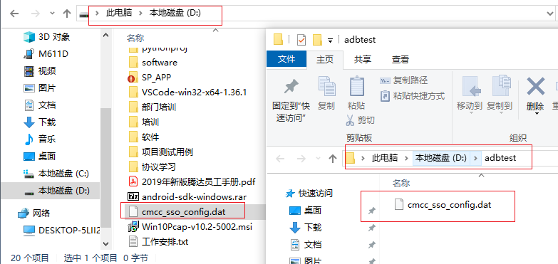

# Android ADB原理及常用命令
Android调试桥(ADB, Android Debug Bridge)是一个Android命令行工具，包含在SDK 平台工具包中，adb可以用于连接Android设备，或者模拟器，实现对设备的控制，比如安装和调试应用。和Appium一样，adb也是基于C/S架构实现的。
<!--more-->

## 一、ADB运行原理
[adb](https://developer.android.com/studio/command-line/adb)分为三个部分：PC上的adb client，adb server和手机（也可能是PC上的模拟器）上的adb daemon。这是一个**多多连接**的设计。即一台PC可以连接多个手机，一台手机也可以连接多个PC。


1. **Client本质上就是Shell**，用来发送命令给**Server**。发送命令时，首先检测PC上有没有启动Server，如果没有Server，则自动启动一个Server，绑定 TCP 的 5037 端口，然后将命令发送到Server，并不关心命令发送过去以后会怎样。
2. **ADB Server**：运行在PC上的后台程序，目的是检测USB接口何时连接或者移除设备。ADB Server维护着一个“已连接的设备的链表”，并且为每一个设备标记了一个状态：**offline，bootloader，recovery或者online**；Server一直在做一些循环和等待，，监听从 clients 发来的命令，协调client和Server还有daemon之间的通信。
3. **ADB Daemon**：程序“adbd”作为一个**后台进程**在Android设备或模拟器系统中运行。它的作用是<u>连接ADB服务器</u>，并且为运行在主机上的客户端提供一些服务；

Client和Server之间通过**TCP/IP**通信，Server侦听本机的**5037端口**，Client试图去连接这个端口。基于ADB的工具有 DDMS 、monkey 测试等
- adb源码：https://android.googlesource.com/platform/system/core/+/refs/heads/android10-c2f2-release/adb/

```shell
netstat -nao | findstr 5037
```


## 二、ADB安装

`adb` 包含在 Android SDK 平台工具软件包中，有两种方法安装adb工具：

1. 使用SDK Manager安装，会安装到 `platform-tools` 目录下。具体安装方法可参考[Appium 介绍及环境安装](https://blog.csdn.net/u010698107/article/details/111416347)中的**安装Android SDK**部分。
2. 单独下载平台工具，下载地址：[https://developer.android.com/studio/releases/platform-tools](https://developer.android.com/studio/releases/platform-tools)。下载完成后解压，添加到环境变量即可。

查看是否安装成功：

```bash
$ adb --version
Android Debug Bridge version 1.0.40
Version 4986621
Installed as D:\android-sdk-windows\platform-tools\adb.exe
```


## 三、ADB常用命令
### 1. adb server启动和连接
* 启动 adb server
```shell
adb start-server 
```
* 停止 adb server
```shell
adb kill-server
```
* 指定 adb server 的网络端口<adb默认端口为5037>
```shell
adb -P <port> start-server 
```
在发送adb命令时，如果pc没有启动Server，则会自动启动一个Server，然后将命令发送到Server。

* 通过adb usb打开设备上的tcpip服务并绑定一个端口
```shell
adb tcpip 5555
adb -s 611DKBQC22SH2 tcpip 5555  # 设备在 5555 端口监听 TCP/IP 连接
```
无线连接要将 Android 设备与将运行 adb 的电脑连接到**同一个局域网**
* ADB Client通过命令adb connect ip连接远程的终端

```bash
adb connect 127.0.0.1:62001 #夜游神模拟器
adb connect 127.0.0.1:7555 #网易mumu模拟器
adb disconnect <device-ip-address> # 断开连接
```
**USB连接**
开启Android 设备的开发者选项和 USB 调试模式

### 2. adb常用命令
以 root 权限运行 adbd
```shell
adb root 
adb -s 611DKBQC22SH2 root
```
查看 adb 版本
```shell
adb version
```
查看设备名称
```shell
adb devices
```
重启手机
```shell
adb reboot
```
安装卸载apk包
模拟器可以直接把安装包拖入模拟器进行安装

adb安装卸载方法：
```bash
# 卸载
adb uninstall 包名
# 安装
adb install app.apk
adb install -r app.apk # 强制安装
```

打印手机日志
```bash
adb logcat | findstr -i displayed # 打印手机日志
```

### 3. 查看appPackage和appActivity
测试某个APP时，通常是先拉起这个APP，需要知道APP包名appPackage，appium启动APP时还需要知道APP某个页面的activity名称appActivity，可以通过adb命令来获取。

获取所有活动
```bash
adb shell dumpsys activity | grep tencent # linux
adb shell dumpsys activity | findstr tencent # windows
```
或者先进入shell环境：
```bash
$ adb shell
root@shamu:/ # dumpsys activity | grep tencent
```

获取当前APP的Package和Activity名：
```bash
adb shell dumpsys activity activities | findstr mResumedActivity
```
例如，打开微信(android 10)：
```bash
$ adb shell dumpsys activity activities | findstr mResumedActivity
    mResumedActivity: ActivityRecord{3a7bec6 u0 com.tencent.mm/.ui.LauncherUI t50558}
```

获取最顶层的activity，也可用来获取当前打开应用的Package和Activity名。
```bash
adb shell dumpsys activity top 
```
上面的命令会打印大量日志信息，需要过滤一下：
```bash
adb shell dumpsys activity | findstr mFocusedActivity
adb shell dumpsys window windows|findstr "mCurrentFocus"
```
如果是Android 8.0及以上的版本，上面的命令可能不能获取到任何信息，因为没有 `mFocusedActivity` 和`mCurrentFocus` 字符。可使用如下命令：
```bash
adb shell dumpsys activity top | findstr "ACTIVITY"
```
返回结果中的最后一行就是当前应用，先打开微信（Android 10），执行如下命令：
```bash
adb shell dumpsys activity top | findstr "ACTIVITY"
  ACTIVITY com.eg.android.AlipayGphone/.AlipayLogin 39a2048 pid=32182
  ACTIVITY com.tencent.mobileqq/.activity.SplashActivity 3984ac6 pid=(not running)
  ACTIVITY com.android.contacts/.activities.ContactDetailActivity 393a983 pid=(not running)
  ACTIVITY tv.danmaku.bili/.MainActivityV2 3a7bf44 pid=19466
  ACTIVITY com.android.email/.activity.Welcome 3c09b05 pid=29831
  ACTIVITY com.tencent.mp/.feature.main.ui.MainActivity 39e2448 pid=4217
  ACTIVITY com.huawei.browser/.BrowserMainActivity 3a13583 pid=15562
  ACTIVITY com.yinxiang/.main.activity.MainActivity 32faf05 pid=5081
  ACTIVITY com.huawei.android.launcher/.unihome.UniHomeLauncher 3906ac6 pid=3143
  ACTIVITY com.tencent.mm/.ui.LauncherUI 3a7bec6 pid=30547
```

也可以使用aapt2工具来获取APP的包名，它也是Android SDK 平台工具软件包中的工具，是一款Android 资源打包工具，可使用如下命令获取apk文件包名：

```bash
$ aapt2 dump badging apk文件名.apk
```

示例(东方财富APP)：

```bash
$ aapt2 dump badging dfcf_0005564.apk
package: name='com.eastmoney.android.berlin' versionCode='10003000' versionName='10.3' platformBuildVersionName='' platformBuildVersionCode='' compileSdkVersion='29' compileSdkVersionCodename='10'
sdkVersion:'16'
targetSdkVersion:'28'
.................
```


查看应用列表
```bash
adb shell pm list packages #所有应用列表
adb shell pm list packages -s # 系统应用
adb shell pm list packages -3 # 第三方应用
adb shell pm list packages smart # 包名包含smart字符串的应用
```

### 4. adb 模拟控制手机
#### 拉起、停止Activity
`adb shell am start [options] <INTENT>` ：调起 Activity
`adb shell am force-stop <packagename>` ： 强制停止应用

```sh
adb shell am start -n com.tenda.smarthome.app/.activity.main.MainActivity # 打开smarthome APP
adb shell am force-stop com.tenda.smarthome.app # 强制停止应用
adb shell pm clear <packagename>  # 清除应用数据与缓存
adb shell am start -a android.intent.action.VIEW -d https://www.baidu.com # 打开网页
```

#### 模拟按键

`adb shell input keyevent <keycode>`： 模拟按键 
```bash
adb shell input keyevent 3 # 按下HOME 键
adb shell input keyevent 4 # 按下返回键

adb shell input keyevent 26 # 按下电源键
adb shell input keyevent 82 # 按下菜单键

adb shell input keyevent 223 # 熄灭屏幕
adb shell input keyevent 224 # 点亮屏幕

adb shell input keyevent 67 # 删除
```

#### 文本框输入
```bash
adb shell input text "text" # 向文本框中输入文字，不支持中文
```

#### 点击
```bash
adb shell input tap 458 573 根据坐标点击
```
#### 滑动
`adb shell input swipe <x1> <y1> <x2> <y2>`： x：屏幕左到右 y：从上到下     左上角为0点-**图像坐标系**
```bash
adb shell input swipe 550 1200 550 375 # 滑动解锁
adb shell input swipe 700 200 100 200 # 左翻页
adb shell input swipe 100 200 1000 200 # 右翻页
````

### 5. adb文件管理（同Linux）
#### 目录操作
```bash
C:\Users\DELL>adb shell
root@M5:/data # su  提取到root权限，显示井号即可
su
root@M5:/ # ls
ls
@btmtk
acdapi
adb
agps_supl
...
root@M5:/data # ls -l
ls -l
drwxrwx--- bluetooth net_bt            2019-03-01 14:26 @btmtk
drwxrwx--- system   system            2019-03-01 14:26 acdapi
drwx------ root     root              2019-03-01 14:26 adb
drwxrwx--x gps      system            2019-07-19 10:49 agps_supl
drwxrwx--- system   system            2019-03-01 14:26 amit
drwxrwxr-x system   system            2019-07-22 09:13 anr
drwxrwx--x system   system            2019-08-01 09:00 app
drwx------ root     root              2019-03-01 14:26 app-asec

root@M5:/data # pwd   当前路径
pwd
/data

root@M5:/data/system # cd - 切换到上次目录
cd -
/data
root@M5:/data # cd .. 切换到上级目录
cd ..
2|root@M5:/ # cd d*a 
cd d*a
root@M5:/data # cd s*m 目录名较长时建议使用通配符"*",如cd到system目录
cd s*m
root@M5:/data/system #
```

#### 文件操作（同Linux）
```bash
rm -r crash # 删除文件夹及内容
rmdir # 文件夹 删文件夹
rm # 文件 删文件
cat filename # cat,more less显示文件内容
cp /data/data/com.android.contacts/databases/contacts_app.db /mnt/sdcard/ # 复制
mkdir # 创建目录
du # 显示目录空间大小
df # 显示磁盘空间大小
touch test.txt # 创建文件
ps # 显示进程
top # 动态显示进程状态
chmod 644 # 改变权限
```

#### 退出
CTRL+C 退出shell模式
```bash
root@M5:/mnt/sdcard # ^C
C:\Users\DELL>d:
```
#### 手机和电脑文件传输
1、将手机文件pull到电脑
```bash
D:\>adb pull sdcard/cmcc_sso_config.dat  # 将手机sdcard中的cmcc_sso_config.dat 文件copy到电脑D：根目录下
D:\>adb pull sdcard/cmcc_sso_config.dat D:\adbtest
D:\>
```


1、将电脑文件push到手机目录下D
```bash
D:\>adb push D:/adbtest/cmcc_sso_config111.dat /sdcard/ # 将D:中的cmcc_sso_config111.dat copy到手机sdcard 文件夹下
D:\>adb shell
root@M5:/ # cd /mnt/sdcard
cd /mnt/sdcard

root@M5:/mnt/sdcard # ls *cmcc_sso_config*
ls *cmcc_sso_config*
cmcc_sso_config.dat
cmcc_sso_config111.dat

root@M5:/mnt/sdcard # find /data -name "cmcc_sso_config*"
find /data -name "cmcc_sso_config*"
/data/media/0/cmcc_sso_config.dat
/data/media/0/cmcc_sso_config111.dat
```

### 6. 其它实用功能
### 屏幕截图

可使用 `screencap` 工具进行截图。下面介绍两种方法：

1、截图保存到SD卡里再导出

```bash
D:\>adb shell screencap -p /sdcard/screen.png
D:\>adb pull /sdcard/screen.png
D:\>adb shell rm /sdcard/screen.png
```

2、 `adb exec-out` 命令直接保存到PC

Android 5.0及之后的版本引入了shell V2协议，可直接使用 `adb exec-out` 命令将文件保存到PC：

```bash
D:\> adb exec-out screencap -p > D:\adbtest\test.png
```

与第一种方式相比，`adb exec-out` 命令效率更高。

#### 录制屏幕
```bash
D:\>adb shell screenrecord /sdcard/filename22.mp4
D:\>adb pull /sdcard/filename22.mp4
D:\>adb shell rm /sdcard/filename22.mp4

D:\>adb shell screenrecord  --time-limit 10 /sdcard/demo.mp4
adb shell screenrecord --size 1280*720 /sdcard/demo.mp4
adb shell screenrecord --bit-rate 6000000 /sdcard/demo.mp4
```


#### 联网
```bash
D:\>adb shell svc wifi disable # 关闭WiFi
D:\>adb shell svc wifi enable  # 开启WiFi

D:\>adb shell ping -w 3 8.8.8.8  #  查看是否能联网
PING 8.8.8.8 (8.8.8.8) 56(84) bytes of data.
--- 8.8.8.8 ping statistics ---
1 packets transmitted, 0 received, 100% packet loss, time 0ms   
D:\>adb shell cat /data/misc/wifi/*.conf  # 查看连接过的 WiFi 密码
.....
device_name=meizu_M5
manufacturer=Meizu
model_name=M611D
model_number=M611D
serial_number=611DKBQC22SH2
device_type=10-0050F204-5
os_version=01020300
config_methods=physical_display virtual_push_button
p2p_no_group_iface=1
external_sim=1
wowlan_triggers=disconnect


network={
        ssid="Plug_C415"
        key_mgmt=NONE
        priority=1
        flag=1
}

network={
        ssid="                                "
        key_mgmt=NONE
        priority=2
        flag=1
}

network={
        ssid="test"
        psk="12345678"
        key_mgmt=WPA-PSK
        priority=3
        flag=1
}
```

#### 切换飞行模式
通过adb shell，输入命令，可以切换飞行模式
开启飞行模式
```bash
adb shell settings put global airplane_mode_on 1
adb shell am broadcast -a android.intent.action.AIRPLANE_MODE --ez state true
```
关闭飞行模式
```bash
adb shell settings put global airplane_mode_on 0
adb shell am broadcast -a android.intent.action.AIRPLANE_MODE --ez state false
```


#### svc命令
这个脚本在/system/bin目录下，可以用来控制电源管理，wifi开关，数据开关(就是上网流量)
控制usb插入的时候屏幕是否常亮
```bash
svc power stayon [true|false|usb|ac]
```
关闭数据连接（上网流量），这个命令不会更改app的任何设置，直接在底层关闭数据连接。
```bash
svc data disable
```
打开上网数据连接
```bash
svc data enable
```
控制3g数据连接比wifi优先。
```bash
svc data prefer
```
关闭wifi 连接
```bash
svc wifi disable
```
开启wifi连接
```bash
svc wifi enable
```
设置wifi优先
```bash
svc wifi prefer
```
上面的命令都要在shell中执行，需要root。可以用script ，然后输入这些命令做成在快捷方式放在桌面，跟那些开关软件一样方便使用。


#### 安卓busybox
android busybox解决adbshell命令不全

安卓虽然是基于linux，但是精简了很多linux工具，很多常用的linux指令不能使用。busybox相当于一个打包的工具箱，打包了很多的常用的linux可执行文件和其依赖。安装了busybox你就可以在安卓下下载一个模拟终端然后在里面运行一些之前不能运行的指令。

#### wpa_spplicant

wpa_supplicant本是开源项目源码，被谷歌修改后加入Android移动平台，它主要是用来支持WEP，WPA/WPA2和WAPI无线协议和加密认证的，控制漫游和无线驱动的IEEE 802.11 验证和关联。通过socket（不管是wpa_supplicant与上层还是wpa_supplicant与驱动都采用socket通讯）与驱动交互上报数据给用户，而用户可以通过socket发送命令给wpa_supplicant调动驱动来对WiFi芯片操作。 简单的说，wpa_supplicant就是WiFi驱动和用户的中转站外加对协议和加密认证的支持。

wpa_supplicant工具主要包含wpa_supplicant(命令行模式，属于服务端)与wpa_cli(交互模式，属于客户端)两个程序来达到无线认证连接。通过wpa_cli来进行WiFi的配置和连接，也可以直接调用wpa_supplicant接口实现网络控制。
部分命令：

```shell
wpa_cli -i wlan0 scan   \\扫描热点
wpa_cli -i wlan0 scan_result   \\打印热点信息
wpa_cli -i wlan0 set_network 0 ssid  "wifi_name" \\配置WiFi热点的名称ssid
wpa_cli -i wlan0 set_network 0 psk '"12345678"' \\配置WiFi热点的密码psk
```

## 四、Python获取ADB返回结果

```python
cmd = "adb shell pm list packages smarthome"
result = os.popen(cmd)
f = result.read() #result只能读取一次
if "smarthome" in f:
    print(f)
```

ADB获取手机时间
```python
def now_time_new(self):
        # now_time_new = datetime.datetime.now().strftime('%H:%M')
        # print "now_time_new",self.now_time_new
        time_a=os.popen('adb shell date "+%Y-%m-%d+%H:%M:%S"')
        time_a=time_a.read()
        time_a=time_a.strip()
        dates=time_a.split('+')[0]
        times=time_a.split('+')[1]
        return (dates,times)
```

## 五、常见问题
没有运行模拟器，而`adb devices`显示多余的设备emulator-5576
```sh
C:\Users\DELL>adb devices
List of devices attached
emulator-5576   offline
611DKBQC22SH2   device
```
解决方法：
运行`adb kill-server`
```sh
C:\Users\DELL>adb kill-server

C:\Users\DELL>adb devices
* daemon not running. starting it now on port 5037 *
* daemon started successfully *
List of devices attached
611DKBQC22SH2   device
```


