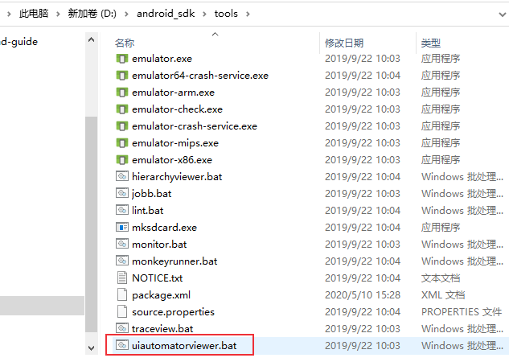
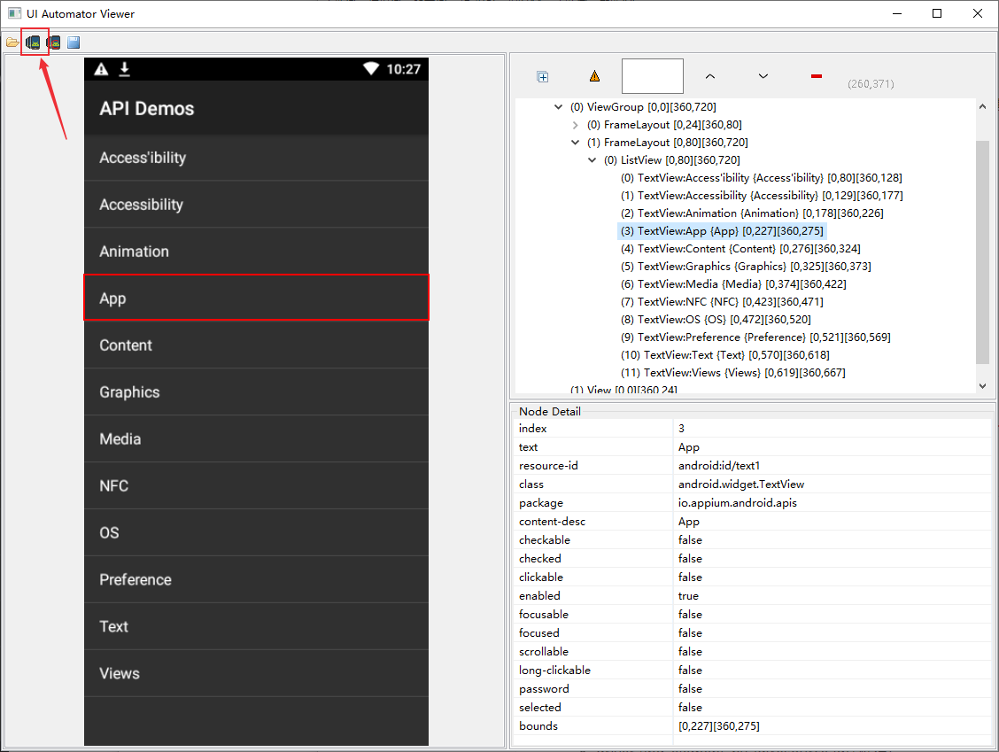
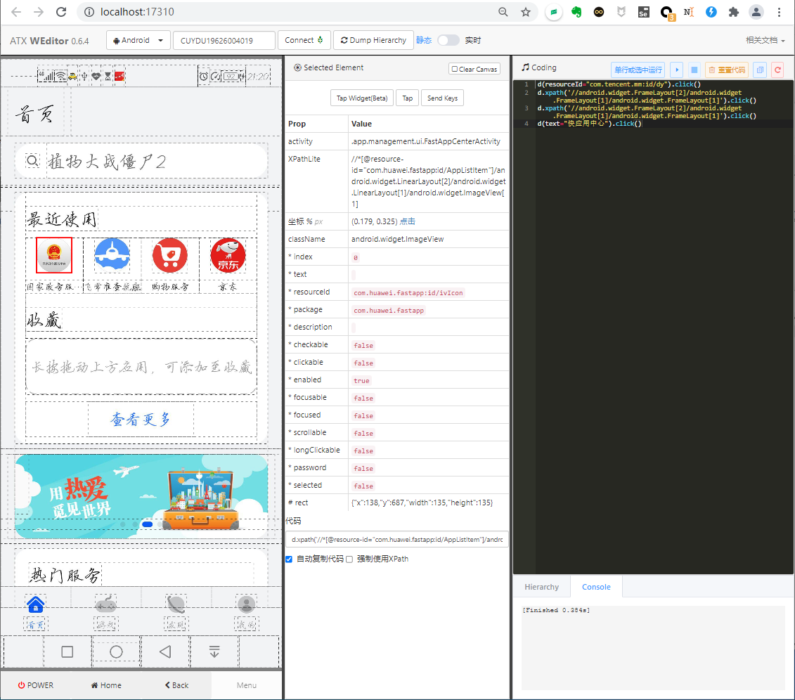
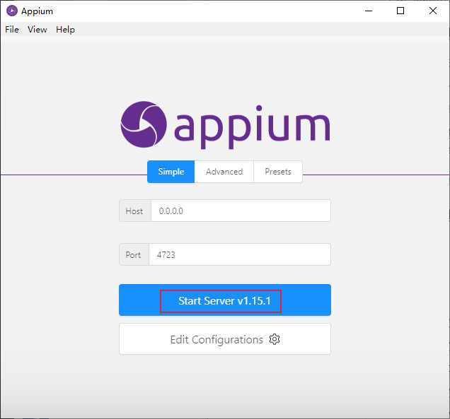
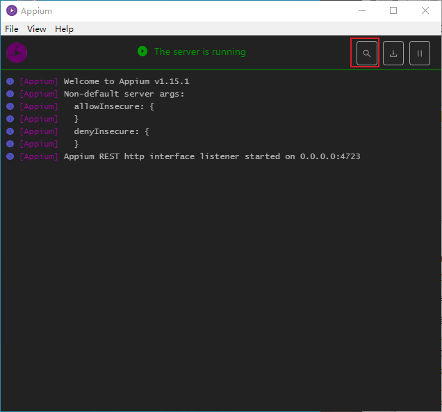
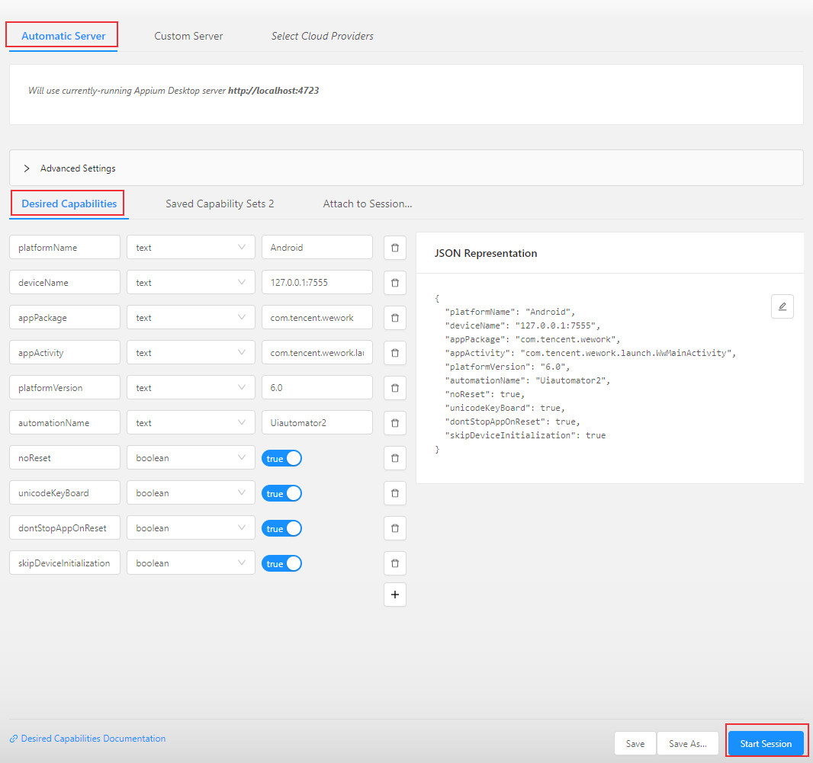
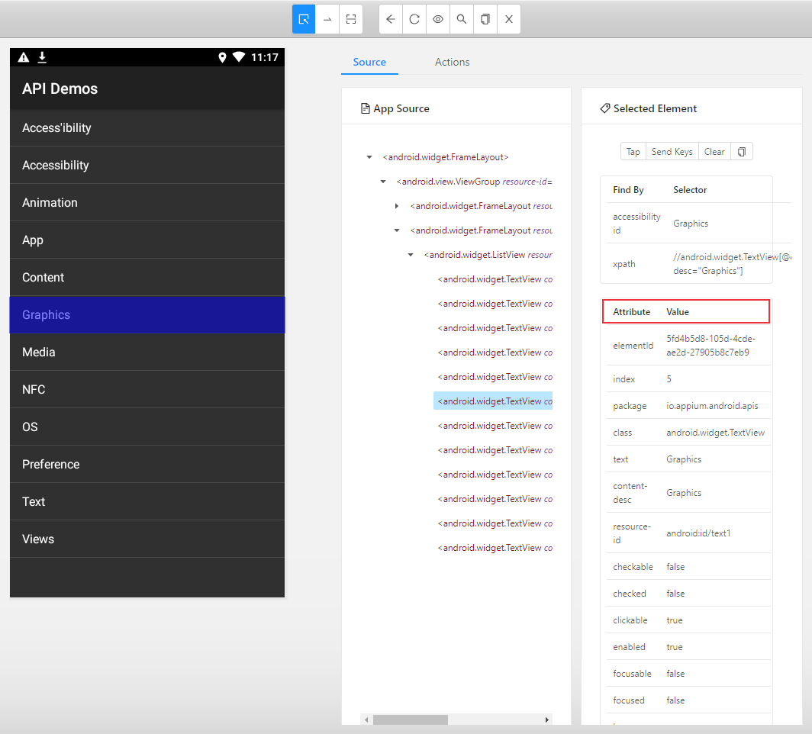
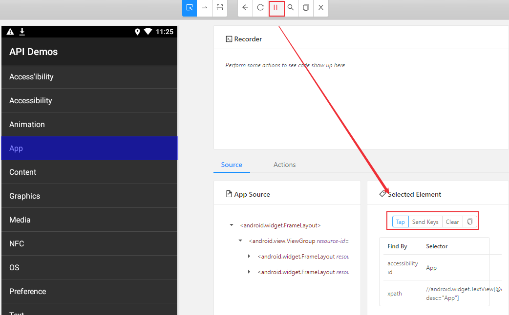
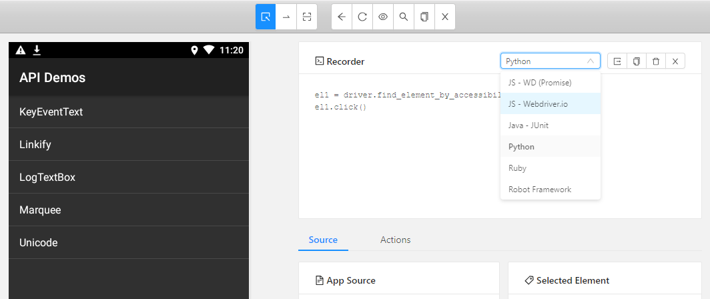

# App控件定位：Android 控件介绍及元素定位方法
<!--more-->

## Android基础知识

### Android布局

Android是通过容器的**布局属性**来管理子控件的位置关系（iOS去掉了布局的概念，直接用变量之间的相对关系完成位置的计算），把界面上所有的控件根据他们的间距的大小，摆放在正确的位置。布局是一种可用于放置很多**控件**的容器，通过多层[布局](https://developer.android.com/guide/topics/ui/declaring-layout?hl=zh-cn)嵌套完成一些比较复杂的界面。

Android布局有LinearLayout(线性布局)、RelativeLayout(相对布局)、FrameLayout(帧布局)、AbsoluteLayout(绝对布局)、TableLayout(表格布局)、Grid layout(网格布局)、ConstraintLayout(约束布局)等。布局的内部除了放置控件外，也可以放置布局，通过多层布局的嵌套，我们就能够完成一些比较复杂的界面。


### Android四大组件

Android四大基本组件分别是Activity，Service服务，Content Provider内容提供者，Broadcast Receiver广播接收器。

#### 1、activity
* 与用户交互的可视化界面
* 一个Activity通常就是一个单独的屏幕（窗口）
* Activity之间通过Intent进行通信

#### 2、Service
* service 实现后台运行程序，在后台完成用户指定的操作
* 通常用于为其他组件提供后台服务或监控其他组件的运行状态。
#### 3、Content Provider
* content provider 内容提供者，提供程序所需要的数据
* 只有需要在多个应用程序间共享数据才需要内容提供者，是不同应用程序间共享数据的唯一方式。
#### 4、Broadcast Receiver
* 监听外部事件的到来(比如来电)
### Android控件

常用的控件：

* TextView(文本控件)，EditText(可编辑文本控件)

* Button(按钮)，imageButton(图片按钮)，ToggIeButton(开关按钮)

* Image View(图片控件)

* CheckBox(复选框控件), RadioButton(单选框控件)

元素定位实际上就是定位控件，Android应用的层级结构使用xml编写，xml全名叫可扩展标记语言，类似于HTML，可以看作一个微型的数据库。android系统里安装的每一个app，其信息都被存到一个xml里。

xml定义了节点和属性，每个控件都有它的属性(resourceid, xpath, aid)，没有css属性（样式文件和布局xml文件是分开的）。

Android中提供了三种解析XML的方式：DOM(Document Object Model)、SAX(Simple API XML)以及Pull解析方式。DOM解析器在解析XML文档时，会把文档中的所有元素按照其出现的层次关系，解析成一个个Node对象(节点)，形成Dom树。DOM允许用户遍历文档树，访问父节点、子节点或者兄弟节点。每个节点具有特定的属性：
- clickable
- content-desc
- resource-id
- text
- bounds
-  ...

## App控件定位
对App控件的定位其实就是节点和属性的定位，下面介绍三种UI元素定位工具：
- Android App可以使用uiautomatorviewer工具进行定位，它是 sdk路径下的一个工具。
- 基于浏览器技术的weditor 工具
- Appium inspector工具


### uiautomatorviewer定位

电脑通过无线或者USB连接到手机设备后（或者连接到模拟机），双击uiautomatorviewer.bat打开uiautomatorviewer工具。


 点击左上角第二个或者第三个图标获取当前手机APP页面，在右边可以看到app的xml结构树，可以获取到每个节点的详细属性。


### weditor
weditor是基于浏览器技术的UI查看器，直接在浏览器打开。

项目地址：[https://github.com/alibaba/web-editor](https://github.com/alibaba/web-editor)。

环境要求Python3.6+，通过pip安装：
```sh
pip3 install -U weditor # 会安装uiautomator2和facebook-wda两个库，分别支持android和iOS APP。
```
在命令窗口输入如下命令运行：
```python
$ weditor # 启动server并打开浏览器
```
启动后会在浏览器自动访问 [http://localhost:17310](http://localhost:17310)



如果你用appium编写APP自动化用例，而使用weditor来查看页面元素。在运行appium用例脚本时需要停止UiAutomator守护服务，因为UiAutomator相关进程会导致appium依赖的uiautomatorviewer 服务无法运行。

关闭方法参考文档 [https://github.com/openatx/uiautomator2#stop-uiautomator](https://github.com/openatx/uiautomator2#stop-uiautomator) 。

### Appium inspector工具

打开appium，点击【启动服务器】


点击右上角搜索标志图标【Start Inspector Session】


编辑Desired Capabilities


Capability设置：[https://appium.io/docs/en/writing-running-appium/caps/](https://appium.io/docs/en/writing-running-appium/caps/)

* platformName：Android或者iOS
* deviceName：设备名，127.0.0.1:7555是网易mumu模拟器，开启后需要使用adb命令`adb connect 127.0.0.1:7555`连接。
* appPackage：包名
* appActivity：Activity名字
* platformVersion：系统版本
* automationName：默认使用 uiautomator2(andorid默认使用 uiautomator2，ios默认使用 XCUITest)
* noReset：是否在测试前后重置相关环境(例如首次打开弹框，或者是登录信息)
* fullReset：
* unicodeKeyBoard：是否需要输入非英文之外的语言并在测试完成后重置输入法
* dontStopAppOnReset：首次启动的时候，不停止app(可以调试或者运行的时候提升运行速度)
* skipDeviceInitialization：跳过安装，权限设置等操作(可以调试或者运行的时候提升运行速度)
* newCommandTimeout：两条命令的最大间隔时间，默认60s
* udid：连接设备的唯一标识
* autoGrantPermissions：自动允许/拒绝弹框信息，默认为false，如果noReset为true时，这个参数不生效

其他更多参数参考官方文档：[https://github.com/appium/appium/blob/master/docs/en/writing-running-appium/caps.md](https://github.com/appium/appium/blob/master/docs/en/writing-running-appium/caps.md)

主要设置好前面6个参数后，点击右下角【Start Session】，可以获取到每个节点的详细属性。


## 用例录制

appium desktop可以录制用例，并生成测试代码

点击上方眼睛图标，开始录制，手动点击左边app元素，右边显示了三种元素操作方法：Tap、Send Keys、Clear，选择对应的操作


完成后测试步骤后，点击停止录制，右上角可以看到生成的自动化代码，可以选择Java，Python等语言。


获取到app页面元素属性值后就可以使用appium来进行定位，实现对app的操作。下一篇文章将介绍appium元素定位方法。

## Python + Appium启动APP
APP自动化测试关键步骤包括：
* 导入依赖:
    `from appium import webdriver`
* capabilities设置
* 初始化 driver
    `webdriver.remote('http://127.0.0.1:4723/wd/hub', desired_caps)`
* 元素定位与操作
* 断言 assert

下面代码实现打开雪球APP，点击输入框，输入”京东“，然后退出。

```python
#!/usr/bin/python3
# -*-coding:utf-8-*-
from appium import webdriver
desired_caps = {}
# desired_caps['recreateChromeDriverSessions'] = True
desired_caps['platformName'] = 'Android'
desired_caps['platformVersion'] = '5.1.1'
desired_caps['deviceName'] = '127.0.0.1:7555'
desired_caps['appPackage'] = 'com.xueqiu.android'
desired_caps['automationName'] = 'Uiautomator2'
desired_caps['appActivity'] = '.common.MainActivity'
desired_caps['newCommandTimeout'] = 3000
desired_caps['unicodeKeyboard'] = True
desired_caps['noReset'] = 'true'
desired_caps['dontStopAppOnReset'] = 'true'
desired_caps['skipDeviceInitialization'] = 'true'
driver = webdriver.Remote('http://127.0.0.1:4723/wd/hub', desired_caps)
driver.implicitly_wait(15)
driver.find_element_by_id("com.xueqiu.android:id/tv_search").click()
driver.find_element_by_id("com.xueqiu.android:id/search_input_text").send_keys("京东")
driver.quit()
```

