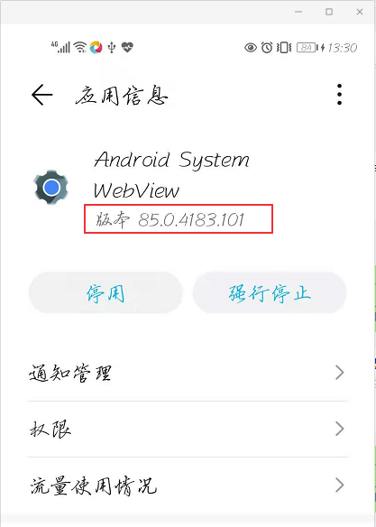
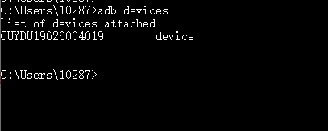
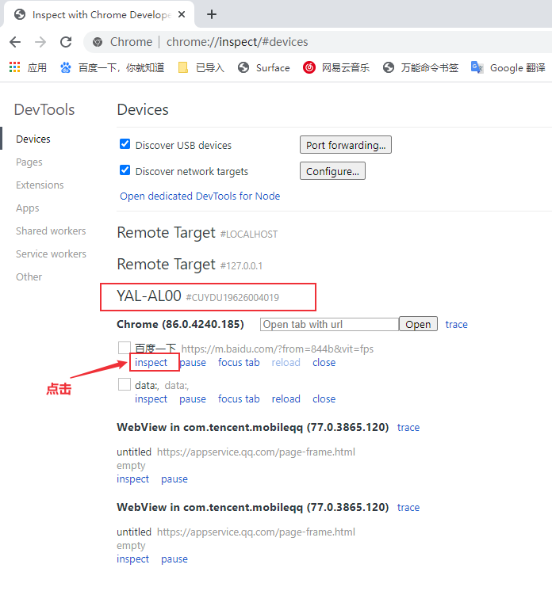
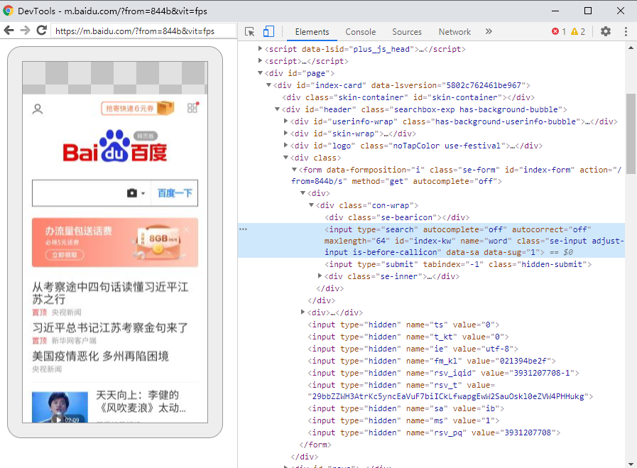
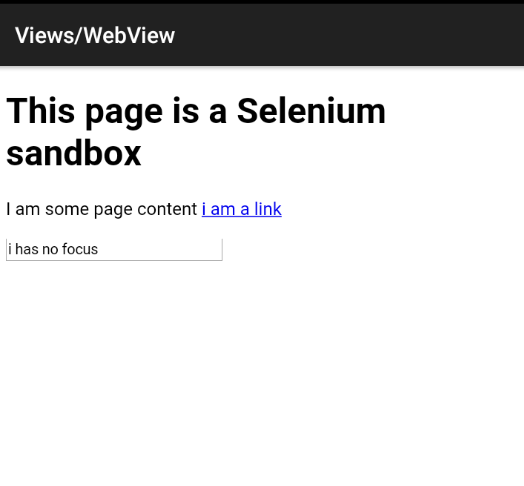

# Android WebView 测试
混合应用中包含 Web 视图的应用，在 **Appinum 介绍及环境安装** 中介绍了appium支持WebView测试，本文将分享Android 混合页面的测试方法。

<!--more-->

## WebView测试环境准备

### 手机端

- 被测浏览器：

  iOS：Safari

  Android：Chrome，Chromium，Browser (自带浏览器)


### PC端

- 安装 Chrome浏览器(或chromium)，可以访问[https://www.google.com](https://www.google.com/)
- 下载手机浏览器webview版本对应的 driver
  - webview和driver版本对应关系：https://raw.githubusercontent.com/appium/appium-chromedriver/master/config/mapping.json
  - driver下载：https://sites.google.com/a/chromium.org/chromedriver/downloads
  - 国内镜像地址 : https://npm.taobao.org/mirrors/chromedriver/
  - appium github: https://github.com/appium/appium/blob/master/docs/en/writing-running-appium/web/chromedriver.md

### 查看手机浏览器版本
```shell
adb shell pm list package | grep webview
adb shell pm dump com.android.browser | grep version
adb shell pm dump com.android.chrome | grep version
adb shell pm dump com.android.webview | grep version
```
查看手机browser和chrome版本

```shell
C:\Users\10287>adb shell pm list packages|findstr browser
package:com.android.browser

C:\Users\10287>adb shell pm dump com.android.browser | findstr version
      versionCode=22 targetSdk=22
      versionName=5.1.1-500200323

C:\Users\10287>adb shell pm dump com.android.chrome | findstr version
      versionCode=398713200 targetSdk=29
      versionName=80.0.3987.132
            enabled=true targetSdkVersion=29 versionCode=398713200

```

### 查看手机webview版本

在手机上设置中查看 Android System WebView应用版本


### 客户端代码

- desirecapability

- - “chromedriverExecutable" = "指定driver地址”
  - "browser" = "Browser" 或者“browser" = ”Chrome“

## WebView元素定位

1、连接手机/模拟器


手机打开google浏览器，并进入百度网页：https://m.baidu.com

2、Chrome浏览器输入地址： [chrome://inspect](chrome://inspect)

可以看到电脑连接的设备名以及打开的手机浏览器


点击inspect


这样就可以定位到浏览器元素。


## Android混合页面测试

文档：https://developers.google.com/web/tools/chrome-devtools/remote-debugging/webviews?hl=zh-cn

测试步骤：

1. 打开ApiDemos
2. 进入WebView页面
3. 点击"i am a link"
4. 退出应用


下载ApiDemos-debug.apk

- https://github.com/appium/appium/blob/master/sample-code/apps/ApiDemos-debug.apk

```python
from appium import webdriver
from appium.webdriver.common.mobileby import MobileBy

class TestBrowser():
    def setup(self):
        desired_caps = {
        'platformName': 'android',        
        'platformVersion': '10',
        'appPackage': 'io.appium.android.apis',
        'appActivity': 'io.appium.android.apis.ApiDemos',        
        'deviceName': 'CUYDU19626004019',
        'noReset': 'true',
        'chromedriverExecutable': 'D:/testing_tools/chromedriver85/chromedriver.exe'
        }
        self.driver = webdriver.Remote('http://127.0.0.1:4723/wd/hub', desired_caps)
        self.driver.implicitly_wait(5)
        
    def teardown(self):        
        self.driver.quit()
        
    def test_webview(self):
        self.driver.find_element_by_accessibility_id("Views").click()
        webview ="WebView"
        print(self.driver.contexts)
        self.driver.find_element_by_android_uiautomator('new UiScrollable(new UiSelector().'
                                                        'scrollable(true).instance(0)).'
                                                        f'scrollIntoView(new UiSelector().text("{webview}")'
                                                        '.instance(0));').click()

        print(self.driver.contexts)
        self.driver.switch_to.context(self.driver.contexts[1])
        print(self.driver.current_context)
        self.driver.find_element(MobileBy.ID, 'i am a link').click()
```


