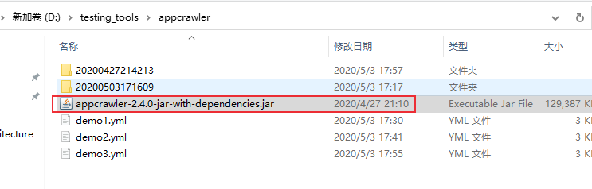
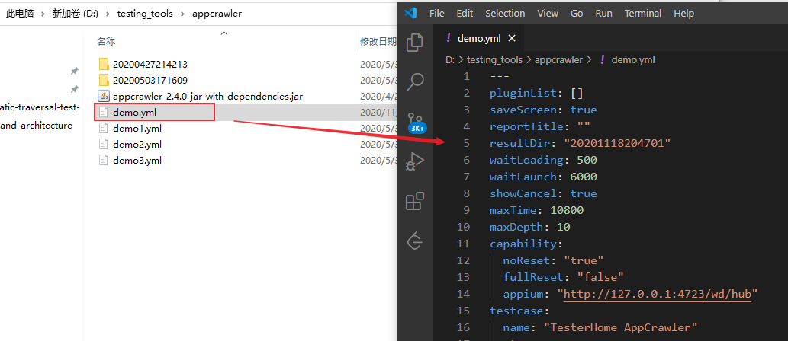
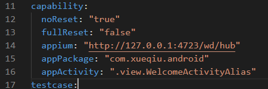
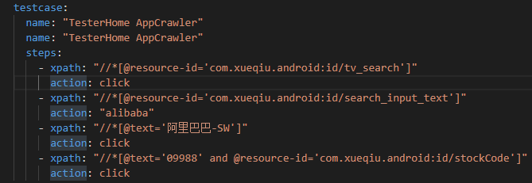
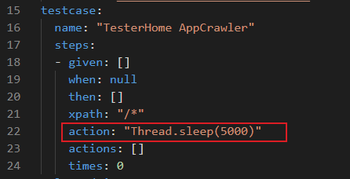
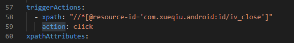
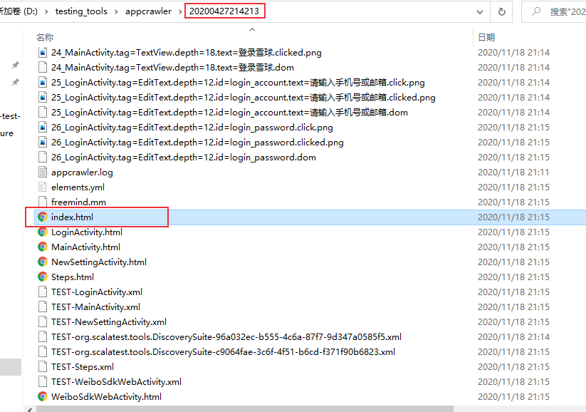
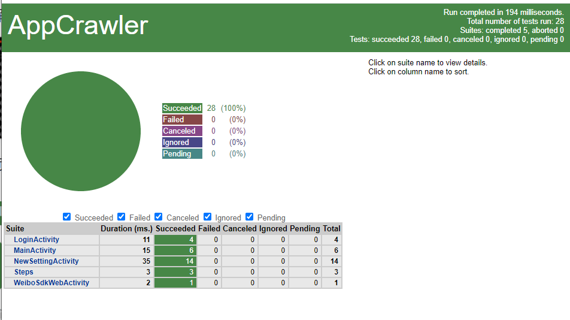

# AppCrawler自动遍历测试
AppCrawler 是由 seveniruby开源的一个自动遍历测试工具，谷歌有一个叫[App Crawler](https://developer.android.com/training/testing/crawler) 的遍历工具。AppCrawler具有很大的灵活性，可以自由控制测试页面，控件类型，测试深度等，且支持Android和IOS应用测试。
<!--more-->
AppCrawler开源地址：[https://github.com/seveniruby/AppCrawler](https://github.com/seveniruby/AppCrawler)

appcrawler基于appium开发，底层引擎还引用了 adb、 macaca、 selenium

## AppCrawler安装
AppCrawler工具以jar包方式发布，下载地址：https://pan.baidu.com/s/1dE0JDCH

appcrawler 2.4.0
- java8 
- appium 1.8.x


## AppCrawler运行
- 启动 appium server
- 启动模拟器或者连接真机
- 开始自动遍历
- appcrawler --capability
- "appPackage=com.xueqiu.android,appActivity=.view.WelcomeActivity Alias"

使用AppCrawler前需要启动appium server，然后启动模拟器或者连接真机。运行 `java -jar appcrawler.jar` 查看帮助。


```shell
D:\testing_tools\appcrawler>java -jar appcrawler-2.4.0-jar-with-dependencies.jar

----------------
AppCrawler 2.4.0 [霍格沃兹测试学院特别纪念版]
Appium 1.8.1 Java8 tested
app爬虫, 用于自动遍历测试. 支持Android和iOS, 支持真机和模拟器
项目地址: https://github.com/seveniruby/AppCrawler
移动测试技术交流: https://testerhome.com
联络作者: seveniruby@testerhome.com (思寒)
致谢: 晓光 泉龙 杨榕 恒温 mikezhou yaming116 沐木

--------------------------------


Usage: appcrawler [options]

  -a, --app <value>        Android或者iOS的文件地址, 可以是网络地址, 赋值给appium的app选项
  -e, --encoding <value>   set encoding, such as UTF-8 GBK
  -c, --conf <value>       配置文件地址
  -p, --platform <value>   平台类型android或者ios, 默认会根据app后缀名自动判断
  -t, --maxTime <value>    最大运行时间. 单位为秒. 超过此值会退出. 默认最长运行3个小时
  -u, --appium <value>     appium的url地址
  -o, --output <value>     遍历结果的保存目录. 里面会存放遍历生成的截图, 思维导图和日志
  --capability k1=v1,k2=v2...
                           appium capability选项, 这个参数会覆盖-c指定的配置模板参数, 用于在模板配置之上的参数微调
  -r, --report <value>     输出html和xml报告
  --template <value>       输出代码模板
  --master <value>         master的diff.yml文件地址
  --candidate <value>      candidate环境的diff.yml文件
  --diff                   执行diff对比
  -vv, --verbose           是否展示更多debug信息
  --demo                   生成demo配置文件学习使用方法
  --help
示例
appcrawler -a xueqiu.apk
appcrawler -a xueqiu.apk --capability noReset=true
appcrawler -c conf/xueqiu.json -p android -o result/
appcrawler -c xueqiu.json --capability udid=[你的udid] -a Snowball.app
appcrawler -c xueqiu.json -a Snowball.app -u 4730
appcrawler -c xueqiu.json -a Snowball.app -u http://127.0.0.1:4730/wd/hub

#生成demo例子
appcrawler --demo

#启动已经安装过的app
appcrawler --capability "appPackage=com.xueqiu.android,appActivity=.view.WelcomeActivityAlias"

#从已经结束的结果中重新生成报告
appcrawler --report result/

#新老版本对比
appcrawler --candidate result/ --master pre/ --report ./
```

### 生成样板配置示例

运行 `java -jar appcrawler.jar --demo` 会在当前目录下生成一个demo.yml文件。

通过编辑demo.yml文件实现app自动遍历的灵活定制。

```shell
D:\testing_tools\appcrawler>java -jar appcrawler-2.4.0-jar-with-dependencies.jar --demo
2020-11-18 20:47:04 INFO [AppCrawler$.86.main]
----------------
AppCrawler 2.4.0 [霍格沃兹测试学院特别纪念版]
Appium 1.8.1 Java8 tested
app爬虫, 用于自动遍历测试. 支持Android和iOS, 支持真机和模拟器
项目地址: https://github.com/seveniruby/AppCrawler
移动测试技术交流: https://testerhome.com
联络作者: seveniruby@testerhome.com (思寒)
致谢: 晓光 泉龙 杨榕 恒温 mikezhou yaming116 沐木

--------------------------------


2020-11-18 20:47:05 INFO [AppCrawler$.223.parseParams] use default appium address 4723
2020-11-18 20:47:05 INFO [AppCrawler$.230.parseParams] appium address = Some(http://127.0.0.1:4723/wd/hub)
2020-11-18 20:47:05 INFO [AppCrawler$.242.parseParams] result directory = 20201118204701
2020-11-18 20:47:07 INFO [AppCrawler$.286.parseParams] you can read D:\testing_tools\appcrawler\demo.yml for demo
```


## 执行参数与配置文件
- capability设置：与 appium完全一致
    ```shell
    appPackage: "com. xueqiu.android"
    appActivity: ".view.WelcomeActivityAlias"
    app:
    appium: "http: //127.0.0.1:4723/wd/hub"
    noReset: true
    automationName: uiautomator2
    dontStopAppOnReset: true
    ```
    - testcase：用于启动app后的基础测试用例
- selectedList：设定遍历范围
- triggerActions：特定条件触发执行动作
- 执行参数比配置文件优先级别高
    ```shell
    java -jar <appcrawler.jar路径> -c example.yml --capability appPackage=com.xueqiu.android,appActivity=.view.WelcomeActivityAlias -o /tmp/xueqiu/
    ```
### testcase

testcase的完整形态
- given：所有的先决条件
- when：先决条件成立后的行为
- then：断言集合

testcase的简写形态
- xpath：对应when里的 xpath
- action：对应when的 action


### action
  - back 后退
  - backApp 回退到当前的app默认等价于back行为 可定制
  - monkey 随机事件
  - xxx()执行代码
    - Thread.sleep(3000)
    - driver.swipe(0.9, 0.5,0.1,0.5)
  - click
  - longTap 


### 自动遍历定制

  - selectedList：需要被遍历的元素范围
  - firstList：优先被点击
  - lastList：最后被点击
  - tagLimitMax：同祖先(同类型)的元素最多点击多少次
  - backButton：当所有元素都被点击后默认后退控件定位
  - blackList：黑名单
  - maxDepth：遍历的最大深度

### 触发器

triggerActions:

  - 动作触发特定次数

  - 通常用于处理弹框：关闭弹框

      - xpath：指定具体按钮
    - action：动作
    - times：规则的使用次数


## 自动遍历测试过程

1. 信息的获取:

      - 把当前app的界面dump为xml结构

2. 获取待遍历元素
	- 遍历范围 selectedList
    - 过滤黑名单 小控件 不可见控件 blackList
    - 重排控件顺序 firstList lastList
    - 跳过已点击+跳过限制点击的控件tagLimit
    - 根据匹配的规则执行 action

3. 循环上面的步骤

## 网页报告
```shell
java -jar appcrawler-2.4.0-jar-with-dependencies.jar -c demo1.yml
```
自动遍历执行完成后，当前目录会生成测试报告index.html
打开index.html文件
