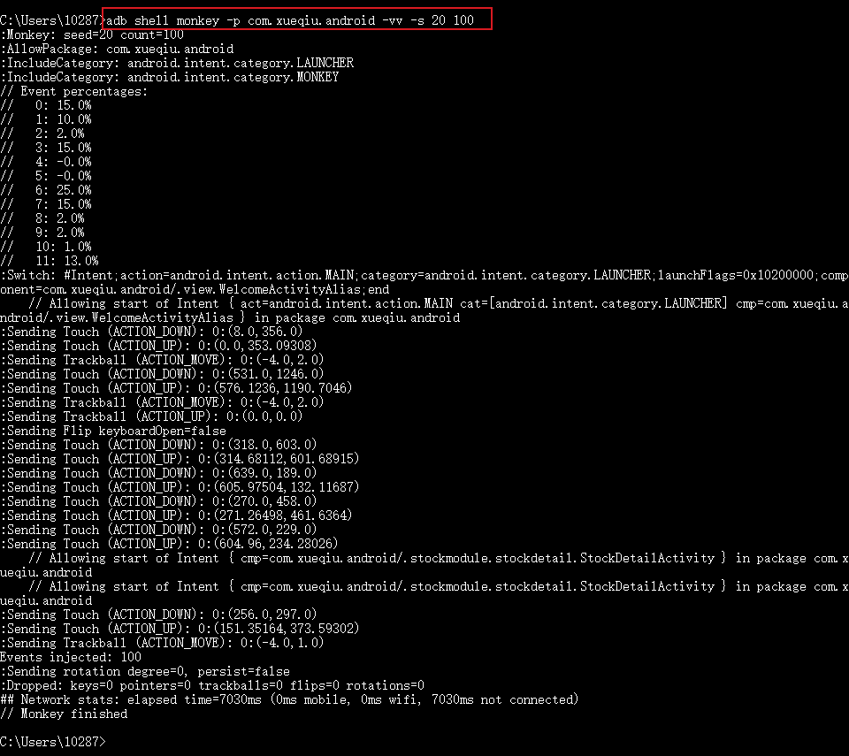
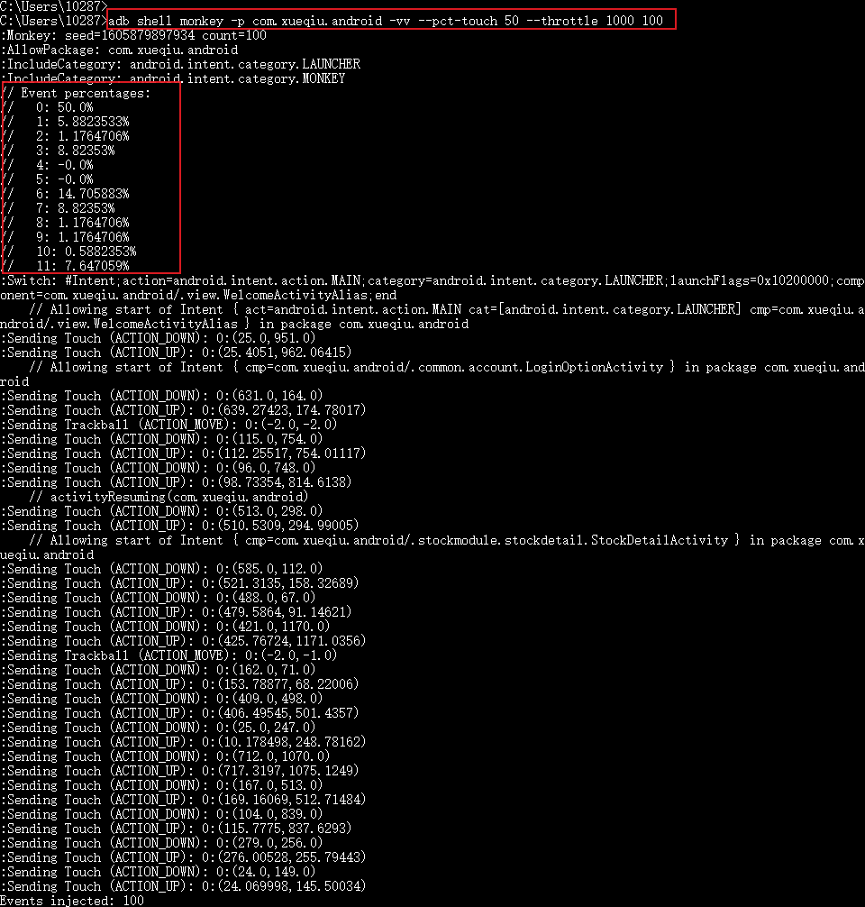

# 自动遍历测试之Monkey工具
某些移动APP业务线多，流程复杂，且产品迭代速度快，在回归测试中涉及到大量用例，工作量大，解决这个问题的一个可行方法是使用自动遍历测试，可以降低用例维护成本，尽可能的自动化覆盖回归业务。
<!--more-->

## 自动遍历工具

- google android原生monkey、 app crawler
- 百度 smartmonkey
- 腾讯 newmonkey
- smart_monkey
- macaca的NoSmoke
- 头条的 zhangzhao maxim
- seveniruby appcrawler

下面介绍android原生monkey工具

## Android monkey

### 简介

monkey是开发用来进行压力测试的工具，测试activity的性能。monkey向应用程序发送**伪随机的用户事件流**（如按键、触屏、滑动等操作），对应用程序进行随机操作，它的这种特性可以用来做自动遍历测试。

Android SDK提供了Monkey工具，使用`adb shell monkey`运行

### 常用Monkey命令
**对所有包随机操作100次**

```shell
adb shell monkey 100
```
**对指定包随机操作100次**

```shell
adb shell monkey -p com.xueqiu.android 100
```
**时间种子**，如果想重现一样的测试路径，两次测试的-s参数应相同

```shell
adb shell monkey -p com.xueqiu.android -s 20 100
```
**打印详细日志**

```shell
adb shell monkey -p com.xueqiu.android -vv -s 20 100
```
可以看到对雪球app的操作日志，其中

- 0：触摸事件百分比，参数--pct-touch
- 1：滑动事件百分比，参数--pct-motion
- 2：缩放事件百分比，参数--pct-pinchzoom
- 3：轨迹球事件百分比，参数--pct-trackball
- 4：屏幕旋转事件百分比，参数--pct-rotation
- 5：基本导航事件百分比，参数--pct-nav
- 6：主要导航事件百分比，参数--pct-majornav
- 7：系统事件百分比，参数--pct-syskeys
- 8：Activity启动事件百分比，参数--pct-appswitch
- 9：键盘翻转事件百分比，参数--pct-flip
- 10：其他事件百分比，参数--pct-anyevent

**事件百分比**

```shell
adb shell monkey -p com.xueqiu.android --pct-touch 10 1000
```
其他事件类似

**时间延迟**

```shell
adb shell monkey -p com.xueqiu.android --throttle 5000 100
```
每次随机事件的时间间隔5000毫秒

### 常用事件

- --pct-touch：触摸事件，比如点击
- --pct-motion：动作事件，比如滑动(直线)
- --pct-trackball：轨迹事件，比如移动+点击,曲线滑动
- --pct-majornav：主要导航事件，比如回退按键、菜单按键:

## monkey 使用实例

1. 启动模拟器或者连接真机
2. 自动遍历雪球APP

随机操作100次，触摸事件百分比50%，每次随机事件的时间间隔1s

```shell
adb shell monkey -p com.xueqiu.android -vv --pct-touch 50 --throttle 1000 100
```




