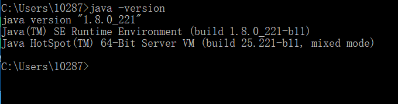

# Appium 介绍及环境安装
Appium是一个可用于测试iOS、 Android操作系统和Windows桌面平台原生应用，移动网页应用和混合应用的自动化测试框架。

<!--more-->

- **原生应用**（Native App）：用 android、iOS或者Windows SDK编写的应用

- **移动网页应用**（Web App）：通过手机浏览器访问的网页应用，比如iOS中 safari应用，Android上的Chrome应用或者内置浏览器应用，不会占用手机的存储空间。

- **混合应用**（Hybrid App）：同时具备Native App和Web App的特性，一种 webview应用，将Javascript，HTML和CSS执行在embedded webview中，外层用Native App wrapper包起來。


Appium 跨语言支持：Java、 Python、 Ruby、JavaScript (Node.js)、PHP、C# (.NET)、RobotFramework等，Appium是跨平台的，可以用在OSX，Windows以及Linux桌面系统上运行。

## Appium架构

### WebDriver
Selenium Webdriver API实现脚本语言与浏览器之间的通信，是一个远程控制接口，可参考[Selenium Webdriver 架构](https://blog.csdn.net/u010698107/article/details/114681384)。 Webdriver定义的JSON Wire Protocol（JSON有线协议）实现selenium客户端与remote server（浏览器驱动的HTTP服务器）的交互，remote server将命令发送给浏览器，实现浏览器的native调用。

WebDriver协议可参考官方文档：[https://w3c.github.io/webdriver/](https://w3c.github.io/webdriver/)

Appium WebDriver对Selenium Webdriver协议进行了扩展（[Mobile JSON Wire Protocol](https://github.com/SeleniumHQ/mobile-spec/blob/master/spec-draft.md)），Appium 客户端通过Webdriver协议与Appium Server进行交互。

### Appium引擎列表
为了不重新编译或修改应用，Appium 使用系统自带的自动化框架：
**Android 4.3+**

* UIAutomator
* UIAutomator2[推荐]

**iOS**
* UIAutomation (iOS ≤ 9.3) 
* XCUITest[推荐] (iOS ≥ 9.3) 

**Windows: **
* WinAppDriver


### Appium的设计理念
#### Client/Server设计模式
Appium采用 C/S架构，Appium与客户端建立连接并监听命令，然后在移动设备上执行这些命令，命令执行结果通过 HTTP 响应的方式返回。客户端通过 WebDriver json wire协议与服务端通讯。由于Appium的这种特性，我们可以将Appium server放在与测试机不同的机器上。Appium Server是使用 Node.js 编写的HTTP服务。


#### session 会话
Appium自动化执行时会首先拉起一个session会话，客户端和服务器之间初始化一个session，通过发送一个`POST /session`建立连接，客户端的post请求中携带一个称为 'desired capabilities‘ 的JSON对象，定义设备平台（iOS或Android）、版本、server地址等请求字段，后面的文章将详细介绍。服务器接收到请求后会建立一个session并回应一个session ID，建立好连接后就可以发送命令了。

#### Appium Clients
Appium支持多语言，包括Java, Ruby, Python, PHP, JavaScript, 和 C#，这些客户端库支持WebDriver 协议扩展。

| 语言/框架            | Github仓库地址                                               |
| :------------------- | :----------------------------------------------------------- |
| Ruby                 | https://github.com/appium/ruby_lib, https://github.com/appium/ruby_lib_core |
| Python               | https://github.com/appium/python-client                      |
| Java                 | https://github.com/appium/java-client                        |
| JavaScript (Node.js) | https://github.com/admc/wd                                   |
| JavaScript (Node.js) | https://github.com/webdriverio/webdriverio                   |
| JavaScript (Browser) | https://github.com/projectxyzio/web2driver                   |
| Objective C          | https://github.com/appium/selenium-objective-c               |
| PHP                  | https://github.com/appium/php-client                         |
| C# (.NET)            | https://github.com/appium/appium-dotnet-driver               |
| RobotFramework       | https://github.com/serhatbolsu/robotframework-appiumlibrary  |

### Appium工作原理
1. 首先开启Appium server，它会默认监听4723端口
2. appium客户端（测试脚本）基于Json wire protocol发送设备信息给Appium server，请求创建session。其中设备信息放在desired capabilities中，包括系统平台，版本，应用等信息（详细介绍参考[App控件定位](https://blog.csdn.net/u010698107/article/details/111431111)）。session用于保存设备配置信息。
3. Appium server创建session id并返回给client：appium server调用AndroidDriver为client生成一个session并且生成一个与此session相关联的session id，作为client与server之间通信的唯一标识。
4. 开启bootstrap socket服务器：Appium在初始化时将中间件Bootstrap.jar推送到设备，bootstrap是uiautomator的测试脚本，继承于UiautomatorTestCase。手机端通过该脚本监听端口4724，appium server作为socket-client端通过4724端口将请求发送给socket服务器（bootstrap.jar），然后bootstrap将appium命令转换成uiautomator命令。

连接建立完成后，Appium client基于Json wire protocol通过4723端口将指令发送给Appium server，Appium server（socket-client）通过4724端口转发给中间件bootstrap.jar（socket-server），bootstrap.jar将请求转换成UiAutomator可以识别的命令，发给UiAutomator对设备进行操作。执行完操作后将执行的结果返回给Appium server，Appium server返回给Appium客户端，客户端对结果做校验。


## Appium生态工具

- **adb**：android的控制工具，用于获取 android的各种数据和控制

- **Appium Desktop**：内嵌了 appium server和inspector的综合工具

- **Appium Server**：appium的核心工具，命令行工具

- **Appium client**：各种语言的客户端封装库，用于连接 appium server

- **AppCrawler**：自动遍历工具

appium使用 appium-xcuitest-driver来测试iPhone设备,其中需要安装 facebook开发的WDA(webdriver agent)来驱动iOS测试，下面介绍Android APP测试环境安装。

## Appium环境安装

* Java1.8版本
* Android sdk
* Node.js(>=10 版本)，npm(>=6 版本)
* Python3
* Appium-desktop
* Appium python client

### 1、安装Node.js
* Node.js 是一个基于 Chrome V8 引擎的 JavaScript 运行环境
* Node.js 使用了一个事件驱动、非阻塞式 I/O 的模型，使其轻量又高效。
* 是运行在服务端的 JavaScript

[https://nodejs.org/en/download/](
https://nodejs.org/en/download/)

命令行窗口中运行`node -v` 查看是否安装成功


### 2、安装jdk
jdk下载下载地址：
[https://www.oracle.com/technetwork/java/javase/downloads/jdk8-downloads-2133151.html](https://www.oracle.com/technetwork/java/javase/downloads/jdk8-downloads-2133151.html)

按照默认路径安装
**配置环境变量**
“我的电脑”右键菜单--->属性--->高级--->环境变量--->系统变量-->新建
* 变量名：JAVA_HOME 
变量值：C:\Program Files (x86)\Java\jdk1.8.0_144 
* 变量名：CALSS_PATH
变量值：.;%JAVA_HOME%\lib\dt.jar;%JAVA_HOME%\lib\tools.jar; 

找到path变量名—>“编辑”添加：
* 变量名：PATH
变量值：%JAVA_HOME%\bin;%JAVA_HOME%\jre\bin;

查看是否安装成功：java -version

### 3. 安装Android SDK
Android SDK是Google提供的Android开发工具包，在开发Android应用的时候会用到，需要通过引入工具包来调用Android的API

下载地址：[https://developer.android.com/](https://developer.android.com/)
中文社区的SDK下载地址：[
http://tools.android-studio.org/index.php/sdk](http://tools.android-studio.org/index.php/sdk)

双击打开SDK Manage.exe，安装API版本和对应的工具包，这些在运行模拟器和真机测试的时候会使用到。

**配置环境变量**
新建环境变量ANDROID_HOME，变量值为sdk的路径：E:\Android\android-sdk 

“我的电脑”右键菜单--->属性--->高级--->环境变量--->系统变量-->新建
* 变量名：ANDROID_HOME 
变量值：D:\android\android-sdk-windows 

找到环境变量path—>“编辑”添加：
* 变量名：PATH
    * 变量值：;% ANDROID_HOME%\platform-tools;
    * 变量值：% ANDROID_HOME%\build-tools;
    * 变量值：% ANDROID_HOME%\tools;  

tools目录下运行android命令，platform-tools目录运行adb命令

检验Android SDK是否安装成功：adb version

### 4. 安装Appium
下载地址：[https://bitbucket.org/appium/appium.app/downloads/?tab=downloads](
https://bitbucket.org/appium/appium.app/downloads/?tab=downloads)

* 安装完成后添加到环境变量
* 把安装的appium文件夹的Appium\node_modules\.bin加到系统环境变量path中

运行appium-doctor，检测appium运行环境的工具

### 5. 安装appium-desktop
下载地址：[https://github.com/appium/appium-desktop/releases/tag/v1.15.1](https://github.com/appium/appium-desktop/releases/tag/v1.15.1)


### 6. 下载Appium-Python-Client
下载链接：[https://pypi.org/project/Appium-Python-Client/](
https://pypi.org/project/Appium-Python-Client/)
运行`python setup.py install`安装

或者运行 `pip install Appium-Python-Client` 安装。

## appium测试
下面来测试一下是否能够进行 Android APP自动化测试

测试APP使用appium提供的测试APP: [android-apidemos](https://github.com/appium/android-apidemos/releases/tag/v3.1.0)，它是从Google的Android ApiDemos fork过来的。

下载成功后安装到测试机：`adb install ApiDemos-debug.apk`

### 1. 启动appium

IP和端口号默认就行（如果你的appium server不在本地，IP地址需要填写appium所在的主机IP地址），点击Start Server：


可以看到appium server已经启动，这个窗口会显示appium server运行日志。

windows中使用手动方式打开appium比较麻烦，可以使用bat脚本来启动appium：

```sh
@echo off REM 回显到控制台上

start cmd /k """taskkill /f /im adb.exe&adb start-server&node "C:\\Program Files\\Appium\\resources\\app\\node_modules\\appium\\build\\lib\\main.js" --address 127.0.0.1 --port 4723 --session-override --log-level debug --log d:/appium-server.log"""
```

main.js位于Appium安装路径下  
- `--address`：appium server地址
- `--port`：端口号
- `--log-level`：日志级别，可设置4种—debug`, ` info`, ` warn`, ` error
- `--log`：保存日志
- 更多appium server参数设置可参考：[https://appium.io/docs/en/writing-running-appium/server-args/](https://appium.io/docs/en/writing-running-appium/server-args/)


注意命令之间用 `&` 隔开。

> `&` 、`&&` 和 `||`区别
>
> -  cmd1 & cmd2 & cmd3：无论前面的命令是否执行成功，后面的命令都会执行
> - cmd1 && cmd2 && cmd3：如果前面的命令执行失败，退出，后面的命令不会执行。
> - cmd1 || cmd2 || cmd3：前面的命令执行成功就退出，不会执行后面的命令。


### 2. 手机USB连接电脑
`adb devices`命令查看手机是否连接成功

```sh
$ adb devices
List of devices attached
SNHVB20C18002195        device
```

### 3. 编写测试脚本

```python
from appium import webdriver

class TestApidemos:
    def setup(self):
        desired_caps = {
            'platformName': 'Android',
            'platformVersion': '10',
            'deviceName': 'SNHVB20C18002195',
            'appPackage': 'io.appium.android.apis',
            'appActivity': '.ApiDemos',
            'automationName': 'Uiautomator2',
            'newCommandTimeout': 3000
        }
        self.driver = webdriver.Remote('http://127.0.0.1:4723/wd/hub', desired_caps)
        self.driver.implicitly_wait(5)

    def teardown_method(self):
        self.driver.quit()

    def test_appium(self):
        elem = self.driver.find_element_by_xpath('//*[@text="App"]')
        elem.click()
        Alarm_exist = self.driver.find_element_by_xpath('//*[@text="Alarm"]').is_displayed()
        assert Alarm_exist == True
```

使用pytest命令执行测试脚本：

```sh
$ pytest test_apidemos.py::TestApidemos::test_appium
```

## 参考文档

1. WebDriver协议：[https://w3c.github.io/webdriver/](https://w3c.github.io/webdriver/)

2. Mobile JSON Wire Protocol：[https://github.com/SeleniumHQ/mobile-spec/blob/master/spec-draft.md](https://github.com/SeleniumHQ/mobile-spec/blob/master/spec-draft.md)


