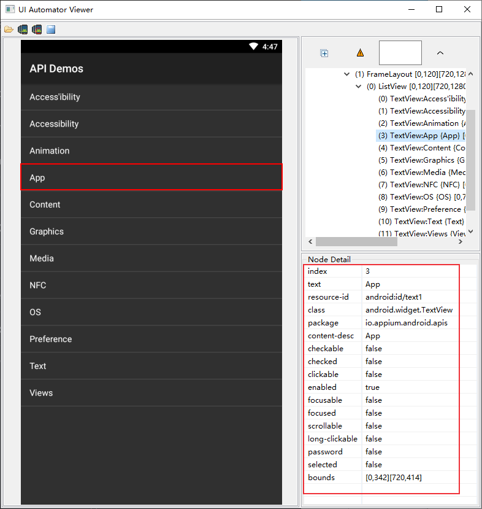

# Appium控件交互
与Web元素操作一样，定位到APP控件元素后，可以对控件进行一系列的操作，实现与APP就交互，比如点击、文本输入、元素属性获取等。

<!--more-->

## 元素操作

### 元素常用操作方法

* 点击方法 element.click()
* 输入操作 element.send_keys("appium")
* 设置元素的值 element.set_value("appium")
* 清除操作 element.clear()

### Python测试实例

安装ApiDemos-debug.apk，下载地址：https://github.com/appium/appium/blob/master/sample-code/apps/ApiDemos-debug.apk

1. 点击Views
2. 滑动选择并点击TextFields
3. 输入文本“appium”
4. 清除文本

```python
#!/usr/bin/python3
#-*-coding:utf-8-*-
import pytest
from appium import webdriver
from appium.webdriver.common.mobileby import MobileBy

class TestLocator:
    def setup(self):
        desired_caps = {}
        desired_caps['platformName'] = 'Android'
        desired_caps['platformVersion'] = '6.0.1'
        desired_caps['deviceName'] = '127.0.0.1:7555'
        desired_caps['appPackage'] = 'io.appium.android.apis'
        desired_caps['appActivity'] = '.ApiDemos'
        desired_caps['automationName'] = 'Uiautomator2'
        desired_caps['newCommandTimeout'] = 3000
        desired_caps['noReset'] = True
        desired_caps['dontStopAppOnReset'] = True
        desired_caps['skipDeviceInitialization'] = True
        desired_caps['unicodeKeyboard'] = True
        desired_caps['resetKeybBoard'] = True
        self.driver = webdriver.Remote('http://127.0.0.1:4723/wd/hub', desired_caps)
        self.driver.implicitly_wait(5)

    def teardown_method(self):
        self.driver.quit()

    def test_locator(self):
        self.driver.find_element_by_xpath('//*[@text="Views"]').click()
        self.driver.find_element_by_android_uiautomator(
            'new UiScrollable(new UiSelector().scrollable(true).instance(0)).scrollIntoView(new UiSelector().text("TextFields").instance(0));').click()
        elem = self.driver.find_element(MobileBy.ID, "io.appium.android.apis:id/edit")
        elem.send_keys("appium")
        elem.clear()

```

## 元素属性

* 获取属性值：get_attribute(name)
* 获取元素文本：element.text
* 获取元素坐标：element.location
* 获取元素尺寸(高和宽): element.size
* 是否可见 element.is_displayed 返回True/False
* 是否可用 element.is_enabled 返回True/False
* 是否被选中 element.is_selected 返回True/False

### get_attribute()方法

get_attribute()方法能获取的属性，元素的属性几乎都能获取到。属性名称和uiautomatorviewer里面的一致。

字符串类型：
- text：返回 text
- resource-id：返回 resource-id， API=>18
- class：返回 class， API=>18
- content-desc：返回 content-desc属性
- bounds

布尔类型：
- checkable
- checked
- clickable
- enabled
- focusable
- focused
- scrollable
- long-clickable
- password
- selected
- displayed

注意：有些属性展示在 uiautomatorviewer里，但是不能通过get_attribute获取，比如: index。
### 属性获取实例
获取“App”的属性值



```python
from appium import webdriver
from appium.webdriver.common.mobileby import MobileBy

class TestGetAttribute:
    def setup(self):
        desired_caps = {}
        desired_caps['platformName'] = 'Android'
        desired_caps['platformVersion'] = '6.0.1'
        desired_caps['deviceName'] = '127.0.0.1:7555'
        desired_caps['appPackage'] = 'io.appium.android.apis'
        desired_caps['appActivity'] = '.ApiDemos'
        desired_caps['automationName'] = 'Uiautomator2'
        desired_caps['newCommandTimeout'] = 3000
        desired_caps['noReset'] = True
        desired_caps['dontStopAppOnReset'] = True
        desired_caps['skipDeviceInitialization'] = True
        desired_caps['unicodeKeyboard'] = True
        desired_caps['resetKeybBoard'] = True
        self.driver = webdriver.Remote('http://127.0.0.1:4723/wd/hub', desired_caps)
        self.driver.implicitly_wait(5)

    def teardown_method(self):        
        self.driver.quit()
    
    def test_get_attribute(self):
        elem = self.driver.find_element_by_xpath('//*[@text="App"]')
        print("text:" + elem.get_attribute("text"))
        print("resource-id:" + elem.get_attribute("resource-id"))
        print("class:" + elem.get_attribute("class"))
        print("package:" + elem.get_attribute("package"))
        print("content-desc:" + elem.get_attribute("content-desc"))
        print("bounds:" + elem.get_attribute("bounds"))
        print("checkable:" + elem.get_attribute("checkable"))
        print("checked:" + elem.get_attribute("checked"))
        print("clickable:" + elem.get_attribute("clickable"))
        print("enabled:" + elem.get_attribute("enabled"))
        print("password:" + elem.get_attribute("password"))
        print("displayed:" + elem.get_attribute("displayed"))
        print("######################")
        print("text:" + elem.text)
        print(elem.location)
        print(elem.size)
        print(elem.is_displayed)
        print(elem.is_enabled)
        print(elem.is_selected)
```
执行结果：
```bash
text:App
resource-id:android:id/text1
class:android.widget.TextView
package:io.appium.android.apis
content-desc:App
bounds:[0,342][720,414]
checkable:false
checked:false
clickable:true
enabled:true
password:false
displayed:true
######################
text:App
{'x': 0, 'y': 342}
{'height': 72, 'width': 720}
<bound method WebElement.is_displayed of <appium.webdriver.webelement.WebElement (session="cceeee8f-ad89-4d00-ab4f-25b57de58ea5", element="a1443341-aad8-4814-8f9b-27ada3fe6f50")>>
<bound method WebElement.is_enabled of <appium.webdriver.webelement.WebElement (session="cceeee8f-ad89-4d00-ab4f-25b57de58ea5", element="a1443341-aad8-4814-8f9b-27ada3fe6f50")>>
<bound method WebElement.is_selected of <appium.webdriver.webelement.WebElement (session="cceeee8f-ad89-4d00-ab4f-25b57de58ea5", element="a1443341-aad8-4814-8f9b-27ada3fe6f50")>>
```

