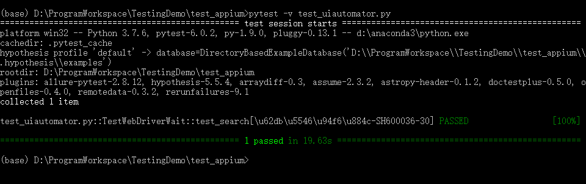

# Appium元素定位（二）：uiautomator定位
<!--more-->
UiAutomator是android的工作引擎，所以定位速度快。缺点是语法表达式复杂，容易写错。

可参考官方文档：[https://developer.android.com/reference/android/support/test/uiautomator/UiSelector](https://developer.android.com/reference/android/support/test/uiautomator/UiSelector)

下面将介绍UiSelector类一些常用接口使用方法。

## uiautomator定位方式
### 通过 resource-id定位
* `new UiSelector().resourceld("id")`
### 通过 classname定位
* `new UiSelector().className("className")`
### 通过 content-desc定位
* `new UiSelector().description("contenet-desc属性")`
### 通过文本定位
* text文本定位
    * `new UiSelector().text("text文本")`
* textContains 模糊匹配
    * `new UiSelector().textContains("包含text文本")`
* textStartsWith，以某个文本开头来匹配
    * `new UiSelector().textStartsWith("以text文本开头")`
* 正则表达式 textMatches 匹配
    * `new UiSelector().textMatches("正则表达式")`
### 组合定位
* id与text属性组合	
	```python
    id_text = 'resourceld("com.baidu.yuedu:id/webbooktitle").text("textname")'
    driver.find_element_by_android_uiautomator(id_text).click()
  ```
* class与text属性组合
	```python
    class_text='className("android.widget.TextView").text("textname")'
    driver.find_element_by_android_uiautomator(class_text).click()
  ```

### 父子元素、兄弟元素定位
#### 父子关系定位 childSelector
通过父元素找儿子元素
```python
son = 'resourceld("com.baidu.yuedu:id/rl_tabs").childSelector(text("股票"))'
```
#### 兄弟定位 fromParent
通过相邻的兄弟元素定位，通过兄弟元素，找到同一父级元素下的子元素
```python
brother = 'resourceld("com.baidu.yuedu:id/lefttitle").fromParent(text("用户"))'
```

### 滚动查找元素
```python
'new UiScrollable(new UiSelector().scrollable(true).instance(0)).scrollIntoView(newUiSelector().text("查找的文本").instance(0));'
```
## uiautomator定位实例
跟 App自动化测试 | Appium元素定位（一）的测试过程一样，判断股票价格
测试过程：
1. 打开雪球app
2. 点击搜索框
3. 输入"招商银行"
4. 选择
5. 获取股价，并判断

```python
import pytest
from appium import webdriver

class TestUiautomator:
    def setup(self):
        desired_caps = {}
        desired_caps['platformName'] = 'Android'
        desired_caps['platformVersion'] = '6.0.1'
        desired_caps['deviceName'] = '127.0.0.1:7555'
        desired_caps['appPackage'] = 'com.xueqiu.android'
        desired_caps['automationName'] = 'Uiautomator2'
        desired_caps['appActivity'] = 'com.xueqiu.android.common.MainActivity'
        desired_caps['newCommandTimeout'] = 3000
        desired_caps['noReset'] = True
        desired_caps['dontStopAppOnReset'] = True
        desired_caps['skipDeviceInitialization'] = True
        desired_caps['unicodeKeyboard'] = True
        desired_caps['resetKeybBoard'] = True
        self.driver = webdriver.Remote('http://127.0.0.1:4723/wd/hub', desired_caps)
        self.driver.implicitly_wait(15)

    def teardown_method(self):
        self.driver.quit()

    def test_search(self, searchkey, type, price):
        self.driver.find_element_by_android_uiautomator(
            'new UiSelector().resourceId("com.xueqiu.android:id/tv_search")').click()
        self.driver.find_element_by_android_uiautomator(
            'new UiSelector().resourceId("com.xueqiu.android:id/search_input_text")').send_keys("招商银行")
        self.driver.find_element_by_android_uiautomator('new UiSelector().text("SH600036")').click()
        self.driver.find_element_by_android_uiautomator('new UiSelector().text("SH600036")').click()
        current_price = self.driver.find_element_by_android_uiautomator(
            'new UiSelector().resourceId("com.xueqiu.android:id/stock_current_price")').text
        print(current_price)
        assert float(current_price) > 40
```
执行结果：



