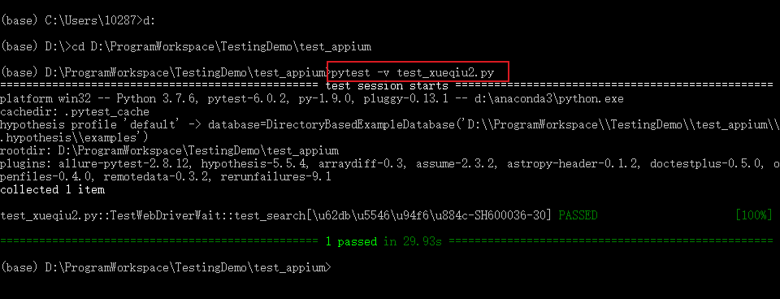

# Appium元素定位（一）
<!--more-->

## ID定位
使用resource-id属性定位，iOS中使用name属性。


```python
elem = driver.find_element_by_id("com.xueqiu.android:id/enter_stock_fund")
elem = driver.find_element(MobileBy.ID,"com.xueqiu.android:id/enter_stock_fund")
```
# Accessibility ID定位
在写Android和iOS自动化测试用例时，可以使用这种定位方法，使代码可重用， 实现跨平台自动化测试。iOS的Accessibility ID为UI元素的名称， Android的Accessibility ID为“ content-desc”属性值。


```python
elem = driver.find_element_by_accessibility_id("Accessibility")
elem = driver.find_element(MobileBy.ACCESSIBILITY_ID,"Accessibility")
```
## Class name定位
使用控件的class属性
```python
elem = driver.find_element_by_class_name("classname")
elem = driver.find_element(MobileBy.CLASS_NAME,"classname")
```
## Xpath定位
APP Xpath定位与Web元素Xpath定位一样，Xpath定位语法可参考文章 [Web自动化测试 | xpath & CSS Selector定位](https://hiyong.gitee.io/posts/selenium-xpath-and-CSS-Selector-locator/)，可以通过父结点定位子结点、子结点定位父结点、子结点定位兄弟结点、 爷爷结点定位孙子结点。Xpath定位语法参考：[https://www.w3school.com.cn/xpath/xpath_syntax.asp](https://www.w3school.com.cn/xpath/xpath_syntax.asp)

| 表达式   | 描述                                                       |
| :------- | :--------------------------------------------------------- |
| nodename | 选取此节点的所有子节点。                                   |
| /        | 从根节点选取。                                             |
| //       | 从匹配选择的当前节点选择文档中的节点，而不考虑它们的位置。 |
| .        | 选取当前节点。                                             |
| ..       | 选取当前节点的父节点。                                     |
| @        | 选取属性。                                                 |

点击雪球APP “行情”


```python
elem = driver.find_element_by_xpath('//*[@text="行情"]').click()
elem.click()
```

# Toast定位
## toast介绍
* Toast是手机应用消息提示框，为当前视图显示一个浮动弹出框
* Toast类的思想：尽可能不引人注意，同时还向用户显示信息，希望他们看到
* Toast显示的时间有限, Toast会根据用户设置的显示时间后自动消失。
* Toast本身是个系统级别的控件，它归属于系统 settings，当一个app发送消息的时候，不是自己造出来的这个弹框，它是发给系统，由系统统一进行弹框，这类的控件不在app内，需要特殊的控件识别方法。
* Appium使用 uiautomator底层的机制来分析抓取 Toast，并且把 Toast放到控件树里面，但本身并不属于控件。
* 必须使用 xpath查找
	* //*[@class='android.widget.Toast']
	* //*[contains(@text, "xxxxx")]
## toast定位

测试步骤：

1. 打开ApiDemos
2. 进入Popup Menu页面
3. 点击"search"
4. 打印弹出toast内容


```python
from appium import webdriver
from appium.webdriver.common.mobileby import MobileBy

class TestToast():
    # API Demos
    def setup(self):
        desired_caps = {
            'platformName': 'android',
            'platformVersion': '6.0.1',
            'deviceName': '127.0.0.1:7555',
            'appPackage': 'io.appium.android.apis',
            'appActivity': 'io.appium.android.apis.view.PopupMenu1',
            'automationName': 'Uiautomator2'
        }

        self.driver = webdriver.Remote('http://127.0.0.1:4723/wd/hub', desired_caps)
        self.driver.implicitly_wait(5)

    def teardown(self):
        self.driver.quit()

    def test_toast(self):
        self.driver.find_element_by_class_name("android.widget.Button").click()
        self.driver.find_element_by_xpath("//*[@text='Search']").click()
        # print(self.driver.page_source)
        print(self.driver.find_element(MobileBy.XPATH, "//*[contains(@text,'Clicked popup')]").text)
```

结果：

```shell
Launching pytest with arguments test_toast.py::TestToast::test_toast in D:\ProgramWorkspace\TestingDemo\test_appium

============================= test session starts =============================
platform win32 -- Python 3.7.6, pytest-6.0.2, py-1.9.0, pluggy-0.13.1 -- D:\Anaconda3\python.exe
cachedir: .pytest_cache
hypothesis profile 'default' -> database=DirectoryBasedExampleDatabase('D:\\ProgramWorkspace\\TestingDemo\\test_appium\\.hypothesis\\examples')
rootdir: D:\ProgramWorkspace\TestingDemo\test_appium
plugins: allure-pytest-2.8.12, hypothesis-5.5.4, arraydiff-0.3, assume-2.3.2, astropy-header-0.1.2, doctestplus-0.5.0, openfiles-0.4.0, remotedata-0.3.2, rerunfailures-9.1
collecting ... collected 1 item

test_toast.py::TestToast::test_toast 

============================= 1 passed in 37.07s ==============================

Process finished with exit code 0
PASSED                              [100%]Clicked popup menu item Search
```


## APP自动化测试实例
测试过程：
1. 打开雪球app
2. 点击搜索框
3. 输入"招商银行"
4. 选择
5. 获取股价，并判断


Note：

1. 实例使用的是网易mumu浏览器，开启后，使用adb命令：`adb connect 127.0.0.1:7555` 连接模拟器

2. 执行代码前需要开启appium服务器


python代码：

```python
import pytest
from appium import webdriver

class TestXueQiu:
    def setup(self):
        desired_caps = {}
        desired_caps['platformName'] = 'Android'
        desired_caps['platformVersion'] = '6.0.1'
        desired_caps['deviceName'] = '127.0.0.1:7555'
        desired_caps['appPackage'] = 'com.xueqiu.android'
        desired_caps['automationName'] = 'Uiautomator2'
        desired_caps['appActivity'] = 'com.xueqiu.android.common.MainActivity'
        desired_caps['newCommandTimeout'] = 3000
        desired_caps['noReset'] = True
        desired_caps['dontStopAppOnReset'] = True
        desired_caps['skipDeviceInitialization'] = True
        desired_caps['unicodeKeyboard'] = True
        desired_caps['resetKeybBoard'] = True
        self.driver = webdriver.Remote('http://127.0.0.1:4723/wd/hub', desired_caps)
        self.driver.implicitly_wait(15)

    def teardown_method(self):
        self.driver.quit()

    def test_search(self, searchkey, type, price):
        self.driver.find_element_by_id("com.xueqiu.android:id/tv_search").click()
        self.driver.find_element_by_id("com.xueqiu.android:id/search_input_text").send_keys("招商银行")
        current_price = self.driver.find_element_by_xpath("//*[@text='SH600036']").click()
        current_price = self.driver.find_element_by_xpath(
            "//*[@text='SH600036']/../../..//*[@resource-id='com.xueqiu.android:id/current_price']").text  
        print(current_price)
        assert float(current_price) > 40
```

执行结果：




