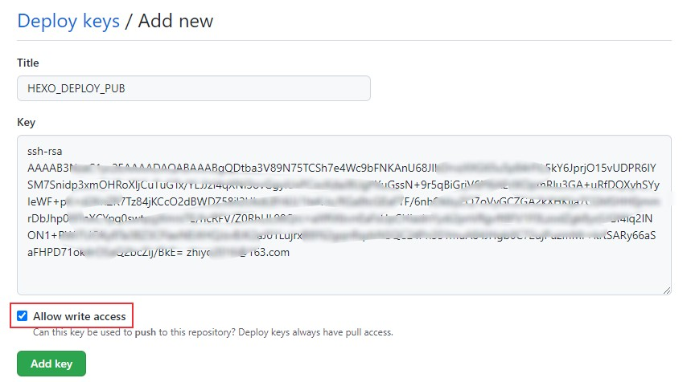
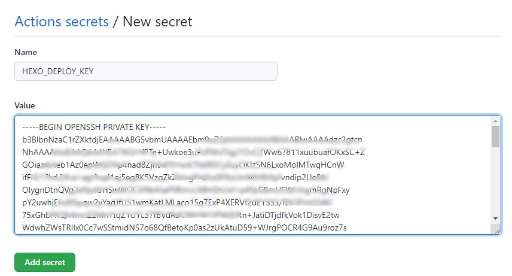
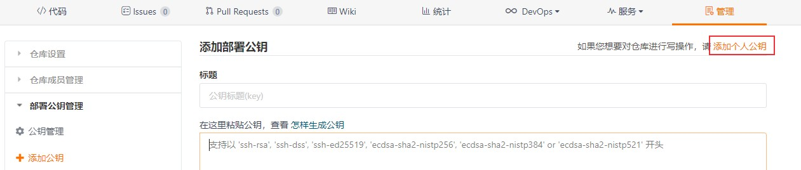
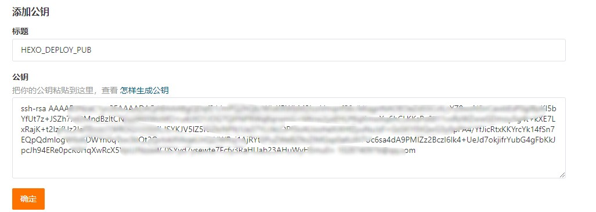
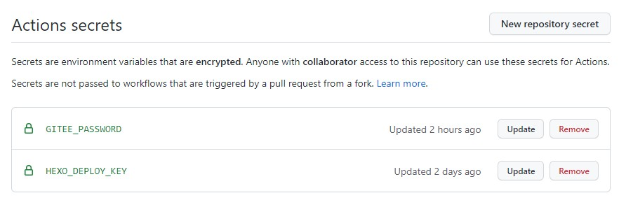
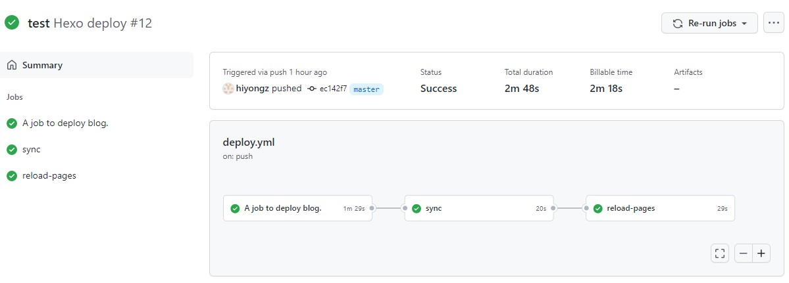

# 使用GitHub Actions实现Hexo博客自动发布
我在[使用jenkins实现hexo博客自动发布](https://blog.csdn.net/u010698107/article/details/115888855)中介绍了可以使用jenkins实现博客自动发布，其实还有一种更简单的方法，就是GitHub提供的持续集成服务：GitHub Actions。下面就来介绍一下如何使用GitHub Actions来实现将hexo博客自动编译及发布到GitHub Pages和Gitee pages上。

<!--more-->

## GitHub Actions 简介

GitHub Actions把代码拉取，打包，触发测试，发布等操作当成一个个的actions，持续集成就是将这些actions组合起来，jenkins也类似。

在项目的`.github/workflows` 目录中创建一个yaml格式的workflow 文件来编写GitHub Actions 工作流程，GitHub会自动运行该文件。workflow语法可参考：[https://docs.github.com/cn/actions/learn-github-actions/workflow-syntax-for-github-actions](https://docs.github.com/cn/actions/learn-github-actions/workflow-syntax-for-github-actions)

开发者可以将actions放到代码仓库供其他开发者引用，可以到官网搜索开源的actions：[https://github.com/marketplace?type=actions](https://github.com/marketplace?type=actions)

可以使用GitHub Actions实现博客自动发布，将静态博客页面部署到多个服务器上，比如GitHub Pages，Gitee pages以及云服务器上。本文使用GitHub Actions实现将Hexo博客自动编译并发布到GitHub Pages 和 Gitee pages上，并且实现Gitee pages自动更新。

下面介绍具体的配置流程。

## 环境准备

### 博客仓库

我的个人博客是使用 hexo 框架搭建的，搭建方法可参考[Hexo+Github/Gitee 搭建个人博客](https://blog.csdn.net/u010698107/article/details/113781267)。

主要包括三个仓库：

- 私有仓库Blog：存储 Hexo 项目文章以及源代码
- Github公共仓库hiyongz.github.io：存储编译之后的静态页面。
- Gitee公共仓库：内容和hiyongz.github.io一样，只是使用的服务不同。

使用GitHub Actions要实现的是当Blog仓库指定目录有更新时，触发自动编译并部署博客到hiyongz.github.io仓库中，并将hiyongz.github.io仓库同步到Gitee公共仓库，同步完成后，更新Gitee Pages。

### GitHub Token配置

配置发布秘钥，用于将生成的静态博客文件 push 至 GitHub Pages 所在的仓库hiyongz.github.io：

**1、生成秘钥**

执行如下命令生成公钥和私钥，替换邮件地址为你的github邮箱地址，其实也可以不使用邮箱，这里只是为了便于辨识。

```bash
ssh-keygen -f hexo-deploy-key -t rsa -C "username@example.com"
```
命令执行后会生成两个文件：`hexo-deploy-key` 和 `hexo-deploy-key.pub` 。

**2、将公钥添加到Github Pages仓库中**

步骤：hiyongz.github.io仓库 -> Settings -> Deploy keys -> Add deploy key

- Title设置为 `HEXO_DEPLOY_PUB` (可以根据自己喜好设置)
- Key填写 `github-deploy-key.pub` 文件内容
- 勾选 `Allow write access` 选项



**3、将私钥添加到博客源码仓库中**

步骤：博客仓库 -> Settings -> Secrets -> New repository secret

- Name 填写 `HEXO_DEPLOY_KEY` 。
- Value 填写 `github-deploy-key` 文件内容。



### Gitee Token配置

Gitee Token配置和Github类似。

秘钥不需要重新生成，直接使用前面生成的秘钥。

**1、将公钥添加到Gitee Pages仓库中**

步骤：gitee pages仓库 -> 管理 -> 公钥管理 -> 添加部署公钥

和github一样需要对仓库有写权限，点击【添加个人公钥】



复制粘贴文件 `github-deploy-key.pub` 中的内容



**2、将私钥添加到Github的博客源码仓库中**

不需要重新创建，直接使用 `HEXO_DEPLOY_KEY` 就行。

**3、配置Gitee 帐号的密码**

步骤：Github博客仓库 -> Settings -> Secrets -> New repository secret

- Name 填写 `GITEE_PASSWORD` 。
- Value 填写Gitee 帐号的密码。



##  配置workflow文件

下面来配置 Github Actions，编写workflow文件。

在博客仓库根目录下创建 `.github/workflows/deploy.yml` 文件，yaml文件名可以随意设置。

下面是我的workflow文件（参考了[Hexo Action](https://github.com/marketplace/actions/hexo-action#%F0%9F%8D%8Cexample-workflow---hexo-deploy)和[Gitee Pages Action](https://github.com/marketplace/actions/gitee-pages-action)提供的例子）：


```yml
name: Hexo deploy

on: 
  push:
    paths-ignore:
      - 'source/_GoNotes/**'
      - 'source/_JavaNotes/**'
      - 'source/_PythonNotes/**'
      - 'source/_drafts/**'
      - '.github/**'
jobs:
  build:
    runs-on: ubuntu-latest
    name: A job to deploy blog.
    steps:
    - name: Checkout
      uses: actions/checkout@v1
      with:
        submodules: true
        
    - name: Cache node modules
      uses: actions/cache@v1
      id: cache
      with:
        path: node_modules
        key: ${{ runner.os }}-node-${{ hashFiles('**/package-lock.json') }}
        restore-keys: |
          ${{ runner.os }}-node-
    - name: Install Dependencies
      if: steps.cache.outputs.cache-hit != 'true'
      run: npm ci
        
    # Deploy hexo blog website.
    - name: Deploy
      id: deploy
      uses: sma11black/hexo-action@v1.0.3
      with:
        deploy_key: ${{ secrets.HEXO_DEPLOY_KEY }}
        user_name: github用户名
        user_email: github邮箱
        commit_msg: ${{ github.event.head_commit.message }}ion)
    - name: Get the output
      run: |
        echo "${{ steps.deploy.outputs.notify }}"
  sync:
    needs: build
    runs-on: ubuntu-latest
    steps:
      - name: Sync to Gitee
        uses: wearerequired/git-mirror-action@master
        env:
          SSH_PRIVATE_KEY: ${{ secrets.HEXO_DEPLOY_KEY }}
        with:
          # 源仓库
          source-repo: git@github.com:hiyongz/hiyongz.github.io.git
          # 目标仓库
          destination-repo: git@gitee.com:hiyong/hiyong.git
  reload-pages:
    needs: sync
    runs-on: ubuntu-latest
    steps:
      - name: Build Gitee Pages
        uses: yanglbme/gitee-pages-action@main
        with:
          gitee-username: hiyong
          gitee-password: ${{ secrets.GITEE_PASSWORD }}
          gitee-repo: hiyong/hiyong
          branch: master
```

部分字段解释：

1、name：workflow 名称

2、on：触发 workflow 的事件

- `push`：push事件
- `paths-ignore`：忽略指定的目录，也就是在忽略路径外的其它目录文件改动时才触发。
- 还可以设置多种触发条件，比如支持cron语法实现定时触发，参考[这里](https://docs.github.com/cn/actions/reference/events-that-trigger-workflows)。

3、jobs：执行任务

- `build`：博客编译和发布，发布到Github Pages
- `sync`：将更新后的hiyongz.github.io仓库同步到Gitee
- `reload-pages`：自动更新 Pages，因为Gitee Pages不像GitHub Pages 那样提交代码就自动更新。
- `runs-on`：运行环境，支持windows，Ubuntu和macOS
- `steps`：指定每个 Job 的运行步骤
- `sma11black/hexo-action@v1.0.3`：博客构建发布，引用了[Hexo Action](https://github.com/marketplace/actions/hexo-action#%F0%9F%8D%8Cexample-workflow---hexo-deploy)：
- `wearerequired/git-mirror-action@master`：仓库同步，引用了[git-mirror-action](https://github.com/marketplace/actions/git-mirror-action)
- `yanglbme/gitee-pages-action@main`：自动更新Gitee Pages，引用了[Gitee Pages Action](https://github.com/marketplace/actions/gitee-pages-action)

更多workflow语法可参考 [Workflow syntax for GitHub Actions](https://docs.github.com/cn/actions/learn-github-actions/workflow-syntax-for-github-actions) 。

## 验证

更新文章后push到博客仓库，如果满足条件，博客仓库中的Actions会自动触发：



有可能报如下错误信息：

```bash
Error: Need phone captcha validation, please follow wechat official account "Gitee" to bind account to turn off authentication.
```

微信公众号关注Gitee，绑定Gitee账号就可以了。

查看hiyongz.github.io和Gitee仓库可以发现有新的更新，并且博客也更新了，这样实现了博客的自动发布，只要将文章写好push到博客仓库就什么也不用管了。

如果Actions执行失败会收到一个邮件。

## 小结

除了GitHub Actions外，还可以使用[Travis CI](https://travis-ci.org/)实现持续集成，它可以绑定Github 上的项目。

使用这些持续集成工具能有效提升效率，比如每次文章更新上传后，GitHub Actions会自动触发编译发布操作，只专注写文章就行了。

**参考文档：**

1. GitHub Actions 快速入门：[https://docs.github.com/cn/actions/quickstart](https://docs.github.com/cn/actions/quickstart)

2. GitHub Actions：[https://github.com/actions](https://github.com/actions)

3. Gitee Pages Action：[https://github.com/marketplace/actions/gitee-pages-action](https://github.com/marketplace/actions/gitee-pages-action)

4. git-mirror-action：[https://github.com/marketplace/actions/git-mirror-action](https://github.com/marketplace/actions/git-mirror-action)

5. Hexo Action：[https://github.com/marketplace/actions/hexo-action](https://github.com/marketplace/actions/hexo-action)

6. awesome-actions：[awesome-actions](https://github.com/sdras/awesome-actions)

7. [https://github.com/marketplace?type=actions](https://github.com/marketplace?type=actions)

8. workflow语法: [https://docs.github.com/cn/actions/learn-github-actions/workflow-syntax-for-github-actions](https://docs.github.com/cn/actions/learn-github-actions/workflow-syntax-for-github-actions)

   


