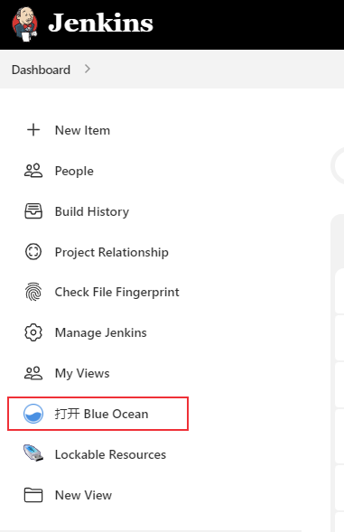
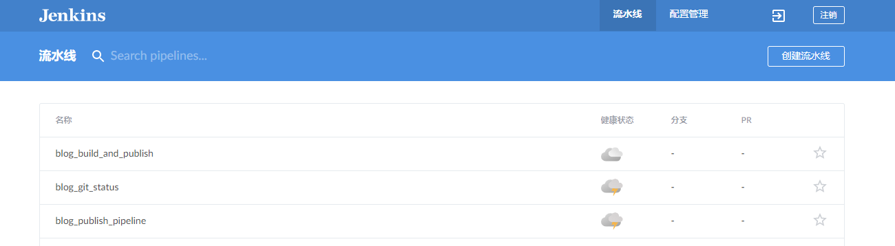
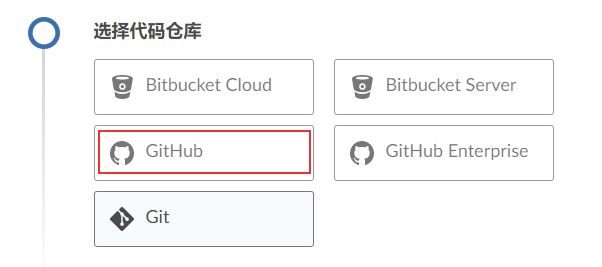
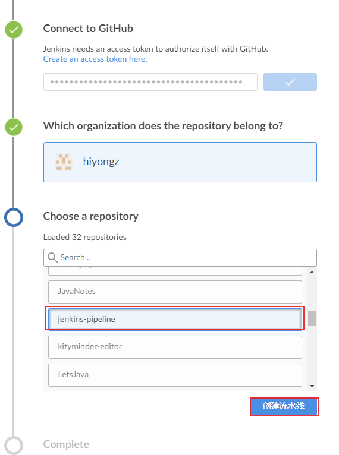
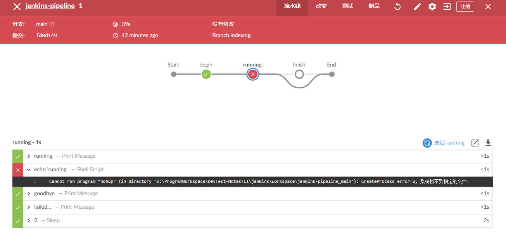
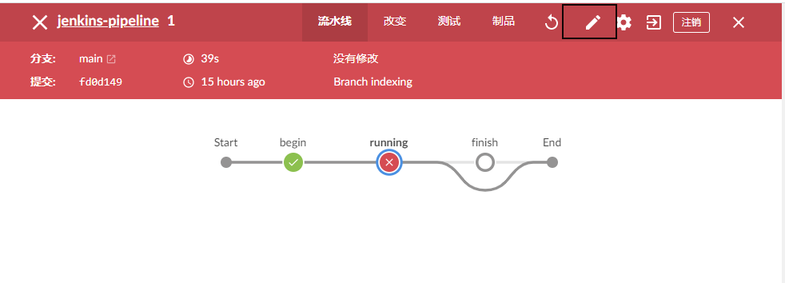
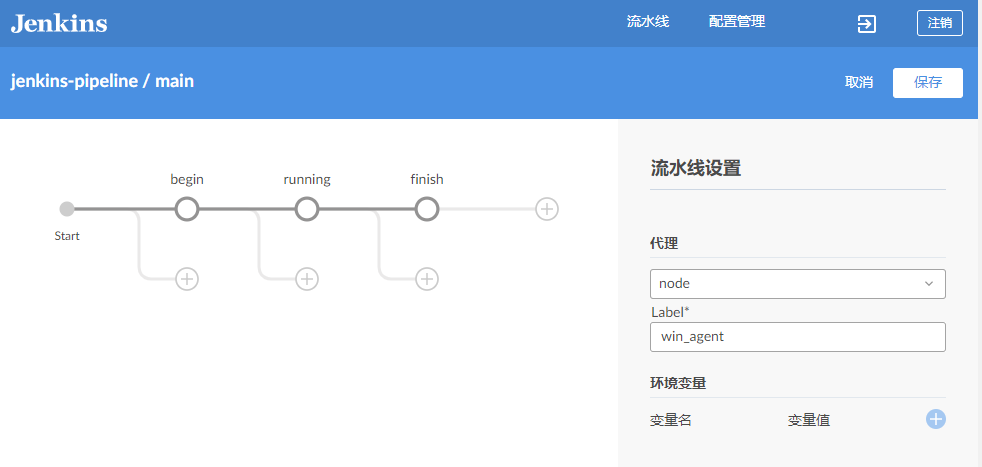
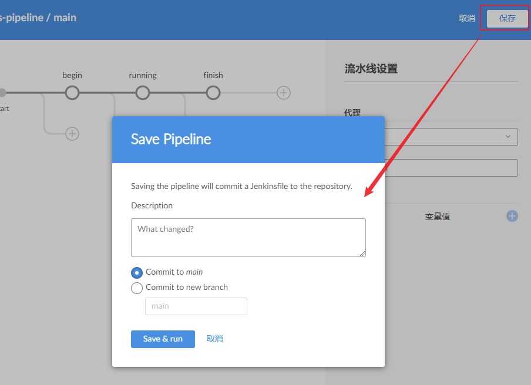

# 持续集成：Jenkins插件Blue Ocean介绍
Blue Ocean插件是为Jenkins Pipeline设计的一个聚合工具，当然也兼容自由风格项目。它图形化了pipeline的流程，使流水线更加直观。

## Blue Ocean安装

进入jenkins插件管理页面安装Blue Ocean插件

安装完成后就可以在jenkins页面看到Blue Ocean：

除了点击【打开Blue Ocean】进入Blue Ocean页面外，也可以访问`<Jenkins-Url>/blue` 进入。

## 创建Pipeline

Blue Ocean中也可以创建Pipeline。

1、点击【创建流水线】，选择代码仓库

以Github为例。

2、输入github access token，选择有jenkinsfile文件的仓库

3、等待生成流水线

Blue Ocean会创建一个多分支流水线项目，我这里生成了一个main分支。

## 查看pipeline执行情况

点击项目可以查看pipeline执行细节

可以看到Blue Ocean可视化了pipeline的运行流程，可以看到每一个阶段的执行状态以及日志。

## pipeline编辑

Blue Ocean除了可以创建pipeline项目，还可以对pipeline项目进行编辑。需要注意的是，只能编辑使用Blue Ocean创建的pipeline项目，使用经典页面创建的pipeline项目无法在Blue Ocean中编辑。

点击编辑：

进入编辑页面后就可以对pipeline步骤进行编辑、新增stage：

编辑完成后点击保存，提交更改

参考资料：

1. [https://www.jenkins.io/doc/book/blueocean/](https://www.jenkins.io/doc/book/blueocean/)
2. [https://www.jenkins.io/doc/book/blueocean/pipeline-editor/](https://www.jenkins.io/doc/book/blueocean/pipeline-editor/)
3. [https://www.jenkins.io/projects/blueocean/](https://www.jenkins.io/projects/blueocean/)
4. [https://plugins.jenkins.io/blueocean/](https://plugins.jenkins.io/blueocean/)

