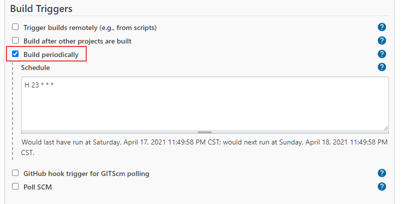
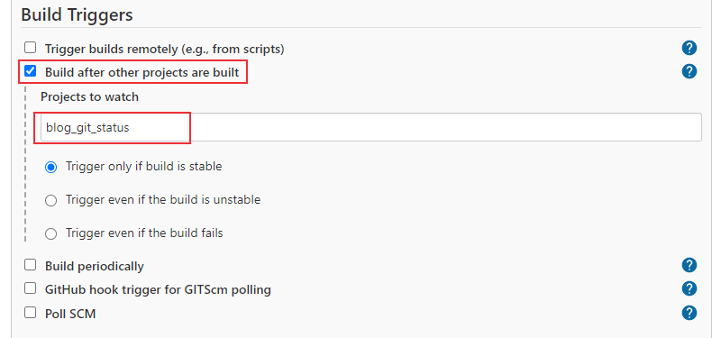
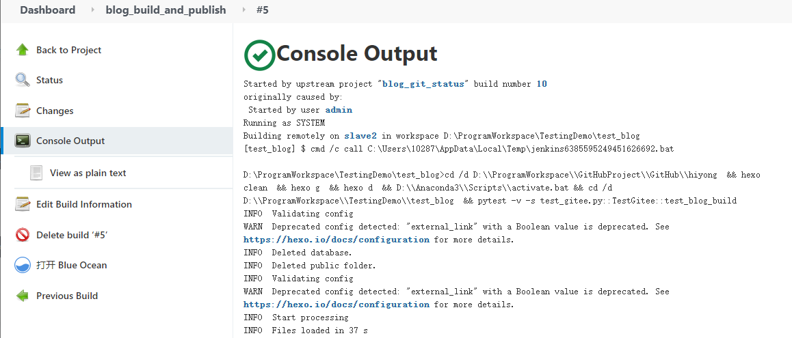

# 使用jenkins实现hexo博客自动发布
本文介绍使用jenkins来进行自动发送博客，检测博客项目是否有文件增加或者修改，如果有改动就执行本地构建和发布。

PS：写这篇文章时还不了解Github Actions服务，刚好用过Jenkins，所以使用Jenkins来实现博客自动发布。如果你只想实现Hexo博客push后触发自动编译发布到GitHub Pages或者Gitee Pages，可以使用Github Actions服务，实现起来更加简洁方便，具体实现可参考[使用GitHub Actions实现Hexo博客自动发布](https://blog.csdn.net/u010698107/article/details/120476856)。

<!--more-->

## 前言
去年使用hexo搭建了一个个人博客，使用Gitee Pages服务部署。发布博客的步骤一般是这样的：先编辑好文章，放到特定的博客项目目录下，然后本地生成博客静态文件，本地构建完成后进行发布，也就是上传到gitee博客仓库，更新Gitee Pages 服务，这样hexo博客就发布完成了。hexo博客搭建和发布可参考文章：[Hexo+Github/Gitee 搭建个人博客](https://blog.csdn.net/u010698107/article/details/113781267)。

这个发布过程，开始是进行手动操作，每次编辑好文章后，除了发布到公众号，CSDN博客外，还需要发布到搭建的个人博客上（个人博客搜索自己的文章更方便），Gitee Pages服务与GitHub Pages不同的是，博客push完成后，需要手动更新，GitHub Pages是自动更新，出于人类懒惰的本性（哈哈，是我比较懒），感觉这个过程比较繁琐。然后写了一个自动部署的脚本，这样本次写好文章后，双击运行脚本就会自动进行上面的步骤，脚本执行完成后看一下部署有没有问题就行了，这样比手动操作省事很多。

但是又发现一个问题就是，构建博客的环境在一台笔记本电脑上，但我不在一台电脑上更新博客文章，也就是我在其它电脑上更新文章后，需要到笔记本上pull新的更改，然后进行构建发布，有时候会忘记更新，所以希望实现定期自动更新。什么技术方法可以实现呢？想到了持续集成工具jenkins，它可以实现持续集成和持续交付。本文主要记录一下这个实现过程。

下面先介绍一下使用到的自动化脚本。
## 自动化脚本
### 检查博客是否更改
检查博客是否更改主要包括：
1. 本地仓库是否有文件删除、增加或者修改
2. 是否需要同步远程仓库：博客文章使用github管理，需要检查远程仓库是否有更新

远程仓库是否更新的代码参考了[https://stackoverflow.com/questions/3258243/check-if-pull-needed-in-git](https://stackoverflow.com/questions/3258243/check-if-pull-needed-in-git)。

脚本如下：
```bash
#!/bin/bash

repo_path=D:\\ProgramWorkspace\\GitHubProject\\GitHub\\hiyong\\source # 本地博客项目地址
cd $repo_path
set -e # 告诉bash如果任何语句的执行结果为false则退出

UPSTREAM=${1:-'@{u}'}
LOCAL=$(git rev-parse @)
REMOTE=$(git rev-parse "$UPSTREAM")
BASE=$(git merge-base @ "$UPSTREAM")

if [ $LOCAL = $REMOTE ]; then
    echo "Up-to-date"
elif [ $LOCAL = $BASE ]; then
    echo "Need to pull"
    git pull    
elif [ $REMOTE = $BASE ]; then
    echo "Need to push"
    git push    
fi

# 判断本地仓库是否变化
if [ -n "$(git status -s | grep _posts)" ];then
    echo "blog changes"
    git add -A
    git commit -m "jenkins update"
    git push
    exit 0
else
    echo "no blog changes"
    exit 1  # 退出，jenkins会显示失败
fi
```
1、jenkins中，非零返回就是job失败。
2、`-n`参数：判断该参数是否已被赋值
3、`git status -s` 或者 `git status --short` ：以精简的方式显示文件状态

* `??`标记：有新增文件
```sh
$ git status -s
?? test.txt
```
* `M`标记：有修改过的文件
```sh
$ git status -s
M testcase_name.txt
```
* `D`标记：本地删除的文件

### 博客构建部署脚本
如果博客有更新，进行本地构建，然后发布。
博客构建命令：
```bash
hexo clean
hexo g
hexo d
```

更新后的博客需要手动更新Gitee Pages服务，使用selenium实现自动化操作，gitee登录使用cookie认证的方式（cookie的介绍可参考[Session、Cookie和Token介绍](https://blog.csdn.net/u010698107/article/details/115710435)），python脚本如下：
```python
import json
import time
from typing import List, Dict

from selenium import webdriver
from selenium.webdriver.common.by import By
from selenium.webdriver.support import expected_conditions
from selenium.webdriver.support.wait import WebDriverWait
import pytest

class TestGitee:
    def setup(self):
        self.driver = webdriver.Chrome(executable_path="D:/testing_tools/chromedriver88/chromedriver.exe")
        self.driver.get("https://gitee.com/hiyong/hiyong")
        self.driver.implicitly_wait(10)
    def teardown_method(self):
        # self.driver.quit()
        pass

    def test_blog_build(self):
        print("登录。。。。。。")
        with open("gitee_cookies.txt",'r') as f:
            # cookies = json.load(f)
            cookies:List[Dict] = json.load(f)
        for cookie in cookies:
            if "expiry" in cookie.keys():
                cookie.pop("expiry")
            self.driver.add_cookie(cookie)
        self.driver.refresh()

        print("点击服务")
        time.sleep(1)
        # articles = self.driver.find_elements(By.XPATH, '//*[@class="article-item-box csdn-tracking-statistics"]//a')
        services = self.driver.find_element(By.XPATH, '//*[@class="ui pointing top right dropdown git-project-service"]')
        time.sleep(1)
        services.click()

        print("点击Gitee Ppages")
        WebDriverWait(self.driver, 10).until(
            expected_conditions.visibility_of_element_located((By.XPATH,'//*[contains(text(),"Gitee Pages")]')))
        gitee_pages = self.driver.find_element(By.XPATH, '//*[contains(text(),"Gitee Pages")]')
        gitee_pages.click()

        print("点击更新")
        WebDriverWait(self.driver, 10).until(
            expected_conditions.visibility_of_element_located((By.XPATH, '//*[@class="button orange redeploy-button ui update_deploy"]')))
        update = self.driver.find_element(By.XPATH, '//*[@class="button orange redeploy-button ui update_deploy"]')
        update.click()

        alert = self.driver.switch_to.alert
        print(alert.text)
        alert.accept()

        WebDriverWait(self.driver, 10).until(
            expected_conditions.visibility_of_element_located((By.ID, 'pages_deploying')))
        print("正在部署，请稍后......")
        WebDriverWait(self.driver, 60).until(
            expected_conditions.invisibility_of_element_located((By.ID, 'pages_deploying')))
        print("部署成功，请访问：https://hiyong.gitee.io")
        self.driver.get("https://hiyong.gitee.io")
```

上面的Python脚本使用pytest执行：
```sh
pytest -v -s test_gitee.py::TestGitee::test_blog_build
```

好了，主要使用到的自动化脚本就介绍完了，下面开始配置jenkins项目

## jenkins配置
前面介绍过，如果博客有更新就进行自动化部署操作，如果没有更新就不操作。下面介绍一种解决方案，构建两个job，一个用于检查博客是否有更新，另一个用于博客发布，也就是配置Jenkins父子多任务（可参考[持续集成平台Jenkins详细介绍](https://blog.csdn.net/u010698107/article/details/113823608)），如果有更新就触发博客发布项目，没有就不用触发。

另外再说明一下我的jenkins部署环境，我的jenkins是部署在虚拟机里面的，博客项目部署在物理机，所以物理机为一个节点，Windows节点添加方法参考[持续集成平台Jenkins详细介绍](https://blog.csdn.net/u010698107/article/details/113823608)。

### 1. 新建检测博客是否更新项目
新建一个名为blog_git_status的job，运行节点为配置的windows节点名称（我的为slave2）。

配置周期触发构建操作，我配置的是每天晚上11点进行构建操作。



添加构建动作Execute shell，将前面写的shell脚本粘贴进去：


### 2. 新建博客发布项目
新建一个名为blog_build_and_publish的job，和blog_git_status一样，运行节点配置为slave2，配置Build Triggers为blog_git_status：

添加构建动作Execute windows batch command，输入如下脚本：
```sh
cd /d D:\\ProgramWorkspace\\GitHubProject\\GitHub\\hiyong&&hexo clean&&hexo g&&hexo d&&D:\\Anaconda3\\Scripts\\activate.bat&&cd /d D:\\ProgramWorkspace\\TestingDemo\\test_blog&&pytest -v -s test_gitee.py::TestGitee::test_blog_build
```


可以配置一下Jenkins邮件报警，构建成功或者失败后会发一个文件，这里不介绍了，参考[持续集成平台Jenkins详细介绍](https://blog.csdn.net/u010698107/article/details/113823608)。


### 3. 构建
运行第一个项目blog_git_status，如果构建成功就会自动触发blog_build_and_publish项目。下图是构建日志：


blog_git_status构建成功后，触发第二个项目：


blog_build_and_publish项目的构建日志：



## 小结
本文介绍了使用持续集成工具jenkins实现博客的自动发布，构建了两个Job，一个用于检测博客是否更新，另一个用于博客的构建和发布。除了这种方法以外，还可以使用Jenkins的pipeline实现持续发布，就不用创建两个Job了。


