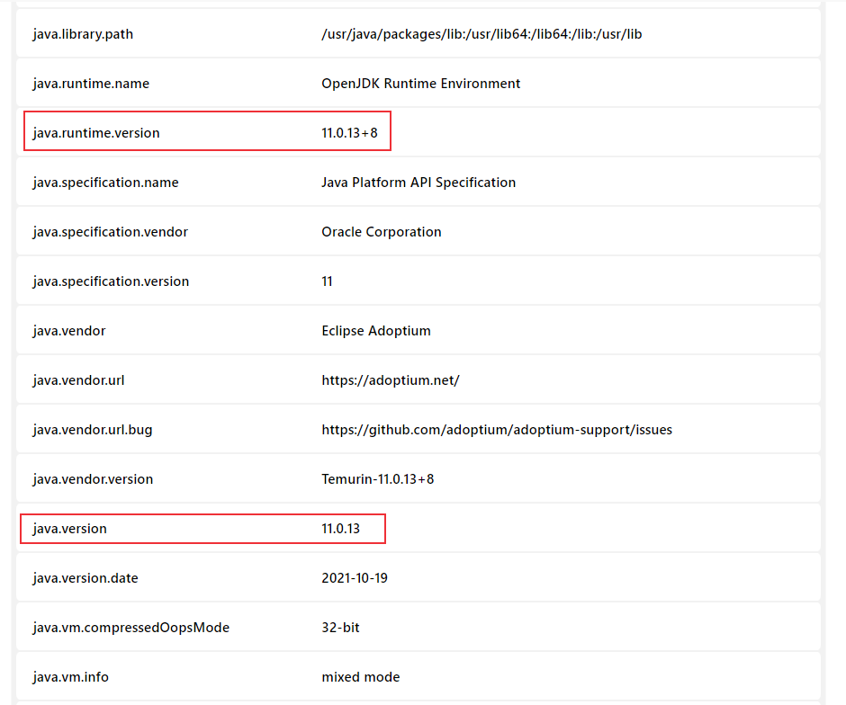

# 持续集成平台Jenkins：docker镜像升级
Jenkins 2.357 及 LTS 2.361.1之后的版本要求Java 11 或者 17，如果使用的是Java 8，要升级最新版本的Jenkins，就需要升级Java JDK版本，本文记录一下如何升级jenkins容器的Java版本。

<!--more-->

## 环境说明

我的jenkins平台是使用docker容器进行安装的，所以，如果要升级Java版本，需要升级jenkins镜像中的Java版本，升级宿主机的jdk版本是没用的。

> 如果你的jenkins是直接安装在Linux服务器上的，可以直接升级服务器上的jdk，升级方法可参考[Java环境安装配置步骤介绍](https://blog.csdn.net/u010698107/article/details/126612602)。

我没有找到直接升级jenkins镜像中的Java版本的方法，所以我采用的方法是直接下载最新（jdk11）的jenkins docker镜像，然后重新创建容器。

如果你的数据是存储在容器中的，删除容器会导致数据也会删除，而我的jenkins容器数据挂载到了宿主机的磁盘目录，所以不用担心数据丢失的问题。

我的挂载目录：

```bash
# docker volume inspect jenkins_test
[
    {
        "CreatedAt": "2022-09-17T18:53:24+08:00",
        "Driver": "local",
        "Labels": {},
        "Mountpoint": "/var/lib/docker/volumes/jenkins_test/_data",
        "Name": "jenkins_test",
        "Options": {},
        "Scope": "local"
    }
]

```

如果你的jenkins没有挂载，请谨慎使用容器删除命令。

下面介绍升级步骤。

## Jenkins镜像升级

### 1. 删除当前jenkins容器

停止jenkins：

```bash
$ docker stop jenkins
jenkins
```
删除jenkins容器：
```bash
$ docker rm jenkins
jenkins
$ docker start jenkins
Error response from daemon: No such container: jenkins
Error: failed to start containers: jenkins
```

### 2. 删除旧的jenkins镜像

```bash
$ docker images | grep jenkins
jenkins/jenkins              latest            10fafa8484ea   20 months ago   721MB
$ docker rmi -f 10fafa8484ea
Untagged: jenkins/jenkins@sha256:e4630b9084110ad05b4b51f5131d62161881216d60433d1f2074d522c3dcd6dc
Deleted: sha256:10fafa8484ea146b66ede5c232021f229e0f5d0282f334bb40114b79d5c493ec
```

### 3. 下载最新jenkins镜像

Jenkins docker hub地址: https://hub.docker.com/r/jenkins/jenkins

```bash
$ docker pull jenkins/jenkins
Using default tag: latest
latest: Pulling from jenkins/jenkins
0e29546d541c: Pull complete 
11bbb8c402a7: Pull complete 
cf91f018150b: Pull complete 
a98e88c6f0f0: Pull complete 
f67fc70d671a: Pull complete 
edbe48067464: Pull complete 
fa23ca93dd6b: Pull complete 
00159d993c13: Pull complete 
f28fb40a17cf: Pull complete 
071d309df04b: Pull complete 
78599f36e494: Pull complete 
896a32d969fb: Pull complete 
3f1a51ea9f7f: Pull complete 
26e724f0bfad: Pull complete 
b377e1ae1384: Pull complete 
d3cdbe7e8b9f: Pull complete 
f3b40ebc3458: Pull complete 
Digest: sha256:c3fa8e7f70d1e873ea6aa87040c557aa53e6707eb1d5ecace7f6884a87588ac8
Status: Downloaded newer image for jenkins/jenkins:latest
docker.io/jenkins/jenkins:latest

$ docker images | grep jenkins
jenkins/jenkins              latest            55860ee0cd73   8 months ago    442MB
```

### 4. 启动jenkins容器

之前搭建jenkins时创建的文件影射卷为jenkins_test：

```bash
$ docker volume inspect jenkins_test
[
    {
        "CreatedAt": "2022-09-17T18:58:31+08:00",
        "Driver": "local",
        "Labels": {},
        "Mountpoint": "/var/lib/docker/volumes/jenkins_test/_data",
        "Name": "jenkins_test",
        "Options": {},
        "Scope": "local"
    }
```

创建并启动jenkins容器：

```bash
$ docker run --name=jenkins -d -p 8080:8080 -p 50000:50000 -v jenkins_test:/var/jenkins_home -e JAVA_OPTS=-Duser.timezone=Asia/Shanghai jenkins/jenkins
8770bb7ec9d78addd156ab56a08c932ce1b23428a2e2a3d7ed8b368d07d9156e
```

查看jenkins容器中的Java版本：

```bash
$ docker exec jenkins java -version
openjdk version "11.0.13" 2021-10-19
OpenJDK Runtime Environment Temurin-11.0.13+8 (build 11.0.13+8)
OpenJDK 64-Bit Server VM Temurin-11.0.13+8 (build 11.0.13+8, mixed mode)

```

可以看到已经升级成功了！

也可以在jenkins平台中查看，访问jenkins，进入系统信息页面：http://192.168.30.8:8080/systemInfo



## Jenkins升级

jenkins升级参考[Docker搭建持续集成平台Jenkins](https://blog.csdn.net/u010698107/article/details/113819992) 。


