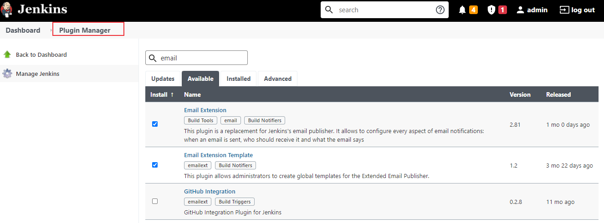
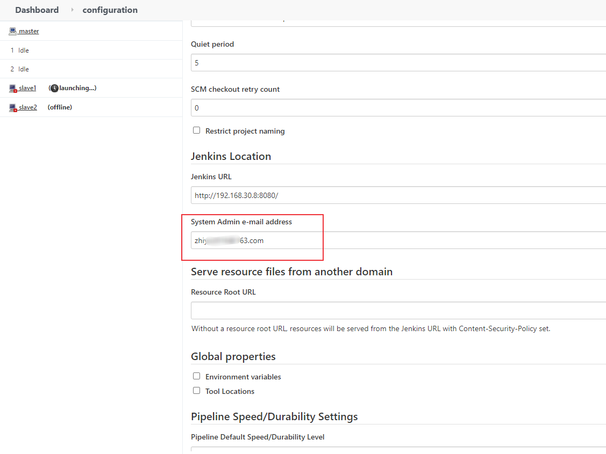
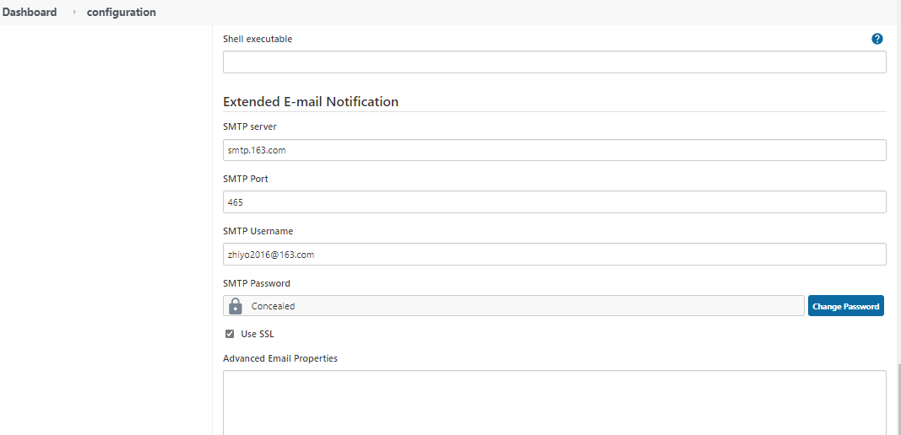
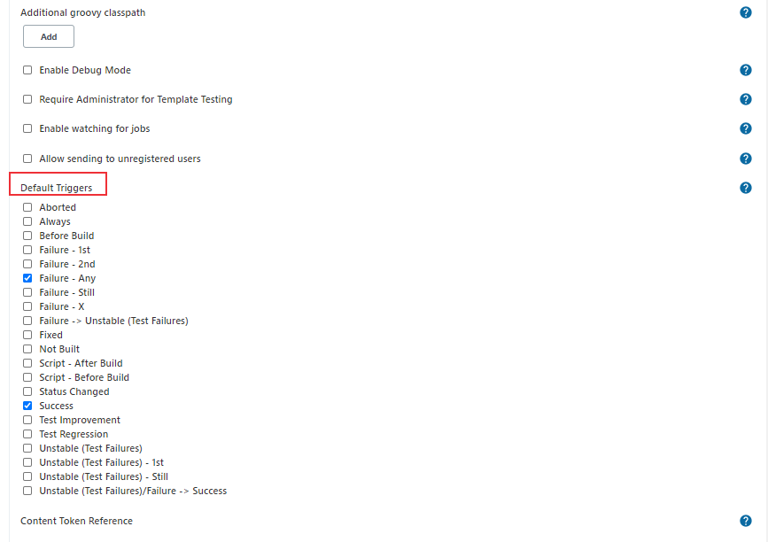
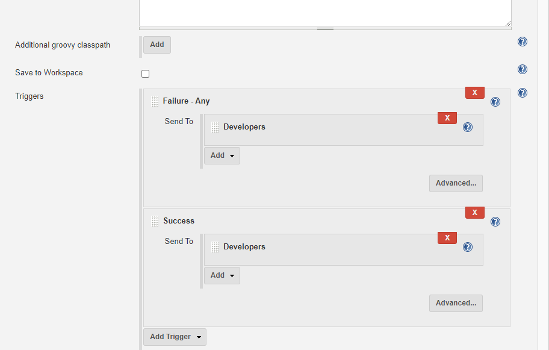
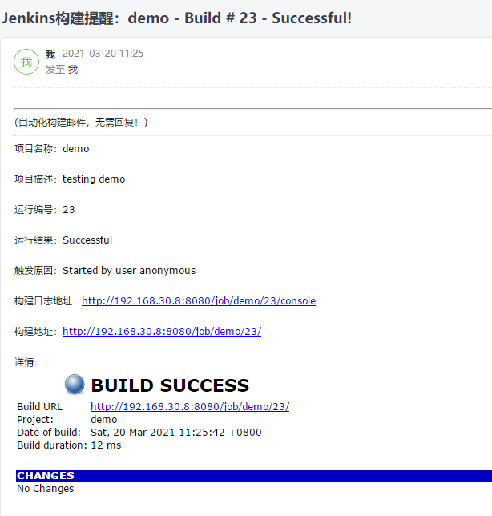
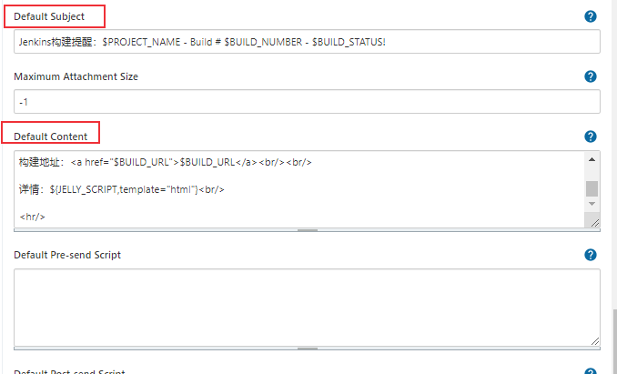

# 持续集成：Jenkins邮件通知配置方法介绍
Jenkins的邮件提醒功能主要通过[Email Extension](https://plugins.jenkins.io/email-ext/)插件来实现，它是对[Mailer Plugin](https://plugins.jenkins.io/mailer)的扩展，我在[持续集成平台Jenkins配置方法介绍](https://blog.csdn.net/u010698107/article/details/113823608)中简要介绍了Jenkins的邮件配置方法，本文介绍jenkins邮件的更多玩法。

<!--more-->

## Jenkins邮件配置
Jenkins可以配置邮件通知，比如在Jenkins构建任务之后发送邮件通知，错误报警等。

安装插件：Email Extension和Email Extension Template，


### Jenkins配置 Email
进入Manage Jenkins -> System Configuration -> Configure System 配置系统管理员e-mail地址


配置Extended E-mail Notification，注意SMTP Password不是邮箱密码，为你的邮箱授权码

拉到最下面，配置邮件通知，配置完成后，可以发一个测试邮件，查看是否配置成功


### Jenkins报警规则
在模板设置的下方有个 Default Triggers 按钮，点击后，设定报警规则



在job的**构建后操作**步骤选择" Editable Email Notification "




配置完成后，构建项目，查看控制台输出


查看邮箱，发送成功！


## Jenkins 通用邮件模板

Jenkins可以根据你配置的邮件模板格式来发送结果邮件，通过Jenkins的参数定制自己的Email模板，常用的参数key值如下:

* $BUILD_STATUS ：构建结果
* $PROJECT_NAME ：构建脚本名称
* $BUILD_NUMBER ：构建脚本编号
* $JOB_DESCRIPTION ：构建项目描述
* $CAUSE ：脚本启动原因
* $BUILD_URL ：脚本构建详情URL地址

可以进行全局邮件配置，进入Manage Jenkins -> System Configuration -> Configure System，配置邮件默认模板。

Default Subject

```txt
Jenkins构建提醒：$PROJECT_NAME - Build # $BUILD_NUMBER - $BUILD_STATUS!
```

Default Content

```html
<hr/>(自动化构建邮件，无需回复！)<br/><hr/>

项目名称：$PROJECT_NAME<br/><br/>

项目描述：$JOB_DESCRIPTION<br/><br/>

运行编号：$BUILD_NUMBER<br/><br/>

运行结果：$BUILD_STATUS<br/><br/>

触发原因：${CAUSE}<br/><br/>

构建日志地址：<a href="${BUILD_URL}console">${BUILD_URL}console</a><br/><br/>

构建地址：<a href="$BUILD_URL">$BUILD_URL</a><br/><br/>

详情：${JELLY_SCRIPT,template="html"}<br/>

<hr/>
```



也可以使用HTML模板，将模板内容保存为HTML文件，使用如下方式来引用：

```bash
${FILE,path="email.html"}
```

在pipeline中使用emailext方法发送邮件：Declarative pipeline

```bash
post {
	always {
        emailext (
            subject: '\'构建通知:${PROJECT_NAME} - Build # ${BUILD_NUMBER} - ${BUILD_STATUS}\'',
            body: '''${FILE,path="email.html"}''',
            to: "XXXXXXX@qq.cn",    
            )
	}
}
```


## Groovy 脚本模板

[Email Extension](https://plugins.jenkins.io/email-ext/)插件支持Groovy 脚本模板，主要步骤如下：

1、创建Groovy 脚本模板

使用Groovy+HTML语言编写，可参考[Email Extension](https://plugins.jenkins.io/email-ext/)提供的示例模板文件：
- [`groovy-html.template`](https://github.com/jenkinsci/email-ext-plugin/blob/master/src/main/resources/hudson/plugins/emailext/templates/groovy-html.template)
- [`jenkins-matrix-email-html.template`](https://github.com/jenkinsci/email-ext-plugin/blob/master/docs/templates/jenkins-matrix-email-html.template)
- [`jenkins-generic-matrix-email-html.template`](https://github.com/jenkinsci/email-ext-plugin/blob/master/docs/templates/jenkins-generic-matrix-email-html.template)

2、将脚本放到  `${JENKINS_HOME}/email-templates/`目录下。

我的JENKINS_HOME路径为 `/var/jenkins_home`，将写好的template文件放入 `/var/jenkins_home/email-templates` 目录下并添加权限：

```bash
$ docker cp Pipeline-html.template jenkins:/var/jenkins_home/email-templates/Pipeline-html.template
$ docker exec -u root -it jenkins /bin/bash
root@87f12fbcc4be:/# cd /var/jenkins_home/email-templates/
root@87f12fbcc4be:/var/jenkins_home/email-templates# chmod 777 Pipeline-html-test.template
```

3、使用模板

使用方法如下:

- 纯文本 Groovy 脚本

  `${SCRIPT, template="groovy-text.template"}`

- HTML Groovy 脚本

  `${SCRIPT, template="groovy-html.template"}`

比如，在pipeline中使用emailext发送邮件：

```bash
emailext (
    subject: '\'构建通知:${PROJECT_NAME} - Build # ${BUILD_NUMBER} - ${BUILD_STATUS}\'',
    body: '''${SCRIPT,template="groovy-html.template"}''',
    to: "XXXXXXX@qq.cn",    
    )
}
```

构建时，邮件报如下错误：

```bash
Exception raised during template rendering: Failed to parse template script (your template may contain an error or be trying to use expressions not currently supported): Failed to create Script instance for class: class SimpleTemplateScript13. Reason: java.lang.SecurityException: Rejecting unsandboxed super constructor call: hudson.plugins.emailext.plugins.content.EmailExtScript() groovy.lang.GroovyRuntimeException: Failed to parse template script (your template may contain an error or be trying to use expressions not currently supported)
```

解决方案：https://stackoverflow.com/questions/40129455/jenkins-pipeline-getting-a-security-error-how-can-i-prevent-the-error-from-be

手动同意使用的模板方法签名，进入Manage Jenkins -> In-process Script Approval 手动同意模板文件就可以了。

参考文档：

1. [https://github.com/jenkinsci/email-ext-plugin](https://github.com/jenkinsci/email-ext-plugin)
