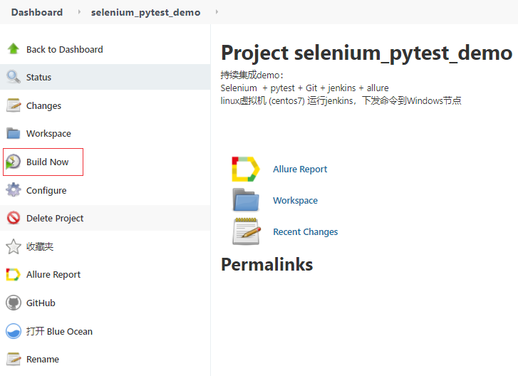

# 持续集成：jenkins + pytest + selenium + Git + Allure自动化测试
本文介绍jenkins， pytest ，selenium，Git，Allure的自动化测试实现方法，使用jenkins实现web自动化测试，并生成报告，自动发送邮件。

<!--more-->
## 0-测试环境准备
- Selenium Web自动化测试框架
- 自动化测试框架pytest编写测试用例
- windows配置Git：可参考[Git简易教程-安装及简单使用](https://blog.csdn.net/u010698107/article/details/111414654)
- linux虚拟机 (centos7) 运行jenkins，虚拟机和Windows可以互相ping通
- 配置jenkins-Windows节点：参考[持续集成平台Jenkins详细介绍](https://blog.csdn.net/u010698107/article/details/113823608)
- 用例Github地址：[https://github.com/hiyongz/selenium_pytest_demo](https://github.com/hiyongz/selenium_pytest_demo)

## 1-jenkins配置github项目
### 1、新建项目
新建一个item，名称：selenium_pytest_demo，选择freestyle project

### 2、配置项目Git地址
节点名为配置的windows节点名

### 3、配置代码管理
注意：分支和github代码分支名一致

### 4、构建
选择执行windows批处理命令

### 5、配置构建后操作
1、选择Allure报告

注意要配置Allure Commandline：进入Global Tool Configuration进行配置

2、配置邮件提醒
Jenkins邮件报警配置方法可参考：[持续集成平台Jenkins详细介绍](https://blog.csdn.net/u010698107/article/details/113823608)

## 2-运行
配置完成后保存，点击Build Now 运行

控制台输出日志：

jenkins查看Allure报告：

邮件提醒：

## 3-jenkins执行本地项目
如果不从GitHub上克隆项目，可以运行本地项目，不需要配置Git，只需要配置项目的本地路径

其它配置类似，配置完成后，点击构建

