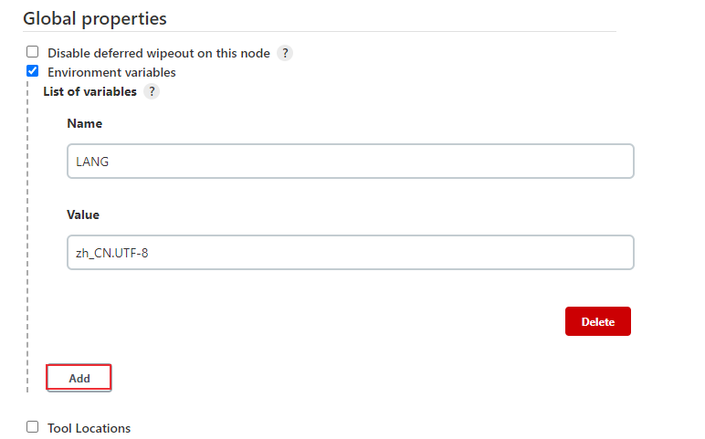
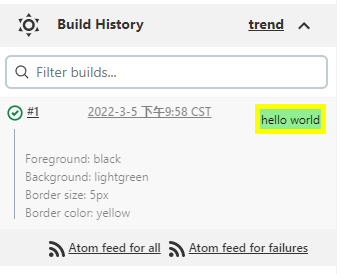
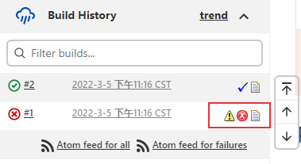
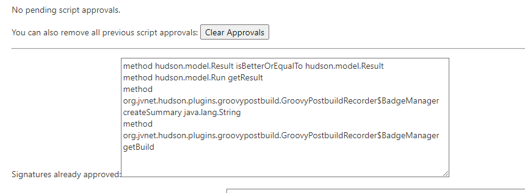

# 持续集成：Jenkins pipeline全局变量
在编写Jenkins Pipeline脚本时，需要使用到一些全局变量，比如环境变量jenkins URL、项目地址，保存在env变量中（字符串类型），可以在Jenkins Pipeline或者其它Jenkinsfile中使用这些变量。本文介绍jenkins 中env、params、currentBuild和manager这几种全局变量。

<!--more-->

## Jenkins 全局变量

Jenkins平台支持的全局变量可通过地址[${JENKINS_URL}/pipeline-syntax/globals](JENKINS_URL/pipeline-syntax/globals) 访问。主要包括以下全局变量：

- `env`：在groovy代码和 Jenkins pipeline中以 `env.VARNAME` 或直接以 `VARNAME` 的形式访问环境变量。
- `params`：将构建中定义的所有参数公开为具有不同类型值的只读映射，通过params来访问。
- `currentBuild`：顾名思义，它处理Jenkins管道当前正在运行的构建。
- `manager`：[Groovy Postbuild](https://plugins.jenkins.io/groovy-postbuild/)插件提供的全局变量。
- `docker`：这是为了在一个Groovy脚本的Jenkins管道中提供方便的访问docker相关函数。

下面来举例说明如何使用。

下面的示例中，groovy脚本在Pipeline 共享库中编写，pipeline脚本直接在pipeline工程的pipeline输入框中编写。pipeline共享库的定义可以参考 [持续集成：Jenkins Pipeline共享库定义和使用](https://blog.csdn.net/u010698107/article/details/122914055) 。

## env

### 查看环境变量

可通过多种方式查看jenkins可使用的环境变量：

1. 访问：[${JENKINS_URL}/pipeline-syntax/globals](JENKINS_URL/pipeline-syntax/globals) 
2. 访问：[${JENKINS_URL}/env-vars.html/](JENKINS_URL/env-vars.html/) 
3. 使用windows bat命令：`set`
4. 使用Linux/Unix shell命令：`printenv`

bat和shell命令可以在pipeline中编写：

```groovy
pipeline{
    agent {
        label "master"
        }
    stages{
		stage('Parallel Stage') {
		parallel {
		stage('windows') {
			agent {
				label "win_agent"
			}
			steps {
				bat 'set'  
			}
		}
		stage('linux') {
			agent {
				label "linux_agent"
			}
			steps {
				sh 'printenv' 
			}
		}
	}    
   }
   }
}
```

由于打印内容较多，这里就不展示结果了。这两个命令除了返回jenkins平台的环境变量外，还会打印对应代理节点的环境变量。

### 使用环境变量

可以以 `env.VARNAME` 或直接以 `VARNAME` 的形式访问环境变量。

pipeline脚本：

```groovy
// @Library('pipelinelibs2@main')   // Github库 
@Library('pipelinelibs@1.0') _   // SVN库

import com.hiyongz.MyLib

def mylib = new MyLib();

mylib.getJenkinsHome();

println "${JENKINS_HOME}";
println "${env.JENKINS_HOME}";
```

MyLib.groovy：

```groovy
def getJenkinsHome(){
	println "${JENKINS_HOME}";
	println "${env.JENKINS_HOME}";
}

```

构建结果日志：

```groovy
[Pipeline] echo
/var/jenkins_home
[Pipeline] echo
/var/jenkins_home
[Pipeline] echo
/var/jenkins_home
[Pipeline] echo
/var/jenkins_home
[Pipeline] End of Pipeline
Finished: SUCCESS
```

### 创建环境变量

除了读取环境变量外，也可以对环境变量进行赋值或者创建新的环境变量。声明环境变量可以使用以下3种方式：

1. `withEnv(["VARIABLE_NAME=value"]) {}` , 脚本式流水线语法，可以覆盖任何环境变量。
2. `env.VARIABLE_NAME` ：只能覆盖以`env.VARIABLE_NAME`的方式创建的环境变量。
3. `environment { }` ，声明式流水线语法，不能以`env.VARIABLE_NAME`的方式覆盖。

pipeline脚本：

```groovy
// @Library('pipelinelibs2@main')   // Github库 
@Library('pipelinelibs@1.0') _   // SVN库

import com.hiyongz.MyLib

def mylib = new MyLib();

env.MY_VERSION = '1.0'
mylib.myEnv();
println "MY_VERSION = ${MY_VERSION}";
println "MY_VERSION = ${env.MY_VERSION}";

pipeline{
    agent {
        label "master"
    }
	environment {
        ENV1 = "env1"
    }
    stages{	
	stage("Env Test") {
		environment {
			ENV1 = "env1_1" // 覆盖environment{}块创建的环境变量
			BUILD_NUMBER = "666" // 可以覆盖以`env.VARIABLE_NAME`方式赋值的环境变量。
			
		}
		steps {
			println "ENV1 = ${env.ENV1}";
			println "BUILD_NUMBER = ${env.BUILD_NUMBER}";
			
			script {
				env.MY_VERSION = "2.0" // env.MY_VERSION会被覆盖
				env.ENV1 = "env1_2"		// env.ENV1不会被覆盖
			}
			
			println "ENV1 = ${env.ENV1}";
			println "MY_VERSION = ${env.MY_VERSION}";

			withEnv(["ENV1=env1_3"]) { // env.ENV1会被覆盖
				echo "ENV1 = ${env.ENV1}"
			}
		}
	}
	}
}

```

MyLib.groovy：

```groovy
def myEnv(){
	println "MY_VERSION = ${env.MY_VERSION}";
	println "MY_VERSION = ${MY_VERSION}";
}
```

构建结果日志：

```groovy
MY_VERSION = 1.0
MY_VERSION = 1.0
MY_VERSION = 1.0
MY_VERSION = 1.0
ENV1 = env1_1
BUILD_NUMBER = 666
ENV1 = env1_1
MY_VERSION = 2.0
ENV1 = env1_3
```

新创建的环境变量在groovy也可以通过如下方式获取：

```groovy
def myEnv(){
	def jobVariables = currentBuild.getBuildVariables();
	println "${jobVariables.MY_VERSION}";
}
```

在pipeline script中创建的环境变量只能在当前pipeline工程中生效，如果想要设置全局环境变量，可以在jenkins系统配置中进行配置。

进入【Manage Jenkins】-> 【Configure System】-> 【Global properties】，新增环境变量，这里设置的环境变量是全局生效的。



## params

对于参数的读取可以使用params来访问，groovy脚本中可以使用`params.get()`和`env.getProperty()`方法来获取：

```groovy
def ParamDemo(){
	def deploy_env = params.get("DEPLOY_ENV") // or: params."${paramName}"
	println "DEPLOY_ENV = ${deploy_env}";
	
	def debug_build = env.getProperty("DEBUG_BUILD")
	println "DEBUG_BUILD = ${debug_build}";
}
```

pipeline脚本如下：

```groovy
// @Library('pipelinelibs2@main')   // Github库 
@Library('pipelinelibs@1.0') _   // SVN库

import com.hiyongz.MyLib
def mylib = new MyLib();

pipeline{
    agent {
        label "master"
    }
    parameters {
        string(name: 'DEPLOY_ENV', defaultValue: 'staging', description: '') 
        text(name: 'DEPLOY_TEXT', defaultValue: 'One\nTwo\nThree\n', description: '') 
        booleanParam(name: 'DEBUG_BUILD', defaultValue: true, description: '')
        choice(name: 'CHOICES', choices: ['one', 'two', 'three'], description: '')
        password(name: 'PASSWORD', defaultValue: 'SECRET', description: 'A secret password')
    }
    stages{	
	stage("Param Test") {
		steps {
		    script {
			println "DEPLOY_ENV = ${params.DEPLOY_ENV}";
            mylib.ParamDemo();
		    }			
		}
	}
	}
}

```

构建结果：

```groovy
DEPLOY_ENV = staging
[Pipeline] echo
DEPLOY_ENV = staging
[Pipeline] echo
DEBUG_BUILD = true
```

## currentBuild

currentBuild变量可以用来获取当前构建的一些属性，比如absoluteUrl、projectName、result等，更多支持的属性方法可以访问：[${JENKINS_URL}/pipeline-syntax/globals](JENKINS_URL/pipeline-syntax/globals) 。

```groovy
pipeline{
    agent {
        label "master"
    }
    stages{	
	stage("Param Test") {
		steps {
		    script {
			    println "build number: ${currentBuild.number}";
			    println "current result: ${currentBuild.currentResult}";
			    println "build URL: ${currentBuild.absoluteUrl}";
		    }			
		}
	}
	}
}
```

## manager

manager是[Groovy Postbuild](https://plugins.jenkins.io/groovy-postbuild/)插件提供的全局变量，用于构建后操作，它是在jenkins JVM 中执行groovy脚本。可用来更改构建结果，显示构建摘要信息等，下面来举几个例子。

**1、addShortText方法**

语法：`addShortText(text, color, background, border, borderColor)`

```groovy
pipeline {
    agent {
        label 'master'
    } 
    stages {
        stage('manager usage') {
            steps {
                script {
                    manager.addShortText("hello world",'black','lightgreen','5px','yellow')
                    currentBuild.description = "Foreground: black\n"
                    currentBuild.description += "Background: lightgreen\n"
                    currentBuild.description += "Border size: 5px\n"
                    currentBuild.description += "Border color: yellow" 
                }
            }
        }
    }
}
```

效果如下图：



**2、添加徽章图标**

添加删除图标相关方法：

- addBadge(icon, text)
- addBadge(icon, text, link)
- addWarningBadge(text)
- addErrorBadge(text)
- addHtmlBadge(html)
- removeBadges()
- removeBadge(index)

还可以设置构建结果：
- buildUnstable() - 设置构建结果为 *UNSTABLE*.
- buildFailure() -设置构建结果为 *FAILURE*.
- buildSuccess() - 设置构建结果为 *SUCCESS*.

pipeline脚本举例：

```groovy
pipeline {
    agent {
        label 'master'
    } 
    stages {
        stage('manager usage') {
            steps {
                script {
                    echo "buildFailure test"
                }
            }
        }
    }
    post {
        always {
            script {
                if(manager.logContains(".*buildFailure.*")) {
                    manager.addWarningBadge("build Failure.")
                    manager.buildFailure()
                }                
                if(manager.build.result.isBetterOrEqualTo(hudson.model.Result.UNSTABLE)) {
                    manager.addBadge("success.gif", "success")
                } else {
                    manager.addBadge("error.gif", "failed")
                }
                manager.addBadge("text.gif", "console output","${currentBuild.absoluteUrl}/console")
            }
        }
            
    }
}
```

构建效果图：



注意Groovy Postbuild 在2.0版本以后引入了 [Script Security Plugi](https://wiki.jenkins.io/display/JENKINS/Script+Security+Plugin)，对一些非白名单方法（比如上述脚本使用到的logContains、build方法）需要管理员同意，可以进入【Manage Jenkins】 > 【In-process Script Approval】同意相关方法：



**参考资料：**

1. [https://plugins.jenkins.io/groovy-postbuild/](https://plugins.jenkins.io/groovy-postbuild/)
2. [https://javadoc.jenkins-ci.org/index-core.html](https://javadoc.jenkins-ci.org/index-core.html)


