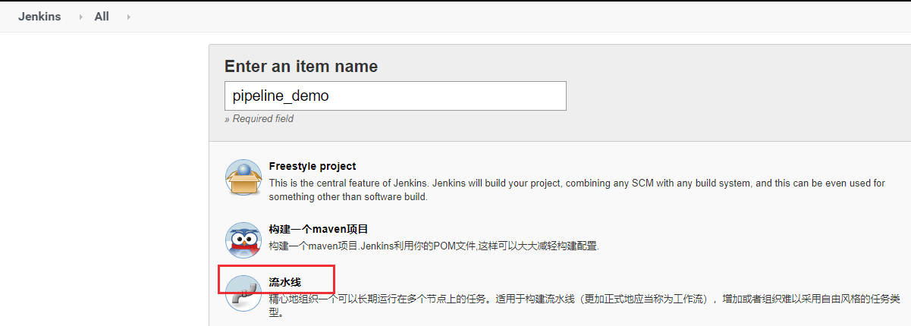
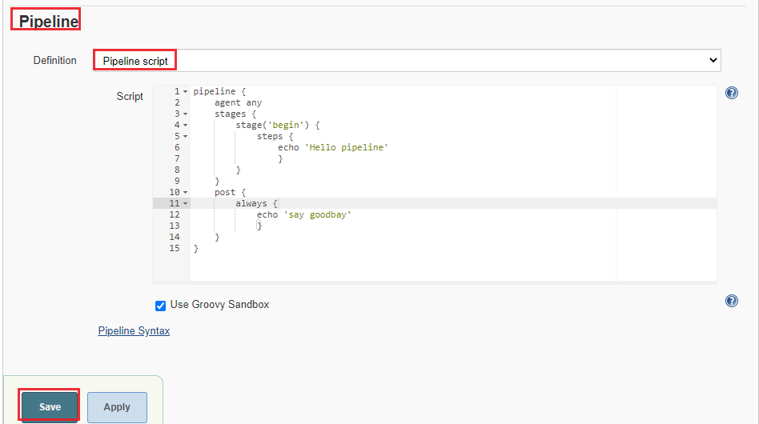
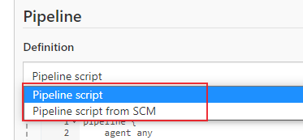
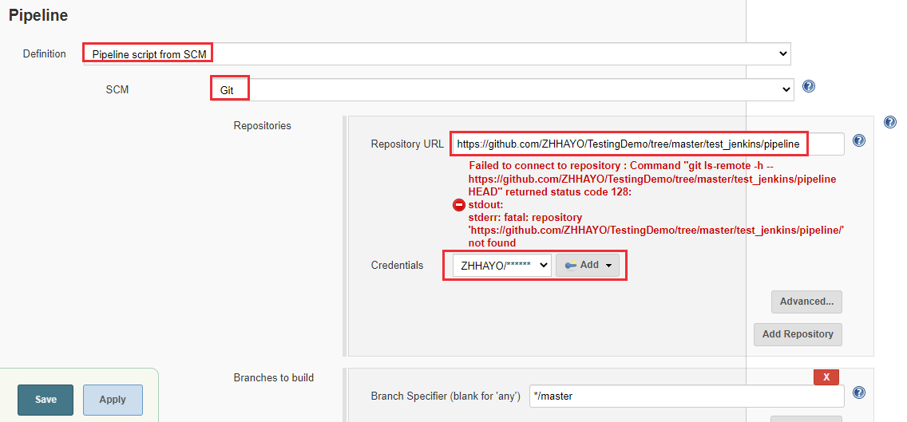
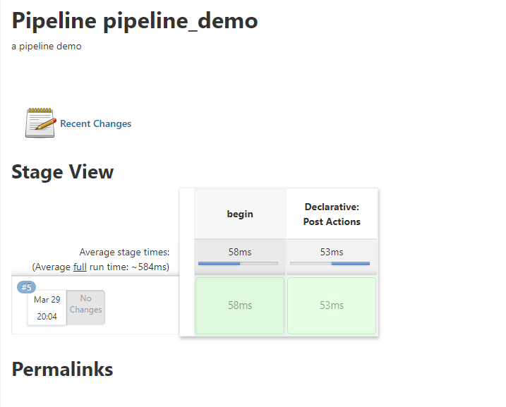

# 持续集成：Jenkins Pipeline语法介绍
Pipeline在Unix/Linux系统中经常用到，Pipeline将一个命令/程序/进程的输出发送到另一个命令/程序/进程，以进行进一步处理。比如：`cat test.txt | grep test1`。Jenkins 中的Pipeline借用了Unix/Linux中的 Pipeline思路，实现像流水线一样来调度Jenkins任务，通过Jenkinsfile来描述整个持续集成流程。

<!--more-->


## 一个简单的 Pipeline项目

先来看看如何在Jenkins上创建一个简单的Pipeline。

### 新建pipeline任务
新建一个pipeline任务


可以设置构建触发方式。

接下来开始编写Pipeline脚本，可选择Pipline script或者Pipline script from SCM。

- Pipline script模式是将脚本写在下面的输入框中
- Pipline script from SCM是将Pipeline script放到Git或者SVN上，执行的时候从上面拉下来执行。

###  Pipeline Script

选择 Pipeline Script，编写如下代码:

```Jenkins
pipeline {
    agent any
    stages {
        stage('begin') {
            steps {
                echo 'Hello pipeline'
                }
        }
    }
    post {
        always {
            echo 'say goodbay'
            }
    }
}
```
* stages：添加执行步骤
* post：任务执行完成后执行的操作




### Pipeline Script from SCM
Pipeline Script除了写在jenkins界面以外，也可以放入git源码库进行管理


在 Jenkins Pipeline任务中选择 Pipeline script from SCM


添加git源码地址，在 Script Path中填写需要运行的Jenkinsfile文件所在的地址


### 构建

创建完成后保存，点击Build Now，我们可以看到不同构建阶段进度


构建日志：


## Jenkinsfile语法
Jenkinsfile支持两种语法形式:
* Scripted pipeline - 脚本式流水线语法，基于 [Groovy](http://groovy-lang.org/syntax.html)语言构建的通用 DSL（Domain-specific language，领域特定语言）
* Declarative pipeline - 声明式流水线语法，在v2.5之后引入，支持结构化方式，提供了更丰富的语法特性。

> DSL是专注于某个应用领域的计算机语言。和Python、Java等这种通用语言（General-purpose Language, GPL）不同的是，DSL是一种为了特定领域而设计的开发语言，比如Web 应用使用的HTML、可扩展标记语言XML、SQL语言等。

通常情况下，流水线中声明式和脚本式语法结合使用。

### Declarative pipeline

声明式流水线语法必须包含在一个 pipeline块内: 

````
pipeline { 
	/* Declarative Pipeline */
}
````

pipeline块中主要由[Sections](https://www.jenkins.io/doc/book/pipeline/syntax/#declarative-sections), [Directives](https://www.jenkins.io/doc/book/pipeline/syntax/#declarative-directives), [Steps](https://www.jenkins.io/doc/book/pipeline/syntax/#declarative-steps), 或者赋值语句组成。

```sh
pipeline {
    agent any
    stages {
        stage('begin') {
            steps {
                echo 'Hello pipeline'
                }
        }
    }
    post {
        always {
            echo 'say goodbay'
        }
    }
}
```
#### Sections

Sections包括agent、stages、steps和post。

##### agent

agent定义 pipeline执行节点，必须在`pipeline` 块的顶层定义。

主要参数：

* `any`：可以在任意可用的 agent上执行pipeline
* `none`：pipeline将不分配全局agent，每个 stage分配自己的agent
* `label`：指定运行节点agent的 Label
* `node`：自定义运行节点配置,
	* 指定 label
	* 指定 customWorkspace
* `docker`：使用给定的容器执行流水线。
* `dockerfile`：使用源码库中包含的Dockerfile构建的容器来执行Pipeline。
* `kubernetes`：在kubernetes集群执行Pipeline

上述参数也可以用于stage中。

示例脚本：

```sh
pipline {
    agent {
        node {
            label "myslave"
            customWorkspace "myWorkspace"
        }
    }
}
```
##### stages
包含一个或多个 stage, Pipeline的大部分工作在此执行。stages也是必须指定的指令，没有参数。此外，每个 pipeline块中必须只有一个 stages。

stage也必须指定，需要定义stage的名字：

```groovy
pipeline {
    agent any
    stages {
        stage('init') {
            steps {
                echo 'Hello World'
            }
        }
    }
}
```

##### steps

steps位于stage块中，也是必须设置的指令，无参数。

steps块中可以包含script块，可用于存放[Scripted Pipeline](https://www.jenkins.io/doc/book/pipeline/syntax/#scripted-pipeline) 脚本：

```sh
pipeline {
    agent any
    stages {
        stage('Example') {
            steps {
                echo 'Hello World'

                script {
                    def browsers = ['chrome', 'firefox']
                    for (int i = 0; i < browsers.size(); ++i) {
                        echo "Testing the ${browsers[i]} browser"
                    }
                }
            }
        }
    }
}
```

##### post

post是在Pipeline或者 stage执行结束后的操作，不是必须出现的指令，可设置以下触发条件：

* `always`：无论 Pipeline或者stage运行完成的状态如何都会运行
* `changed`：只有当前 Pipeline或者stage运行的状态与先前运行状态不同时才能运行
* `fixed`：只有当前一次构建失败或者不稳定，而当前 Pipeline或者stage运行成功时运行
* `regression`：前一次运行成功，而当前Pipeline或者stage运行状态为failure, unstable 或者 aborted时运行
* `aborted`：只有当前 Pipeline或者stage处于“aborted”状态时才能运行。通常是手动终止。
* `failure`：当前 Pipeline或者stage处于“failed”状态时才运行
* `success`：当前 Pipeline或者stage具有“success”状态时才运行
* `unstable`：当前 Pipeline或者stage具有“unstable”状态才运行
* `unsuccessful`：当前 Pipeline或者stage不是“success”状态时运行
* `cleanup`：不管Pipeline或stage的状态如何，在每一个post条件被执行之后运行。

示例脚本：

```sh
pipeline {
    agent any
    stages {
        stage('init') {
            steps {
                echo 'Hello World'
            }
        }
    }
    post {
        success {
            echo 'success!'
            sleep 2        
        }

        always {
            echo 'goodbye'
        }
    }
}
```
#### Directives

Declarative pipeline也包含了各种指令，比如environment，options，parameters，triggers等，指令不是必须出现的指令。

##### environment

定义 Pipeline或stage运行时的环境变量，位于pipeline块顶部的 `environment` 定义的环境变量适用于流水线中的所有步骤，`stage` 中定义的 `environment` 只能应用于 `stage` 中的步骤。
```sh
pipeline {
    agent any
    environment { 
        CC = 'clang'
    }
    stages {
        stage('Example') {
            environment { 
                hlw = 'hello world'    
            }
            steps {
                echo hlw
            }
        }
    }
}
```

##### options
options指令允许在Pipeline内部定义 pipeline专有属性。

pipeline可用选项：
* `buildDiscarder`：保持构建的最大个数，超过最大构建数后会丢弃以前的构建。
* `checkoutToSubdirectory`：在工作区的子目录中执行自动源代码控制checkout 。
* `disableConcurrentBuilds`：禁止并行执行 pipeline任务，可用于防止同时访问共享资源。
* `disableResume`：如果控制器重启，不允许管道恢复。
* `newContainerPerStage`：与docker或dockerfile顶级代理一起使用。指定后，每个阶段将运行在同一节点上的新容器实例中，而不是所有阶段都运行在同一个容器实例中。
* `overrideIndexTriggers`：允许重写分支索引触发器的默认处理方法。如果分支索引触发器在多分支或组织标签处被禁用，`options { overrideIndexTriggers(true) }`将仅为该job启用。否则，`options { overrideIndexTriggers(false) }`将只禁用该job的分支索引触发器。
* `preserveStashes`：保留已完成构建的stashes ，以便在stage 重启时使用。例如: `options {preserveStashes()}`用于保存最近完成构建的stashes ，或者`options {preserveStashes(buildCount: 5)}`用于保存最近完成构建的五个堆栈。
* `quietPeriod`：为Pipeline设置静默期(以秒为单位)，覆盖全局默认值。例如: `options {quietPeriod(30)}`
* `skipDefaultCheckout`：在agent指令中，默认情况下跳过从源代码Checkout代码。例如: `options {skipDefaultCheckout()}`
* `skipStagesAfterUnstable`：一旦构建状态变为 “Unstable“ 状态，就跳过stages。例如: `options {skipstagesafterstable ()}`
* `retry`：失败后，重试整个 Pipeline的次数例如: `options { retry(3) }`
* `timeout`：为Pipeline的运行设置一个超时时间，在此之后，Jenkins就中止Pipeline。例如: `options {timeout(time: 1, unit: 'HOURS')}` 
* `timestamps`：在所有由Pipeline运行生成的控制台输出前加上间。例如: `options {timestamp ()}`
* `parallelsAlwaysFailFast`：将流水线中所有后续并行阶段的failfast设置为true，用于并行执行stage中。例如: `options {parallelsAlwaysFailFast()}`

stage的options指令类似于Pipeline的options指令。然而，stage选项只能包含`retry`, `timeout`, 或 `timestamps` 的步骤，或者与stage相关的声明性选项，比如`skipDefaultCheckout`。

在stage中，在进入agent或检查任何 when条件之前调用options指令中的步骤。

stage 可用选项：

- `skipDefaultCheckout`
- `timeout`：为当前stage的运行设置一个超时时间
- `retry`
- `timestamps`

示例脚本：


```sh
pipeline {
    agent any
    options {
    	timeout (time: 1, unit: 'HOURS')
    	buildDiscarder(logRotator(numToKeepStr: '2')
    	retry(5)
	}
    stages {
        stage('init') {
            options {
                timeout(time: 30, unit: 'SECONDS') 
            }
            steps {
                echo 'Hello World'
            }
        }
    }
}
```

##### parameters

`parameters` 指令定义 pipeline的专有参数列表，支持参数类型: 

- `string`：字符串类型
- `text`：文本, 可包括多行
- `booleanParam`：布尔参数
- `choice`：choice 参数
- `password`：密码参数

示例脚本：

```sh
pipeline {
    agent any
    parameters {
        string(name: 'DEPLOY_ENV', defaultValue: 'staging', description: '') 
        text(name: 'DEPLOY_TEXT', defaultValue: 'One\nTwo\nThree\n', description: '') 
        booleanParam(name: 'DEBUG_BUILD', defaultValue: true, description: '')
        choice(name: 'CHOICES', choices: ['one', 'two', 'three'], description: '')
        password(name: 'PASSWORD', defaultValue: 'SECRET', description: 'A secret password')
    }
    stages {
        stage('Example') {
            steps {
                echo "${params.DEPLOY_ENV}"
                echo "${params.PASSWORD}"
            }
        }
    }
}
```

##### triggers
`triggers` 指令定义了 Pipeline自动化触发的方式，主要包括3种触发器：

* `cron`：接受一个cron样式的字符串来定义 Pipeline触发的间隔周期，例如: `triggers { cron('H */4 * * 1-5') }`
* `pollSCM`：接受一个cron样式的字符串来定义 Jenkins检查SCM源码更新的常规间隔；如果存在新的更改，Pipeline将被重新触发。例如: `triggers { pollSCM('H */4 * * 1-5') }`
* `upstream`：接受以逗号分隔的job字符串和阈值。当字符串中的任何作业以最小阈值完成时，将重新触发Pipeline。例如: `triggers { upstream(upstreamProjects: 'job1,job2', threshold: hudson.model.Result.SUCCESS) }`

更多cron表达式语法介绍可参考 [Linux cron定时介绍](https://blog.csdn.net/u010698107/article/details/121593309)。

示例脚本：

```sh
pipeline {
    agent any
    triggers {
        cron('H */4 * * 1-5')
    }
    stages {
        stage('init') {
            steps {
                echo 'Hello World'
            }
        }
    }
}
```
##### stage

前面介绍过，stage指令位于stages块中，也是必须设置的指令，应至少包含一个。

##### tools

定义自动安装和`PATH`上的工具。如果没有指定agent，则忽略此参数。

支持如下工具：

- maven
- jdk
- gradle

示例脚本：

```sh
pipeline {
    agent any
    tools {
        maven 'apache-maven-3.0.1' 
    }
    stages {
        stage('Example') {
            steps {
                sh 'mvn --version'
            }
        }
    }
}
```

其中工具名 `apache-maven-3.0.1` 必须在jenkins中预先配置：Manage Jenkins -> Global Tool Configuration 。

##### input

`stage` 的 `input` 指令允许使用 [`input` step](https://jenkins.io/doc/pipeline/steps/pipeline-input-step/#input-wait-for-interactive-input)提示输入。 在应用了此 `options` 后，进入 `stage` 的 `agent` 或评估 `when` 条件前， `stage` 将暂停。 如果 `input` 被同意, `stage` 将会继续。

可配置选项如下：

- `message`：必须指定，是呈现给用户的信息。
- `id`：可选标识符， 默认为 `stage` 名称。
- `ok`： "ok"按钮的可选文本。
- `submitter`：以逗号分隔的用户列表或允许提交 `input` 的外部组名。默认允许任何用户。
- `submitterParameter`：环境变量的可选名称。如果存在，用 `submitter` 名称设置。
- `parameters`：提示提交者提供的一个可选的参数列表。 和前面介绍的`parameters` 指令定义方法一样。

示例脚本：

```sh
pipeline {
    agent any
    stages {
        stage('Example') {
            input {
                message "Should we continue?"
                ok "Yes, we should."
                submitter "alice,bob"
                parameters {
                    string(name: 'PERSON', defaultValue: 'Mr Jenkins', description: 'Who should I say hello to?')
                }
            }
            steps {
                echo "Hello, ${PERSON}, nice to meet you."
            }
        }
    }
}
```

##### when

`when` 指令位于stage指令中，允许流水线根据给定的条件决定是否应该执行阶段，必须包含至少一个条件。

支持以下嵌套条件：

- branch：当正在构建的分支与分支模式匹配时执行这个阶段, 例如: `when { branch 'master' }`。注意，只适用于多分支流水线。

- `buildingTag`：当构建正在构建标记时执行该阶段。例如: `when {buildingTag()}`

- environment：当指定的环境变量是给定的值时，执行这个步骤, 例如: `when { environment name: 'DEPLOY_TO', value: 'production' }`

- `changelog`：如果构建的SCM变更日志包含一个给定的正则表达式模式，则执行该阶段，例如: `when { changelog '.*^\\[DEPENDENCY\\] .+$' }`

- `changeset`：如果构建的SCM变更集包含一个或多个匹配给定模式的文件，则执行该阶段。例如: `when { changeset "**/*.js" }`

- `changeRequest`：如果当前构建是为了一个“change request”(比如GitHub的Pull request, GitLab上的Merge request, Gerrit中的change等)时执行这个阶段。如果没有传递参数，stage在每次变更请求上运行，例如: `when { changeRequest() }`

- `environment`：当指定的环境变量设置为给定的值时执行，例如: `when { environment name: 'DEPLOY_TO', value: 'production' }`

- `equals`：当期望值与实际值相等时执行，例如: `when { equals expected: 2, actual: currentBuild.number }`

- `expression`：当指定的Groovy表达式为true时执行, 例如: `when { expression { return params.DEBUG_BUILD } }`。注意，当表达式返回字符串时，它们必须转换为布尔值，或者返回null来计算为false。简单地返回“0”或“false”仍然会被计算为“true”。

- `tag`：如果`TAG_NAME`变量与给定的模式匹配则执行该阶段。例如: `when { tag "release-*" }`。如果提供了一个空模式，那么如果存在TAG_NAME变量，则该阶段将执行(与 `buildingTag()` 相同)。

- `not`：当嵌套条件是 `false` 时执行这个阶段，它必须包含一个条件，例如: `when { not { branch 'master' } }`

- `allOf`：当所有的嵌套条件都为 `true` 时执行，必须包含至少一个条件，例如: `when { allOf { branch 'master'; environment name: 'DEPLOY_TO', value: 'production' } }`

- `anyOf`：当至少有一个嵌套条件为 `true` 时执行，必须包含至少一个条件，例如: `when { anyOf { branch 'master'; branch 'staging' } }`

- `triggeredBy`：当当前构建被给定的参数触发时执行。例如: 
  - `when { triggeredBy 'SCMTrigger' }`
  - `when { triggeredBy 'TimerTrigger' }`
  - `when { triggeredBy 'BuildUpstreamCause' }`
  - `when { triggeredBy cause: "UserIdCause", detail: "vlinde" }`

在进入 `stage` 的 `agent` 前评估 `when`

- 默认情况下，如果定义了该`stage` 的 `agent` ，则`stage`的 `when` 条件将在进入该`stage`的`agent`之后计算。但是，这可以通过在 `when` 块中指定 `beforeAgent` 选项来更改。如果 `beforeAgent` 设置为 `true` ，则首先计算 `when` 条件，只有当条件计算为 `true` 时才进入 `agent`。

在 `input` 指令之前评估 `when`

- 默认情况下，如果定义了 `stage` 的 `when` 条件，则不会在 `input` 之前求值。但是，这可以通过在 `when` 块中指定 `beforeInput` 选项来更改。如果 `beforeInput` 设置为 `true` , `when` 条件将首先计算，只有当条件计算为true时才会进入`input `。
- `beforeInput true`优先级高于`beforeAgent true`。

在 `options` 指令之前评估 `when`

- 默认情况下，如果`stage`定义了任何 `options` ，`stage` 的 `when` 条件将在进入该`stage`的`options`之后计算。但是，这可以通过在 `when` 块中指定 `beforeOptions` 选项来更改。如果 `beforeOptions` 设置为true，则首先计算 `when` 条件，只有当条件计算为 `true` 时才会进入 `options`。
- `beforeOptions true`优先级高于`beforeInput true`和`beforeAgent true`。

示例脚本：

```sh
pipeline {
    agent any
    stages {
        stage('Example Build') {
            steps {
                echo 'Hello World'
            }
        }
        
        stage('Deploy1') {
            when {
                branch 'production1'
            }
            steps {
                echo 'Deploying1'
            }
        }
        
        stage('Deploy2') {
            when {
                allOf {
                    branch 'production2'
                    environment name: 'DEPLOY_TO', value: 'production2'
                }
            }
            steps {
                echo 'Deploying2'
            }
        }
        
        stage('Deploy3') {
            when {
                beforeInput true
                branch 'production3'
            }
            input {
                message "Deploy to production3?"
                id "simple-input"
            }
            steps {
                echo 'Deploying3'
            }
        }
    }
}
```

#### 并行执行

声明式流水线支持多阶段并行执行，`Parallel` 块中，当其中任何一个阶段失败时，可以通过添加`failFast true`来强制所有并行阶段都中止。也可以在管道定义中添加一个`options` : `options {parallelsAlwaysFailFast() }`

```sh
pipeline {
    agent any
    stages {
        stage('Non-Parallel Stage') {
            steps {
                echo 'This stage will be executed first.'
            }
        }
        stage('Parallel Stage') {
            when {
                branch 'master'
            }
            failFast true
            parallel {
                stage('Branch A') {
                    agent {
                        label "for-branch-a"
                    }
                    steps {
                        echo "On Branch A"
                    }
                }
                stage('Branch B') {
                    agent {
                        label "for-branch-b"
                    }
                    steps {
                        echo "On Branch B"
                    }
                }
			}
		}
	}
}
```

声明式流水线可以将stage放入矩阵单元中，Matrix可以定义一个多维的 name-value组合矩阵，并将其并行运行。具体使用方法可以参考[官方文档](https://www.jenkins.io/doc/book/pipeline/syntax/#declarative-matrix)。

### Scripted pipeline

Scripted pipeline是基于groovy语法定制的一种DSL语言，它的灵活性更高，具有更好的可扩展性。

使用它需要了解一定的groovy语法知识，可参考如下文档：

- [http://groovy-lang.org/syntax.html](http://groovy-lang.org/syntax.html)
- https://www.w3cschool.cn/groovy/

请看下面的Scripted pipeline脚本，使用了if/else和try/catch/finally流程控制方法，无论构建状态是什么都发送邮件：
```sh
node('win_agent') {
    try {
        // 自动化测试 
        stage('Test') {
            TEST_STATU = bat (
                script: '''echo autotest''',
                returnStatus: true
            ) == 0
            
            if ("${TEST_STATU}" == "false") {
                catchError(stageResult: 'FAILURE') {
                    echo "测试未通过"
                    env.LOG = "测试未通过"
                }
            } else {
                echo "测试通过"
                env.LOG = "测试通过"
            }
        }
    } catch (exc) {
    	currentBuild.result = 'FAILURE'
        echo "Something failed, I'm in the catch block."
  	} finally {
    	stage("email") {
            emailext (
                subject: '\'构建通知:${PROJECT_NAME} - Build # ${BUILD_NUMBER} - ${BUILD_STATUS}\'',
                to: "XXXXXXXX@163.com", 
                body: '${FILE,path="email.html"}',
                )
        }
  }
}
```

## DSL方法步骤

前面介绍Declarative pipeline和Scripted pipeline语法的实例中，使用到了一些方法步骤，比如`sh`、`echo`、`emailext`等，它们是jenkins插件提供的一些方法步骤，下面举2个例子：

1、bat/sh方法：

```groovy
STATU = bat (
                script: '''echo 666''',
                returnStatus: true
            ) == 0
echo ${STATU}
```

2、catchError方法：捕获到异常后，设置当前构建或者阶段状态设置为FAILURE，并继续执行Pipeline后面的步骤:

```groovy
stage('Test') {
    STATU = bat (
                script: '''echo 666''',
                returnStatus: true
            ) == 0
    
    if ("${TEST}" == "false") {
        catchError(stageResult: 'FAILURE') {
            echo "测试未通过"
        }
    } else {
        echo "测试通过"
    }
}
```

也可以用`try-catch`来实现。

当前jenkins平台支持的更多步骤可以访问 [http://<host>:<port>/pipeline-syntax/html](http://<host>:<port>/pipeline-syntax/html) 查看。


## 小结

本文介绍了两种pipeline脚本语法，使用pipeline脚本可以使任务调度更加灵活，特别是对于比较复杂的项目。

另外，这两种pipeline脚本语法通常会一起使用，为了让代码更加简洁，建议使用pipeline共享库，将groovy脚本放到共享库中，这样多个pipeline项目就可以共用这些方法，大大减少代码冗余。

参考文档：

1. https://www.jenkins.io/zh/doc/book/pipeline/
1. https://www.jenkins.io/doc/book/pipeline/syntax/
1. https://www.jenkins.io/zh/doc/book/pipeline/syntax
2. https://www.jenkins.io/blog/2019/12/02/matrix-building-with-scripted-pipeline/
2. https://www.jenkins.io/blog/2016/07/01/html-publisher-plugin/#snippet-generator-to-the-rescue
2. https://www.jenkins.io/doc/pipeline/examples/


