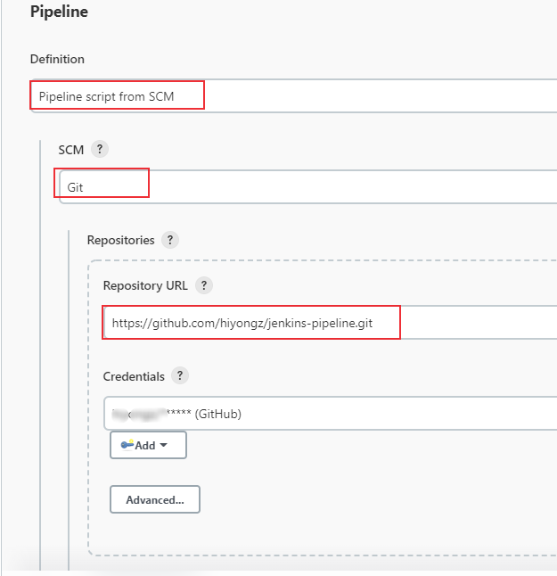
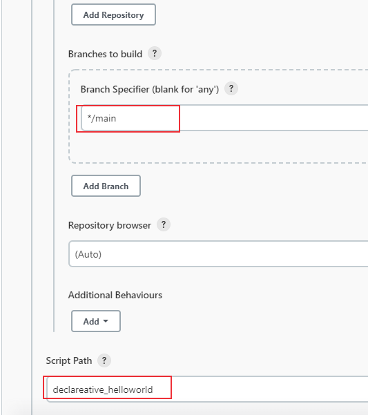
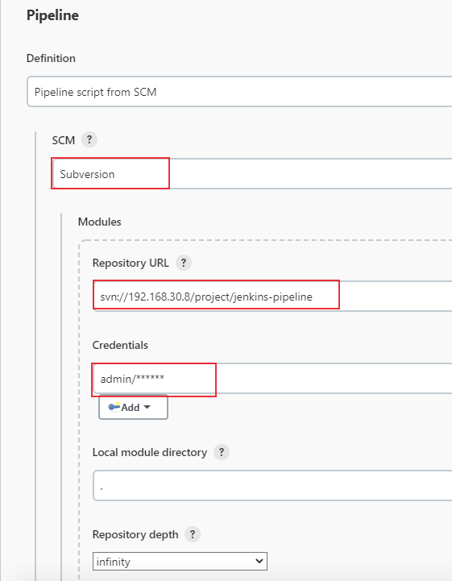
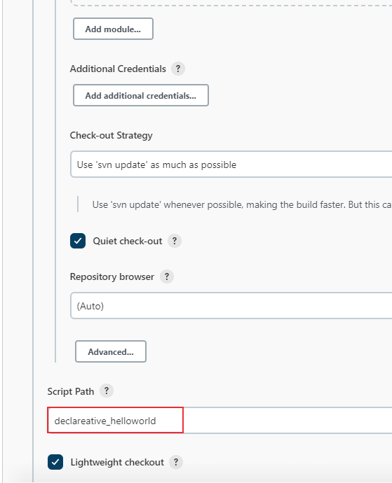

# 持续集成：Jenkinsfile使用方法介绍
在pipeline项目中，可以直接在jenkins的web UI上编写pipeline脚本，还有一种方法是使用Jenkinsfile，它放在源码管理库中，比如github、SVN等。为了使pipeline项目管理更加方便，推荐使用这种方式。本文将介绍pipeline项目如何使用Jenkinsfile。


## 1. 编写jenkinsfile

在[持续集成：Jenkins Pipeline语法介绍](https://blog.csdn.net/u010698107/article/details/122913713) 中介绍了pipeline支持的两种语法：Declarative 和 Scripted Pipeline。编写pipeline脚本保存为jenkinsfile文本文件，示例脚本如下：

```
pipeline {
    agent any
    stages {
	stage('begin'){
		steps {
			echo 'begin'
			sleep 2
		}
	}
	stage('running'){
		steps {
		   echo 'running'
		   script {
			   RUNNING_STATU = sh (
					script: "echo 'running'",
					returnStatus: true
			   ) == 0
			
			   if ("${RUNNING_STATU}" == "false") {
					catchError(stageResult: 'FAILURE') {
						echo "执行失败"
					}
					sh "EXIT 1"
				}
			}
			sleep 2
		}
	}
	stage('finish'){
		steps {
			echo 'finish'
			sleep 2
		}
	}
    }
    post {
        success {
            echo 'success!'
            sleep 2
        }
        failure {
            echo 'failed...'
            sleep 2
        }
        always {
            echo 'goodbye'
        }
    }
}
```

保存脚本为文本文件：declareative_helloworld，上传到github或者SVN服务器中。

## 2. pipeline项目配置

创建一个pipeline项目（可选择Pipeline或者多分支流水线），pipeline脚本定义选择Pipeline script from SCM，

Git库配置方法：





SVN库配置方法：





## 3. 构建

配置完成后保存，构建时会检出jenkinsfile后执行jenkinsfile中的流水线步骤。比如SVN库的构建日志如下： 

```bash
Started by user admin
Obtained declareative_helloworld from svn svn://192.168.30.8/project/jenkins-pipeline
[Pipeline] Start of Pipeline
[Pipeline] node
Running on master in /tmp/jenkins_slave/workspace/jenkinsfile_demo2
[Pipeline] {
[Pipeline] stage
[Pipeline] { (Declarative: Checkout SCM)
[Pipeline] checkout
Checking out a fresh workspace because /tmp/jenkins_slave/workspace/jenkinsfile_demo2 doesn't exist
Cleaning local Directory .
Checking out svn://192.168.30.8/project/jenkins-pipeline at revision '2022-04-19T20:22:48.150 +0800' --quiet
At revision 35

[Pipeline] }
[Pipeline] // stage
[Pipeline] withEnv
[Pipeline] {
[Pipeline] stage
[Pipeline] { (begin)
[Pipeline] echo
begin
[Pipeline] sleep
Sleeping for 2 sec
[Pipeline] }
[Pipeline] // stage
[Pipeline] stage
[Pipeline] { (running)
[Pipeline] echo
running
[Pipeline] script
[Pipeline] {
[Pipeline] sh
+ echo running
running
[Pipeline] }
[Pipeline] // script
[Pipeline] sleep
Sleeping for 2 sec
[Pipeline] }
[Pipeline] // stage
[Pipeline] stage
[Pipeline] { (finish)
[Pipeline] echo
finish
[Pipeline] sleep
Sleeping for 2 sec
[Pipeline] }
[Pipeline] // stage
[Pipeline] stage
[Pipeline] { (Declarative: Post Actions)
[Pipeline] echo
goodbye
[Pipeline] echo
success!
[Pipeline] sleep
Sleeping for 2 sec
[Pipeline] }
[Pipeline] // stage
[Pipeline] }
[Pipeline] // withEnv
[Pipeline] }
[Pipeline] // node
[Pipeline] End of Pipeline
Finished: SUCCESS
```

