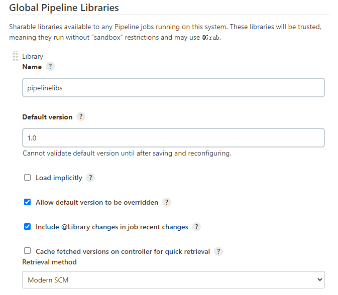
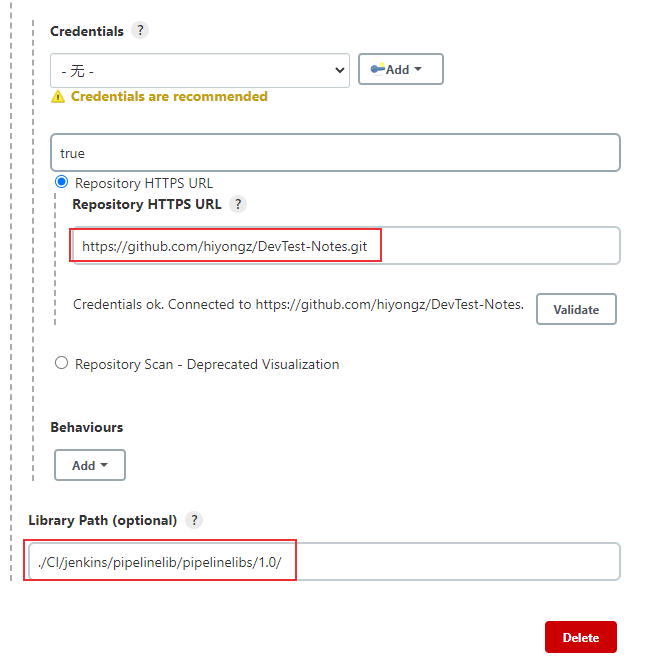

# 持续集成：Jenkins Pipeline共享库定义和使用
通常情况下多个流水线项目需要使用相同的功能，流水线支持创建 "共享库" ，把这些公共的方法类定义在一个仓库中，使多个pipeline项目可以共享这些库，这有助于减少代码冗余。

<!--more-->

下面来介绍Jenkins如何配置和使用Pipeline共享库。

## Pipeline 共享库定义

共享库（shared library）是一些 Groovy 脚本的集合，可以在外部源代码控制仓库（Git 或者Subversion）中托管Pipeline共享库。配置好共享库之后，可以在Pipeline项目中对它进行调用。

### 目录结构

将共享库放到SVN或者Git服务器上，其目录结构如下：

```bash
(root)
+- src                     # Groovy source files
|   +- org
|       +- foo
|           +- Bar.groovy  # for org.foo.Bar class
+- vars
|   +- foo.groovy          # for global 'foo' variable
|   +- foo.txt             # help for 'foo' variable
+- resources               # resource files (external libraries only)
|   +- org
|       +- foo
|           +- bar.json    # static helper data for org.foo.Bar
```

`src` 目录和标准的Java源代码目录一样，主要提供类库，存放具体实现方法。

`vars` 目录存放脚本文件的变量可以在pipeline中使用，也就是全局变量，文件的名称是Pipeline中变量的名称。

`resources` 目录存放一些配置文件，允许从外部库使用 `libraryResource` 步骤来加载相关的非groovy文件。目前，内部库不支持此功能。

### 创建共享库

目录结构如下

```bash
\---1.0
    +---resources
    +---src
    |   \---com
    |       \---hiyongz
    |               MyLib.groovy
    |
    \---vars
            log.groovy
```

MyLib.groovy脚本内容：

```groovy
// 获取时间 格式：20201208200419
def getTime() {
    return new Date().format('yyyy-MM-ddHHmmss')
}

def getJenkinsHome(){
	return "${JENKINS_HOME}";
```

log.groovy脚本：

```groovy
def info(message) {
    echo "INFO: ${message}"
}
```


### 配置 Global Shared Libraries

进入*Manage Jenkins » Configure System » Global Pipeline Libraries*，点击Add

下面介绍SVN和GitHub两种共享库配置方法。

#### SVN库配置

SVN源码库svn://192.168.30.8/project/pipelinelibs 下存放上面介绍的共享库。




#### GitHub库配置

也可以将共享库放到github上，路径为 `DevTest-Notes/CI/jenkins/pipelinelib/pipelinelibs/` 。

和SVN配置方法类似，选择GitHub




其它Git仓库配置方法类似。

## 使用共享库

配置好共享库后就可以在pipeline中调用其中提供的方法了，新建一个pipeline库，脚本如下：

```groovy
// @Library('pipelinelibs@1.0') _  // SVN库 
@Library('pipelinelibs2@main') _  // Github库 
import com.hiyongz.MyLib

def mylib = new MyLib();

println mylib.getTime();
println mylib.getJenkinsHome();
log.info "中文"
```

上述脚本中的下划线 `_`可以省略，如果 `@Libray` 后面紧接的一行不是 `import` 语句，就需要这个下划线。

构建日志如下：

```bash
[Pipeline] Start of Pipeline
[Pipeline] echo
2022-02-12 20:30:23
[Pipeline] echo
/var/jenkins_home
[Pipeline] echo (hide)
INFO: 中文
```


参考文档：

1. https://www.jenkins.io/doc/book/pipeline/shared-libraries/ 

2. https://www.jenkins.io/zh/doc/book/pipeline/shared-libraries/

   


