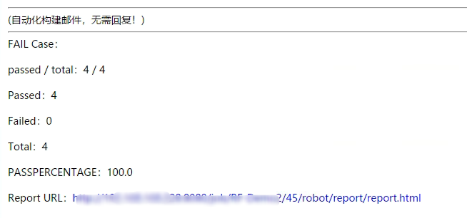
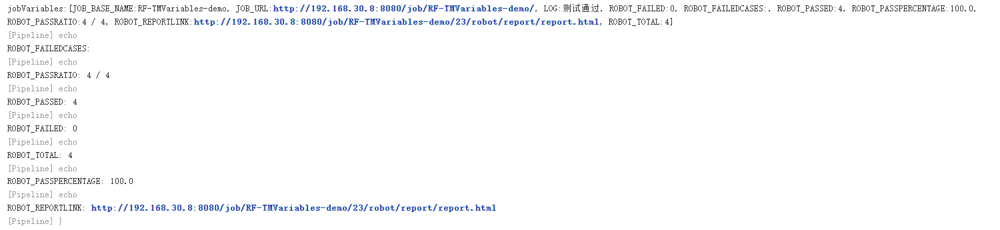
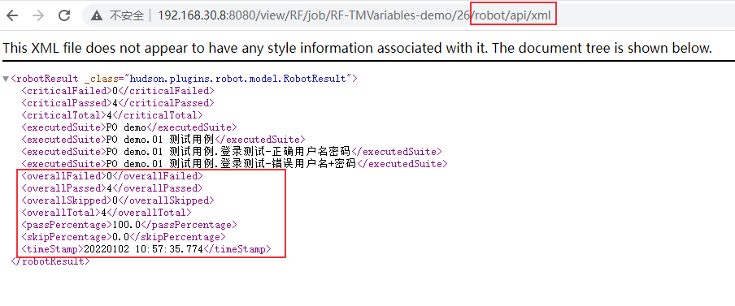
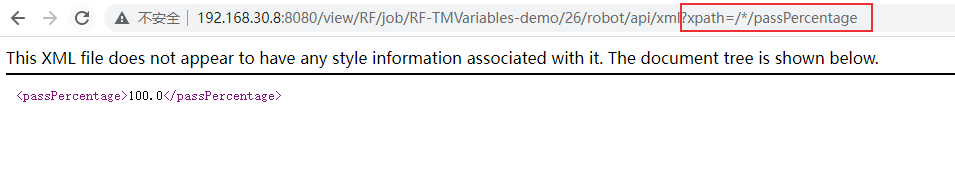

# 持续集成：Jenkins中获取Robot Framework插件返回的Robot变量
在 [Jenkins集成Robot Framework](https://blog.csdn.net/u010698107/article/details/122278661) 中介绍了Jenkins如何集成Robot Framework测试框架，本文介绍如何在邮件报告中显示测试结果（比如通过率、测试报告链接等参数）。


<!--more-->

Robot Framework插件返回了以下参数：

- `${ROBOT_FAILEDCASES}` - 失败用例列表
- `${ROBOT_PASSPERCENTAGE, onlyCritical}` - 通过率 (passed / total * 100%)，onlyCritical默认为false。
- `${ROBOT_PASSRATIO, onlyCritical}` - 'passed / total' 格式的结果，onlyCritical默认为false。
- `${ROBOT_FAILED}` - 失败用例数
- `${ROBOT_PASSED}` - 通过用例数
- `${ROBOT_TOTAL}` - 总用例数
- `${ROBOT_REPORTLINK}` - log.html文件链接。

要在邮件报告中使用这些参数另外还需要安装 [Email Extension](https://plugins.jenkins.io/email-ext/) 和 [Token Macro](https://plugins.jenkins.io/token-macro/) 这两个插件。

## 邮件直接调用

插件安装完成后，可以在HTML模板中可以直接调用上述参数：

```html
<hr/>(自动化构建邮件，无需回复！)<br/><hr/>

FAIL Case：$ROBOT_FAILEDCASES<br/><br/>

passed / total：$ROBOT_PASSRATIO<br/><br/>

Passed：${ROBOT_PASSED}<br/><br/>

Failed：${ROBOT_FAILED}<br/><br/>

Total：${ROBOT_TOTAL}<br/><br/>

PASSPERCENTAGE：$ROBOT_PASSPERCENTAGE<br/><br/>

Report URL：<a href="${ROBOT_REPORTLINK}">${ROBOT_REPORTLINK}</a><br/><br/
<hr/>
```

执行Robot framework自动化测试的pipeline 脚本 (scripted pipeline语法) 如下：

```groovy
node('win_agent') { //测试代理节点
    try {
        // 自动化测试 
        stage('Test') {
            TEST_STATU = bat (
                script: '''robot -d %WORKSPACE%/rf_results D:/Testcases''',
                returnStatus: true
            ) == 0
        }
        
        stage('Test Report') {
            script {
              step(
                    [
                      $class              : 'RobotPublisher',
                      outputPath          : 'rf_results',
                      outputFileName      : 'output.xml',
                      reportFileName      : 'report.html',
                      logFileName         : 'log.html',
                      otherFiles          : '*.png,*.jpg',
                      disableArchiveOutput: true,
                      passThreshold       : 100,
                      unstableThreshold   : 100,
                    ]
              )
            }
        }
        
    } catch (error) {
        currentBuild.result = 'FAILURE'
        throw error        
    } finally {
        stage("email") {
            emailext (
                subject: '\'构建通知:${PROJECT_NAME} - Build # ${BUILD_NUMBER} - ${BUILD_STATUS}\'',
                to: "XXXXXXXXX@qq.com", 
                body: '${FILE,path="email.html"}',
                )
        }
    }
}


```

构建，执行效果如下：



## Groovy 脚本模板调用

Email Extension插件支持HTML Groovy 脚本模板，那么如何在HTML Groovy 脚本模板中展示测试结果呢？

下面介绍两种方案。

### 方案1：保存Robot变量

可以先将Robot变量保存到一个xml文件中，然后在template文件中解析这个生成的xml文件。

下面介绍具体实现思路。

**1、将Robot变量保存到环境变量中**

脚本如下：

```groovy
stage('Test Report') {
    script {
        step(
            [
                $class              : 'RobotPublisher',
                outputPath          : 'rf_results',
                outputFileName      : 'output.xml',
                reportFileName      : 'report.html',
                logFileName         : 'log.html',
                otherFiles          : '*.png,*.jpg',
                disableArchiveOutput: true,
                passThreshold       : 100,
                unstableThreshold   : 100,
            ]
        )
    }

    script {
        // 将测试结果保存到环境变量中
        env.ROBOT_FAILEDCASES = tm('${ROBOT_FAILEDCASES}')
        env.ROBOT_PASSRATIO = tm('${ROBOT_PASSRATIO}')
        env.ROBOT_PASSED = tm('${ROBOT_PASSED}')
        env.ROBOT_FAILED = tm('${ROBOT_FAILED}')
        env.ROBOT_TOTAL = tm('${ROBOT_TOTAL}')
        env.ROBOT_PASSPERCENTAGE = tm('${ROBOT_PASSPERCENTAGE}')                
        env.ROBOT_REPORTLINK = tm('${ROBOT_REPORTLINK}')
    }
}
```

其中`tm` 是Token Macro插件提供的方法。

**2、将变量保存到xml文件中**

可以使用groovy脚本来编写保存环境变量的方法，为了是代码更加简洁，将groovy脚本放到pipeline共享库中。

```groovy
def saveEnvToXml() {
	def jobVariables = currentBuild.getBuildVariables();
	println "jobVariables:${jobVariables}"; 
	println "ROBOT_FAILEDCASES: ${ROBOT_FAILEDCASES}";  
	println "ROBOT_PASSRATIO: ${ROBOT_PASSRATIO}";  
	println "ROBOT_PASSED: ${ROBOT_PASSED}";  
	println "ROBOT_FAILED: ${ROBOT_FAILED}";  
	println "ROBOT_TOTAL: ${ROBOT_TOTAL}";  
	println "ROBOT_PASSPERCENTAGE: ${ROBOT_PASSPERCENTAGE}";               
	println "ROBOT_REPORTLINK: ${ROBOT_REPORTLINK}";  
}
```

saveEnvToXml()方法中保存变量到xml文件的代码这里省略，主要介绍实现思路。

执行结果如下图：



**3、groovy-html.template文件中解析xml文件，读取Robot变量。**

template文件使用groovy+HTML语法编写，使用groovy来解析xml文件，HTML展示结果。

pipeline完整脚本如下：

```groovy
@Library('pipelinelibs@1.0') _   // SVN库
import com.hiyongz.MyLib
def mylib = new MyLib();

node('win_agent') { //测试代理节点
    env.JOB_BASE_NAME = "${JOB_BASE_NAME}"
    env.JOB_URL = "${JOB_URL}"
    
    try {
        // 自动化测试 
        stage('Test') {
            TEST_STATU = bat (
                script: '''robot -d %WORKSPACE%/rf_results D:/Testcases''',
                returnStatus: true
            ) == 0
        }
        
        stage('Test Report') {
            script {
              step(
                    [
                      $class              : 'RobotPublisher',
                      outputPath          : 'rf_results',
                      outputFileName      : 'output.xml',
                      reportFileName      : 'report.html',
                      logFileName         : 'log.html',
                      otherFiles          : '*.png,*.jpg',
                      disableArchiveOutput: true,
                      passThreshold       : 100,
                      unstableThreshold   : 100,
                    ]
              )
            }           
            script {
                // 将测试结果保存到环境变量中
                env.ROBOT_FAILEDCASES = tm('${ROBOT_FAILEDCASES}')
                env.ROBOT_PASSRATIO = tm('${ROBOT_PASSRATIO}')
                env.ROBOT_PASSED = tm('${ROBOT_PASSED}')
                env.ROBOT_FAILED = tm('${ROBOT_FAILED}')
                env.ROBOT_TOTAL = tm('${ROBOT_TOTAL}')
                env.ROBOT_PASSPERCENTAGE = tm('${ROBOT_PASSPERCENTAGE}')       
                env.ROBOT_REPORTLINK = tm('${ROBOT_REPORTLINK}')
                
            }
            script {
                mylib.saveEnvToXml();
            }
        }
        
    } catch (error) {
        currentBuild.result = 'FAILURE'
        throw error        
    } finally {
        stage("email") {
            emailext (
                subject: '\'构建通知:${PROJECT_NAME} - Build # ${BUILD_NUMBER} - ${BUILD_STATUS}\'',
                to: "XXXXXXXXX@qq.com", 
                body: '''${SCRIPT,template="groovy-html.template"}''',
                )
        }
    }
}

```

### 方案2：Jenkins API读取结果

也可以直接在template文件中编写groovy脚本解析Robot Framework生成的output.xml文件，获取测试结果。这种方法缺点是output.xml文件可能比较大，且处理比较复杂。

更简单的方法是使用Jenkins API读取测试结果，jenkins支持以下3种方式：

- JSON API：`.../api/json`
- XML API：`.../api/xml`
- Python API：比如有 [JenkinsAPI](https://pypi.python.org/pypi/jenkinsapi), [Python-Jenkins](https://pypi.python.org/pypi/python-jenkins/), [api4jenkins](https://pypi.org/project/api4jenkins/), [aiojenkins](https://pypi.org/project/aiojenkins/) Python库

更多Jenkins API介绍可参考[持续集成：Jenkins API使用方法详细介绍]()，这里介绍一下xml api的用法。

进入Robot Results界面，在url后面添加 `/api/xml`，会返回如下xml内容：



可以看到robot framework测试结果，我们可以从这个api中提取结果。可以进一步使用xpath语法获取想要的值，获取通过率passPercentage：`../api/xml?xpath=/*/passPercentage`：



自动化脚本中可以使用curl命令获取通过率passPercentage：

```bash
$ curl -k --silent -L --user 用户名:API Token http://192.168.30.8:8080/view/RF/job/RF-TMVariables-demo/26/robot/api/xml?xpath=/*/passPercentage | tr '<' '\n' | egrep '^passPercentage>' | sed 's/.*>//g'
100.0
```

groovy脚本：

```groovy
def WORKFLOW_API_XML = sh ( script: "API_XML=\$(curl -k --silent -L --user 用户名:API Token http://192.168.30.8:8080/view/RF/job/RF-TMVariables-demo/26/robot/api/xml?xpath=/*/passPercentage | tr '<' '\n' | egrep '^passPercentage>' |  sed 's/.*>//g'); echo \${API_XML}", returnStdout: true ).trim();
```

使用json api会返回json格式的测试结果，获取到这些结果后，就有很多方法可以用来提取你想要的值。

参考文档：

1. [https://plugins.jenkins.io/robot/](https://plugins.jenkins.io/robot/)
2. [https://plugins.jenkins.io/email-ext/](https://plugins.jenkins.io/email-ext/)
2. https://www.jenkins.io/doc/book/using/remote-access-api/
3. [https://stackoverflow.com/questions/54751520/how-to-output-test-pass-failure-notification-to-slack-through-jenkins-when-runni](https://stackoverflow.com/questions/54751520/how-to-output-test-pass-failure-notification-to-slack-through-jenkins-when-runni)


