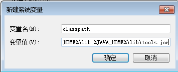
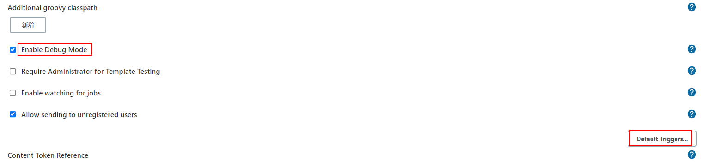
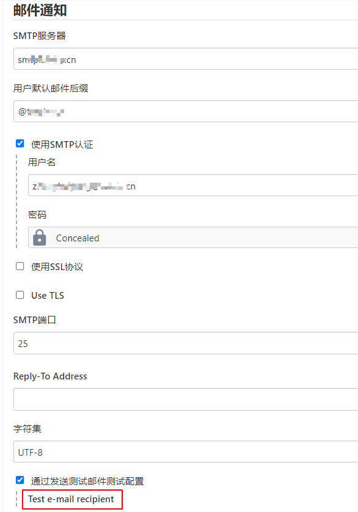
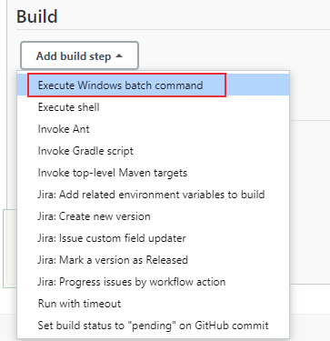

# Jenkins集成Robot Framework
本文介绍Jenkins如何集成Robot Framework。

所用环境如下：

- Jenkins 2.326，使用docker安装部署
- 代理机：Windows10，安装Java环境、Robot Framework测试框架，用于执行自动化测试用例。

下面介绍具体部署流程。

## 一、代理机配置Java环境

启动代理节点时需要使用Java命令，所以需要配置Java环境。

#### 1. 下载安装JDK

JDK下载地址：[https://www.oracle.com/java/technologies/downloads/#java8-windows](https://www.oracle.com/java/technologies/downloads/#java8-windows)


下载完成后安装

#### 2. 配置环境变量
新建系统变量 JAVA_HOME，变量值：`C:\Program Files\Java\jdk1.8.0_311`


新建系统变量classpath， 变量值：`.;%JAVA_HOME%\lib;%JAVA_HOME%\lib\tools.jar`


编辑系统变量Path，新增 `%JAVA_HOME%\bin;%JAVA_HOME%\jre\bin;`

查看是否配置成功：`java -version`
```bash
$ java -version
java version "1.8.0_311"
Java(TM) SE Runtime Environment (build 1.8.0_311-b11)
Java HotSpot(TM) 64-Bit Server VM (build 25.311-b11, mixed mode)
```

## 二、添加并启动windows slave

打开jenkins平台。

进入【系统管理】 -> 【节点管理】进行新增节点

windows节点配置、启动方法参考[持续集成平台Jenkins详细介绍](https://blog.csdn.net/u010698107/article/details/113823608)


## 三、安装Robot Framework 插件

Robot Framework plugin用于在Jenkins中收集和发布Robot Framework的测试结果，下面介绍两种安装方法。

方法1：到【插件管理】页面搜索Robot Framework plugin进行安装下载。

方法2：如果Jenkins无法连接网络，可以先到可以上网的电脑上下载对应的hpi格式插件后上传。Robot Framework plugin下载地址：[https://plugins.jenkins.io/robot/#releases](https://plugins.jenkins.io/robot/#releases)，选择相应版本，下载完成后进入【插件管理】，点击【高级】，到【上传插件】栏进行插件上传安装。

## 四、邮件配置

先安装插件[Email Extension Plugin](https://github.com/jenkinsci/email-ext-plugin) 和 [Email Extension Template Plugin](https://plugins.jenkins.io/emailext-template)。

进入【系统管理】-> 【配置】页面，设置系统管理员地址：


下拉找到【Extended E-mail Notification】进行配置。


配置邮件内容模板


如果要查看邮件发送的日志可以勾选Enable Debug Mode，邮件配置没问题后再关掉它：



这里也可以设置默认触发方式，这是一个全局的设置，点击Default Triggers


进入【邮件通知】，配置方法和前面一样，配置完成后测试一下邮件是否能够发送成功。



如果是内网环境，需要确保Jenkins服务器能够与邮件服务器通信。


## 五、创建项目

介绍两种项目创建方法。

### 方法1：创建自由风格项目

#### 构建配置

新建自由风格项目，设置项目运行的代理节点，标签为前面添加windows slave时指定的标签。


我这里不设置源码管理和触发器，手动进行构建。

添加构建步骤，选择windows bat脚本。



通过标签 `login` 来执行下面的robot framework测试用例：


robot命令：

```bash
robot -d D:\ProgramWorkspace\DevTest-Notes\CI\jenkins\rf_results --include=login D:\ProgramWorkspace\DevTest-Notes\RobotFramework\PO_demo
```

在输入框中输入执行robot framework用例的robot命令：


#### 配置RF测试报告

接下来添加构建后操作步骤，首先添加【Publish Robot Framework test results】配置RF测试报告。


指定报告生成位置及结果阈值


#### 配置邮件提醒

添加邮件提醒


#### 构建

点击构建，执行完成后可以看到RF报告：


点击report.html查看详细日志，可能会报错：Opening Robot Framework report failed


解决方案：[https://stackoverflow.com/questions/36607394/error-opening-robot-framework-log-failed](https://stackoverflow.com/questions/36607394/error-opening-robot-framework-log-failed)

进入【Manage Jenkins】，点击【Script Console】，在输入框中输入如下命令并点击【Run】：

```bash
System.setProperty("hudson.model.DirectoryBrowserSupport.CSP","sandbox allow-scripts; default-src 'none'; img-src 'self' data: ; style-src 'self' 'unsafe-inline' data: ; script-src 'self' 'unsafe-inline' 'unsafe-eval' ;")
```

执行完后就可以成功打开日志报告了。

如果重启了Jenkins，使用这种方式配置会丢失，又要重新运行一下上面的命令。

第二种方法是修改Jenkins容器中的 `/usr/local/bin/jenkins.sh` 文件，这样可以永久生效：

编辑 `jenkins.sh` 文件，将以下命令添加到`exec java` 开头的那行命令中：

```bash
-Dhudson.model.DirectoryBrowserSupport.CSP="sandbox allow-scripts; default-src 'none'; img-src 'self' data: ; style-src 'self' 'unsafe-inline' data: ; script-src 'self' 'unsafe-inline' 'unsafe-eval' ;"
```

如果Jenkins容器没有vi或者vim命令，可以将文件复制出来修改后，再复制回去：

```bash
$ docker cp jenkins:/usr/local/bin/jenkins.sh .   #复制到当前目录
$ vi jenkins.sh # 修改jenkins.sh文件
$ docker cp jenkins.sh jenkins:/usr/local/bin/jenkins.sh # 复制到容器中
```

修改完成后重启Jenkins：

```bash
$ docker restart jenkins
```


### 方法2：创建流水线项目

下面介绍第2种方法，新建一个流水线项目。

和方法1一样，我这里不设置源码管理和触发器，通过手动构建的方式触发。

#### Pipeline

Pipeline script的编写非常重要，主要由它来进行测试流程的控制，要执行测试脚本的代理机也在pipeline中指定。

Jenkinsfile支持两种语法形式：

* Declarative pipeline - v2.5之后引入，采用结构化的方式。
* Scripts pipeline - 基于groovy的语法。

本文使用Declarative pipeline编写。

下面的脚本主要实现以下功能：

- 指定代理节点
- 下发构建脚本命令
- 添加构建后RF报告
- 添加邮件提醒

```xml
pipeline {
  agent {
      node {
        label "slave-windows"
        customWorkspace "D:/ProgramWorkspace/DevTest-Notes/CI/jenkins"
    }
  }

  stages {
         stage('intialize') {
            steps {
                echo "begin"
            }
        }
    
        stage('Run Robot Tests') {
            steps {
            bat "D:/robotframework/Scripts/activate.bat&&robot -d D:/ProgramWorkspace/DevTest-Notes/CI/jenkins/rf_results --include=login D:/ProgramWorkspace/DevTest-Notes/RobotFramework/PO_demo"
            sleep 1
            }
            
            post {
                always {
                    script {
                      step(
                            [
                              $class              : 'RobotPublisher',
                              outputPath          : 'rf_results',
                              outputFileName      : 'output.xml',
                              reportFileName      : 'report.html',
                              logFileName         : 'log.html',
                              disableArchiveOutput: false,
                              passThreshold       : 100,
                              unstableThreshold   : 80,
                            ]
                      )
                    }
                    emailext (
                        subject: '\'构建通知:${PROJECT_NAME} - Build # ${BUILD_NUMBER} - ${BUILD_STATUS}\'',
                        to: "zhiyo2016@163.com", 
                        body: '${FILE,path="email2.html"}',
                    )
                }
            }
        }
    }
}
```

保存。

#### 构建

手动点击【Build Now】，结果和自由风格项目类似。


jenkins平台会保存每一次构建的测试报告。


