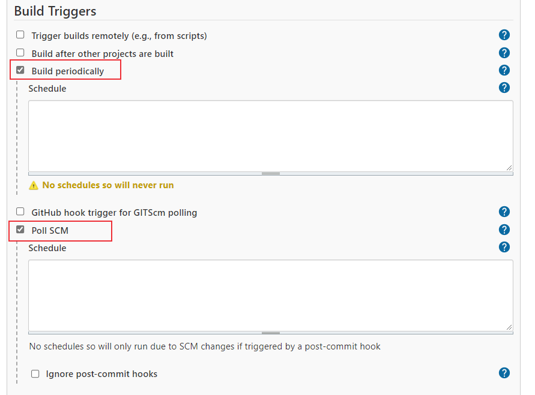

# Linux cron定时介绍


定时任务的使用场景非常广泛，比如定时发送邮件，定时清理日志等等，在持续集成中，可以定时的触发测试任务，比如希望在每天晚上下班时间执行自动化用例。本文通过介绍Linux cron定时来了解​cron定时相关概念。


## Linux Crontab 定时任务
cron来源于希腊语chronos，意思是时间。在类Unix的操作系统中，可以使用cron 服务器来实现定时执行任务。crontab文件存放cron指令，执行周期命令的守护进程crond负责激活这些任务，定期检查是否有任务执行。

### crond 服务

crond 服务是用来执行周期任务或等待处理某些事件的一个守护进程，crontab 命令需要 crond 服务支持。centos7中一般是默认安装的，可以使用 `rpm` 命令查看是否安装：

```bash
$ rpm -qa | grep crontab
crontabs-1.11-6.20121102git.el7.noarch
```

查看crond 服务状态：

```bash
# centos7
systemctl status crond.service 

# centos6
service crond status
```

启动crond 服务：

```bash
# centos7
systemctl start  crond.service

# centos6
service crond start
```

停止crond 服务：

```bash
# centos7
systemctl stop  crond.service

# centos6
service crond stop
```

重启crond 服务：

```bash
# centos7
systemctl restart  crond.service

# centos6
service crond restart
```

重载crond 服务：

```bash
# centos7
systemctl reload  crond.service

# centos6
service crond reload
```


### crontab相关文件

cron 服务主要包括以下文件目录：

- `/var/spool/cron`：用户定义的crontab文件存放目录
- `/etc/cron.d`：存放要执行的crontab文件或脚本
- `/etc/crontab`：系统任务调度的配置文件
- `/etc/anacrontab`：anacron配置文件
- `/etc/cron.deny`：列出不允许使用crontab命令的用户
- `/etc/cron.daily`：每天执行一次的脚本
- `/etc/cron.hourly`：每小时执行一次的脚本
- `/etc/cron.monthly`：每月执行一次的脚本
- `/etc/cron.weekly`：每星期执行一次的脚本

`/etc/crontab`文件负责管理和维护任务：

```bash
$ cat /etc/crontab
SHELL=/bin/bash
PATH=/sbin:/bin:/usr/sbin:/usr/bin
MAILTO=root

# For details see man 4 crontabs

# Example of job definition:
# .---------------- minute (0 - 59)
# |  .------------- hour (0 - 23)
# |  |  .---------- day of month (1 - 31)
# |  |  |  .------- month (1 - 12) OR jan,feb,mar,apr ...
# |  |  |  |  .---- day of week (0 - 6) (Sunday=0 or 7) OR sun,mon,tue,wed,thu,fri,sat
# |  |  |  |  |
# *  *  *  *  * user-name  command to be executed
```
其中：
- `SHELL`变量指定系统使用的shell版本
- `PATH`指定系统执行命令的路径
- `MAILTO`指定邮件发送的用户，如果为root，邮件会发送到`/var/spool/mail/root`文件中

### cron表达式

用户定义的crontab文件保存在 `/var/spool/cron` 目录中，每个crontab任务以创建者的名字命名。crontab文件中每一行都代表一项任务，每条命令包括6个字段，前5个代表时间，第6个字段是要执行的命令。

五颗星：`* * * * *`
- 第1颗星：分钟 minute，取值 0~59；
- 第2颗星：小时 hour，取值 0~23；
- 第3颗星：天 day，取值 1~31；
- 第4颗星：月 month，取值 1~12；
- 第5颗星：星期 week，取值 0~7，0 和 7 都表示星期天。

可以使用4种操作符：

- `*` ：当前代表的所有取值范围内的数字
- `/`：需要间隔的数字
- `-`：某个区间，比如1-3表示1, 2, 3
- `,`：分散的数字，可以不连续，比如1, 3, 5

下面举几个例子：

```sh
# 每5分钟构建一次
H/5 * * * *

# 每2小时构建一次
H H/2 * * *

# 每天8点到22点，每2小时构建一次
H 8-22/2 * * *

# 每天8点，22点各构建一次
H 8,22 * * *
```


### crontab命令

crontab 命令用来配置定时任务，语法如下：

```bash
crontab [options] file
crontab [options]
```

常用options：

- `-u <user>`  ：定义用户
- `-e`：编辑 crontab表
- `-l`： 列出用户crontab表
- `-r`：删除用户crontab表
- `-i`：删除提示
- `-n <hostname>`  设置用户crontab主机名
- `-c`：获取运行用户crontab的主机名
- `-s`：selinux 上下文
- `-x <mask>` ：开启调试

### crontab定时示例

先写一个用于采集CPU性能信息的脚本（cpu_Perf.sh）：

```bash
#!/bin/bash
mpstat -P ALL 1 2 >> /var/cron/perf.log
```

下面来添加一个定时任务：

执行 命令`crontab -e` ，输入下面的cron表达式，每分钟执行一次CPU性能采集脚本：

```bash
* * * * * /var/cron/cpu_Perf.sh
```

保存。命令保存到了 `/var/spool/cron/` 目录下的root文件中(当前用户为root)：

```bash
$ cat /var/spool/cron/root 
* * * * * /var/cron/cpu_Perf.sh
$ crontab -l
* * * * * /var/cron/cpu_Perf.sh
```

保存成功后，每一分钟就会执行一次脚本。

## Linux anacron 定时任务

如果服务器关机或者无法运行任务，定时任务就不会执行，服务器恢复后，定时任务不会执行没有执行的定时任务。这种场景下可以使用anacron命令，它与crond功能相同，增加了执行被跳过任务的功能。一旦服务器启动，anacron就会检查配置的定时任务是否错过了上一次执行，如果有，将立即运行这个任务，且只运行一次(不管错过了多少个周期)。

也就是说， anacron 是用来保证由于系统原因导致错过的定时任务可以在系统正常后执行的服务。

### anacron命令

可以使用 anacron 命令来管理 anacron 服务，语法格式如下：

```bash
anacron [options] [job] ...
anacron -T [-t anacrontab-file]
```

options选项：

- `-s`：串行调用任务
- `-f`：强制执行任务，忽略设置的周期
- `-n`：没有delay执行任务，隐含调用了`-s`参数
- `-d`：把信息输出到标准输出设备和系统日志中
- `-q`：禁止向标准输出发送消息，只能和-d选项配合使用。
- `-u`：更新时间戳但不执行任务
- `-V`：打印版本信息
- `-h`：打印帮助信息
- `-t <file>` ：使用指定的配置文件，忽略默认的/etc/anacrontab文件。
- `-T`：Anacrontab测试
- `-S <dir>`：指定存放timestamp文件的路径

`job` 是 `/etc/anacrontab` 文件中定义的工作名 job-identifier

### anacron执行过程

下面来介绍一下anacron的执行过程：

1、根据脚本需要执行的频率，将脚本安装到`/etc/cron.[hourly|daily|weekly|monthly]` 目录中：

```bash
/etc/cron.hourly
/etc/cron.daily
/etc/cron.monthly
/etc/cron.weekly
```

2、crond 服务会执行`/etc/cron.d/0hourly` 中指定的cron 任务，

```bash
$ cat /etc/cron.d/0hourly
# Run the hourly jobs
SHELL=/bin/bash
PATH=/sbin:/bin:/usr/sbin:/usr/bin
MAILTO=root
01 * * * * root run-parts /etc/cron.hourly
```

每小时运行一次 **run-parts** 程序，而 **run-parts** 程序执行 `/etc/cron.hourly` 中的所有的shell脚本。

`/etc/cron.hourly` 目录中包含 `0anacron` 脚本：

```bash
$ ls /etc/cron.hourly
0anacron  mcelog.cron
```

3、 `0anacron` 脚本通过 `/etc/anacrontab` 配置文件来运行anacron程序。

```bash
$ cat /etc/anacrontab
# /etc/anacrontab: configuration file for anacron

# See anacron(8) and anacrontab(5) for details.

SHELL=/bin/sh
PATH=/sbin:/bin:/usr/sbin:/usr/bin
MAILTO=root
# the maximal random delay added to the base delay of the jobs
RANDOM_DELAY=45
# the jobs will be started during the following hours only
START_HOURS_RANGE=3-22

#period in days   delay in minutes   job-identifier   command
1       5       cron.daily              nice run-parts /etc/cron.daily
7       25      cron.weekly             nice run-parts /etc/cron.weekly
@monthly 45     cron.monthly            nice run-parts /etc/cron.monthly
```

- `RANDOM_DELAY=45` ：表示最大随机延迟时间为45分钟。

- `START_HOURS_RANGE=3-22` : 执行的时间范围为03:00—22:00

`/etc/anacrontab` 配置文件执行`cron.[daily|weekly|monthly]` 目录中的可执行文件。

anacron的监测周期为每天、每周和每月，每天执行一次`/etc/cron.daily` 目录中的程序，每周执行一次 `/etc/cron.weekly` 中的程序，每月执行一次 `/etc/cron.monthly` 中的程序。

anacron不能在指定某个时间运行某个程序，它的设计目的是在特定的时间间隔运行某个程序，例如每天，每周日或者每月第一天的03:00运行某个程序。如果因为某种原因（关机或者服务器异常）没有执行，anacron会在服务器正常后运行一次错过的执行。

那么，anacron 是如何判断这些定时任务错过了执行呢？

其实是通过读取上次执行 anacron 的时间记录文件，通过两个时间的差值判断是否超过指定间隔时间（1天、1周和1月）。

`/var/spool/anacron/` 目录中的 `cron.[daily|weekly|monthly]` 文件记录了上一次执行 cron任务 的时间：

```bash
$ ls /var/spool/anacron/
cron.daily  cron.monthly  cron.weekly
$ cat /var/spool/anacron/cron.daily
20211123
```


## cron表达式应用

前面介绍了在Linux中通常用 crond 服务来实现任务定时执行，在很多场景都会用到定时任务，比如定时提醒，定时发送邮件等。比如python中可以使用[APScheduler](https://github.com/agronholm/apscheduler)库执行定时任务，Java可以使用Quartz框架实现，Go语言使用 [github.com/robfig/cron](https://github.com/robfig/cron) 包。

在持续测试平台Jenkins中经常会配置定时执行任务，下面简单介绍一下Jenkins定时构建配置方法。

### Jenkins定时构建

在配置Jenkins任务时，构建定时任务主要有两种形式：
- 一种是配置周期触发（Build periodically），在特定时间进行自动触发测试流程。
- 第二种是Poll SCM：定时检查源码变更，如果有更新就checkout新的代码下来，然后执行构建动作。

在【Build Triggers】中选择 Build periodically 或者 Poll SCM



在Schedule中输入cron表达式来配置定时任务。

Jenkins也可以创建多个定时，比如在每个工作日的9:30和每周五22:30构建：
```sh
30 9 * * 1-5
30 22 * * 5
```


