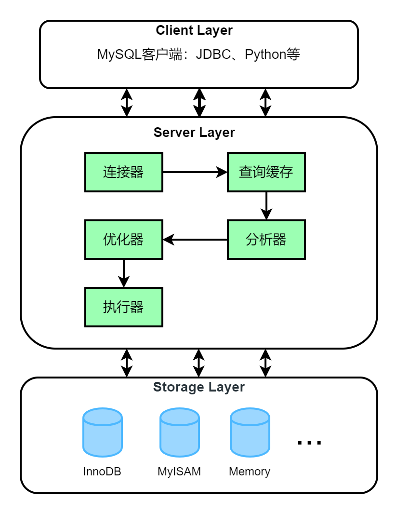

# MySQL基础架构：SQL查询语句执行过程
MySQL是一种关系型数据库管理系统，采用的是分层结构，本文中将简单介绍MySQL数据库的内部架构。

<!--more-->

MySQL是一个C/S系统，MySQL服务器是服务器，连接到MySQL服务器的应用程序是客户端。MySQL体系结构主要包含三层：

- 客户端层
- 服务器层
- 存储层



## 客户端层

客户端层主要负责连接数据库，连接建立后，客户端可以看到一个线程。客户端层向服务端发送请求指令，并在屏幕上显示输出。

比如连接MySQL服务器：`mysql -u root -p`

查询端口号3306：

```bash
$ netstat -ano | findstr 3306
  TCP    0.0.0.0:3306           0.0.0.0:0              LISTENING       18456
  TCP    0.0.0.0:33060          0.0.0.0:0              LISTENING       18456
  TCP    [::]:3306              [::]:0                 LISTENING       18456
  TCP    [::]:33060             [::]:0                 LISTENING       18456
  TCP    [::1]:3306             [::1]:64636            ESTABLISHED     18456
  TCP    [::1]:64636            [::1]:3306             ESTABLISHED     148

$ tasklist | findstr 18456
mysqld.exe                   18456 Services                   0    374,900 K

$ tasklist | findstr 148
mysql.exe                      148 Console                    1     10,840 K

```

可以看到启动了一个PID为148，名字为mysql.exe的进程。

另外开启一个连接会再启动一个mysql进程：

```bash
$ netstat -ano | findstr 3306
  TCP    [::1]:3306             [::1]:64636            ESTABLISHED     18456
  TCP    [::1]:3306             [::1]:64909            ESTABLISHED     18456
  TCP    [::1]:64636            [::1]:3306             ESTABLISHED     148
  TCP    [::1]:64909            [::1]:3306             ESTABLISHED     1272
```

## 服务器层

MySQL Server 层负责MySQL的所有逻辑功能，包括连接器、数据缓存、缓存查询、分析器、优化器、执行器等核心功能，以及所有的内置函数（如日期、时间、数学和加密函数等），所有跨存储引擎的功能都在这一层实现，比如存储过程、触发器、视图等。

### 连接器

客户端连接服务器时会首先经过连接器，连接器负责跟客户端建立连接、维持和管理连接、认证、权限管理等。

执行连接命令 `mysql -u root -p`，输入密码，密码认证通过，然后进行权限认证，这样用户与MySQL服务器就成功的建立了连接。

可以使用 `show processlist` 命令中获取建立的连接：

```sql
mysql> show processlist;
+----+-----------------+-----------------+------+---------+------+------------------------+------------------+
| Id | User            | Host            | db   | Command | Time | State                  | Info             |
+----+-----------------+-----------------+------+---------+------+------------------------+------------------+
|  4 | event_scheduler | localhost       | NULL | Daemon  | 6007 | Waiting on empty queue | NULL             |
| 11 | root            | localhost:64636 | NULL | Query   |    0 | starting               | show processlist |
| 12 | root            | localhost:64909 | NULL | Sleep   | 5182 |                        | NULL             |
+----+-----------------+-----------------+------+---------+------+------------------------+------------------+
3 rows in set (0.00 sec)
```

连接建立成功后，如果不进行进一步操作，不会马上断开，此连接进入空闲状态，`Sleep` 表示一个空闲连接。这个空闲连接也不会一直存在，一般默认是 8 小时，可以通过设置参数 `wait_timeout` 来控制。

```sql
mysql> show global variables like 'wait_timeout';
+---------------+-------+
| Variable_name | Value |
+---------------+-------+
| wait_timeout  | 28800 |
+---------------+-------+
1 row in set, 1 warning (0.05 sec)

mysql> set global wait_timeout=28800;
```

### 查询缓存

执行查询语句前，MySQL会先查找查询缓存，如果当前查询存在缓存（语句及结果会以 key-value 对的形式保存）中，那么结果就会直接返回到客户端。

如果语句不在查询缓存中，就会继续后面的执行阶段。执行完成后，执行结果会被存入查询缓存中。

需要注意的是，对于频繁更新的数据表不建议开启查询缓存。只要有对一个表的更新，这个表上所有的查询缓存都会被清空，这对于并发度大的服务来说会导致额外的开销，反而降低效率 。

MySQL 8.0 版本已经将查询缓存功能删除了。

```sql
mysql> show variables like '%query_cache%';
+------------------+-------+
| Variable_name    | Value |
+------------------+-------+
| have_query_cache | NO    |
+------------------+-------+
1 row in set, 1 warning (0.00 sec)
```

### 分析器

分析器是对 SQL 语句进行解析，首先做“**词法分析**”，识别出SQL 语句的字符串分别是什么，代表什么。比如查询语句 `select * from student where id=1；`，识别出关键字select表示一个查询语句，名为student的表，把字符串“id”识别成表字段id。如果不存在id字段，则会在这个阶段报错。

完成词法分析后，开始进行“**语法分析**”，根据语法规则，判断输入的 SQL 语句是否满足 MySQL 语法。

### 优化器

经过分析器后，还要使用优化器进行优化。包括了多种优化技术，比如确定扫描表的顺序、选择索引、确定表连接顺序等。

### 执行器

SQL语句经过了词法分析、语法分析和优化之后，正式进入执行器阶段，开始执行语句。

执行之前，还会进行权限验证，查询是否有相应权限。如果有权限，执行器会调用表的引擎提供的接口执行语句，执行器会将所有满足条件的行组成的记录集作为结果集返回给客户端。

## 存储层

存储引擎层负责数据的存储和提取。其架构模式是插件式的，支持 InnoDB、MyISAM、Memory 等多个存储引擎，不同的存储引擎共用一个 Server 层。

使用命令 `show engines;` 查看当前MySQL服务器支持的引擎：

```sql
mysql> show engines;
+--------------------+---------+----------------------------------------------------------------+--------------+------+------------+
| Engine             | Support | Comment                                                        | Transactions | XA   | Savepoints |
+--------------------+---------+----------------------------------------------------------------+--------------+------+------------+
| MEMORY             | YES     | Hash based, stored in memory, useful for temporary tables      | NO           | NO   | NO         |
| MRG_MYISAM         | YES     | Collection of identical MyISAM tables                          | NO           | NO   | NO         |
| CSV                | YES     | CSV storage engine                                             | NO           | NO   | NO         |
| FEDERATED          | NO      | Federated MySQL storage engine                                 | NULL         | NULL | NULL       |
| PERFORMANCE_SCHEMA | YES     | Performance Schema                                             | NO           | NO   | NO         |
| MyISAM             | YES     | MyISAM storage engine                                          | NO           | NO   | NO         |
| InnoDB             | DEFAULT | Supports transactions, row-level locking, and foreign keys     | YES          | YES  | YES        |
| BLACKHOLE          | YES     | /dev/null storage engine (anything you write to it disappears) | NO           | NO   | NO         |
| ARCHIVE            | YES     | Archive storage engine                                         | NO           | NO   | NO         |
+--------------------+---------+----------------------------------------------------------------+--------------+------+------------+
9 rows in set (0.00 sec)
```

默认存储引擎为InnoDB，可以在建表的时候指定存储引擎：

```sql
create table student(
    id int not null auto_increment primary key COMMENT 'ID',
    name varchar(10) not null COMMENT '姓名',
    sex char(10) not null COMMENT '性别',
    age tinyint(100) not null COMMENT '年龄',
    dept char(4) not null COMMENT '专业') ENGINE=InnoDB 
    DEFAULT CHARSET=utf8 ROW_FORMAT=DYNAMIC
    comment = '学生';  
```

在MySQL 5.5.5 之前的版本默认使用MyISAM 存储引擎，MySQL 5.5.5 版本开始使用InnoDB作为默认存储引擎。


> 有人认为，公众希望环境得以保护，人类的存续得以实现，还认为那些为了这类崇高目标而奋斗的理想主义者会得到公众的爱戴，这种想法都是错的。实际上，公众所期望的只有一件事：他们自己过上安逸舒适的生活。——艾萨克·阿西莫夫《神们自己》


