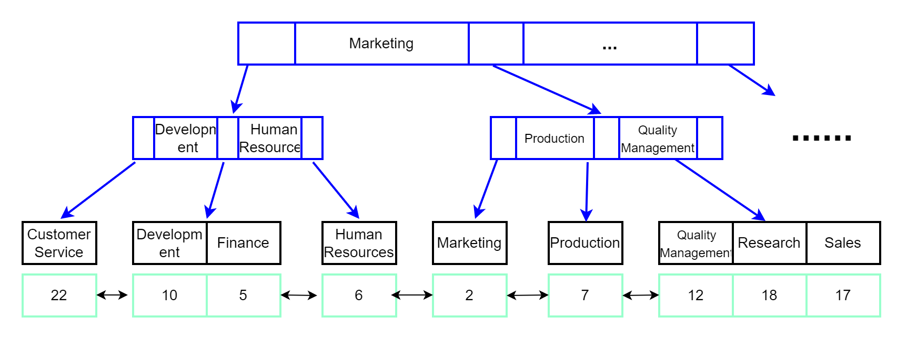

# MySQL索引介绍
索引主要是用来提高数据库的查询效率的，它对指定的列或列的集合生成索引，然后可以通过索引来检索目标数据，就像目录一样，缩小了扫描范围，大大提高了查询效率。

如果不使用索引，MySQL服务器会从第一行开始查询，直到找到相关行，数据表越大，耗费时间就越多。本文将介绍索引的一些基本原理，了解它是如何优化数据库性能的。

<!--more-->

## 简介

MyISAM存储引擎使用三个文件来表示每个表：

- frm文件：格式文件，存储表结构的定义
- MYD文件：数据文件，存储表行数据
- MYI文件：索引文件，存储表上索引

InnoDB存储引擎的存储文件包括两个文件：frm 和 ibd

- frm文件存储表结构定义
- ibd文件存储表的内容，存储数据和索引

MEMORY存储引擎也frm格式文件存储表结构，而数据及索引存储在内存中，因此它的查询速度更快。

MySQL索引是在存储引擎层实现的，因此不同引擎数据库的底层的实现可能不同，列举几种实现索引的数据结构：

- **哈希表**：键-值（key-value）方式存储数据，需要注意出现**哈希碰撞（Hash Collisions）**的情况。另外哈希表的 Hash 码不是按顺序存放的，因此哈希索引更适用于等值查询，对于范围查找就不适合了。
- **二叉搜索树**：查询的时间复杂度O(log(N))，由于在数据量大的情况下会使用大量的数据块，频繁读取磁盘，导致查询效率变慢。因此实际使用中通常会使用N叉树。
- **B树**：B树就是一种N叉树，树的高度降低了。每个节点存储Key值和数据。
- **B+树**：B+树是对B树的改进，数据存储在同一层的叶子节点上，并且按顺序排列，非叶子节点不再存储数据，只存储key的信息。这是目前MySQL索引最常用的数据结构。
- 其他：当然还有其它数据结构也可以用来保存索引，比如有序数组，跳表、LSM 树等。

InnoDB 存储引擎使用的索引数据结构为**B+树**，InnoDB也是最常用的MySQL数据库引擎，下面来介绍以下B+树索引模型。

## B+ 树索引模型

先创建一个使用InnoDB 存储引擎的表departments，主键为id，辅助索引dept_name：

```sql
create table departments(
	id int not null primary key,
	dept_no char(4) null,
	dept_name varchar(40) null,
	unique index dept_name(dept_name)) engine=InnoDB;
	
insert into departments values(2,'d001', 'Marketing'),(5,'d002','Finance'),(6,'d003','Human Resources'),(7,'d004','Production'),(10,'d005','Development'),(12,'d006','Quality Management'),(17,'d007','Sales'),(18,'d008','Research'),(22,'d009','Customer Service');	
```

查询数据：

```sql
mysql> select * from departments;
+----+---------+--------------------+
| id | dept_no | dept_name          |
+----+---------+--------------------+
|  2 | d001    | Marketing          |
|  5 | d002    | Finance            |
|  6 | d003    | Human Resources    |
|  7 | d004    | Production         |
| 10 | d005    | Development        |
| 12 | d006    | Quality Management |
| 17 | d007    | Sales              |
| 18 | d008    | Research           |
| 22 | d009    | Customer Service   |
+----+---------+--------------------+
9 rows in set (0.00 sec)
```

查看索引：
```sql
mysql> show index from departments;
+-------------+------------+-----------+--------------+-------------+-----------+-------------+----------+--------+------+------------+---------+---------------+---------+------------+
| Table       | Non_unique | Key_name  | Seq_in_index | Column_name | Collation | Cardinality | Sub_part | Packed | Null | Index_type | Comment | Index_comment | Visible | Expression |
+-------------+------------+-----------+--------------+-------------+-----------+-------------+----------+--------+------+------------+---------+---------------+---------+------------+
| departments |          0 | PRIMARY   |            1 | id          | A         |           9 |     NULL |   NULL |      | BTREE      |         |               | YES     | NULL       |
| departments |          0 | dept_name |            1 | dept_name   | A         |           9 |     NULL |   NULL | YES  | BTREE      |         |               | YES     | NULL       |
+-------------+------------+-----------+--------------+-------------+-----------+-------------+----------+--------+------+------------+---------+---------------+---------+------------+
2 rows in set (0.13 sec)

mysql> desc departments;
+-----------+-------------+------+-----+---------+-------+
| Field     | Type        | Null | Key | Default | Extra |
+-----------+-------------+------+-----+---------+-------+
| id        | int(11)     | NO   | PRI | NULL    |       |
| dept_no   | char(4)     | YES  |     | NULL    |       |
| dept_name | varchar(40) | YES  | UNI | NULL    |       |
+-----------+-------------+------+-----+---------+-------+
3 rows in set (0.00 sec)
```

可以看到有两个索引：主键索引id和唯一索引dept_name，每一个索引在 InnoDB 里面对应一棵 B+树。

关于B+树的特性这里就不介绍了，主键索引示意图如下：


唯一索引dept_name示意图如下：



图中的数据页之间通常使用双向链表进行连接，可以减少查询时间，特别是区间查询时。

### 回表

主键索引就是在主键上添加的索引，它的叶子节点保存了整行数据。

辅助索引是主键之外的索引，也被称为二级索引（secondary index）。InnoDB引擎的辅助索引引用主键作为data域，也就是说，使用辅助索引的需要先搜索当前辅助索引树，得到主键值后，再到主键索引搜索一次，通过主键索引查找到目标数据，这个过程称为**回表**。因此，在实际使用过程中，如果能使用主键查询就应该优先选择它。

比如通过辅助索引dept_name查询部门名称为Research的dept_no：`select dept_no from departments where dept_name='Research';`

1. 搜索dept_name索引树，得到dept_name为Research的id为18；
2. 通过id索引树查询id为18的行记录。

如果知道id，直接使用id查询，效率会更高。

```sql
mysql> select dept_no from departments where dept_name='Research';
+---------+
| dept_no |
+---------+
| d008    |
+---------+
1 row in set (0.04 sec)

mysql> select dept_no from departments where id=18;
+---------+
| dept_no |
+---------+
| d008    |
+---------+
1 row in set (0.00 sec)
```

### 聚簇索引和非聚簇索引

上面介绍的是InnoDB存储引擎的主键索引和辅助索引，MyISAM引擎的索引结构与它有一定差异。MyISAM存储引擎使用MYD文件存储表行数据，使用MYI文件存储表上索引。InnoDB存储引擎使用ibd文件存储表数据和索引。

InnoDB引擎的索引和数据是存储在一起的，称为**聚簇索引**（clustered index）。

MyISAM的索引和数据是分开存储的，这种称为**非聚簇索引**（unclustered index）。非聚簇索引只存储索引字段和记录所在的位置，通过索引找到记录所在的位置，然后再根据位置去获取记录。因此MyISAM引擎的主键索引和辅助索引在结构上没有什么差别，叶子节点都使用一个地址指向真正的表数据。

聚簇索引的查找效率要比非聚簇索引快，因为聚簇索引查找到索引就查找到了数据位置，而非聚簇索引查找到索引之后，根据记录的数据地址，再去查找数据；

由于MyISM使用非聚簇索引，主键索引和辅助索引树是独立的，因此通过辅助索引查询时不需要访问主键的索引树。

### 页分裂

虽然聚簇索引查询速度相对更快，但聚簇索引对写入效率影响更大。为了保证B+树中索引的有序性，在进行插入和删除操作的时候需要对索引进行维护。

上面的示意图是3阶B+树，如果要插入一个id为11的记录，直接在10后面插入就可以了。而要插入id为4的记录，就需要挪动后面的数据来空出位置，这个过程称为**页分裂**。

如果相邻两个页由于删除了数据空出大量空间，通常还会对数据页进行合并。因此删除、插入操作可能会出现大量的索引分裂和合并，严重影响效率。

那么有什么解决方案呢？最好的解决方案就是使用递增主键，这样在插入记录时，不会进行索引分裂，直接追加在后面就可以。因此，选择主键时最好采用自增主键。

## 联合索引

联合索引是对两个或者更多的列添加索引，B+树中的key值变成了多个，MyISAM和InnoDB引擎限制最多列数为16。

联合索引查询时遵循“最左前缀”原则，即使用 where 条件查询时最左边的为起点索引都能匹配上。所以在创建联合索引时，通常将使用最频繁的列放在最左边。下面看一个示例：

student表数据如下：

```sql
mysql> select * from student;
+----+------+-----+-----+--------+
| id | name | sex | age | dept   |
+----+------+-----+-----+--------+
|  1 | 李四 | 男  |  21 | 通信   |
|  2 | 张三 | 男  |  21 | 通信   |
|  3 | 王二 | 男  |  23 | 计算机 |
|  4 | 小花 | 女  |  23 | 计算机 |
|  7 | 小王 | 男  |  28 | 通信   |
+----+------+-----+-----+--------+
5 rows in set (0.14 sec)
```

添加一个`(name, age)`的联合索引: `alter table student add index name_age(name,age);`

```sql
mysql> alter table student add index name_age(name,age);
Query OK, 0 rows affected (1.30 sec)
Records: 0  Duplicates: 0  Warnings: 0

mysql> show index from student;
+---------+------------+----------+--------------+-------------+-----------+-------------+----------+--------+------+------------+---------+---------------+---------+------------+
| Table   | Non_unique | Key_name | Seq_in_index | Column_name | Collation | Cardinality | Sub_part | Packed | Null | Index_type | Comment | Index_comment | Visible | Expression |
+---------+------------+----------+--------------+-------------+-----------+-------------+----------+--------+------+------------+---------+---------------+---------+------------+
| student |          0 | PRIMARY  |            1 | id          | A         |           4 |     NULL |   NULL |      | BTREE      |         |               | YES     | NULL       |
| student |          1 | name_age |            1 | name        | A         |           4 |     NULL |   NULL |      | BTREE      |         |               | YES     | NULL       |
| student |          1 | name_age |            2 | age         | A         |           4 |     NULL |   NULL |      | BTREE      |         |               | YES     | NULL       |
+---------+------------+----------+--------------+-------------+-----------+-------------+----------+--------+------+------------+---------+---------------+---------+------------+
3 rows in set (0.08 sec)
```

查询时如果想要使用到创建的联合索引，可以使用`name`、`(name,age)`或者`(age,name)`这几种组合：

```sql
select * from student where name='张三';
select * from student where name='张三' and age=21;
select * from student where age=21 and name='张三';
```

```sql
mysql> explain select * from student where name='张三';
+----+-------------+---------+------------+------+---------------+----------+---------+-------+------+----------+-------+
| id | select_type | table   | partitions | type | possible_keys | key      | key_len | ref   | rows | filtered | Extra |
+----+-------------+---------+------------+------+---------------+----------+---------+-------+------+----------+-------+
|  1 | SIMPLE      | student | NULL       | ref  | name_age      | name_age | 32      | const |    1 |   100.00 | NULL  |
+----+-------------+---------+------------+------+---------------+----------+---------+-------+------+----------+-------+
1 row in set, 1 warning (0.00 sec)

mysql> explain select * from student where name='张三' and age=21;
+----+-------------+---------+------------+------+---------------+----------+---------+-------------+------+----------+-------+
| id | select_type | table   | partitions | type | possible_keys | key      | key_len | ref         | rows | filtered | Extra |
+----+-------------+---------+------------+------+---------------+----------+---------+-------------+------+----------+-------+
|  1 | SIMPLE      | student | NULL       | ref  | name_age      | name_age | 33      | const,const |    1 |   100.00 | NULL  |
+----+-------------+---------+------------+------+---------------+----------+---------+-------------+------+----------+-------+
1 row in set, 1 warning (0.00 sec)

mysql> explain select * from student where age=21 and name='张三';
+----+-------------+---------+------------+------+---------------+----------+---------+-------------+------+----------+-------+
| id | select_type | table   | partitions | type | possible_keys | key      | key_len | ref         | rows | filtered | Extra |
+----+-------------+---------+------------+------+---------------+----------+---------+-------------+------+----------+-------+
|  1 | SIMPLE      | student | NULL       | ref  | name_age      | name_age | 33      | const,const |    1 |   100.00 | NULL  |
+----+-------------+---------+------------+------+---------------+----------+---------+-------------+------+----------+-------+
1 row in set, 1 warning (0.00 sec)

mysql> explain select * from student where age=21;
+----+-------------+---------+------------+------+---------------+------+---------+------+------+----------+-------------+
| id | select_type | table   | partitions | type | possible_keys | key  | key_len | ref  | rows | filtered | Extra       |
+----+-------------+---------+------------+------+---------------+------+---------+------+------+----------+-------------+
|  1 | SIMPLE      | student | NULL       | ALL  | NULL          | NULL | NULL    | NULL |    4 |    25.00 | Using where |
+----+-------------+---------+------------+------+---------------+------+---------+------+------+----------+-------------+
1 row in set, 1 warning (0.00 sec)
```

可以看到`select * from student where age=21;` 没有使用到索引。

语句`select * from student where age=21 and name='张三';`也能使用到索引的原因是SQL查询时分析器会对查询语句进行优化，选择效率最高的索引查询顺序。(SQL查询顺序可参考[MySQL基础架构：SQL查询语句执行过程](https://blog.csdn.net/u010698107/article/details/124787392))

## 索引语法

下面来介绍一些常用的MySQL索引语法。

### 创建索引

建表时创建索引：

```sql
CREATE TABLE tbl_name(
	id int not null primary key,
	name varchar(40) null,
	age int null,
	INDEX index_name(字段名)) engine=InnoDB;
```

新建索引：

```sql
CREATE INDEX index_name ON tbl_name(字段名);
```

修改表结构新建索引:
```sql
ALTER TABLE tbl_name ADD INDEX index_name ON 字段名; 
```

创建唯一索引：
```sql
CREATE UNIQUE INDEX index_name ON tbl_name(字段名);
ALTER TABLE tbl_name ADD UNIQUE index_name ON 字段名;
-- 建表时指定
CREATE TABLE tbl_name(
	id int not null primary key,
	name varchar(40) null,
	age int null,
	UNIQUE INDEX index_name(字段名)) engine=InnoDB;
```
注意唯一索引索引列的值必须唯一，允许为NULL。

创建主键时会自动创建主键索引，一张表只能有一个主键索引，不允许重复，不允许为 NULL；另外，加有 unique 约束的字段上会自动创建索引。

创建组合索引：
```sql
CREATE INDEX index_name ON tbl_name(字段1,字段2);
ALTER TABLE tbl_name ADD INDEX index_name(字段1,字段2);
-- 建表时指定
INDEX index_name(字段1,字段2)
```

### 显示索引

```sql
SHOW INDEX FROM tbl_name;
```


### 删除索引

```sql
ALTER TABLE tbl_name DROP INDEX index_name;
DROP INDEX index_name ON tbl_name;
```

不能删除主键索引。

### 重命名索引

```sql
ALTER TABLE tbl_name RENAME INDEX index_name TO new_index_name;
```

## 总结

本文简单介绍了常用的B+树索引模型，B+树只有叶子节点才会存储数据，非叶子节点只存储键值，最底层的叶子节点形成了一个双向有序链表。另外要注意聚簇索引和非聚簇索引的区别，它们在数据存储方式上有差异。

联合索引查询时需要遵循“最左前缀”原则，因此在创建和使用联合索引时需要考虑到这一点。

参考：

1. [https://dev.mysql.com/doc/refman/8.0/en/innodb-limits.html](https://dev.mysql.com/doc/refman/8.0/en/innodb-limits.html)
2. [https://dev.mysql.com/doc/refman/8.0/en/myisam-storage-engine.html](https://dev.mysql.com/doc/refman/8.0/en/myisam-storage-engine.html)


 


