# MySQL数据库安装配置详细教程
本文介绍MySQL 在 Windows系统和Linux系统安装方法。

<!--more-->


## MySQL数据库
### SQL
SQL(Structured Query Language)是结构化查询语言，NoSQL数据库也在一定程度上支持SQL。

SQL分类：
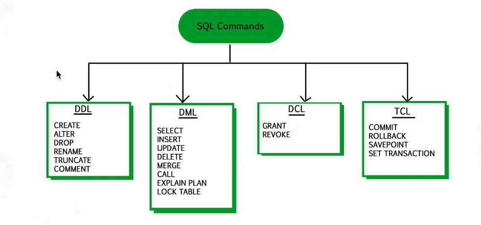

## Windows系统安装MySQL
### 1、下载
下载地址：[https://dev.mysql.com/downloads/mysql/](https://dev.mysql.com/downloads/mysql/)
选择要下载的MySQL版本
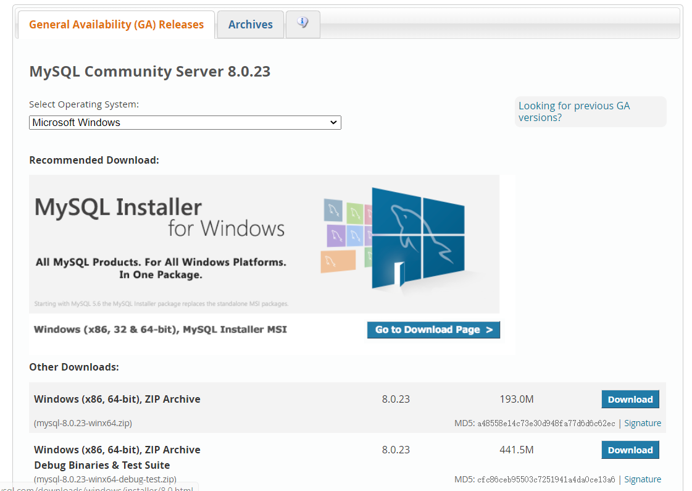
### 2、解压zip包
解压下载的zip压缩包
### 3、配置环境变量
在Path下添加D:\tools\mysql-8.0.16-winx64\bin
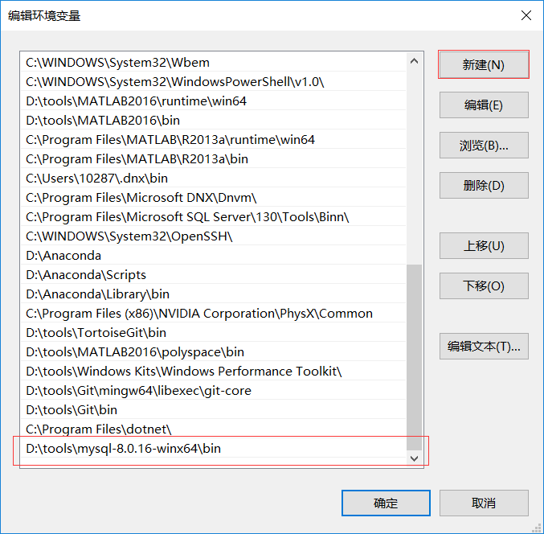
### 4、编写配置文件
在安装根目录下添加my-default.ini文件：D:\tools\mysql-8.0.16-winx64\my-default.ini
```ini
[mysqld]
# 3306端口
port=3306
# mysql的安装目录
basedir=D:\tools\mysql-8.0.16-winx64
# 设置mysql数据库的数据的存放目录
datadir=D:\tools\mysql-8.0.16-winx64\data
# 允许最大连接数
max_connections=200
# 允许连接失败的次数，防止有人从该主机试图攻击数据库系统
max_connect_errors=10
# 服务端使用的字符集默认为UTF8
character-set-server=utf8
# 创建新表时将使用的默认存储引擎
default-storage-engine=INNODB
# 默认使用“mysql_native_password”插件认证
default_authentication_plugin=mysql_native_password
[mysql]
# 设置mysql客户端默认字符集
default-character-set=utf8
[client]
# 设置mysql客户端连接服务端时默认使用的端口
port=3306
default-character-set=utf8
```
### 5、MySQL服务安装
```mysql
mysqld --install MySQL
mysqld install
```
**报错1：**
信息如下：
Install/Remove of the Service Denied
解决办法：
打开cmd.exe程序的时候选择“用管理员身份打开”。

**报错2：**
```sh
C:\WINDOWS\system32>mysqld --install MySQL
The service already exists!
The current server installed: D:\xampp\mysql\bin\mysqld MySQL
```
解决办法：
```mysql
mysqld -remove MySQL
```
### 6、MySQL初始化
在MySQL安装目录的 bin 目录下执行命令：
```mysql
mysqld --initialize --console
```
执行完成后，会打印 root 用户的初始默认密码：
```sh
C:\WINDOWS\system32>mysqld --initialize --console
2019-05-15T09:27:48.338369Z 0 [System] [MY-013169] [Server] D:\tools\mysql-8.0.16-winx64\bin\mysqld.exe (mysqld 8.0.16) initializing of server in progress as process 15308
2019-05-15T09:28:50.242794Z 5 [Note] [MY-010454] [Server] A temporary password is generated for root@localhost: u#vTkx6L:dg,
2019-05-15T09:29:42.201421Z 0 [System] [MY-013170] [Server] D:\tools\mysql-8.0.16-winx64\bin\mysqld.exe (mysqld 8.0.16) initializing of server has completed
```
启动MySQL服务
```mysql
net start mysql
```
### 7、更改密码和密码认证插件
进入D:\tools\mysql-8.0.16-winx64\bin路径下，执行
```mysql
mysql -u root -p
```
然后输入第6步的密码：`u#vTkx6L:dg`

然后修改用户密码，在MySQL中执行命令：
```mysql
ALTER USER 'root'@'localhost' IDENTIFIED WITH mysql_native_password BY '新密码';
```
### 8、查看默认数据库mysql
初始化完成后，初始化了名为mysql数据库，其中user表里面存储MySQL用户信息。
```mysql
mysql> show databases;
mysql> use mysql;
mysql> show tables;
```
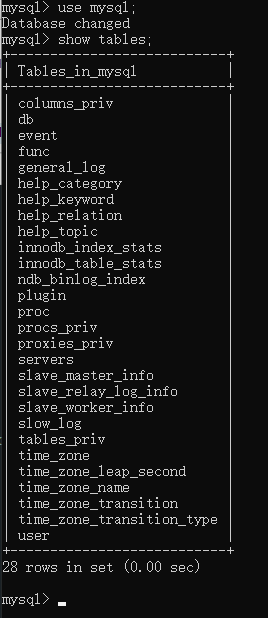

```mysql
# 显示user表结构
mysql> desc user;
mysql> select user,host,authentication_string from mysql.user;
```
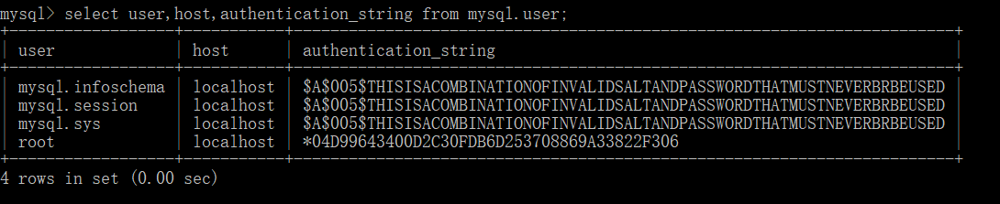

## 添加新的用户
除了管理员root用户，也可以添加其他用户。
### 允许本地 IP访问localhost的Mysql数据库
```mysql
mysql> create user 'admin'@'localhost' identified by 'admin';
Query OK, 0 rows affected (0.22 sec)
```
### 允许外网IP访问数据库
允许开放其他ip登录，添加权限
```mysql
mysql> create user 'admin'@'%' identified by 'admin'; 
Query OK, 0 rows affected (0.08 sec)
mysql> GRANT ALL PRIVILEGES ON e_menu.* TO 'admin'@'%' WITH GRANT OPTION; //将数据库e_menu授权给admin用户 
Query OK, 0 rows affected (0.15 sec)
mysql> flush privileges; //刷新授权
Query OK, 0 rows affected (0.05 sec)
```
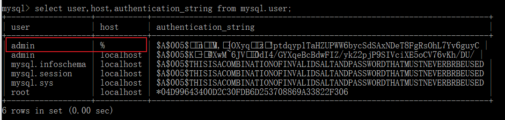

注意：上面的授权命令适用于MySQL8.0及之后的版本，MySQL8.0之前的版本使用如下命令授权
```mysql
grant all privileges on 库名.表名 to '用户名'@'IP地址' identified by '密码' with grant option;
```
授权基本的查询修改权限：
```mysql
GRANT SELECT,INSERT,UPDATE,DELETE,CREATE,DROP,ALTER ON 库名.表名 TO '用户名'@'IP地址';
```

撤销用户权限
```mysql
revoke all privileges on *.* from '用户名'@'IP地址'; 
```

查看用户权限
```mysql
show grants for '用户名'@'IP地址';
```

查看MYSQL数据库中所有用户
```mysql
mysql> SELECT DISTINCT CONCAT('User: ''',user,'''@''',host,''';') AS query FROM mysql.user;
+---------------------------------------+
| query                                 |
+---------------------------------------+
| User: 'admin'@'%';                    |
| User: 'admin'@'localhost';            |
| User: 'mysql.infoschema'@'localhost'; |
| User: 'mysql.session'@'localhost';    |
| User: 'mysql.sys'@'localhost';        |
| User: 'root'@'localhost';             |
+---------------------------------------+
6 rows in set (0.04 sec)

mysql>
```

## Linux系统安装MySQL：Docker安装
Linux系统推荐使用docker安装，简单方便。
如果没有安装docker，需要先安装一下，可参考 [容器技术介绍：Docker简介及安装](https://blog.csdn.net/u010698107/article/details/113820115)
### 1、查看可用的 MySQL 版本
先查看一下可以安装的 MySQL 版本，MySQL镜像的可用版本可在[docker hub](https://hub.docker.com/)中搜索查看：[https://hub.docker.com/_/mysql?tab=tags](https://hub.docker.com/_/mysql?tab=tags)

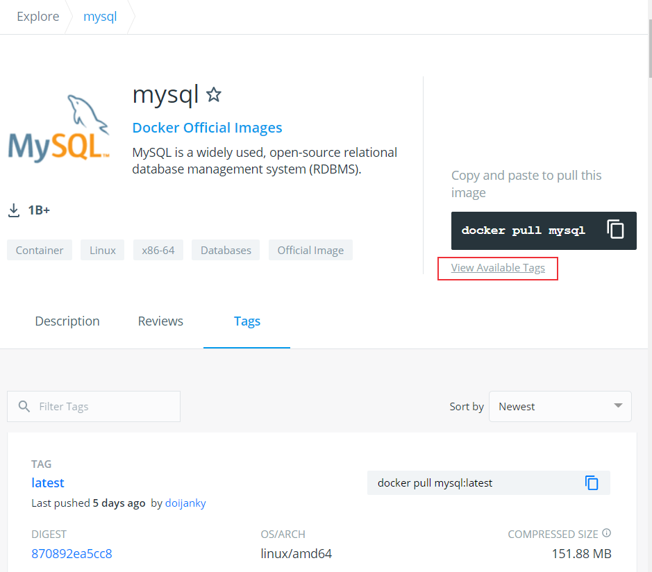
### 2、拉取 MySQL 镜像
拉取指定版本的MySQL
```sh
$ docker pull mysql:5.7
```
查看是否安装MySQL镜像
```sh
$ docker images
[root@server ~]# docker images
REPOSITORY                   TAG               IMAGE ID       CREATED         SIZE
jenkins/jenkins              latest            10fafa8484ea   4 weeks ago     721MB
nginx                        latest            f6d0b4767a6c   4 weeks ago     133MB
mysql                        5.7               9cfcce23593a   8 months ago    448MB
```

### 3、运行容器
运行 mysql 容器：
```sh
$ docker run -itd --name mysql-test -v $PWD/mysql:/var/lib/mysql -p 3306:3306 -e MYSQL_ROOT_PASSWORD=123456 mysql:5.7
```
* --name mysql-test：设置容器名
* -v：`$PWD/mysql`为挂载路径，`/var/lib/mysql`为容器内数据库数据默认存储地址
* -p 3306:3306 ：映射容器服务的 3306 端口到宿主机的 3306 端口。
* MYSQL_ROOT_PASSWORD=123456：设置 MySQL 服务 root 用户的密码。

查看MySQL镜像是否启动成功：
```sh
$ docker ps
[root@server ~]# docker ps
CONTAINER ID   IMAGE       COMMAND                  CREATED        STATUS          PORTS                               NAMES
2c5ae10a7543   mysql:5.7   "docker-entrypoint.s…"   7 months ago   Up 23 minutes   0.0.0.0:3306->3306/tcp, 33060/tcp   mysql-test
```
### 4、进入mysql容器
```sh
$ docker exec -it 容器ID或者容器名 /bin/bash
```

```sh
[root@server ~]# docker exec -it mysql-test /bin/bash
root@2c5ae10a7543:/# exit
exit
[root@server ~]# docker exec -it 2c5ae10a7543 /bin/bash
root@2c5ae10a7543:/# 
```
通过 root 和密码 123456 访问 MySQL 服务
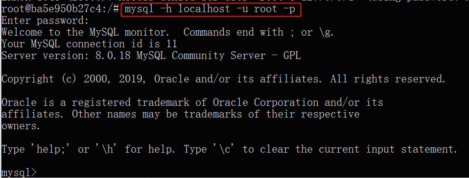

### 5、查看mysql镜像的ip地址
**方法一**
```sh
$ docker inspect mysql-test
```
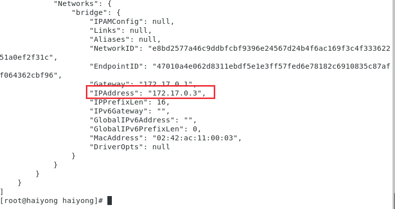
**方法二**
```sh
[root@server local]# docker ps
CONTAINER ID        IMAGE                 COMMAND                  CREATED             STATUS              PORTS                                              NAMES
3bab7ac2a2af        jenkins/jenkins:lts   "/sbin/tini -- /usr/…"   9 hours ago         Up 9 hours          0.0.0.0:8080->8080/tcp, 0.0.0.0:50000->50000/tcp   jenkins
2c5ae10a7543        mysql:5.7             "docker-entrypoint.s…"   6 days ago          Up 8 hours          0.0.0.0:3306->3306/tcp, 33060/tcp                  mysql-test
[root@server local]# docker exec -it mysql-test bash
root@2c5ae10a7543:/# cat /etc/hosts
127.0.0.1    localhost
::1    localhost ip6-localhost ip6-loopback
fe00::0    ip6-localnet
ff00::0    ip6-mcastprefix
ff02::1    ip6-allnodes
ff02::2    ip6-allrouters
172.17.0.3    2c5ae10a7543
root@2c5ae10a7543:/#
```
命令行连接mysql
```mysql
root@2c5ae10a7543:/# mysql -h 172.17.0.3 -u root -p
Enter password: 
Welcome to the MySQL monitor.  Commands end with ; or \g.
Your MySQL connection id is 8
Server version: 5.7.30 MySQL Community Server (GPL)

Copyright (c) 2000, 2020, Oracle and/or its affiliates. All rights reserved.

Oracle is a registered trademark of Oracle Corporation and/or its
affiliates. Other names may be trademarks of their respective
owners.

Type 'help;' or '\h' for help. Type '\c' to clear the current input statement.
mysql> 

```


### 6、增加远程访问docker MySQL权限
在步骤4中，可以进入mysql容器后连接mysql数据库，那么怎么在外面（我的docker mysql安装在centos虚拟机中，想在宿主机上连接docker安装的mysql）也可以连接mysql容器呢？

前面已经讲过授权其他IP访问mysql，这里类似。先进入docker mysql容器内，连接mysql数据库，然后对root账户进行授权并刷新设置：

```mysql
root@2c5ae10a7543:/# mysql -u root -p
Enter password: 
Welcome to the MySQL monitor.  Commands end with ; or \g.
Your MySQL connection id is 3
Server version: 5.7.30 MySQL Community Server (GPL)

Copyright (c) 2000, 2020, Oracle and/or its affiliates. All rights reserved.

Oracle is a registered trademark of Oracle Corporation and/or its
affiliates. Other names may be trademarks of their respective
owners.

Type 'help;' or '\h' for help. Type '\c' to clear the current input statement.

mysql> GRANT ALL PRIVILEGES ON *.* TO 'root'@'%' IDENTIFIED BY '123456' WITH GRANT OPTION;
Query OK, 0 rows affected, 1 warning (0.66 sec)

mysql> flush privileges;
Query OK, 0 rows affected (0.00 sec)
mysql> 
```
授权成功后，在宿主机上连接虚拟机上docker安装的mysql：
```mysql
C:\WINDOWS\system32>mysql -h 192.168.30.8 -P 3306 -u root -p
Enter password: ******
Welcome to the MySQL monitor.  Commands end with ; or \g.
Your MySQL connection id is 4
Server version: 5.7.30 MySQL Community Server (GPL)

Copyright (c) 2000, 2019, Oracle and/or its affiliates. All rights reserved.

Oracle is a registered trademark of Oracle Corporation and/or its
affiliates. Other names may be trademarks of their respective
owners.

Type 'help;' or '\h' for help. Type '\c' to clear the current input statement.

mysql> select user,host,authentication_string from mysql.user;
+---------------+-----------+-------------------------------------------+
| user          | host      | authentication_string                     |
+---------------+-----------+-------------------------------------------+
| root          | localhost | *6BB4837EB74329105EE4568DDA7DC67ED2CA2AD9 |
| mysql.session | localhost | *THISISNOTAVALIDPASSWORDTHATCANBEUSEDHERE |
| mysql.sys     | localhost | *THISISNOTAVALIDPASSWORDTHATCANBEUSEDHERE |
| root          | %         | *6BB4837EB74329105EE4568DDA7DC67ED2CA2AD9 |
+---------------+-----------+-------------------------------------------+
4 rows in set (0.11 sec)

mysql>

```
连接成功！

## 数据库管理工具连接MySQL
除了通过命令行连接管理数据库，为了更加方便管理mysql数据库，有很多数据库管理工具可以通过GUI界面管理数据库，下面介绍数据库管理工具MySQL Workbench连接数据库方法。

MySQL Workbench是MySQL官方自带的免费管理工具，下载地址：[https://dev.mysql.com/downloads/workbench/](https://dev.mysql.com/downloads/workbench/)

**1. 连接宿主机安装的mysql**
安装成功后打开Workbench，添加连接，设置连接名，配置主机名，用户名。
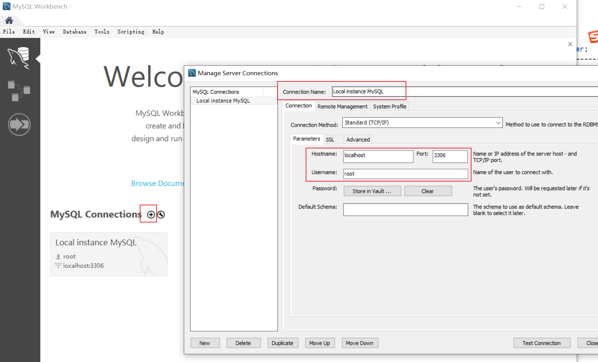
输入密码，连接成功，可以看到数据库
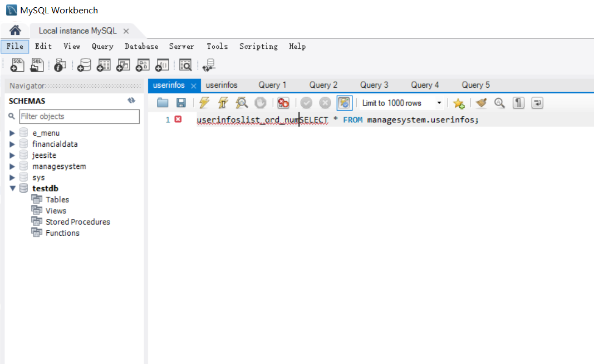

**2. 连接虚拟机安装的docker mysql**
添加连接，设置连接名，配置主机名，用户名
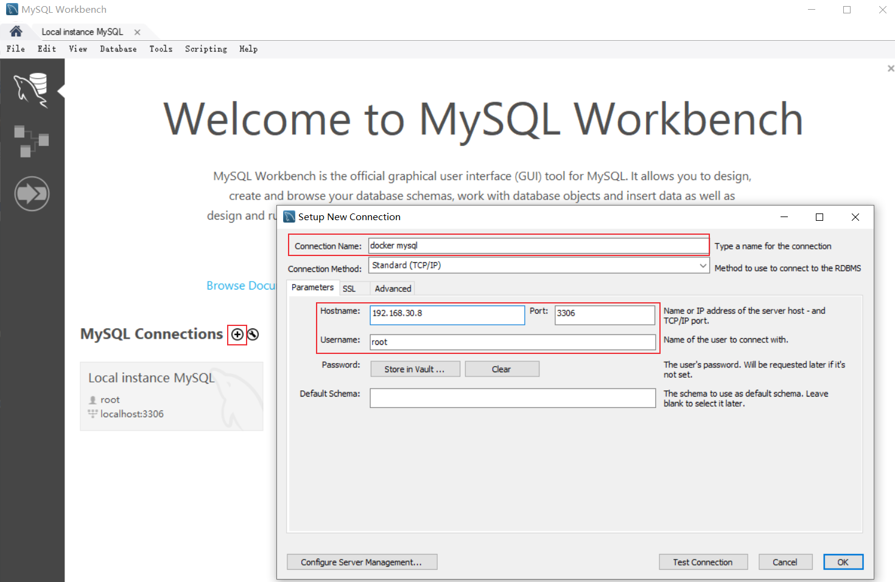
输入密码，连接成功
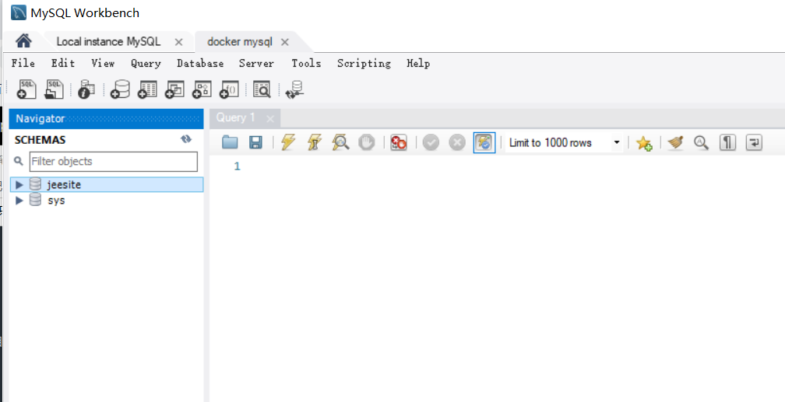

也可以使用Navicat工具连接数据库，连接方法类似


