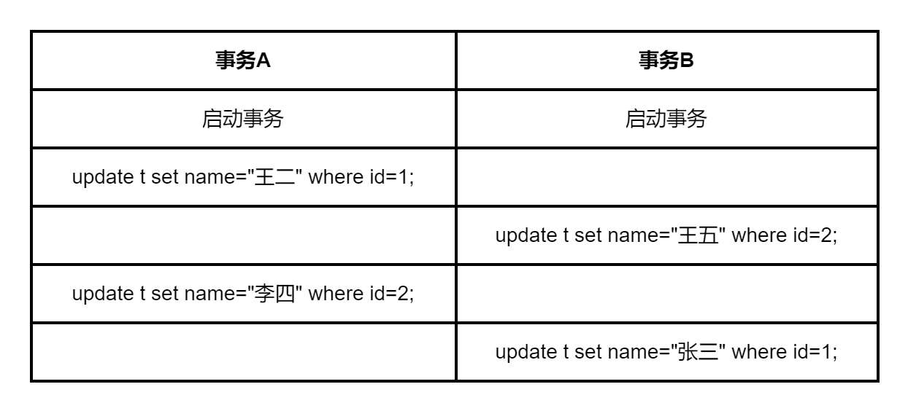

# MySQL锁：全局锁、表级锁和行锁


事务的实现离不开MySQL数据库的锁机制，设计锁的目的也是为了处理并发访问问题，本文简单介绍MySQL 里面的全局锁、表级锁和行锁三类锁。


按对数据操作的类型可分为读锁（read lock）和写锁（write lock）。

- 读锁也叫共享锁（S锁），加了读锁后，加锁的当前会话以及其它会话只能进行读操作，并且多个读操作可以同时进行。
- 写锁也称为排他锁， `X`锁， `exclusive` 的缩写，因为加了写锁之后其它会话不能进行读写操作。

从对数据操作的颗粒度来分，锁可以分为全局锁、表级锁和行锁，下面分别对他们进行介绍。

## 全局锁

全局锁是对整个数据库加锁，数据库被加上全局锁后所有数据表会处于只读状态，修改数据表的DDL语句，数据更新语句（增删改）等操作会被阻塞。

全局锁的命令是：`FLUSH TABLES WITH READ LOCK;` , 简称FTWRL，解锁命令：`UNLOCK TABLES;` 

窗口A加全局锁：

```sql
mysql> FLUSH TABLES WITH READ LOCK;
Query OK, 0 rows affected (0.00 sec)
```

窗口A插入数据会报错：

```sql
mysql> insert into department (name) values ('测试');
ERROR 1223 (HY000): Can't execute the query because you have a conflicting read lock
```

窗口B查询：

```sql
mysql> select * from department;
+----+------+
| id | name |
+----+------+
|  1 | 开发 |
|  2 | 产品 |
|  5 | 测试 |
+----+------+
3 rows in set (0.04 sec)
```

窗口B插入数据会被阻塞：

```sql
mysql> insert into department (name) values ('测试');
```

窗口A解锁：

```sql
mysql> UNLOCK TABLES;
Query OK, 0 rows affected (0.00 sec)
```

窗口B插入语句执行成功：

```sql
mysql> insert into department (name) values ('测试');
Query OK, 1 row affected (2 min 44.85 sec)

mysql> select * from department;
+----+------+
| id | name |
+----+------+
|  1 | 开发 |
|  2 | 产品 |
|  5 | 测试 |
|  6 | 测试 |
+----+------+
4 rows in set (0.00 sec)
```


全局锁的一个使用场景是做全库逻辑备份（mysqldump），加了全局锁后，在备份过程中整个库处于只读状态。如果备份主库，备份期间更新相关业务都无法执行；如果是备份从库，备份期间从库就不能执行主库同步过来的 binlog，会导致主从延迟。

支持事务的引擎InnoDB可以不使用FTWRL，使用mysqldump命令备份时可以使用参数 `--single-transaction` 来获取一致性备份，它会在开始备份前启动一个事务（可重复读隔离级别），利用了MVCC技术（可参考文章[MySQL事务：事务隔离](https://blog.csdn.net/u010698107/article/details/125732536)），确保拿到一致性视图，备份过程可以正常更新数据。

而不支持事务的引擎MyISAM就无法使用 `--single-transaction`参数了，它不支持事务隔离，所以使用MyISAM引擎的数据库备份需要使用FTWRL命令。

## 表级锁

表级锁是对整张表加锁，MyISAM、InnoDB、BDB和MEMOR都支持表级锁。

MySQL 表级锁包括两种：表锁和元数据锁（meta data lock，MDL)。

### 表锁

表锁包括读锁（read lock）和写锁（write lock）。

```sql
lock table 表名 read;  -- 读锁 
lock table 表名 write; -- 写锁
unlock tables; -- 释放表锁，连接断开时会自动释放表锁
```

以MyISAM引擎为例演示一下表锁的作用效果：

创建一个以MyISAM为引擎的表，并插入一条记录：

```sql
create table table_lock_test(
    id int not null auto_increment primary key,
    name char(30) not null) ENGINE=MyISAM DEFAULT CHARSET=utf8;
    
insert into table_lock_test (name) values ('zhangsan');    
```

#### 1、读锁实例

窗口A给table_lock_test表加读锁：

```sql
mysql> lock table table_lock_test read;
Query OK, 0 rows affected (0.04 sec)

mysql> select * from table_lock_test;
+----+----------+
| id | name     |
+----+----------+
|  1 | zhangsan |
+----+----------+
1 row in set (0.00 sec)
```

查看被锁定的表：

```sql
mysql> show open tables where In_use > 0;
+----------+-----------------+--------+-------------+
| Database | Table           | In_use | Name_locked |
+----------+-----------------+--------+-------------+
| testdb   | table_lock_test |      1 |           0 |
+----------+-----------------+--------+-------------+
1 row in set (0.00 sec)
```

窗口A执行更新、插入操作：

```sql
mysql> update table_lock_test set name='lishi' where id=1;
ERROR 1099 (HY000): Table 'table_lock_test' was locked with a READ lock and can't be updated

mysql> insert into table_lock_test (name) values ('lishi');
ERROR 1099 (HY000): Table 'table_lock_test' was locked with a READ lock and can't be updated
```

窗口A读其它表：

```sql
mysql> select * from department;
ERROR 1100 (HY000): Table 'department' was not locked with LOCK TABLES
```

未解锁前不能操作其它表。

窗口B查询：

```sql
mysql> select * from table_lock_test;
+----+----------+
| id | name     |
+----+----------+
|  1 | zhangsan |
+----+----------+
1 row in set (0.00 sec)
```

窗口B执行更新操作：

```sql
mysql> update table_lock_test set name='lishi' where id=1;

```

更新操作会被阻塞，因为读锁没有被释放，只能查询不能更新。到窗口A将锁释放：

```sql
unlock tables;
```

解锁后，窗口B更新操作成功：

```sql
mysql> update table_lock_test set name='lishi' where id=1;
Query OK, 1 row affected (3 min 22.88 sec)
Rows matched: 1  Changed: 1  Warnings: 0

mysql> select * from table_lock_test;
+----+-------+
| id | name  |
+----+-------+
|  1 | lishi |
+----+-------+
1 row in set (0.00 sec)
```

#### 2、写锁实例
窗口A给table_lock_test表加写锁：

```sql
mysql> lock table table_lock_test write;
Query OK, 0 rows affected (0.00 sec)

mysql> select * from table_lock_test;
+----+-------+
| id | name  |
+----+-------+
|  1 | lishi |
+----+-------+
1 row in set (0.00 sec)
```

窗口A执行更新、插入操作：

```sql
mysql> update table_lock_test set name='zhangsan' where id=1;
Query OK, 1 row affected (0.05 sec)
Rows matched: 1  Changed: 1  Warnings: 0

mysql> insert into table_lock_test (name) values ('lishi');
Query OK, 1 row affected (0.05 sec)

mysql> select * from table_lock_test;
+----+----------+
| id | name     |
+----+----------+
|  1 | zhangsan |
|  2 | lishi    |
+----+----------+
2 rows in set (0.00 sec)
```

窗口A读其它表：

```sql
mysql> select * from department;
ERROR 1100 (HY000): Table 'department' was not locked with LOCK TABLES
```

和读锁一样，未解锁前不能其它表进行CRUD操作。


窗口B查询：

```sql
mysql> select * from table_lock_test;

```

被阻塞了，因为写锁为排它锁，其它连接不能对table_lock_test表进行读写操作。


到窗口A将锁释放：

```sql
unlock tables;
```

解锁后，窗口B查询成功：

```sql
mysql> select * from table_lock_test;
+----+----------+
| id | name     |
+----+----------+
|  1 | zhangsan |
|  2 | lishi    |
+----+----------+
2 rows in set (3 min 10.99 sec)
```


### 元数据锁

在 MySQL 5.5 以后的版本中，访问一个表的时候会自动加上 MDL（metadata lock)，作用是保证读写的正确性。比如在RR隔离级别下，当前事务A在操作一个表的过程中，另外一个事务B对表执行DDL操作（表结构变更），如果没有MDL，会导致事务A 两次查询结果不一样。要实现可重复度，就需要使用到MDL。

当对一个表做DML操作（增删改查）时，加 MDL 读锁，当其它事务对表进行DDL操作时，需要先获得MDL 读锁才能对表结构进行修改；当要对表做DDL操作（表结构变更）时，会加 MDL 写锁。

- 读锁之间不互斥，多事务同时对一张表进行DML操作不会阻塞。 注意：实际进行增删改查时可能会看到锁等待，这是InnoDB的行锁导致的。
- 读写锁之间互斥，也就是对同一表进行的DML和DDL操作会相互阻塞。
- 写锁之间互斥，多事务同时对一张表进行DDL操作会阻塞，其中一个要等另一个执行完才能开始执行。

MDL锁在语句开始执行时申请，在事务提交后释放。如果事务A对表T加了一个MDL读锁，且未提交。事务B对数据表执行DDL操作，此时事务B会被锁住（Waiting for table metadata lock），因为事务A 的 MDL 读锁没有释放，而事务B需要 MDL 写锁，因此会被阻塞。而后续对表T的任何操作都会被阻塞，此时表T完全不可读写了。MDL 锁的这一机制需要特别注意。

在窗口A启动一个事务：

```sql
mysql> select * from performance_schema.metadata_locks;
+-------------+--------------------+----------------+-------------+-----------------------+-------------+---------------+-------------+-------------------+-----------------+----------------+
| OBJECT_TYPE | OBJECT_SCHEMA      | OBJECT_NAME    | COLUMN_NAME | OBJECT_INSTANCE_BEGIN | LOCK_TYPE   | LOCK_DURATION | LOCK_STATUS | SOURCE            | OWNER_THREAD_ID | OWNER_EVENT_ID |
+-------------+--------------------+----------------+-------------+-----------------------+-------------+---------------+-------------+-------------------+-----------------+----------------+
| TABLE       | performance_schema | metadata_locks | NULL        |         1883582562928 | SHARED_READ | TRANSACTION   | GRANTED     | sql_parse.cc:5929 |              75 |              4 |
+-------------+--------------------+----------------+-------------+-----------------------+-------------+---------------+-------------+-------------------+-----------------+----------------+
1 row in set (0.00 sec)

mysql> start transaction;
Query OK, 0 rows affected (0.04 sec)

mysql> select * from table_lock_test;
+----+----------+
| id | name     |
+----+----------+
|  1 | zhangsan |
|  2 | lishi    |
+----+----------+
2 rows in set (0.14 sec)

mysql> select * from performance_schema.metadata_locks;
+-------------+--------------------+-----------------+-------------+-----------------------+-------------+---------------+-------------+-------------------+-----------------+----------------+
| OBJECT_TYPE | OBJECT_SCHEMA      | OBJECT_NAME     | COLUMN_NAME | OBJECT_INSTANCE_BEGIN | LOCK_TYPE   | LOCK_DURATION | LOCK_STATUS | SOURCE            | OWNER_THREAD_ID | OWNER_EVENT_ID |
+-------------+--------------------+-----------------+-------------+-----------------------+-------------+---------------+-------------+-------------------+-----------------+----------------+
| TABLE       | testdb             | table_lock_test | NULL        |         1883582562928 | SHARED_READ | TRANSACTION   | GRANTED     | sql_parse.cc:5929 |              75 |              7 |
| TABLE       | performance_schema | metadata_locks  | NULL        |         1883583662656 | SHARED_READ | TRANSACTION   | GRANTED     | sql_parse.cc:5929 |              75 |              8 |
+-------------+--------------------+-----------------+-------------+-----------------------+-------------+---------------+-------------+-------------------+-----------------+----------------+
2 rows in set (0.00 sec)

mysql>


```

事务A启动后，metadata_locks表新增了一条table_lock_test表的加锁记录。

窗口B执行一个修改表结构的DDL操作：

```sql\
mysql> ALTER TABLE table_lock_test ADD age TINYINT;

```

会被阻塞。

窗口A查询数据库线程：

```sql
mysql> show processlist;
+----+-----------------+-----------------+--------+---------+---------+---------------------------------+---------------------------------------------+
| Id | User            | Host            | db     | Command | Time    | State                           | Info                                        |
+----+-----------------+-----------------+--------+---------+---------+---------------------------------+---------------------------------------------+
|  4 | event_scheduler | localhost       | NULL   | Daemon  | 1693591 | Waiting on empty queue          | NULL                                        |
| 36 | root            | localhost:61623 | testdb | Query   |       0 | starting                        | show processlist                            |
| 37 | root            | localhost:55438 | testdb | Query   |      93 | Waiting for table metadata lock | ALTER TABLE table_lock_test ADD age TINYINT |
+----+-----------------+-----------------+--------+---------+---------+---------------------------------+---------------------------------------------+
3 rows in set (0.05 sec)


```

可以发现线程37在等待MDL锁。

接着窗口C执行查询操作：

```sql
mysql> select * from table_lock_test;

```

也被阻塞了，后续对表table_lock_test的任何操作都会被阻塞掉。

到窗口A提交事务

```sql
mysql> commit;
Query OK, 0 rows affected (0.00 sec)
```

B和C执行成功。查询表，字段添加成功：

```sql
mysql> select * from table_lock_test;
+----+----------+------+
| id | name     | age  |
+----+----------+------+
|  1 | zhangsan | NULL |
|  2 | lishi    | NULL |
+----+----------+------+
2 rows in set (0.00 sec)

```

查询table_lock_test表的加锁记录，表table_lock_test消失：

```sql
mysql> select * from performance_schema.metadata_locks;
+-------------+--------------------+----------------+-------------+-----------------------+-------------+---------------+-------------+-------------------+-----------------+----------------+
| OBJECT_TYPE | OBJECT_SCHEMA      | OBJECT_NAME    | COLUMN_NAME | OBJECT_INSTANCE_BEGIN | LOCK_TYPE   | LOCK_DURATION | LOCK_STATUS | SOURCE            | OWNER_THREAD_ID | OWNER_EVENT_ID |
+-------------+--------------------+----------------+-------------+-----------------------+-------------+---------------+-------------+-------------------+-----------------+----------------+
| TABLE       | performance_schema | metadata_locks | NULL        |         1883583665248 | SHARED_READ | TRANSACTION   | GRANTED     | sql_parse.cc:5929 |              75 |             13 |
+-------------+--------------------+----------------+-------------+-----------------------+-------------+---------------+-------------+-------------------+-----------------+----------------+
1 row in set (0.00 sec)
```


## 行锁

### 行锁简介

行锁是对数据行加锁，是在引擎层实现的，MyISAM 引擎不支持行锁，而 InnoDB 引擎是支持行锁的，因此相比MyISAM 引擎，InnoDB可以提供良好的并发控制。

当然行锁也包括读锁（read lock）和写锁（write lock）。

- 读锁也叫共享锁，`S`锁，加了读锁后，加锁的当前会话以及其它会话只能进行读操作，并且多个读操作可以同时进行。
- 写锁也称为排他锁，`X`锁， `exclusive` 的缩写，因为加了写锁之后其它会话不能进行读写操作。

当前读都会加行锁：

```sql
select * from account lock in share mode; # 添加读锁（S 锁，共享锁）
select * from account for update; # 添加写锁（X 锁，排他锁）
insert语句
update语句
delete语句
```

InnoDB 引擎的行锁会自动加上，比如在更新数据时会自动加上行锁，其它事务对相同行数据进行更新时就会被阻塞，直到锁被释放才能更新。

行锁不是在数据更新完行之后就立马解锁，而是在事务提交(commit)或者回滚(rollback)之后才会解锁。这称为**两阶段锁协议**，包括加锁和解锁两个阶段。

### 行锁实例

下面看一个例子：

先创建一个表，使用InnoDB引擎：

```sql
create table table_row_lock(
    id int not null auto_increment primary key COMMENT 'ID',
    name char(30) not null COMMENT '名称') ENGINE=InnoDB 
	DEFAULT CHARSET=utf8
	comment = '行锁测试'; 	
```

事务隔离级别为可重复读（RR）。

插入数据：

```sql
mysql> insert into table_row_lock (name) values ('张三');
Query OK, 1 row affected (0.07 sec)

mysql> insert into table_row_lock (name) values ('李四');
Query OK, 1 row affected (0.09 sec)

mysql> select * from table_row_lock;
+----+------+
| id | name |
+----+------+
|  1 | 张三 |
|  2 | 李四 |
+----+------+
2 rows in set (0.00 sec)
```

窗口A启动一个事务，并更新数据：

```sql
mysql> begin;
Query OK, 0 rows affected (0.00 sec)

mysql> update table_row_lock set name="王二" where id=1;
Query OK, 1 row affected (0.00 sec)
Rows matched: 1  Changed: 1  Warnings: 0

mysql> select * from table_row_lock;
+----+------+
| id | name |
+----+------+
|  1 | 王二 |
|  2 | 李四 |
+----+------+
2 rows in set (0.00 sec)
```

窗口B更新相同行的记录，会被阻塞：

```sql
mysql> update table_row_lock set name="张三" where id=1;
ERROR 1205 (HY000): Lock wait timeout exceeded; try restarting transaction
```

行锁等待时间可以执行 `SHOW VARIABLES LIKE 'innodb_lock_wait_timeout';` 命令查看：

```sql
mysql> SHOW VARIABLES LIKE 'innodb_lock_wait_timeout';
+--------------------------+-------+
| Variable_name            | Value |
+--------------------------+-------+
| innodb_lock_wait_timeout | 50    |
+--------------------------+-------+
1 row in set, 1 warning (0.01 sec)
```

窗口B更新其它行记录：

```sql
mysql> update table_row_lock set name="王五" where id=2;
Query OK, 1 row affected (0.07 sec)
Rows matched: 1  Changed: 1  Warnings: 0

mysql> select * from table_row_lock;
+----+------+
| id | name |
+----+------+
|  1 | 张三 |
|  2 | 王五 |
+----+------+
2 rows in set (0.00 sec)
```

`id=2`行数据没有被加写锁，所以可以对它进行更新操作。

窗口A提交事务：

```sql
mysql> commit;
Query OK, 0 rows affected (0.07 sec)
```

此时窗口B就可以更新`id=1`那行数据了。

```sql
mysql> update table_row_lock set name="张三" where id=1;
Query OK, 1 row affected (0.06 sec)
Rows matched: 1  Changed: 1  Warnings: 0

mysql> select * from table_row_lock;
+----+------+
| id | name |
+----+------+
|  1 | 张三 |
|  2 | 王五 |
+----+------+
2 rows in set (0.00 sec)
```

### 死锁

真实业务中通常对数据库进行并发控制，多个事务可能会依赖相同的资源，如果都在等待其它事务释放锁时，这会导致这几个事务进入无限等待的状态，也就是出现死锁。

比如下图就会出现死锁，事务 A 在等待事务 B 释放 id=2 的行锁，而事务 B 在等待事务 A 释放 id=1 的行锁。



出现死锁后，有两种策略来解决：

1. 等待锁超时。默认超时等待时间为50s，可通过`innodb_lock_wait_timeout`参数来设置，具体等待时间需要根据自己的实际业务来设置。
2. 死锁检测。设置参数`innodb_deadlock_detect = on`，开启后，系统会自动检测死锁的事务并回滚某一个事务，让其他可以事务继续执行。


## 总结

本文简单介绍了全局锁、表级锁和行锁，全局锁主要用于全库逻辑备份。如果数据库引擎使用的是 InnoDB，可以使用 `-–single-transaction` 参数。

表锁是对整张表加锁，访问一个表的时候会自动加上元数据锁(MDL)，MDL锁在语句开始执行时申请，在事务提交后释放。如果表T的MDL锁没有释放，后续对表T的任何操作都会被阻塞。

行锁是对数据行加锁，MyISAM引擎不支持行锁，它一般使用的是表级锁。InnoDB 引擎支持行锁，因此它可以实现更好的并发控制。另外使用行锁要注意尽量减少死锁对数据库的影响。

另外要注意的是，加锁是要消耗资源的，对锁的各种操作会增加系统的开销，相比MyISAM引擎，InnoDB 引擎的行锁会导致占用更大的数据空间。


 


