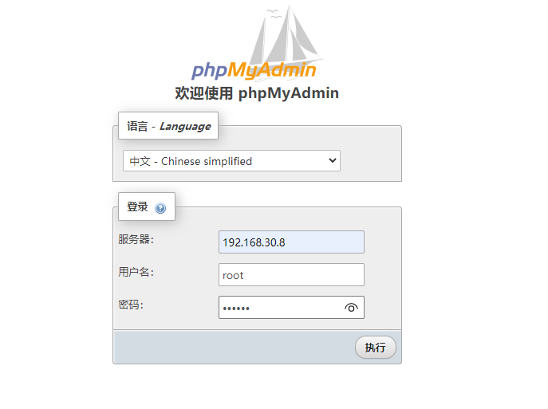
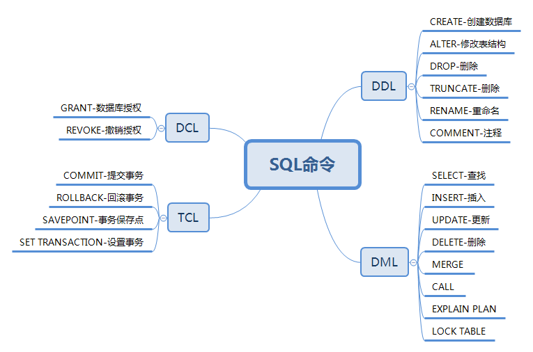
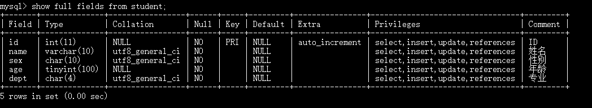

# MySQL数据库基础入门
本文介绍MySQL数据库基础操作方法

<!--more-->

## MySQL 连接
### shell连接
命令行连接mysql服务器：
```sh
mysql -h 主机名 -u 用户名 -p
```
* -h：指定要登录的MySQL主机名，登录本机可以省略
* -u：用户名
* -p：登录密码

```mysql
C:\Users\10287>mysql -u root -p
Enter password: *********
Welcome to the MySQL monitor.  Commands end with ; or \g.
Your MySQL connection id is 8
Server version: 8.0.16 MySQL Community Server - GPL

Copyright (c) 2000, 2019, Oracle and/or its affiliates. All rights reserved.

Oracle is a registered trademark of Oracle Corporation and/or its
affiliates. Other names may be trademarks of their respective
owners.

Type 'help;' or '\h' for help. Type '\c' to clear the current input statement.

mysql>
```

可使用exit 命令退出
```mysql
mysql> exit
Bye

C:\Users\10287>
```


非交互模式：
```mysql
C:\Users\10287>mysql -uroot -Dtestdb -e "show tables;" -p123456 -B
mysql: [Warning] Using a password on the command line interface can be insecure.
Tables_in_testdb
score
student

C:\Users\10287>
```


### 管理工具连接
可以使用MySQL Workbench、Navicat等数据库管理工具连接MySQL数据库，MySQL Workbench连接方法可参考[MySQL数据库安装配置详细教程](https://blog.csdn.net/u010698107/article/details/113824326)。

#### phpMyAdmin 连接
phpMyAdmin是一个以PHP为基础，以Web-Base方式架构在网站主机上的MySQL的数据库管理工具，让管理者可用Web接口 MyS管理数据库。方便实现远程管理 MySQL数据库。下面介绍Linux中phpMyAdmin安装方法。

使用docker安装phpmyadmin镜像：
```sh
docker pull phpmyadmin/phpmyadmin
```
安装完成后启动phpmyadmin容器：
```sh
docker run -d \
--name myadmin \
-e PMA_ARBITRARY=1 \
-p 3080:80 \
phpmyadmin/phpmyadmin
```
启动MySQL服务器，我这里的MySQL服务也是使用docker启动的，安装和使用方法参考：[MySQL数据库安装配置详细教程](https://blog.csdn.net/u010698107/article/details/113824326)
```sh
docker start mysql-test
```
浏览器访问：http://192.168.30.8:3080/， 192.168.30.8为主机IP地址，3080为映射的端口号。
输入主机名，MySQL数据库的用户名，密码


登录进去后可以对数据库进行管理


## SQL 语言

SQL语言包括四种语句：

- 数据定义语言(data definition language，DDL)

- 数据操作语言(data manipulation language，DML)

- 数据控制语言(Data Control Language，DCL)

- 事务控制语言（Transaction Control Language，TCL）



## 创建数据库

```sql
mysql> create database testdb;
Query OK, 1 row affected (0.13 sec)
mysql> show databases;
+--------------------+
| Database           |
+--------------------+
| information_schema |
| mysql              |
| sys                |
| testdb             |
+--------------------+
9 rows in set (0.37 sec)

mysql>
```

## 删除数据库
```sql
mysql> drop database testdb;
Query OK, 0 rows affected (0.35 sec)
mysql> create database testdb;
Query OK, 1 row affected (0.13 sec)
```

## 数据表操作
MySQL数据库操作可以下载测试数据库进行练习：[https://github.com/datacharmer/test_db](https://github.com/datacharmer/test_db)， 本文在本地进行创建。

### mysql数据类型
常见的数据类型
- varchar：可变长度的字符串，最长255，根据实际的数据长度动态分配空间。
- char：定长字符串，最长255，分配固定长度的空间
- int：整型，最长11
- bigint：长整型
- float：单精度浮点型数据
- double：双精度浮点型数据
- date：短日期类型，包括年月日信息
- datetime：长日期类型，包括年月日时分秒信息
- clob：字符大对象，最多可以存储4G的字符串。超过255个字符的都要采用CLOB字符大对象来存储。
- blob：二进制大对象，专门用来存储图片、声音、视频等流媒体数据。

### 约束

在创建表的时候，可以给表中的字段加上一些约束，来保证这个表中数据的完整性、有效性。

约束包括：
- not null：非空约束，约束的字段不能为NULL
- unique：唯一性约束，约束字段不能重复，但可以为NULL
- primary key：主键约束
- foreign key：外键约束
- check：检查约束，mysql不支持，oracle支持

#### 非空约束not null
```sql
create table student(
    id int,
    name varchar(255) not null
);
```
#### 唯一性约束unique
需要给多个字段联合起来添加某一个约束的时候，需要使用表级约束。
```sql
unique(name,email) 
```
#### 主键约束primary key
- 任何一张表都应该有主键，主键值是每一行记录的唯一标识，主键字段中的每一个值都叫做：主键值。
- 主键的特征：not null + unique（主键值不能是NULL，同时也不能重复！）
- 一张表，主键约束只能添加1个
- 主键值一般都是数字，一般都是定长的
```sql
create table student(
    id int primary key,  //列级约束,单一主键
    name varchar(255)
);
create table student(
    id int,
    name varchar(255),
    email varchar(255),
    primary key(id,name) //表级约束,复合主键<在实际开发中建议使用单一主键！
);

```
#### 外键约束foreign key
- 外键和主键一样也是索引的一种。不同的是MySQL会自动为所有表的主键进行索引，但是外键字段必须由用户进行明确的索引.

- 对于两个具有关联关系的表而言，相关联字段中主键所在的表就是主表（父表），外键所在的表就是从表（子表）

- 外键用来建立主表与从表的关联关系，为两个表的数据建立连接，约束两个表中数据的一致性和完整性。

- 主键不能包含空值，但允许在外键中出现空值

### 创建数据表
主键：表中记录的**唯一标识符**，不重复，非空
外键：字段中的值来自于其他表的主键
索引：加速表的查询


首先选择一个数据库
```sql
mysql> use testdb;
Database changed
```
进入testdb数据库后，创建一个名称为student的表
```sql
create table student(
    id int not null auto_increment primary key COMMENT 'ID',
    name varchar(10) not null COMMENT '姓名',
    sex char(10) not null COMMENT '性别',
    age tinyint(100) not null COMMENT '年龄',
    dept char(4) not null COMMENT '专业') ENGINE=InnoDB 
    DEFAULT CHARSET=utf8 ROW_FORMAT=DYNAMIC
    comment = '学生';    
```

### 删除数据表
```sql
drop table 表名;
truncate table 表名;
```
### 查看表结构
```sql
mysql> desc student;
+-------+--------------+------+-----+---------+----------------+
| Field | Type         | Null | Key | Default | Extra          |
+-------+--------------+------+-----+---------+----------------+
| id    | int(11)      | NO   | PRI | NULL    | auto_increment |
| name  | varchar(10)  | NO   |     | NULL    |                |
| sex   | char(10)     | NO   |     | NULL    |                |
| age   | tinyint(100) | NO   |     | NULL    |                |
| dept  | char(4)      | NO   |     | NULL    |                |
+-------+--------------+------+-----+---------+----------------+
5 rows in set (0.03 sec)
```
使用以下命令是一样的效果：
```sql
describe student;
show columns from student;
```
查看详细表结构
```sql
show full fields from student;
```


### 表结构修改
常用语法格式:
`ALTER TABLE <表名> [修改选项]`
修改选项的语法格式如下:

```sql
ADD COLUMN <列名> <类型> [after 插入位置]/*添加字段，或者在某列后插入列*/
CHANGE COLUMN <旧列名> <新列名> <新列类型> /*改变字段名*/
MODIFY COLUMN <列名> <类型> /*修改字段类型*/
DROP COLUMN <列名> /*删除字段*/
RENAME TO <新表名> /*修改表名*/
```
修改字段长度
```sql
alter table 表名 modify column 字段名 char(10);
```

```sql   
alter table 表名 auto_increment = 201215121;
```

## 函数
包括字符串、日期、数字相关系统自定义函数，官方文档：[https://dev.mysql.com/doc/refman/8.0/en/functions.html](https://dev.mysql.com/doc/refman/8.0/en/functions.html)

### 数据处理函数

数据处理函数又被称为单行处理函数，一个输入对应一个输出。
常见单行处理函数
lower 转换小写
upper 转换大写
```sql
select upper(name) as name from student;
```
substr：取子串，`substr( 被截取的字符串, 起始下标,截取的长度)`
concat：字符串的拼接
length：取长度
trim：去空格
str_to_date：将字符串转换成日期
date_format：格式化日期
format：设置千分位
round：四舍五入
rand()：生成随机数
### 多行处理函数
分组函数，多个输入，对应1个输出。
- count：计数
- sum：求和
- avg：平均值
- max：最大值
- min：最小值

注意：
- 分组函数自动忽略NULL，你不需要提前对NULL进行处理。
- 分组函数不能够直接使用在where子句中
- 所有的分组函数可以组合起来一起用。
- 分组函数不能直接使用在where后面，因为分组函数在使用的时候必须先分组之后才能使用。where执行的时候，还没有分组。所以where后面不能出现分组函数。
## 增删改查
### 插入数据
语法：
```sql
insert into 表名(字段1,字段2) values(字段值1,字段值2)
```
插入数据
```sql
mysql> insert into Student (name, sex, age, dept) values ('张三', '男', 20, '通信');
Query OK, 1 row affected (0.45 sec)
mysql> select * from student;
+----+------+-----+-----+------+
| id | name | sex | age | dept |
+----+------+-----+-----+------+
|  1 | 张三 | 男  |  20 | 通信 |
+----+------+-----+-----+------+
1 row in set (0.03 sec)

mysql>
```


### 删除数据
语法：
```sql
delete from 表名 where 字段名1= 字段值1
delete from 表名 /*删除表里所有数据*/
```
删除
```sql
mysql> delete from student;
Query OK, 1 row affected (0.09 sec)
mysql> select * from student;
Empty set (0.00 sec)

mysql> insert into Student (name, sex, age, dept) values ('张三', '男', 20, '通信');
Query OK, 1 row affected (0.07 sec)

mysql> insert into Student (name, sex, age, dept) values ('李四', '男', 22, '通信');
Query OK, 1 row affected (0.07 sec)

mysql> delete from student where name='张三';
Query OK, 1 row affected (0.17 sec)
mysql> select * from student;
+----+------+-----+-----+------+
| id | name | sex | age | dept |
+----+------+-----+-----+------+
|  3 | 李四 | 男  |  22 | 通信 |
+----+------+-----+-----+------+
1 row in set (0.00 sec)

mysql>
```
### 更新数据
语法：
```sql
update 表名 set 字段名1=字段值1 where 字段名2=字段值2
update 表名 set 字段名1=字段值1 /*修改表里所有数据*/
```
更新数据
```sql
mysql> update student set age=20 where name='李四';
Query OK, 1 row affected (0.07 sec)
Rows matched: 1  Changed: 1  Warnings: 0

mysql> select * from student;
+----+------+-----+-----+------+
| id | name | sex | age | dept |
+----+------+-----+-----+------+
|  3 | 李四 | 男  |  20 | 通信 |
+----+------+-----+-----+------+
1 row in set (0.00 sec)

mysql> update student set age=age+1;
Query OK, 4 rows affected (0.79 sec)
Rows matched: 4  Changed: 4  Warnings: 0

mysql> select * from student;
+----+------+-----+-----+--------+
| id | name | sex | age | dept   |
+----+------+-----+-----+--------+
|  1 | 李四 | 男  |  21 | 通信   |
|  2 | 张三 | 男  |  21 | 通信   |
|  3 | 王二 | 男  |  23 | 计算机 |
|  4 | 小花 | 女  |  23 | 计算机 |
+----+------+-----+-----+--------+
4 rows in set (0.04 sec)

mysql>
```

### 查询数据
再创建一个名称为score的表，记录成绩
```sql
create table score(
    sid int not null auto_increment primary key COMMENT 'score ID',
    student_id int(10) not null COMMENT '学号',
    name varchar(10) not null COMMENT '姓名',
    course char(10) not null COMMENT '课程',
    grade tinyint(100) not null COMMENT '分数') ENGINE=InnoDB 
    DEFAULT CHARSET=utf8 ROW_FORMAT=DYNAMIC
    comment = '成绩';
```

student和score两个表显示如下：
```sql
mysql> select * from student;
+----+------+-----+-----+--------+
| id | name | sex | age | dept   |
+----+------+-----+-----+--------+
|  1 | 李四 | 男  |  20 | 通信   |
|  2 | 张三 | 男  |  20 | 通信   |
|  3 | 王二 | 男  |  22 | 计算机 |
|  4 | 小花 | 女  |  22 | 计算机 |
+----+------+-----+-----+--------+
4 rows in set (0.00 sec)

mysql> select * from score;
+-----+------------+------+------------+-------+
| sid | student_id | name | course     | grade |
+-----+------------+------+------------+-------+
|   1 |          1 | 李四 | 高数       |    90 |
|   2 |          1 | 李四 | 英语       |    92 |
|   3 |          1 | 李四 | 经济学基础 |    88 |
|   4 |          2 | 张三 | 高数       |    80 |
|   5 |          2 | 张三 | 英语       |    85 |
|   6 |          2 | 张三 | 经济学基础 |    93 |
|   7 |          3 | 王二 | 高数       |    82 |
|   8 |          3 | 王二 | 英语       |    98 |
|   9 |          3 | 王二 | 经济学基础 |    80 |
+-----+------------+------+------------+-------+
9 rows in set (0.00 sec)

mysql>
```

#### 简单查询

查询语法：

```sql
select * from 表名
```
```sql
mysql> select * from student;
+----+------+-----+-----+--------+
| id | name | sex | age | dept   |
+----+------+-----+-----+--------+
|  1 | 李四 | 男  |  20 | 通信   |
|  2 | 张三 | 男  |  20 | 通信   |
|  3 | 王二 | 男  |  22 | 计算机 |
|  4 | 小花 | 女  |  22 | 计算机 |
+----+------+-----+-----+--------+
4 rows in set (0.00 sec)

mysql>
```

#### where 条件查询
where 关键词查询：`select 列名称 from 表名称 where 条件;`

where关键词支持如下运算： 
* 比较：=、>、<、>=、<\>、!= 
* is [not] null、in、like 
* 支持not查询， or 和 and 组合查询
* 范围限定：where age between 10 and 20;
* 子集限定：where course in ('高数','英语');


```sql
mysql> select * from student where age > 20;
+----+------+-----+-----+--------+
| id | name | sex | age | dept   |
+----+------+-----+-----+--------+
|  3 | 王二 | 男  |  22 | 计算机 |
|  4 | 小花 | 女  |  22 | 计算机 |
+----+------+-----+-----+--------+
2 rows in set (0.71 sec)

mysql> select * from student where age > 20 and sex = '女';
+----+------+-----+-----+--------+
| id | name | sex | age | dept   |
+----+------+-----+-----+--------+
|  4 | 小花 | 女  |  22 | 计算机 |
+----+------+-----+-----+--------+
1 row in set (0.03 sec)

mysql> select * from student where dept like '计算%';
+----+------+-----+-----+--------+
| id | name | sex | age | dept   |
+----+------+-----+-----+--------+
|  3 | 王二 | 男  |  22 | 计算机 |
|  4 | 小花 | 女  |  22 | 计算机 |
+----+------+-----+-----+--------+
2 rows in set (0.00 sec)

mysql> select * from student where dept like '计算_';
+----+------+-----+-----+--------+
| id | name | sex | age | dept   |
+----+------+-----+-----+--------+
|  3 | 王二 | 男  |  22 | 计算机 |
|  4 | 小花 | 女  |  22 | 计算机 |
+----+------+-----+-----+--------+
2 rows in set (0.00 sec)

mysql> select * from student where age between 21 and 23;
+----+------+-----+-----+--------+
| id | name | sex | age | dept   |
+----+------+-----+-----+--------+
|  1 | 李四 | 男  |  21 | 通信   |
|  2 | 张三 | 男  |  21 | 通信   |
|  3 | 王二 | 男  |  23 | 计算机 |
|  4 | 小花 | 女  |  23 | 计算机 |
+----+------+-----+-----+--------+
4 rows in set (0.00 sec)
mysql> select * from score where course in ('高数','英语');
+-----+------------+------+--------+-------+
| sid | student_id | name | course | grade |
+-----+------------+------+--------+-------+
|   1 |          1 | 李四 | 高数   |    90 |
|   2 |          1 | 李四 | 英语   |    92 |
|   4 |          2 | 张三 | 高数   |    80 |
|   5 |          2 | 张三 | 英语   |    85 |
|   7 |          3 | 王二 | 高数   |    82 |
|   8 |          3 | 王二 | 英语   |    98 |
+-----+------------+------+--------+-------+
6 rows in set (0.03 sec)
```

#### 排序
- desc 降序
- asc 升序
```sql
mysql> select * from score order by grade desc;
+-----+------------+------+------------+-------+
| sid | student_id | name | course     | grade |
+-----+------------+------+------------+-------+
|   8 |          3 | 王二 | 英语       |    98 |
|   6 |          2 | 张三 | 经济学基础 |    93 |
|   2 |          1 | 李四 | 英语       |    92 |
|   1 |          1 | 李四 | 高数       |    90 |
|   3 |          1 | 李四 | 经济学基础 |    88 |
|   5 |          2 | 张三 | 英语       |    85 |
|   7 |          3 | 王二 | 高数       |    82 |
|   4 |          2 | 张三 | 高数       |    80 |
|   9 |          3 | 王二 | 经济学基础 |    80 |
+-----+------------+------+------------+-------+
9 rows in set (0.03 sec)

mysql>
```

语句执行顺序为from -> where -> select -> order by

#### 去重

```sql
mysql> select distinct name from score;
+------+
| name |
+------+
| 李四 |
| 张三 |
| 王二 |
+------+
3 rows in set (0.03 sec)

```

#### 分页
从0开始查询5个
```sql
mysql> select * from score order by grade desc limit 5 offset 0;
+-----+------------+------+------------+-------+
| sid | student_id | name | course     | grade |
+-----+------------+------+------------+-------+
|   8 |          3 | 王二 | 英语       |    98 |
|   6 |          2 | 张三 | 经济学基础 |    93 |
|   2 |          1 | 李四 | 英语       |    92 |
|   1 |          1 | 李四 | 高数       |    90 |
|   3 |          1 | 李四 | 经济学基础 |    88 |
+-----+------------+------+------------+-------+
5 rows in set (0.00 sec)
```

#### 聚合查询-分组查询
基本语法：`group by 字段 having 条件;`

having必须和group by联合使用。常用函数：count、max、min、sum、avg

```sql
mysql> select count(*) from student where age>22;
+----------+
| count(*) |
+----------+
|        2 |
+----------+
1 row in set (0.00 sec)

mysql> select sex,avg(age) from student group by sex;
+-----+----------+
| sex | avg(age) |
+-----+----------+
| 男  |  21.6667 |
| 女  |  23.0000 |
+-----+----------+
2 rows in set (0.00 sec)
```

#### 嵌套查询

**嵌套查询**：查询李四同学的高数成绩（注意可能存在同名的，所以可以添加学号来组合查询）
```sql
mysql> select student_id, name, course, grade from score where student_id in (select id from student where name='李四') and course='高数';
+------------+------+--------+-------+
| student_id | name | course | grade |
+------------+------+--------+-------+
|          1 | 李四 | 高数   |    90 |
+------------+------+--------+-------+
1 row in set (0.00 sec)

```

### 连接查询


#### 右连接 right join
right join 是 right outer join的简写，全称右外连接，是外连接中的一种。
语句: 
```sql
SELECT * FROM student a right outer join b on a.a_id = b.b_id;
```
连接student和score：
```sql
mysql> SELECT * FROM student a right outer join score b on a.name = b.name;
+------+------+------+------+--------+-----+------------+------+------------+-------+
| id   | name | sex  | age  | dept   | sid | student_id | name | course     | grade |
+------+------+------+------+--------+-----+------------+------+------------+-------+
|    1 | 李四 | 男   |   21 | 通信   |   1 |          1 | 李四 | 高数       |    90 |
|    1 | 李四 | 男   |   21 | 通信   |   2 |          1 | 李四 | 英语       |    92 |
|    1 | 李四 | 男   |   21 | 通信   |   3 |          1 | 李四 | 经济学基础 |    88 |
|    2 | 张三 | 男   |   21 | 通信   |   4 |          2 | 张三 | 高数       |    80 |
|    2 | 张三 | 男   |   21 | 通信   |   5 |          2 | 张三 | 英语       |    85 |
|    2 | 张三 | 男   |   21 | 通信   |   6 |          2 | 张三 | 经济学基础 |    93 |
|    3 | 王二 | 男   |   23 | 计算机 |   7 |          3 | 王二 | 高数       |    82 |
|    3 | 王二 | 男   |   23 | 计算机 |   8 |          3 | 王二 | 英语       |    98 |
|    3 | 王二 | 男   |   23 | 计算机 |   9 |          3 | 王二 | 经济学基础 |    80 |
+------+------+------+------+--------+-----+------------+------+------------+-------+
9 rows in set (0.09 sec)

```

注意：与左(外)连接相反，右(外)连接，左表(a_table)只会显示符合搜索条件的记录，而右表(b_table)的记录将会全部表示出来。左表记录不足的地方均为NULL

示例sql: 
```sql
mysql> SELECT student.id, student.name, score.course, score.grade FROM student RIGHT JOIN score ON student.id = score.sid;
+------+------+------------+-------+
| id   | name | course     | grade |
+------+------+------------+-------+
|    1 | 李四 | 高数       |    90 |
|    2 | 张三 | 英语       |    92 |
|    3 | 王二 | 经济学基础 |    88 |
|    4 | 小花 | 高数       |    80 |
| NULL | NULL | 英语       |    85 |
| NULL | NULL | 经济学基础 |    93 |
| NULL | NULL | 高数       |    82 |
| NULL | NULL | 英语       |    98 |
| NULL | NULL | 经济学基础 |    80 |
+------+------+------------+-------+
9 rows in set (0.00 sec)

mysql>
```


#### 内连接查询 inner join
语句: 
```sql
select * from a_table a inner join b_table b on a.a_id=b.b_id;
```
说明：组合两个表中的记录，返回关联字段相符的记录，也就是返回两个表的交集部分；inner可以省略。

内连接查询，示例sql: 
```sql
mysql> SELECT student.id, student.name, score.course, score.grade FROM student INNER JOIN score ON student.id = score.sid;
+----+------+------------+-------+
| id | name | course     | grade |
+----+------+------------+-------+
|  1 | 李四 | 高数       |    90 |
|  2 | 张三 | 英语       |    92 |
|  3 | 王二 | 经济学基础 |    88 |
|  4 | 小花 | 高数       |    80 |
+----+------+------------+-------+
4 rows in set (0.00 sec)

mysql>
```
#### 左连接查询 left join
left join是 left outer join的简写,它的全称是左外连接，是外连接中的一种。
语句: 
```sql
SELECT * FROM a_table a left join b_table b ON a.a_id = b.b_id
```

说明：左(外)连接，左表(a_table)的记录将会全部表示出来，而右表(b_table)只会显示符合搜索条件的记录。右表记录不足的地方均为NULL。

示例sql: 
```sql
mysql> SELECT student.id, student.name, score.course, score.grade FROM student LEFT JOIN score ON student.id = score.sid;
+----+------+------------+-------+
| id | name | course     | grade |
+----+------+------------+-------+
|  1 | 李四 | 高数       |    90 |
|  2 | 张三 | 英语       |    92 |
|  3 | 王二 | 经济学基础 |    88 |
|  4 | 小花 | 高数       |    80 |
+----+------+------------+-------+
4 rows in set (0.00 sec)

mysql> SELECT student.id, student.name, score.course, score.grade FROM student LEFT JOIN score ON student.name = score.name;
+----+------+------------+-------+
| id | name | course     | grade |
+----+------+------------+-------+
|  1 | 李四 | 高数       |    90 |
|  1 | 李四 | 英语       |    92 |
|  1 | 李四 | 经济学基础 |    88 |
|  2 | 张三 | 高数       |    80 |
|  2 | 张三 | 英语       |    85 |
|  2 | 张三 | 经济学基础 |    93 |
|  3 | 王二 | 高数       |    82 |
|  3 | 王二 | 英语       |    98 |
|  3 | 王二 | 经济学基础 |    80 |
|  4 | 小花 | NULL       |  NULL |
+----+------+------------+-------+
10 rows in set (0.00 sec)

mysql>
```

## 删除语句：DROP、TRUNCATE、 DELETE 的区别

前面提到了DROP、TRUNCATE、 DELETE这三个删除语句，它们有什么区别呢？

- **DELETE**属于DML命令，用于删除指定数据 ，执行后要进行事务提交，可以进行回滚操作。
- DROP和TRUNCATE都是DDL命令，执行后会自动提交，不能回滚
- DROP删除表记录，并释放空间；TRUNCATE删除表，并释放空间，但不删除表的定义，表的结构还在；DELETE删除整个表时，仅删除表的内容，保留表的定义，不释放空间。
- 执行速度：drop > truncate > delete


