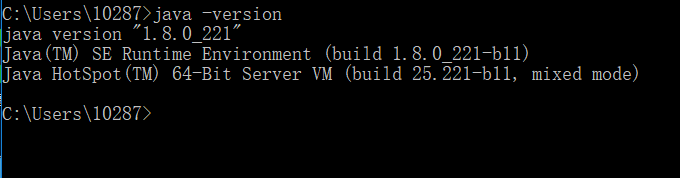
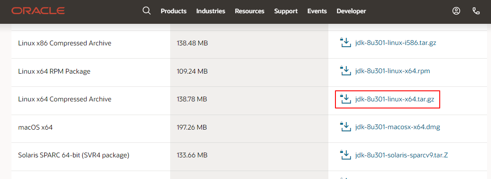

# Java环境安装配置步骤介绍
本文记录Windows环境和Linux环境(centos7)安装Java以及Linux环境升级Java JDK版本的步骤。

<!--more-->

## Windows环境安装Java JDK

### 1、下载安装

jdk下载下载地址：[https://www.oracle.com/technetwork/java/javase/downloads/jdk8-downloads-2133151.html](https://www.oracle.com/technetwork/java/javase/downloads/jdk8-downloads-2133151.html)

按照默认路径安装即可。

### 2、配置环境变量

“我的电脑” 右键菜单--->属性--->高级--->环境变量--->系统变量-->新建

* 变量名：JAVA_HOME 
变量值：C:\Program Files (x86)\Java\jdk1.8.0_144 
* 变量名：CALSS_PATH
变量值：.;%JAVA_HOME%\lib\dt.jar;%JAVA_HOME%\lib\tools.jar; 

找到path变量名—>“编辑”添加：
* 变量名：PATH
变量值：%JAVA_HOME%\bin;%JAVA_HOME%\jre\bin;

查看是否安装成功：java -version


## Linux环境安装Java JDK

介绍centos7环境下Java JDK安装方法。

### 1、下载安装包
安装包下载路径：[https://www.oracle.com/java/technologies/javase/javase-jdk8-downloads.html](https://www.oracle.com/java/technologies/javase/javase-jdk8-downloads.html) 。



### 2、安装

（1）创建安装目录
```bash
mkdir /usr/local/java/
```
（2）解压至安装目录
```bash
tar -zxvf jdk-8u301-linux-x64.tar.gz -C /usr/local/java/
```

### 3、设置环境变量
打开文件：`vim /etc/profile`
在末尾添加

```bash
export JAVA_HOME=/usr/local/java/jdk1.8.0_301
export JRE_HOME=${JAVA_HOME}/jre
export CLASSPATH=.:${JAVA_HOME}/lib:${JRE_HOME}/lib
export PATH=${JAVA_HOME}/bin:$PATH
```

使环境变量生效
```bash
source /etc/profile
```
添加软链接
```bash
ln -s /usr/local/java/jdk1.8.0_301/bin/java /usr/bin/java
```
检查
```bash
# java -version
java version "1.8.0_301"
Java(TM) SE Runtime Environment (build 1.8.0_301-b09)
Java HotSpot(TM) 64-Bit Server VM (build 25.301-b09, mixed mode)
[root@Server ~]# 
```

## 升级Java JDK版本

如果要升级Java JDK版本，可以不删除旧版本，安装新版本的JDk即可。

查看版本：

```bash
$ java --version
```

查看已安装jdk：

```bash
$ yum list *openjdk*
$ yum list installed | grep java
```

卸载：

```bash
$ yum remove java-1.8.0-openjdk-devel
```

搜索可安装jdk版本：

```bash
$ yum search java | grep jdk
```

安装指定版本：

```bash
$ yum -y install java-11-openjdk.x86_64
```

使用`alternatives`命令设置默认Java版本：

```bash
[root@Server ~]# java -version
openjdk version "1.8.0_342"
OpenJDK Runtime Environment (build 1.8.0_342-b07)
OpenJDK 64-Bit Server VM (build 25.342-b07, mixed mode)
[root@Server ~]# 
[root@Server ~]# 
[root@Server ~]# alternatives --config java

共有 3 个提供“java”的程序。

  选项    命令
-----------------------------------------------
   1           java-1.7.0-openjdk.x86_64 (/usr/lib/jvm/java-1.7.0-openjdk-1.7.0.261-2.6.22.2.el7_8.x86_64/jre/bin/java)
*+ 2           java-1.8.0-openjdk.x86_64 (/usr/lib/jvm/java-1.8.0-openjdk-1.8.0.342.b07-1.el7_9.x86_64/jre/bin/java)
   3           java-11-openjdk.x86_64 (/usr/lib/jvm/java-11-openjdk-11.0.16.0.8-1.el7_9.x86_64/bin/java)

按 Enter 保留当前选项[+]，或者键入选项编号：3
[root@Server ~]# 
[root@Server ~]# 
[root@Server ~]# 
[root@Server ~]# java -version
openjdk version "11.0.16" 2022-07-19 LTS
OpenJDK Runtime Environment (Red_Hat-11.0.16.0.8-1.el7_9) (build 11.0.16+8-LTS)
OpenJDK 64-Bit Server VM (Red_Hat-11.0.16.0.8-1.el7_9) (build 11.0.16+8-LTS, mixed mode, sharing)
[root@Server ~]# 

```


