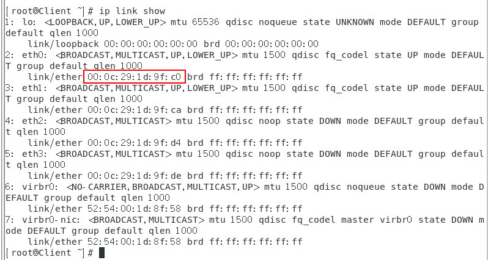
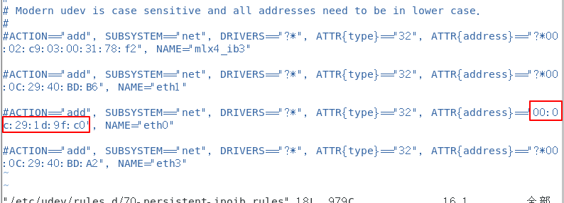
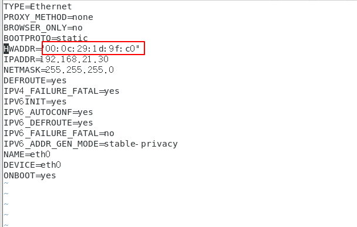
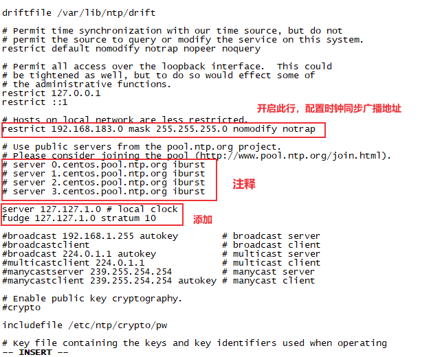

# Centos 虚拟机配置
<!--more-->

## 克隆虚拟机后设置静态IP

克隆虚拟机后设置静态IP无效的解决方法

### 1. 获取虚拟机网卡的MAC地址
通过下面的其中一个命令获取要设置的网卡MAC地址
```bash
ip link show
ifconfig -a
ip address show
```

### 2. 修改70-persistent-ipoib.rules 文件

将eth0的MAC地址改为第一步获取到的地址
```bash
vim /etc/udev/rules.d/70-persistent-ipoib.rules
```

### 3. 修改网卡配置文件

将对于网卡配置文件的MAC地址也改为第一步获取到的地址
```bash
vim /etc/sysconfig/network-scripts/ifcfg-eth0
```

### 4. 重启

重启网络服务
```bash
systemctl restart network
```

## systemctl restart network失败

systemctl restart network 重启网络失败

```sh
[root@haiyong rules.d]# systemctl restart network
Job for network.service failed because the control process exited with error code. See "systemctl status network.service" and "journalctl -xe" for details.
[root@haiyong rules.d]# journalctl -xe
-- 
-- The start-up result is done.
Jun 19 12:10:01 haiyong CROND[5949]: (root) CMD (/usr/lib64/sa/sa1 1 1)
Jun 19 12:10:10 haiyong polkitd[754]: Registered Authentication Agent for unix-process:
Jun 19 12:10:10 haiyong systemd[1]: Starting LSB: Bring up/down networking...
-- Subject: Unit network.service has begun start-up
-- Defined-By: systemd
-- Support: http://lists.freedesktop.org/mailman/listinfo/systemd-devel
-- 
-- Unit network.service has begun starting up.
Jun 19 12:10:10 haiyong NetworkManager[939]: <warn>  [1624075810.7721] ifcfg-rh:     mi
Jun 19 12:10:10 haiyong network[5992]: Bringing up loopback interface:  [  OK  ]
Jun 19 12:10:10 haiyong NetworkManager[939]: <warn>  [1624075810.8999] ifcfg-rh:     mi
Jun 19 12:10:10 haiyong NetworkManager[939]: <info>  [1624075810.9472] agent-manager: r
Jun 19 12:10:10 haiyong NetworkManager[939]: <info>  [1624075810.9481] audit: op="conne
Jun 19 12:10:10 haiyong network[5992]: Bringing up interface ens33:  Error: Connection 
Jun 19 12:10:10 haiyong network[5992]: [FAILED]
Jun 19 12:10:11 haiyong NetworkManager[939]: <info>  [1624075811.0139] agent-manager: r
Jun 19 12:10:11 haiyong NetworkManager[939]: <info>  [1624075811.0152] audit: op="conne
Jun 19 12:10:11 haiyong network[5992]: Bringing up interface ens37:  Error: Connection 
Jun 19 12:10:11 haiyong network[5992]: [FAILED]
Jun 19 12:10:11 haiyong network[5992]: RTNETLINK answers: File exists
Jun 19 12:10:11 haiyong network[5992]: RTNETLINK answers: File exists
Jun 19 12:10:11 haiyong network[5992]: RTNETLINK answers: File exists
Jun 19 12:10:11 haiyong network[5992]: RTNETLINK answers: File exists
Jun 19 12:10:11 haiyong network[5992]: RTNETLINK answers: File exists
Jun 19 12:10:11 haiyong network[5992]: RTNETLINK answers: File exists
Jun 19 12:10:11 haiyong network[5992]: RTNETLINK answers: File exists
Jun 19 12:10:11 haiyong network[5992]: RTNETLINK answers: File exists
Jun 19 12:10:11 haiyong network[5992]: RTNETLINK answers: File exists
Jun 19 12:10:11 haiyong systemd[1]: network.service: control process exited, code=exite
Jun 19 12:10:11 haiyong systemd[1]: Failed to start LSB: Bring up/down networking.
-- Subject: Unit network.service has failed
-- Defined-By: systemd
-- Support: http://lists.freedesktop.org/mailman/listinfo/systemd-devel
-- 
-- Unit network.service has failed.
-- 
-- The result is failed.
Jun 19 12:10:11 haiyong systemd[1]: Unit network.service entered failed state.
Jun 19 12:10:11 haiyong systemd[1]: network.service failed.
Jun 19 12:10:11 haiyong polkitd[754]: Unregistered Authentication Agent for unix-proces


```

解决方法：

```sh
[root@haiyong rules.d]# systemctl stop NetworkManager
[root@haiyong rules.d]# systemctl disable NetworkManager
Removed symlink /etc/systemd/system/multi-user.target.wants/NetworkManager.service.
Removed symlink /etc/systemd/system/dbus-org.freedesktop.nm-dispatcher.service.
Removed symlink /etc/systemd/system/network-online.target.wants/NetworkManager-wait-online.service.
[root@haiyong rules.d]# systemctl restart network
```

## 关闭防火墙

查看防⽕火墙状态 

```sh
systemctl status firewalld
systemctl status firewalld.service
```

停⽌止firewall

```sh
systemctl stop firewalld.service
```

禁止firewall开机启动

```sh
systemctl disable firewalld.service 
```

## 关闭selinux

vi /etc/selinux/config

注释SELINUX=enforcing，添加SELINUX=disabled

```sh
# This file controls the state of SELinux on the system.
# SELINUX= can take one of these three values:
#     enforcing - SELinux security policy is enforced.
#     permissive - SELinux prints warnings instead of enforcing.
#     disabled - No SELinux policy is loaded.
# SELINUX=enforcing
SELINUX=disabled
# SELINUXTYPE= can take one of three values:
#     targeted - Targeted processes are protected,
#     minimum - Modification of targeted policy. Only selected processes are protected.
#     mls - Multi Level Security protection.
SELINUXTYPE=targeted
```

## 时钟同步

ntpdate是一个linux时间同步服务软件，一般默认情况下是未安装。

### 1. 配置时间服务器

使用root⽤户

```sh
[root@linux .ssh]# ntpdate
-bash: ntpdate: command not found
```

安装ntpdate：

```sh
yum -y install ntpdate
yum -y install ntp
```

```sh
[root@linux ~]# systemctl status ntpd.service
● ntpd.service - Network Time Service
   Loaded: loaded (/usr/lib/systemd/system/ntpd.service; disabled; vendor preset: disabled)
   Active: inactive (dead)
[root@linux ~]# rpm -qa | grep ntp
ntpdate-4.2.6p5-29.el7.centos.2.x86_64
ntp-4.2.6p5-29.el7.centos.2.x86_64
```

编辑/etc/ntp.conf

`vim /etc/ntp.conf`

```sh
restrict 127.0.0.1
restrict ::1

# Hosts on local network are less restricted.
restrict 192.168.183.0 mask 255.255.255.0 nomodify notrap

# Use public servers from the pool.ntp.org project.
# Please consider joining the pool (http://www.pool.ntp.org/join.html).
# server 0.centos.pool.ntp.org iburst
# server 1.centos.pool.ntp.org iburst
# server 2.centos.pool.ntp.org iburst
# server 3.centos.pool.ntp.org iburst

server 127.127.1.0 # local clock
fudge 127.127.1.0 stratum 10
```


保证BIOS与系统时间同步

vim /etc/sysconfig/ntpd ,添加：

```sh
# Command line options for ntpd
OPTIONS="-g"
SYNC_HWLOCK=yes
```

启动ntpd服务

```sh
systemctl start ntpd.service
```

设置ntpd的服务开机启动

```sh
chkconfig ntpd on
systemctl enable ntpd.service
```

设置时间同步：

```sh
# 通过⽹络连接外⽹进⾏时钟同步
ntpdate us.pool.ntp.org;
# 阿⾥云时钟同步服务器
ntpdate ntp4.aliyun.com

```

### 2. 其他机器配置

使用root⽤户

安装ntpdate：
```sh
yum -y install ntpdate
```

在其他机器配置10分钟与时间服务器同步⼀次
编写脚本

```sh
crontab -e
```

输入如下内容：

```sh
*/10 * * * * /usr/sbin/ntpdate 192.168.183.121
```

修改任意机器时间

```sh
date -s "2020-06-20 11:11:11"
```

查看crontab任务

```
crontab -l
```

查看crontab的执行日志

```
tail -n 30 -f /var/log/cron
```

## 安装jdk

查看系统⾃带的openjdk，如果有，卸载系统⾃带的openjdk

```sh
[root@linux ~]# rpm -qa | grep java
[root@linux ~]# 
```

使用rz命令上传jdk-8u231-linux-x64.tar.gz文件，注意不要勾选**Upload files as ASCII**

解压jdk

```sh
tar -zxvf jdk-8u231-linux-x64.tar.gz -C ../servers/
```

配置环境变量

vi /etc/profile

```sh
export JAVA_HOME=/opt/bigdata/servers/jdk1.8.0_231
export PATH=:$JAVA_HOME/bin:$PATH
```

使配置文件生效

```sh
source /etc/profile
```

```sh
[root@linux software]# java -version
java version "1.8.0_231"
Java(TM) SE Runtime Environment (build 1.8.0_231-b11)
Java HotSpot(TM) 64-Bit Server VM (build 25.231-b11, mixed mode)
```


