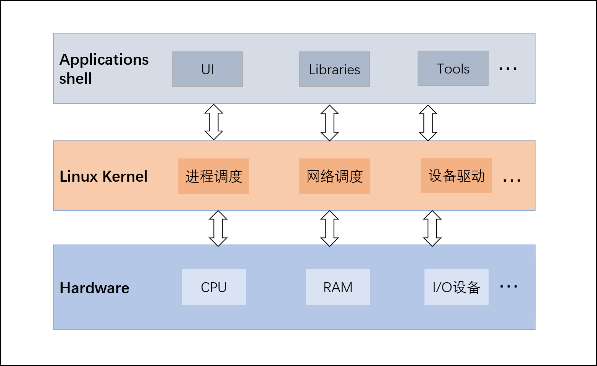
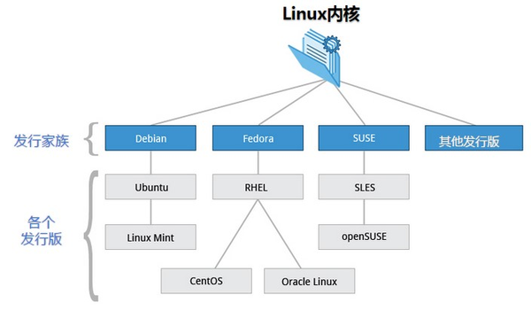
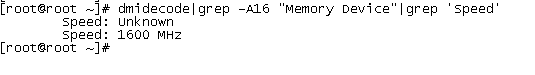
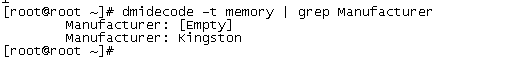

# Linux系统介绍：内核、shell及软件包管理
Linux系统主要包括3层， 硬件（RAM、CPU、I/O设备等）、 Linux 内核和 用户进程。<!--more-->
Linux 内核最初由芬兰黑客 Linus Torvalds 开发，Linux内核是Linux操作系统的重要组成部分，是操作系统的核心，是系统硬件和进程之间的接口。内核提供内存管理、进程管理、设备驱动和各种系统调用。

## Linux内核版本

Linux各个内核版本可以在[https://www.kernel.org/](https://www.kernel.org/) 上下载，一些社区组织或厂商将Linux内核与各种软件和文档包装起来，并提供系统安装界面和系统配置、设定与管理工具，就构成了 Linux 的发行版本。Linux有多个发行版本，常见的Linux系统有Centos和Ubuntu。

### 查看系统版本
```bash
cat /proc/version
uname -a
```

```bash
[root@iZ8vb54310gt89j8qct198Z ~]# cat /proc/version
Linux version 4.18.0-147.5.1.el8_1.x86_64 (mockbuild@kbuilder.bsys.centos.org) (gcc version 8.3.1 20190507 (Red Hat 8.3.1-4) (GCC)) #1 SMP Wed Feb 5 02:00:39 UTC 2020
[root@iZ8vb54310gt89j8qct198Z ~]# uname -a
Linux iZ8vb54310gt89j8qct198Z 4.18.0-147.5.1.el8_1.x86_64 #1 SMP Wed Feb 5 02:00:39 UTC 2020 x86_64 x86_64 x86_64 GNU/Linux
```
`4.18.0-147.5.1.el8_1.x86_64` :
- 4：内核主版本号
- 18：内核次版本号，偶数代表稳定版；奇数代表开发版
- 0：内核修订版本号，添加安全补丁，bug修复，新功能或驱动程序等
- 147.5.1：发行版本的补丁版本  
- el8_1：使用的内核是 RedHat / CentOS 系列发行版专用内核
- x86_64：x86平台64位CPU

查看centos发行版本：
```bash
[root@iZ8vb54310gt89j8qct198Z ~]# cat /etc/redhat-release 
CentOS Linux release 8.1.1911 (Core) 
```
## shell
### 常见 shell


Shell 是一种脚本编程语言，连接内核和用户。常见的 Shell 有 sh、bash、ksh、csh等。
* Bourne Shell (/usr/bin/sh或/bin/sh)
* Bourne Again Shell (/bin/bash)：兼容 sh
* C Shell (/usr/bin/csh)
* K Shell (/usr/bin/ksh)
* Shell for Root (/sbin/sh)

`cat /etc/shells` 命令查看系统可用shell:
```bash
[root@client ~]# cat /etc/shells
/bin/sh
/bin/bash
/usr/bin/sh
/usr/bin/bash
[root@client ~]# 
```

### 运行 shell
1. 使脚本具有执行权限
```bash
chmod +x ./test.sh 
chmod 777 ./test.sh 
```
2. 执行脚本
```bash
./test.sh # 执行脚本
/bin/sh test.sh
```
## 查看Linux系统信息
### 查看系统位数
1. `getconf LONG_BIT`
2. `file /bin/ls`

```bash
[root@iZ8vb54310gt89j8qct198Z ~]# getconf LONG_BIT
64
[root@iZ8vb54310gt89j8qct198Z ~]# file /bin/ls
/bin/ls: ELF 64-bit LSB shared object, x86-64, version 1 (SYSV), dynamically linked, interpreter /lib64/ld-linux-x86-64.so.2, for GNU/Linux 3.2.0, BuildID[sha1]=937708964f0f7e3673465d7749d6cf6a2601dea2, stripped, too many notes (256)
[root@iZ8vb54310gt89j8qct198Z ~]# 
```

### 查看内存信息
Linux 查看内存支持的最大内存容量
```bash
$ dmidecode|grep -P 'Maximum\s+Capacity'
        Maximum Capacity: 8 GB
```

查看槽位上内存的速率，没插就是unknown。
```bash
dmidecode|grep -A16 "Memory Device"|grep 'Speed'
```

查看内存条厂家
```bash
dmidecode -t memory | grep Manufacturer
```


查看内存信息（显示插槽个数和每个插槽里内存条的大小）
```bash
$ dmidecode -t memory | grep Size
        Size: 8192 MB
```
查看内存使用情况：

```bash
$free -h
              total        used        free      shared  buff/cache   available
Mem:           1.8G        1.4G        173M        764K        251M        268M
Swap:          2.0G        1.0G        1.0G
```


### 查看CPU信息

```bash
# CPU型号
$ cat /proc/cpuinfo | grep name | sort | uniq
model name      : Intel Xeon Processor (Skylake, IBRS)

# 物理CPU个数
$ cat /proc/cpuinfo | grep "physical id" 
physical id     : 0
physical id     : 1
physical id     : 2
physical id     : 3
physical id     : 4
physical id     : 5
physical id     : 6
physical id     : 7

# 每个物理CPU核数
$ cat /proc/cpuinfo| grep "cpu cores"| uniq
cpu cores       : 1

# 逻辑CPU个数
$ cat /proc/cpuinfo| grep "processor"| wc -l
8
```


## Linux软件包管理
Linux软件安装可以直接通过源码编译安装，一般源码包都打包成tar.gz压缩格式。源码包安装比较麻烦，容易出错，也可以使用包管理来软件包的管理，包管理工具是对软件工具的安装、卸载及其他管理， 常见的两类软件包管理工具是RPM 和 DPKG，RPM是Red Hat软件包管理器，DPKG的是Debian的Linux系列基本的包管理系统。

### 源码编译安装
源码编译安装步骤：
1. 下载安装文件
2. 解压
```bash
tar -xvzf xxx.tar.gz
```
3. 检查编译
进入解压文件内
```bash
./configure
```
检查通过后，将生成用于编译的MakeFile文件。
4. 编译
```bash
make
```
5. 安装
```bash
make install
```

安装完毕，应清除编译过程中产生的临时文件和配置过程中产生的文件。
```bash
make clean
make distclean
```
如果要卸载，则执行
```bash
make uninstall
```

### RPM
RPM 全称为 Redhat Package Manager，最早由 Red Hat 公司制定实施，rpm包文件通常以.rpm结尾。
#### RPM包安装
下载rpm包后安装：
安装 RPM 包
```bash
rpm -ivh package.rpm
```

升级 RPM 包
```bash
rpm -Uvh package.rpm
```

卸载 RPM 包
```bash
rpm -ev package
```

#### rpm命令其它用法

查看是否安装了某个软件：

```sh
[root@Client ~]# rpm -qa | grep wireshark
wireshark-1.10.14-25.el7.x86_64
```

查询某个命令属于哪个软件：

```sh
[root@Client ~]# which scp
/usr/bin/scp
[root@Client ~]# rpm -qf /usr/bin/scp
openssh-clients-7.4p1-21.el7.x86_64
```


#### yum
rpm无法解决软件包与软件包之间的依赖问题，可以使用yum工具进行在线安装，yum（Yellowdog update Modifier）是RPM前端工具，操作对象为rpm包。由于网络问题，可以设置yum国内镜像源，也可以配置本地源。下面介绍yum安装方法：
搜索可用软件包：
```bash
yum search all 软件关键字
```
搜索已安装的软件：
```bash
yum list installed | grep 软件关键字
```

安装
```bash
yum install package-name
yum -y install package-name #接受所有互动问答
```
卸载
```bash
yum remove package-name
yum -y remove package-name
```

### DPKG
DPKG全称为 Debian Package，功能与 RPM 相似，包文件通常以 .deb 扩展名结尾。Ubuntu系统使用此包管理工具。
#### DPKG 命令安装

安装 DEB 包
```bash
dpkg -i package.deb
```
升级 DEB 包
```bash
dpkg -i package.deb ( 和安装命令相同）
```
卸载 DEB 包
```bash
dpkg -r package.deb # 不卸载配置文件
dpkg -P package.deb # 卸载配置文件
```
#### apt
apt 全称 Advanced Packaging Tools，DPKG 前端工具， apt 的主要包管理工具为apt-get，实现功能和yum类似。

搜索可用软件包
```bash
apt-cache search 软件关键字
```
安装
```bash
apt-get install package-name
```
下载指定软件的源文件
```bash
apt-get source package-name
```
更新
```bash
apt-get upgrade # 更新软件
apt-get update # 更新软件列表
apt-get dist-upgrade # 更新所有软件
```
卸载
```bash

apt-get remove package-name
```

## 查看历史命令history
在Linux命令窗口可以查看执行过的历史命令，可以通过上/下方向键（或者Ctrl+ p / Ctrl+ n）显示相对于当前命令的上一条或下一条历史记录。或者通过`Ctrl+ r` 来搜索历史命令。

还有一种更为直观的方法是使用history命令，可以显示多个记录，默认情况下，历史命令存放在 `~/.bash_history` 文件里面，也可以在`/etc/bashrc`中设置历史命令存放路径，添加：`export HISTFILE=存放路径`

history命令格式如下：
```sh
history [-c] [-d offset] [n]
```
* -c：清空历史命令
* -d offset：删除历史命令中第offset个命令
* n：显示最近的n条历史命令

显示最近的5个命令：
```sh
[root@server ~]# history 5
  996  cat /etc/bashrc
  997  vim /etc/bashrc
  998  history --help
  999  echo $HISTSIZE
 1000  history 5
[root@server ~]# 
```

## Linux 文件句柄
由于UNIX/Linux系统中的资源都是以文件的形式存在的，可以限制用户进程可使用的系统资源数量，比如一个进程可以打开的文件数，用户可以创建多大的文件，以及进程可以使用多少内存。如果Linux在进行大量并发操作的时候，可能会报 "Too many open files" 错误，这是因为并发操作的文件数超过了限制，可以使用`ulimit`命令查看：
```bash
$ ulimit -a
core file size          (blocks, -c) 0
data seg size           (kbytes, -d) unlimited
scheduling priority             (-e) 0
file size               (blocks, -f) unlimited
pending signals                 (-i) 7144
max locked memory       (kbytes, -l) 64
max memory size         (kbytes, -m) unlimited
open files                      (-n) 1024
pipe size            (512 bytes, -p) 8
POSIX message queues     (bytes, -q) 819200
real-time priority              (-r) 0
stack size              (kbytes, -s) 8192
cpu time               (seconds, -t) unlimited
max user processes              (-u) 7144
virtual memory          (kbytes, -v) unlimited
file locks                      (-x) unlimited
```

open files 的最大限制为1024，可以使用ulimit命令进行修改：
```bash
ulimit –n 10000
```
这个命令不能保证永久生效，系统重启后会恢复原来的默认值。为了让ulimit在重启过程中持续存在，需要修改配置文件`/etc/security/limits.conf`：
```bash
#<domain>      <type>  <item>         <value>
#

#*               soft    core            0
#*               hard    rss             10000
#@student        hard    nproc           20
#@faculty        soft    nproc           20
#@faculty        hard    nproc           50
#ftp             hard    nproc           0
#@student        -       maxlogins       4
```

type可以设置为soft和hard：
- soft：软件限制，用于警告
- hard：硬件限制，设置实际的默认值

item选项包括：

- **core** ：core文件大小 (KB)
- **data** ：最大的数据大小 (KB)
- **fsize** ：最大文件大小 (KB)
- **memlock** ：最大锁定内存空间 (KB)
- **nofile** ：打开文件的最大数量
- **rss** ：最大Resident Set大小 (KB)
- **stack** ：堆栈大小 (KB)
- **cpu** ：最大CPU time (MIN)
- **nproc** ：最大进程数
- **as** ：最大地址空间 (KB)
- **maxlogins** ：此用户的最大登录数
- **maxsyslogins** ：系统的最大登录数
- **priority** ：运行用户进程的优先级
- **locks** ：用户最大文件锁定数
- **sigpending** ：最大被挂起/阻塞 (pending) 的信号数
- **msgqueue** ：POSIX消息队列使用的最大内存 (bytes)
- **nice** ：最大允许的 nice 优先级: [-20, 19]
- **rtprio** ：最大realtime优先级

打开文件的最大数量设置方法如下：

编辑配置文件 `/etc/security/limits.conf` 加入如下配置：

```bash
* soft nofile 10000
* hard nofile 10000
```

或者：

```bash
* - nofile 2000
```

保存退出。


