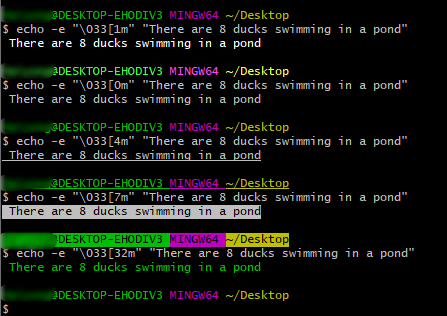

# Linux Bash编程二：shell语法及实用技巧
在[Linux Bash编程](https://blog.csdn.net/u010698107/article/details/112254528)中，介绍了Bash编程基本语法，本文记录一下Bash编程中使用到的相关shell 语法技巧。

<!--more-->

## 字符串处理

### 在字符串中传递变量

```sh
$ num=8
# 方法1：双引号
$ text="There are $num ducks swimming in a pond"
$ echo $text
There are 8 ducks swimming in a pond
$ 
$ text="There are "$num" ducks swimming in a pond"
$ echo $text
There are 8 ducks swimming in a pond

# 方法2：单引号
$ text='There are $num ducks swimming in a pond'
$ echo $text
There are $num ducks swimming in a pond
$ 
$ text='There are '$num' ducks swimming in a pond'
$ echo $text
There are 8 ducks swimming in a pond
$ text="There are '$num' ducks swimming in a pond"
$ echo $text
There are '8' ducks swimming in a pond

```

### tr命令
tr (translate) 命令用于删除或者转换字符，比如大小写转换，删除字符等。命令格式如下：
```sh
$ tr [OPTION] SET1 [SET2]
```
OPTION参数说明：
- `-c | --complement`：删除或者替换SET1以外的字符
- `-d | --delete`：删除SET1以外的字符
- `-s, --squeeze-repeats`：压缩连续重复的字符为单个字符
- `-t, --truncate-set1`：截取 SET1 使之与 SET2 长度相等

#### 1. 大小写转换
```sh
$ echo HELLO WORLD | tr "A-Z" "a-z"
hello world
$ echo HELLO WORLD | tr "[:upper:]" "[:lower:]"
hello world
$ 
$ echo hello world | tr "a-z" "A-Z"
HELLO WORLD
$ echo hello world | tr "[:lower:]" "[:upper:]"
HELLO WORLD
```
#### 2. 替换
```sh
$ echo "(hello world)" | tr "()" "{}"
{hello world}
```
#### 3. 压缩重复字符串
比如可以将多个连续空格压缩为一个空格
```sh
$ echo "hello        world    !" | tr -s [:space:] ' '
hello world !
```
#### 4. 删除指定字符
```sh
$ echo "10MB" | tr -d MB
10
```
提取数字还可以这样：
```sh
$ echo "10MB" | tr -cd "[0-9]"
10
$ echo "10MB" | tr -cd [:digit:]
10
```
删除数字：
```sh
$ echo "10MB" | tr -d "[0-9]"
MB
$ echo "10MB" | tr -d [:digit:]
MB
```
字母字符用`[:alpha:]`表示

### 判断字符串是否包含某个子串
使用通配符\*
```sh
SIZE=10M

if [[ $SIZE == *M* ]]
then
   echo "$SIZE include M"
fi
```
或者使用操作符~
```sh
if [[ $SIZE =~ M ]]
then
   echo "$SIZE include M"
fi
```


## 数组操作

### 冒泡排序

```bash
#!/bin/bash

BubbleSort()
{
    # 冒泡排序
    # Performing Bubble sort
    num_length=${#arry[*]}
    
    for (( i = 0; i<$num_length; i++ ))
    do
        for (( j = 0; j<$num_length-i-1; j++ ))
        do
            if [[ ${arry[j]} -gt ${arry[$(( j+1 ))]} ]]
            then
                # swap
                temp=${arry[j]}
                arry[$j]=${arry[$((j+1))]}
                arry[$(( j+1 ))]=$temp
            fi
        done
    done
    
    echo "Array in sorted order :"
    echo -e "\E[1;31m${arry[*]} \033[0m"
}

arry=(9 8 5 6 2 4 7 1)
BubbleSort
```

执行结果：

```bash
$ sh BubbleSort.sh 
Array in sorted order :
1 2 4 5 6 7 8 9 
```


## 字体颜色

常用颜色格式：
```shell
normal='\033[0m' # 默认颜色
style='\033[1m' # 高亮
style='\033[4m' # 添加下划线
style='\033[7m' # 反显 
color='\033[32m' # 绿色字体
color='\033[30m' # 黑色
color='\033[31m' # 红色
color='\033[33m' # 黄色
color='\033[34m' # 蓝色
color='\033[35m' # 紫色
color='\033[36m' # 深绿
color='\033[37m' # 白色

```
使用方法：
```shell
echo -e "\033[1m" "There are 8 ducks swimming in a pond"
echo -e "\033[0m" "There are 8 ducks swimming in a pond"
echo -e "\033[4m" "There are 8 ducks swimming in a pond"
echo -e "\033[7m" "There are 8 ducks swimming in a pond"
echo -e "\033[32m" "There are 8 ducks swimming in a pond"
```


## 文本处理
### 文件操作

```shell
sed -i '/^$/d' test.txt # 删除空行
sed -i 's/ *//g' test.txt # 删除空格
IFS=$'\n'  # linux分隔符，默认是空格
for lines in `cat test.txt`; do # 循环读取每一行
	pic=`echo $lines | grep '\!\[\]('` # 处理读取的内容：使用Linux三剑客进行文本处理
	if [ "$pic" != "" ]
	then
    	echo $pic >> new_file.txt
    fi
	# do something
done	
```

### 清空文件内容

用于每次写文件时清空文件内容，下面介绍5种方法，前面4种方法中，如果文件不存在会创建文件。

```shell
$ cat /dev/null > test.txt
$ : > test.txt
$ > test.txt
$ true > test.txt
$ sed -i '1,$d' test.txt # 如果文件test.txt不存在会报错
```


