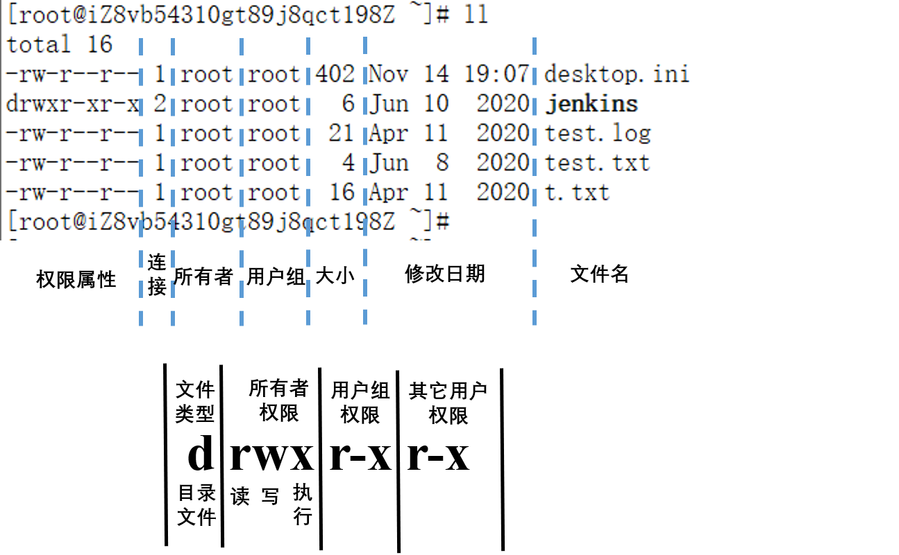

# Linux常用命令：文件操作命令
Linux系统命令主要包括文件操作、网络命令和性能命令，本文介绍常用文件操作命令。
<!--more-->

## 文件属性

文件类型：
- 普通文件：-
- 目录文件：d
- 块设备文件：b，硬盘
- 字符设备： c，串行端口的接口设备，例如键盘、鼠标
- 链接文件：l
- 套接字文件：s
- 管道文件：p

r 读权限read **4**
w 写权限 write **2**
x 操作权限 execute **1**

常用命令：
* chmod 777 test，修改test文件属性为可读，可写，可执行（4+2+1=7）
* ls -l 查看文件属性（或者使用`ll`）
* ls -ld 查看当前目录的属性
* ls -l 长模式，属性信息
* ls -1 把文件一行一个的显示出来
* ls -a 显示所有文件
* ls -s 显示文件及文件大小
* ls -l -a -s  --> ls -las
* ls -sh (h-human，显示文件大小单位）

## 基本终端操作命令
ls: 列出目录文件
pwd: 显示目前的目录
cd: 切换目录
- cd - ：切换到上次目录
- cd .. ：切换到上级目录
- cd / ：切换到根目录
- cd ~ ：切换到当前用户的home目录
- cd start\*end ：目录名较长时可使用通配符"\*"，比如进入system目录，可以使用 cd s\*m

man命令：可以通过 `man + 命令` 查看帮助文档：
- j：下翻
- k：上翻
- 空格键：翻页 
- q：退出
- /-e：查找“-e”
    - n 下一个“-e”
    - N（shift+n） 上一个“-e”

```bash
[root@client ~]# ls
desktop.ini  jenkins  test.log  test.txt  t.txt
[root@client ~]# cd j*s
[root@client jenkins]# pwd  
/root/jenkins
[root@client jenkins]# cd -
/root
[root@client ~]# pwd
/root
[root@client ~]# cd jenkins/
[root@client jenkins]# pwd
/root/jenkins
[root@client jenkins]# cd ..
[root@client ~]# pwd
/root
[root@client ~]# 
/root
[root@client ~]# cd /
[root@client /]# pwd
/
[root@client /]# cd ~
[root@client ~]# pwd
/root
[root@client ~]# 
```

## 文件、目录操作
touch：新建文件，或者使用vim命令创建文件：vim test.txt，保存
mkdir: 创建一个新的目录
rmdir: 删除一个空的目录
cp: 复制文件或目录
rm: 移除文件或目录
mv: 移动文件与目录，或修改文件与目录的名称


```bash
# 将目录A复制到目录B下
cp -r /etc/A /etc/B
# 将目录A的内容复制到目录B下
cp -r /etc/A/* /etc/B
cp -r /etc/A/. /etc/B
# 删除目录A及其下面的所有文件
rm -r /etc/A
rm -rf /etc/A #强制删除
# 移动目录A到目录B下
mv /etc/A /etc/B
# 移动目录A下的所有文件到目录B下
mv /etc/A/* /etc/B
```

## 文件内容显示
cat：显示文件内容，还可以将多个文件连接起来显示，适用于内容少的文件
more：以一页一页的显示内容，空格键下一页
less：支持向前翻，向后翻页
head：打印前面n行内容：head -2 test.txt
tail：打印后面n行内容：tail -2 test.txt

## 向文件添加内容
将内容"TEST"添加到test.txt文件中

**方法一：vi编辑法**　
- 打开终端，输入vi test.txt 回车，按a或i进入编辑模式
输入 TEST，然后按esc键退出编辑模式，输入 `:wq` 保存并退出。

**方法二：echo命令法**　　
```bash
# 追加
echo ‘TEST’ >> ./test.txt
# 覆盖
echo ‘TEST’ > ./test.txt
```
**方法三：cat命令法**　　
```bash
cat >> ./test.txt <<TEST
```
结尾的TEST要顶格。 

**方法四：cat编辑法**　　
```bash
cat >> ./test.txt
```
* 回车后开始编辑输入内容：TEST
* 按ctrl+d组合键结束编辑。


## find命令
用于查找文件，基本用法：`find path -name‘xxx'`
`find / -name jenkins`：查找所有目录下的jenkins文件
```bash
[root@client ~]# find / -name jenkins
/root/jenkins
/var/lib/docker/overlay2/6cc1d9dcc70fed5dcc455ca4147a13f650724c2e8004a9c101b4e2130276241c/diff/usr/share/jenkins
/var/lib/docker/overlay2/9b98446d8cf91c4c8da9d8eab5cd6366ef2cec266615c1fe6ad4f4faa84f25a1/diff/usr/share/jenkins
/var/lib/docker/overlay2/f1f4123687b215d1eff46d989df6c9568be89c231a83ab6105dc22c136ccf24b/diff/usr/share/jenkins
[root@iZ8vb54310gt89j8qct198Z ~]# 
```
限制搜索深度
- -maxdepth
- -mindefth

限制文件类型：文件类型有：普通文件f，目录d，符号链接 l，字符设备c，块设备b，套接字s，FIFO-p
- -type f：搜索普通文件和目录
还有其他限制条件，可以通过命令 `man find` 查看

## 文件解压
```bash
tar -xvzf xxx.tar.gz
```
- `-x, --extract`：解压文件
- `-v, --verbose`：显示解压日志
- `-z, --gzip`：通过gzip支持压缩或解压缩
- `-f, --file`：指定解压文件

## du 命令：显示目录或文件的大小
du（disk usage）命令主要用于显示目录或文件的大小：
```bash
$ du
du
18760   ./node_exporter-1.1.2.linux-amd64
27792   .
```
下面介绍几个选项参数：
- `-a, --all`：显示目录下所有文件大小
- `-b, --bytes`：以byte为单位
- `-h, --human-readable`：文件大小以K，M，G为单位显示
- `-H, --si`：文件大小以KB，MB，GB为单位（幂底数为1000）
- `-k, --kilobytes`：以1024 bytes为单位
- `-m, --megabytes`：以MB为单位
- `-s, --summarize`：显示文件总大小

实例：

```bash
$du -hs
28M     .

$ du -ah
8.9M    ./node_exporter-1.1.2.linux-amd64.tar.gz
12K     ./node_exporter-1.1.2.linux-amd64/LICENSE
4.0K    ./node_exporter-1.1.2.linux-amd64/NOTICE
19M     ./node_exporter-1.1.2.linux-amd64/node_exporter
12K     ./node_exporter-1.1.2.linux-amd64/nohup.out
19M     ./node_exporter-1.1.2.linux-amd64
28M     .
```


